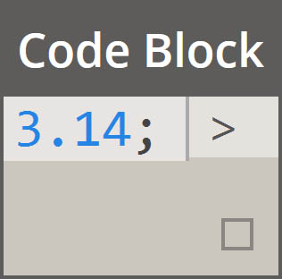
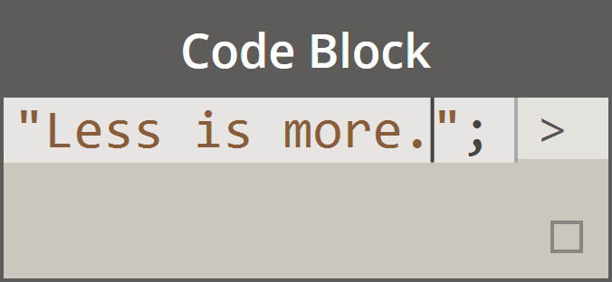
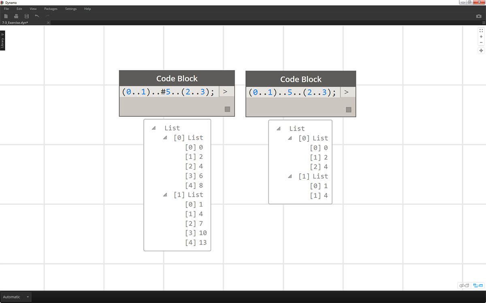
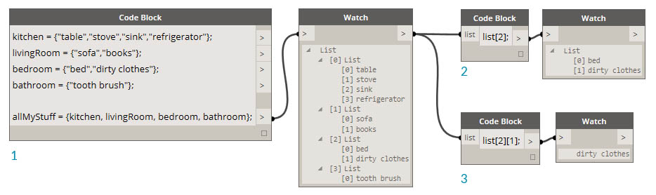
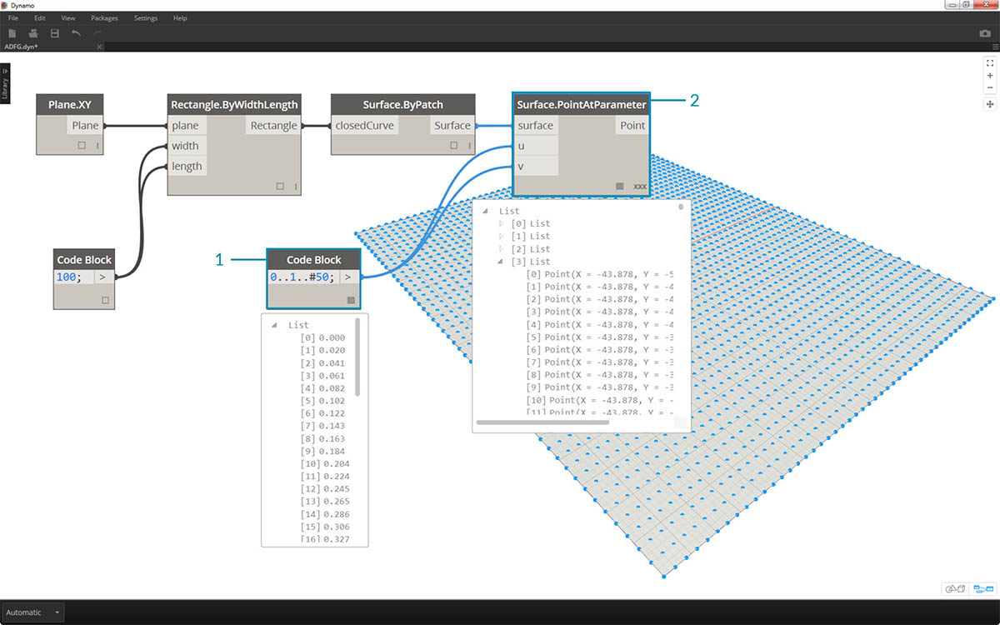
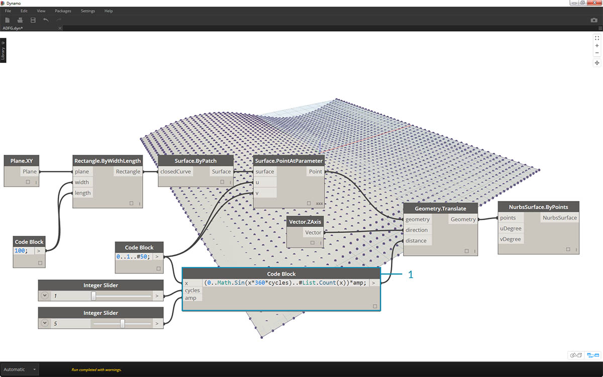
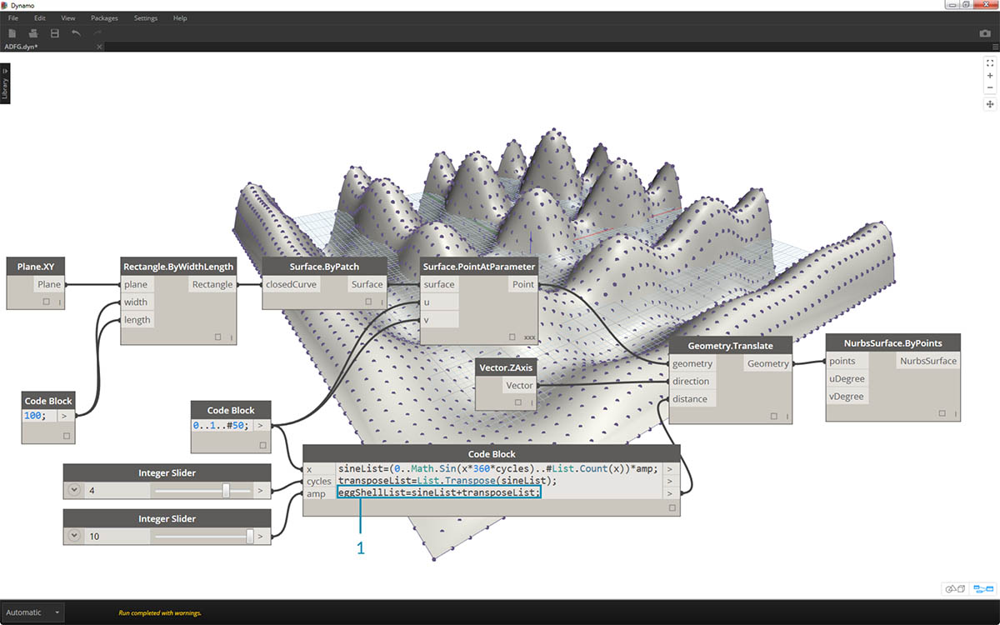

<style>
table{box-shadow: 2px 2px 2px #BBBBBB;max-width:75%;display:block;margin-left: auto;   margin-right: auto }
img{display:block;margin-left: auto;   margin-right: auto }
</style>

## Raccourci

Il existe quelques méthodes de base pour raccourcir le bloc de code qui simplifient *énormément* la gestion des données. Vous allez découvrir les concepts de base ci-dessous et comprendre comment ce raccourci peut être utilisé à la fois pour créer et interroger des données.

<table>
    <tr>
    <td width="50%"><b>Type de données</b></td>
    <td width="25%"><b>Dynamo standard</b> </td>
    <td width="25%"><b>Bloc de code équivalent</b></td>
  </tr>
  <tr>
    <td> Nombres</td>
    <td></img> </td>
    <td></img></td>
  </tr>
  <tr>
    <td>Chaînes</td>
    <td></img> </td>
    <td></img></td>
  </tr>
  <tr>
    <td>Séquences</td>
    <td></img> </td>
    <td></img></td>
  </tr>
  <tr>
    <td>Intervalles</td>
    <td></img> </td>
    <td></img></td>
  </tr>
  <tr>
    <td>Obtenir l'élément au niveau de l'index</td>
    <td></img> </td>
    <td></img></td>
  </tr>
  <tr>
    <td>Création d'une liste</td>
    <td></img> </td>
    <td></img></td>
  </tr>
  <tr>
    <td>Concaténer des chaînes</td>
    <td></img> </td>
    <td></img></td>
  </tr>
  <tr>
    <td>Instructions conditionnelles</td>
    <td></img> </td>
    <td></img></td>
  </tr>
</table>

### Syntaxe supplémentaire

|Nœud(s)|Bloc de code équivalent|Remarque|
| -- | -- | -- |
|Tout opérateur (+, &&, >=, Not, etc.)|+, &&, >=, !, etc.|Notez que "Not" devient "!" mais que le nœud est appelé "Not" pour faire la distinction avec "Factorial"|
|Valeur booléenne True|true;|Minuscules|
|Valeur booléenne False|false;|Minuscules|

### Intervalles

La méthode de définition des intervalles et des séquences peut être réduite au raccourci de base. Utilisez l'image ci-dessous comme guide de la syntaxe ".." pour définir une liste de données numériques avec un bloc de code. Après avoir obtenu l'arrêt de cette notation, la création de données numériques est un processus vraiment efficace : 

> 1. Dans cet exemple, un intervalle de nombres est remplacé par la syntaxe de bloc de code de base définissant ```beginning..end..step-size;```. Représentés numériquement, voici le résultat : ```0..10..1;```
2. La syntaxe ```0..10..1;``` est équivalente à ```0..10;```. La taille de pas 1 est la valeur par défaut de la notation de la plus courte. Par conséquent, ```0..10;``` donne une séquence de 0 à 10 avec une taille de pas de 1.
3. L'exemple de la *séquence de nombres* est similaire, sauf que vous devez utiliser *"#"* pour indiquer que vous voulez 15 valeurs dans la liste, plutôt qu'une liste qui atteint 15. Dans ce cas, définissez ce qui suit : ```beginning..#ofSteps..step-size```. La syntaxe réelle de la séquence est ```0..#15..2```
4. Placez *"#"* de l'étape précédente dans la partie *"taille de pas"* de la syntaxe. À présent, vous avez un *intervalle de nombres* qui s'étend du *"début"* à la *"fin"* et la notation *"taille de pas"* distribue uniformément un certain nombre de valeurs entre les deux valeurs : ```beginning..end..#ofSteps```

### Intervalles avancés

La création d'intervalles avancés vous permet de travailler avec une liste de listes en toute simplicité. Dans les exemples ci-dessous, découvrez comment isoler une variable de la notation d'intervalle principale et créer une autre série de cette liste. 

> 1. En créant des intervalles imbriqués, comparez la notation avec *"#"* et la notation sans. La même logique s'applique aux intervalles de base, à la différence qu'elle devient un peu plus complexe.
2. Vous pouvez définir un sous-intervalle à n'importe quel endroit de l'intervalle principal, et avoir aussi deux sous-intervalles.
3. En contrôlant la valeur de *"fin"* dans un intervalle, vous pouvez créer davantage d'intervalles de longueurs différentes.



> Dans le cadre d'un exercice logique, comparez les deux raccourcis ci-dessus et analysez comment les *sous-intervalles* et la notation *"#"* déterminent la sortie résultante.

### Création de listes et obtention d'éléments à partir d'une liste

Outre la création de listes avec un raccourci, vous pouvez également créer des listes à la volée. Ces listes peuvent contenir une large gamme de types d'éléments et peuvent également être interrogées (rappelez-vous que les listes sont des objets en eux-mêmes). Pour résumer, un bloc de code vous permet de créer des listes avec des accolades et d'interroger des éléments d'une liste avec des crochets :


> 1. Créez rapidement des listes avec des chaînes et interrogez-les à l'aide de l'index d'éléments.
2. Créez des listes avec des variables et interrogez-les à l'aide de la notation du raccourci d'intervalle.

La gestion de listes imbriquées est un processus similaire. Veillez à l'ordre de la liste et n'oubliez pas d'utiliser plusieurs jeux de crochets :



> 1. Définissez une liste de listes.
2. Interrogez une liste avec une notation de crochet simple.
3. Interrogez un élément avec une notation entre crochets.

### Exercice

> Téléchargez le fichier d'exemple joint à cet exercice (cliquez avec le bouton droit de la souris et choisissez "Enregistrer le lien sous..."). Vous trouverez la liste complète des fichiers d'exemple dans l'annexe. [Obsolete-Nodes_Sine-Surface.dyn](datasets/7-3/Obsolete-Nodes_Sine-Surface.dyn)

Dans cet exercice, vous allez perfectionner vos nouvelles compétences en concevant une super surface en coquille d'oeuf définie par des intervalles et des formules. Au cours de cet exercice, vous découvrirez comment utiliser le bloc de code et les nœuds Dynamo existants en tandem : le bloc de code est utilisé pour le gros volume de données, tandis que les nœuds Dynamo sont visuellement disposés pour la lisibilité de la définition.


> Commencez par créer une surface en connectant les nœuds ci-dessus. Au lieu d'utiliser un nœud Number pour définir la largeur et la longueur, cliquez deux fois sur la zone de dessin et tapez ```100;``` dans un bloc de code.



> 1. Définissez un intervalle compris entre 0 et 1 et 50 divisions en tapant ```0..1..#50``` dans un bloc de code.
2. Connectez l'intervalle à *Surface.PointAtParameter*, qui prend les valeurs *u* et *v* entre 0 et 1 sur la surface. Pensez à définir la *combinaison* sur *Produit vectoriel* en cliquant avec le bouton droit de la souris sur le nœud *Surface.PointAtParameter*.


> Dans cette étape, vous allez utiliser votre première fonction pour déplacer la grille de points vers le haut sur l'axe Z. Cette grille pilotera une surface générée reposant sur la fonction sous-jacente.

> 1. Ajoutez les nœuds visuels à la zone de dessin, comme illustré dans l'image ci-dessus.
2. Au lieu d'utiliser un nœud Formula, utilisez un bloc de code avec la ligne : ```(0..Math.Sin(x*360)..#50)*5;```. Pour décomposer rapidement cet intervalle, définissez un intervalle contenant une formule. Cette formule est la fonction Sinus. La fonction Sinus reçoit les entrées de degrés dans Dynamo. Ainsi, pour obtenir une onde sinusoïdale complète, multipliez les valeurs *x* (valeur d'entrée de l'intervalle de 0 à 1) par *360*. Ensuite, utilisez le même nombre de divisions que les points de grille de contrôle pour chaque ligne. Définissez donc 50 sous-divisions avec *#50*. Enfin, le multiplicateur de 5 augmente simplement l'amplitude de la translation de sorte que l'effet soit visible dans l'aperçu Dynamo.



> 1. Même si le bloc de code précédent fonctionnait correctement, il n'était pas entièrement paramétrique. Pour piloter ses paramètres de manière dynamique, remplacez la ligne de l'étape précédente par ```(0..Math.Sin(x*360*cycles)..#List.Count(x))*amp;```. Cela vous donne la possibilité de définir ces valeurs en fonction des entrées.


> 1. La modification des curseurs (de 0 à 10) permet d'obtenir des résultats intéressants.


> 1. Lorsque vous effectuez une transposition sur l'intervalle de nombres, vous inversez la direction de l'onde du rideau : ```transposeList = List.Transpose(sineList);```



> 1. Lorsque vous ajoutez sineList et tranposeLit, vous obtenez une surface en coquille d'oeuf déformée : ```eggShellList = sineList+transposeList;```


> 1. Modifiez à nouveau les curseurs pour retrouver un algorithme "paisible".


> 1. Enfin, recherchez des parties isolées des données avec le bloc de code. Pour régénérer la surface avec un intervalle de points spécifique, ajoutez le bloc de code ci-dessus entre le nœud *Geometry.Translate* et le nœud *NurbsSurface.ByPoints*. Cette ligne contient la ligne de texte : ```sinusBandes[0..15..1];```. Cela permet de sélectionner les 16 premières lignes de points (sur 50). Recréez la surface. Vous pouvez voir que vous avez généré une partie isolée de la grille de points.


> 1. Dans la dernière étape, pour rendre ce bloc de code encore plus paramétrique, pilotez la requête en utilisant un curseur compris entre 0 et 1. Pour ce faire, utilisez cette ligne de code : ```sinusBandes[0..((List.Count(sineSrayures)-1)*u)];```. Cela peut sembler déroutant, mais la ligne de code vous donne un moyen rapide de mettre à l'échelle la longueur de la liste en un multiplicateur entre 0 et 1.


> 1. Une valeur de *0.53* sur le curseur permet de créer une surface juste au-delà du milieu de la grille.


> 1. Comme prévu, un curseur de *1* crée une surface à partir de la grille complète de points.


> En examinant le graphique obtenu, vous pouvez mettre en surbrillance les blocs de code et voir chacune de leurs fonctions.

> 1. Le premier bloc de code remplace le nœud *Number*.
2. Le deuxième bloc de code remplace le nœud *Number Range*.
3. Le troisième bloc de code remplace le nœud *Formula* (ainsi que *List.Transpose*, *List.Count* et *Number Range*).
4. Le quatrième bloc de code interroge une liste de listes, remplaçant ainsi le nœud *List.GetItemAtIndex*.

