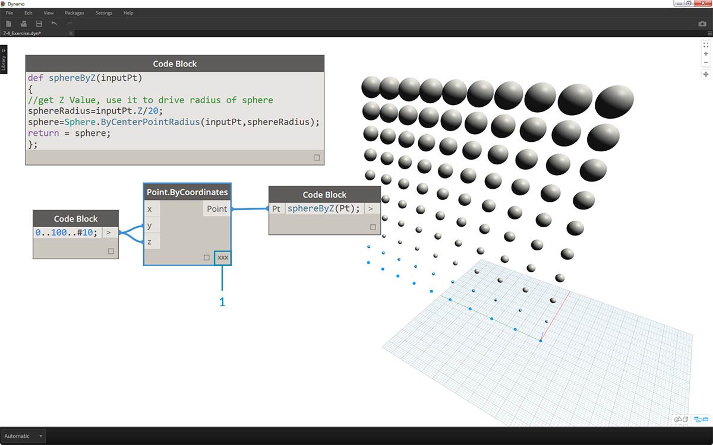

## Fonctions de bloc de code

Les fonctions peuvent être créées dans un bloc de code et rappelées ailleurs dans une définition Dynamo. Cela permet de créer un autre calque de contrôle dans un fichier paramétrique et de l'afficher en tant que version de texte d'un nœud personnalisé. Dans ce cas, le bloc de code "parent" est facilement accessible et peut être situé n'importe où sur le graphique. Aucun fil n'est nécessaire.

### Parent

La première ligne comporte le mot clé "def", puis le nom de la fonction, puis les noms des entrées entre parenthèses. Les contreventements définissent le corps de la fonction et renvoient une valeur avec "return =". Les nœuds Code Block qui définissent une fonction ne disposent pas de ports d'entrée ou de sortie, car ils sont appelés à partir d'autres nœuds Code Block. 

```
/*This is a multi-line comment,
which continues for
multiple lines*/
def FunctionName(in1,in2)
{
//This is a comment
sum = in1+in2;
return sum;
};
```

### Enfants

Appelez la fonction avec un autre nœud Code Block dans le même fichier en donnant le nom et le même nombre d'arguments. Cela fonctionne comme les nœuds prêts à l'emploi de votre bibliothèque.


```
FunctionName(in1,in2);
```

### Exercice

> Téléchargez le fichier d'exemple joint à cet exercice (cliquez avec le bouton droit de la souris et choisissez "Enregistrer le lien sous..."). Vous trouverez la liste complète des fichiers d'exemple dans l'annexe. [Functions_SphereByZ.dyn](datasets/7-4/Functions_SphereByZ.dyn)

Dans cet exercice, vous allez créer une définition générique permettant d'obtenir des sphères à partir d'une liste de points d'entrée. Le rayon de ces sphères est défini par la propriété Z de chaque point.


> Commencez par une plage de dix valeurs allant de 0 à 100. Connectez-les à un nœud *Point.ByCoordinates* afin de créer une ligne diagonale.


> 1. Créez un nœud *Code Block* et introduisez la définition en utilisant la ligne de code suivante :
```
def sphereByZ(inputPt){
};
```

Le terme *inputPt* est le nom donné pour représenter les points qui contrôlent la fonction. Pour l'instant, la fonction ne fait rien, mais vous allez la construire dans les étapes à venir.


> 1. L'ajout de la fonction *Code Block* permet de placer un commentaire et une variable *sphereRadius* qui interroge la position *Z* de chaque point. N'oubliez pas que *inputPt.Z* n'a pas besoin de parenthèses comme méthode. Il s'agit d'une *requête* des propriétés d'un élément existant, donc aucune entrée n'est nécessaire :
```
def sphereByZ(inputPt,radiusRatio)
{
//get Z Value, use it to drive radius of sphere
sphereRadius=inputPt.Z;
};
```


> 1. Rappelez-vous la fonction créée dans un autre *Code Block*. Si vous double-cliquez sur la zone de dessin pour créer un *Code Block* et que vous tapez *sphereB*, Dynamo suggère la fonction *sphereByZ* que vous avez définie. Votre fonction a été ajoutée à la bibliothèque Intellisense. Bien.


> 1. Vous allez maintenant appeler la fonction et créer une variable appelée *Pt* afin de connecter les points créés dans les étapes précédentes :
```
sphereByZ(Pt)
```

2. La sortie ne contient que des valeurs nulles. Pourquoi ? Lorsque vous avez défini la fonction, vous avez calculé la variable *sphereRadius*, mais vous n'avez pas défini ce que la fonction doit *renvoyer* en tant que *sortie*. Vous pourrez résoudre ce problème à l'étape suivante.


> 1. Une étape importante consiste à définir la sortie de la fonction en ajoutant la ligne ```return = sphereRadius;``` à la fonction *sphereByZ*.
2. La sortie du nœud *Code Block* indique désormais les coordonnées Z de chaque point.


> Modifiez la fonction *Parent* pour créer des sphères réelles.

> 1. Tout d'abord, définissez une sphère avec la ligne de code suivante : ```sphere=Sphere.ByCenterPointRadius(inputPt,sphereRadius);```.
2. Ensuite, modifiez la valeur renvoyée pour la définir comme *sphere* au lieu de *sphereRadius* : ```return = sphere;```. Vous obtenez ainsi des sphères géantes dans l'aperçu de Dynamo.


> 1. Pour modifier la taille de ces sphères, mettez à jour la valeur *sphereRadius* en ajoutant un séparateur : ```sphereRadius = inputPt.Z/20;```. Les sphères distinctes sont maintenant visibles et la relation entre le rayon et la valeur Z devient plus claire.



> 1. Sur le nœud *Point.ByCoordinates*, remplacez la combinaison *Liste la plus courte* par * Produit vectoriel* afin de créer une grille de points. La fonction *sphereByZ* reste pleinement effective, de sorte que tous les points créent des sphères avec des rayons fondés sur des valeurs Z.


> 1. Pour tâter le terrain, connectez simplement la liste de nombres d'origine à l'entrée X de *Point.ByCoordinates*. Vous obtenez ainsi un cube de sphères.
2. Remarque : si le calcul sur votre ordinateur prend beaucoup de temps, essayez de remplacer *nº 10* par un autre élément, *nº 5* par exemple.


> 1. N'oubliez pas que la fonction *sphereByZ* créée est générique. Vous pouvez donc rappeler l'hélice d'une leçon précédente et lui appliquer la fonction.


> Dernière étape : déterminez le rapport des rayons avec un paramètre défini par l'utilisateur. Pour ce faire, vous devez créer une entrée pour la fonction et remplacer également le séparateur *20* par un paramètre.

> 1. Remplacez la définition de *sphereByZ* par :
```
def sphereByZ(inputPt,radiusRatio)
{
//get Z Value, use it to drive radius of sphere
sphereRadius=inputPt.Z/radiusRatio;
//Define Sphere Geometry
sphere=Sphere.ByCenterPointRadius(inputPt,sphereRadius);
//Define output for function
return sphere;
};
```

2. Mettez à jour les blocs de code enfant en ajoutant une variable *ratio* à l'entrée : ```sphereByZ(Pt,ratio);```. Connectez un curseur à la nouvelle entrée du bloc de code et modifiez la taille des rayons en fonction du rapport des rayons.

