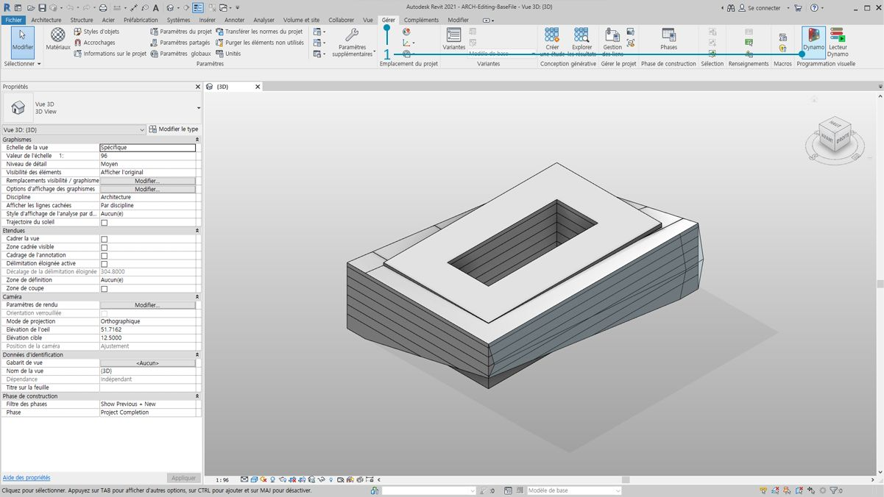
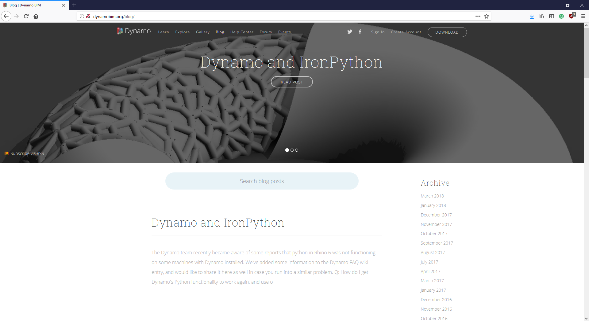

## La connexion Revit

Dynamo for Revit étend la modélisation des données du bâtiment à l'environnement de données et de logique d'un éditeur d'algorithmes graphiques. Sa flexibilité, associée à une base de données Revit robuste, offre une nouvelle perspective pour le BIM.

Ce chapitre se concentre sur les workflows Dynamo pour le BIM. Les coupes sont principalement basées sur des exercices, car le passage immédiat à un projet est le meilleur moyen de se familiariser avec un éditeur d'algorithmes graphiques pour le BIM. Mais d'abord, voici les débuts du programme.

####

#### Compatibilité de la version de Revit

Comme Revit et Dynamo évoluent encore, il se peut que vous constatiez que la version de Revit sur laquelle vous travaillez n'est pas compatible avec la version de Dynamo for Revit que vous avez installée sur votre ordinateur. Les versions de Dynamo for Revit compatibles avec Revit sont répertoriées ci-dessous.

|Version de Revit|Première version stable de Dynamo|Dernière version de Dynamo for Revit prise en charge|
| -- | -- | -- |
|2013|[0.6.1](http://dyn-builds-data.s3-us-west-2.amazonaws.com/DynamoInstall0.6.1.exe)|[0.6.3](http://dyn-builds-data.s3-us-west-2.amazonaws.com/DynamoInstall0.6.3.exe)|
|2014|[0.6.1](http://dyn-builds-data.s3-us-west-2.amazonaws.com/DynamoInstall0.6.1.exe)|[0.8.2](http://dyn-builds-data.s3-us-west-2.amazonaws.com/DynamoInstall0.8.2.exe)|
|2015|[0.7.1](http://dyn-builds-data.s3-us-west-2.amazonaws.com/DynamoInstall0.7.1.exe)|[1.2.1](http://dyn-builds-data.s3-us-west-2.amazonaws.com/DynamoInstall1.2.1.exe)|
|2016|[0.7.2](http://dyn-builds-data.s3-us-west-2.amazonaws.com/DynamoInstall0.7.2.exe)|[1.3.2](http://dyn-builds-data.s3-us-west-2.amazonaws.com/DynamoInstall1.3.2.exe)|
|2017|[0.9.0](http://dyn-builds-data.s3-us-west-2.amazonaws.com/DynamoInstall0.9.0.exe)|[1.3.4](http://dyn-builds-data.s3-us-west-2.amazonaws.com/DynamoInstall1.3.4.exe) / [2.0.3](https://dyn-builds-data.s3-us-west-2.amazonaws.com/DynamoInstall2.0.3.exe)|
|2018|[1.3.0](http://dyn-builds-data.s3-us-west-2.amazonaws.com/DynamoInstall1.3.0.exe)|[1.3.4](http://dyn-builds-data.s3-us-west-2.amazonaws.com/DynamoInstall1.3.4.exe) / [2.0.3](https://dyn-builds-data.s3-us-west-2.amazonaws.com/DynamoInstall2.0.3.exe)|
|2019|[1.3.3](http://dyn-builds-data.s3-us-west-2.amazonaws.com/DynamoInstall1.3.3.exe)|[1.3.4](http://dyn-builds-data.s3-us-west-2.amazonaws.com/DynamoInstall1.3.4.exe) / [2.0.3](https://dyn-builds-data.s3-us-west-2.amazonaws.com/DynamoInstall2.0.3.exe)|
|2020|2.1.0 - Revit 2020 inclut désormais Dynamo et reçoit les mises à jour comme Revit.|N/A|

####

#### Historique de Dynamo

> Avec une équipe de développeurs dédiée et une communauté passionnée, le projet est loin de ses débuts timides.

Dynamo a été créé à l'origine pour rationaliser les workflows AEC dans Revit. Bien que Revit crée une base de données solide pour chaque projet, il peut être difficile pour un utilisateur lambda d'accéder à ces informations en dehors des contraintes de l'interface. Revit héberge une API (Application Program Interface) complète, permettant aux développeurs tiers de créer des outils personnalisés. Les programmeurs utilisent cette API depuis des années, mais les scripts basés sur du texte ne sont pas accessibles à tous. Dynamo vise à démocratiser les données Revit via un éditeur d'algorithmes graphiques abordable.

En utilisant les principaux nœuds Dynamo conjointement avec des nœuds Revit personnalisés, un utilisateur peut considérablement étendre les workflows paramétriques pour l'interopérabilité, la documentation, l'analyse et la génération. Avec Dynamo, les workflows fastidieux peuvent être automatisés tandis que les explorations de conception peuvent se développer.

### Exécution de Dynamo dans Revit

> 1. Dans un projet Revit ou un éditeur de familles, accédez à Compléments et cliquez sur *Dynamo*. Remarque : Dynamo s'exécute uniquement dans le fichier dans lequel il a été ouvert.

> 1. Lors de l'ouverture de Dynamo dans Revit, une nouvelle catégorie appelée *Revit* apparaît. Il s'agit d'un ajout complet à l'interface utilisateur qui offre des nœuds spécifiquement conçus pour les workflows Revit.*

**Remarque : en utilisant la famille de nœuds propre à Revit, le graphique Dynamo fonctionne uniquement lorsqu'il est ouvert dans Dynamo for Revit. Si un graphique Dynamo for Revit est ouvert dans Dynamo Sandbox par exemple, les nœuds Revit sont manquants.*

### Gel des nœuds

Revit étant une plate-forme qui fournit une gestion de projet robuste, les opérations paramétriques dans Dynamo peuvent être complexes et lentes à calculer. Si Dynamo met du temps pour calculer des nœuds, vous pouvez utiliser la fonctionnalité "geler" du nœud pour interrompre l'exécution des opérations Revit lorsque vous développez votre graphique. Pour plus d'informations sur le gel des nœuds, consultez la section "Gel" du [chapitre Solides](../05_Geometry-for-Computational-Design/5-6_solids.md#freezing).

### Communauté

Depuis que Dynamo a été créé pour le secteur AEC, sa vaste communauté dynamique est une excellente ressource pour apprendre et créer des liens avec des experts du secteur. La communauté de Dynamo est constituée d'architectes, d'ingénieurs, de programmeurs et de concepteurs dont la passion commune est de partager ce qu'ils font.

Dynamo est un projet open source en constante évolution et un grand nombre de développements sont liés à Revit. Si vous êtes nouveau, rendez-vous sur le forum de discussion et [posez des questions](http://dynamobim.org/forums/forum/dyn/). Si vous êtes programmeur et que vous souhaitez vous impliquer dans le développement de Dynamo, consultez la [page github](https://github.com/DynamoDS/Dynamo). En outre, le [gestionnaire de packages Dynamo](http://dynamopackages.com/) constitue une ressource très utile pour les bibliothèques tierces. Beaucoup de ces packages sont conçus pour le secteur AEC. Dans ce chapitre, vous étudierez les packages tiers pour la panélisation.

> Dynamo maintient également un [blog](http://dynamobim.com/blog/) actif. Lisez les articles récents pour en savoir plus sur les derniers développements.

