## Sélection

Revit est un environnement riche en données. Cet environnement vous offre de nombreuses possibilités de sélection allant bien au-delà du "pointer-cliquer". Vous pouvez interroger la base de données Revit et lier dynamiquement des éléments Revit à la géométrie Dynamo tout en effectuant des opérations paramétriques.


> La bibliothèque Revit de l'interface utilisateur propose une catégorie "Selection" qui permet d'explorer plusieurs méthodes de sélection de géométrie.

Pour sélectionner correctement des éléments Revit, il est important de bien comprendre la hiérarchie des éléments Revit. Vous souhaitez sélectionner tous les murs d'un projet ? Effectuez une sélection par catégorie. Vous voulez sélectionner toutes les chaises Eames dans votre hall moderne du milieu du siècle ? Effectuez une sélection par famille. Avant de passer à l'exercice, examinez rapidement la hiérarchie Revit.

#### Hiérarchie Revit

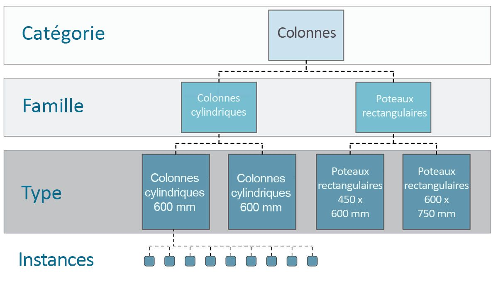

Vous vous souvenez de la taxinomie en biologie ? Règne, Embranchement, Classe, Ordre, Famille, Genre, Espèces ? Les éléments Revit sont classés de la même manière. À la base, la hiérarchie Revit peut être divisée en catégories, familles, types* et instances. Une instance est un élément de modèle individuel (avec un ID unique), tandis qu'une catégorie définit un groupe générique (tel que "murs" ou "sols"). La base de données Revit étant organisée de cette manière, vous pouvez sélectionner un élément et choisir tous les éléments similaires en fonction d'un niveau spécifié dans la hiérarchie.

**Remarque : les types définis dans Revit diffèrent des types de programmation. Dans Revit, un type fait référence à une branche de la hiérarchie plutôt qu'à un "type de données".*

#### Navigation dans la base de données avec les nœuds Dynamo

Les trois images ci-dessous décrivent les principales catégories pour la sélection d'éléments Revit dans Dynamo. Ces outils sont très utiles en association. Vous allez en découvrir certains dans les exercices suivants.


> *Pointer-cliquer* est la méthode la plus simple pour sélectionner directement un élément Revit. Vous pouvez sélectionner un élément de modèle complet ou des parties de sa topologie (une face ou une arête, par exemple). Il reste lié dynamiquement à cet objet Revit, de sorte que lorsque l'emplacement ou les paramètres du fichier Revit sont mis à jour, l'élément Dynamo référencé est mis à jour dans le graphique.


> Les *menus déroulants* permettent de créer une liste de tous les éléments accessibles dans un projet Revit. Vous pouvez utiliser cette option pour référencer des éléments Revit qui ne sont pas nécessairement visibles dans une vue. C'est un outil formidable pour rechercher des éléments existants ou en créer d'autres dans un projet Revit ou l'Éditeur de familles.


> Vous pouvez également sélectionner des éléments Revit en fonction de niveaux spécifiques dans la *hiérarchie Revit*. Cette option est puissante pour personnaliser des réseaux de données volumineux en vue de la documentation ou de l'instanciation et de la personnalisation génératives.

Tout en gardant les trois images ci-dessus, vous allez étudier un exercice qui sélectionne les éléments d'un projet Revit de base en vue de les préparer aux applications paramétriques créées dans les autres sections de ce chapitre.

### Exercice

> Téléchargez les fichiers d'exemple joints à cet exercice (cliquez avec le bouton droit de la souris et choisissez "Enregistrer le lien sous..."). Vous trouverez la liste complète des fichiers d'exemple dans l'annexe.

> 1. [Selecting.dyn](datasets/8-2/Selecting.dyn)
2. [ARCH-Selecing-BaseFile.rvt](datasets/8-2/ARCH-Selecting-BaseFile.rvt)

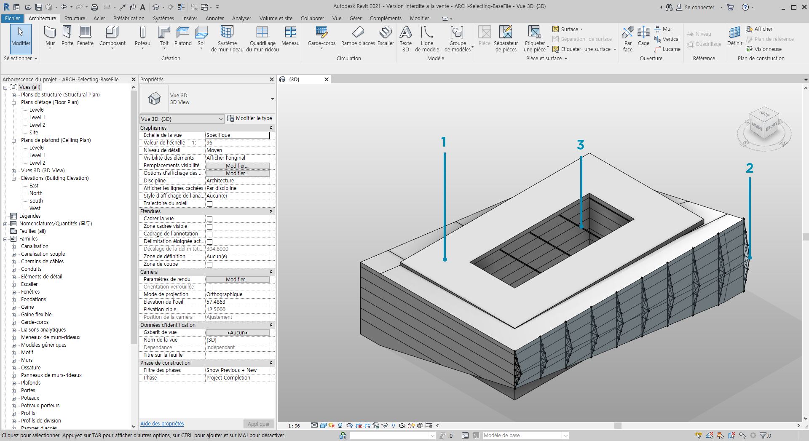

> Ce fichier d'exemple Revit contient trois types d'éléments d'un bâtiment simple. Utilisez ce fichier comme exemple pour sélectionner des éléments Revit dans le contexte de la hiérarchie Revit :

> 1. Volume de bâtiment
2. Fermes (composants adaptatifs)
3. Poutres (ossature)

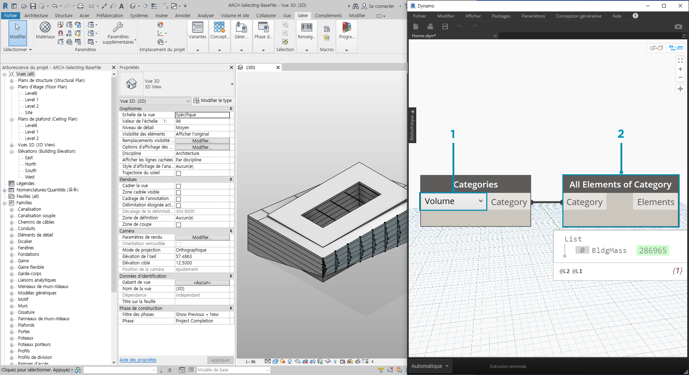

> Quelles conclusions pouvez-vous tirer des éléments affichés actuellement dans la vue du projet Revit ? Jusqu'à quelle distance de la hiérarchie devez-vous aller pour sélectionner les éléments appropriés ? Cette tâche est évidemment plus complexe lorsque vous travaillez sur un projet volumineux. De nombreuses options sont disponibles : vous pouvez sélectionner des éléments par catégories, niveaux, familles, instances, etc.

> 1. Puisque vous travaillez avec une configuration de base, sélectionnez le volume du bâtiment en choisissant *"Mass"* dans le nœud déroulant Categories. Vous le trouverez dans l'onglet Revit > Selection.
2. La sortie de la catégorie Mass est uniquement la catégorie elle-même. Vous devez sélectionner les éléments. Pour ce faire, utilisez le nœud *"All Elements of Category"*.

À ce stade, aucune géométrie n'est visible dans Dynamo. Un élément Revit a été sélectionné, mais il n'a pas encore été converti en géométrie Dynamo. Il s'agit d'une distinction importante. Si vous sélectionnez un grand nombre d'éléments, vous ne souhaitez pas afficher un aperçu de tous ces éléments dans Dynamo, sous peine de ralentir le programme. Dynamo est un outil permettant de gérer un projet Revit sans avoir à effectuer des opérations de géométrie. Vous allez le découvrir dans la section suivante de ce chapitre.

Dans ce cas, vous travaillez avec une géométrie simple. Vous devez donc importer la géométrie dans l'aperçu Dynamo. Le nœud Watch ci-dessus affiche un numéro vert* en regard de l'élément "BldgMass". Il représente l'ID de l'élément et vous indique que vous travaillez avec un élément Revit et non avec une géométrie Dynamo. L'étape suivante consiste à convertir cet élément Revit en géométrie dans Dynamo.

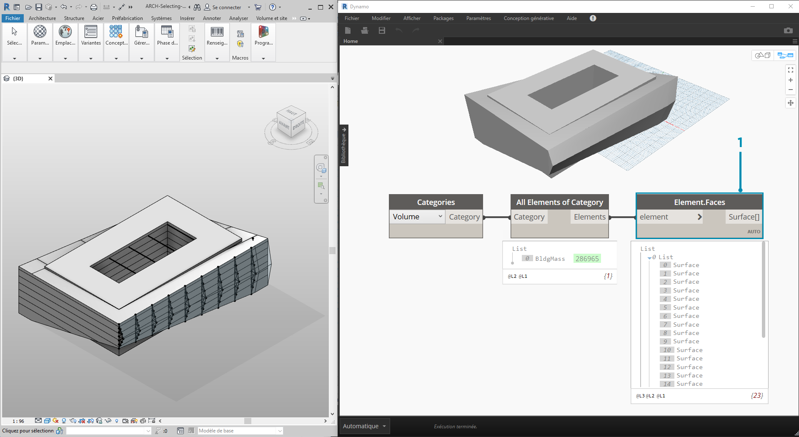

> 1. Le nœud *Element. Faces* vous permet d'obtenir une liste de surfaces représentant chaque face du volume Revit. Vous pouvez désormais voir la géométrie dans la fenêtre Dynamo et commencer à référencer la face pour les opérations paramétriques.

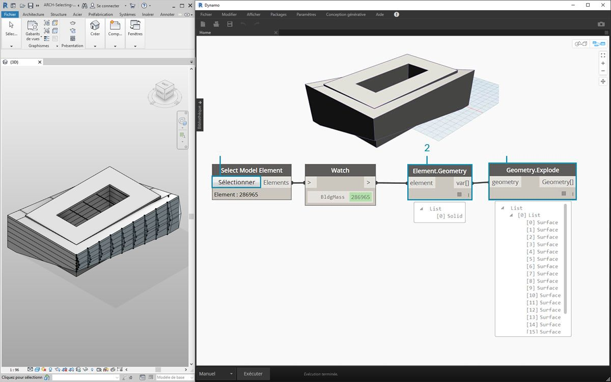

> Voici une autre méthode : dans ce cas, vous ne pouvez pas effectuer de sélection via la hiérarchie Revit *("All Elements of Category")* et choisissez de sélectionner explicitement la géométrie dans Revit.

> 1. Utilisez le nœud *"Select Model Element"*, et cliquez sur le bouton *"Sélectionner"* (ou *"Modifier"*). Dans la fenêtre Revit, sélectionnez l'élément souhaité. Dans ce cas, l'élément sélectionné est le volume du bâtiment.
2. Au lieu d'utiliser le nœud *Element.Faces*, vous pouvez sélectionner le volume complet comme géométrie solide à l'aide du nœud *Element.Geometry*. Cette opération permet de sélectionner toute la géométrie contenue dans ce volume.
3. Le nœud *Geometry.Explode* vous permet de récupérer la liste des surfaces. Ces deux nœuds fonctionnent de la même manière que *Element.Faces*, mais offrent d'autres options permettant d'explorer la géométrie d'un élément Revit.

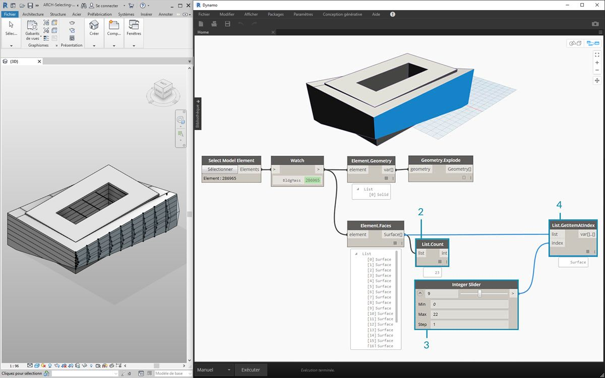

> 1. Certaines des opérations de liste de base vous permettent d'interroger la face qui vous intéresse.
2. Tout d'abord, le nœud *List.Count* indique que vous travaillez avec 23 surfaces du volume.
3. En faisant référence à ce nombre, définissez la valeur maximale d'un *curseur de type entier* sur *"22"*.
4. À l'aide de *List.GetItemAtIndex*, entrez les listes et le *curseur d'entier* pour l'*index*. Faites glisser le curseur avec la sélection et arrêtez lorsque vous atteignez l'*index 9* et que vous avez isolé la façade principale qui héberge les fermes.

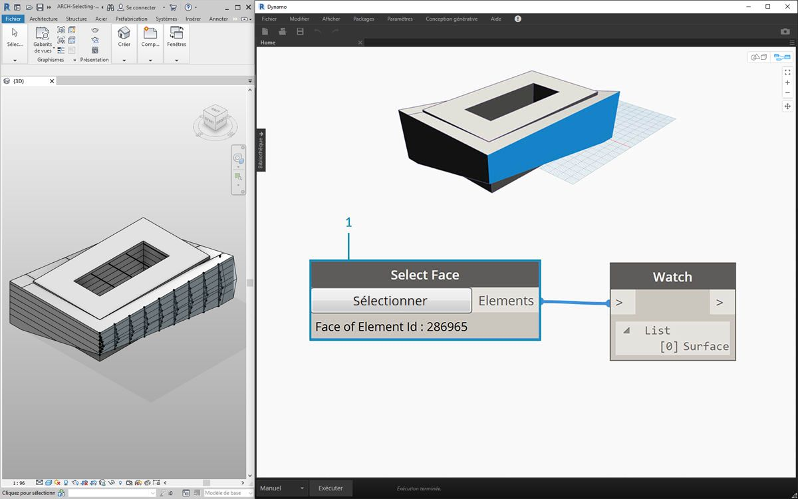

> 1. L'étape précédente était un peu compliquée. Grâce au nœud *"Select Face"*, cette opération est beaucoup plus rapide. Cela vous permet d'isoler une face qui n'est pas un élément en soi dans le projet Revit. La même interaction s'applique à *"Select Model Element"*, sauf que vous sélectionnez la surface plutôt que l'élément entier.


> Imaginez que vous souhaitiez isoler les murs de la façade principale du bâtiment. Pour ce faire, vous pouvez utiliser le nœud *"Select Faces"*. Cliquez sur le bouton "Select", puis sélectionnez les quatre façades principales dans Revit.

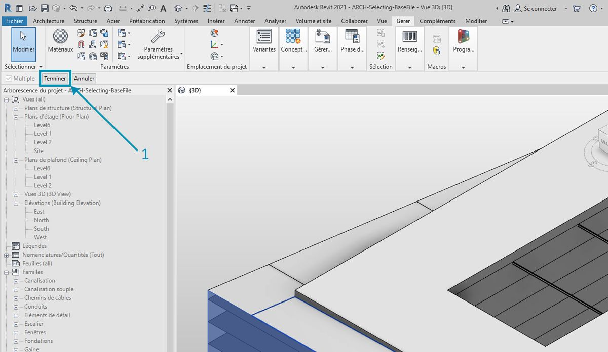

> 1. Après avoir sélectionné les quatre murs, assurez-vous que vous cliquez sur le bouton *"Terminer"* dans Revit.

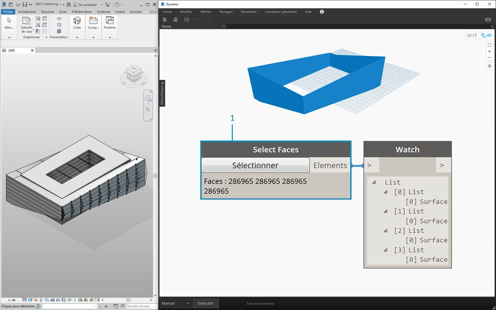

> 1. Les faces sont désormais importées dans Dynamo en tant que surfaces.

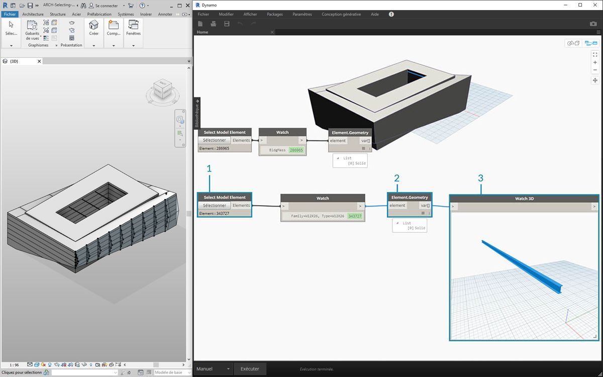

> 1. Examinez désormais les poutres sur l'atrium. À l'aide du nœud *"Select Model Element"*, sélectionnez l'une des poutres.
2. Connectez l'élément poutre au nœud *Element.Geometry*. La poutre apparaît dans la fenêtre Dynamo.
3. Vous pouvez effectuer un zoom avant sur la géométrie à l'aide d'un nœud *Watch3D* (si vous ne voyez pas la poutre dans Watch 3D, cliquez avec le bouton droit de la souris et sélectionnez "Zoom tout").

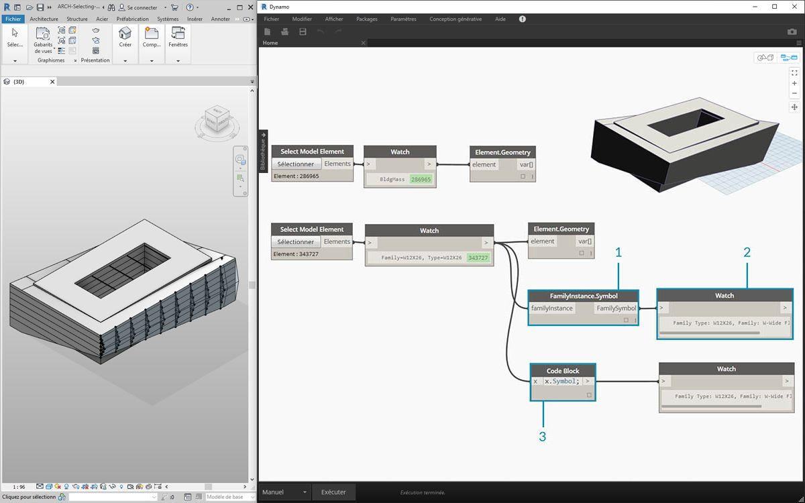

> Question fréquente pendant les workflows Revit/Dynamo : comment sélectionner un élément et obtenir tous les éléments similaires ? Étant donné que l'élément Revit sélectionné contient toutes ses informations hiérarchiques, vous pouvez interroger son type de famille et sélectionner tous les éléments de ce type.

> 1. Connectez l'élément poutre à un nœud *FamilyInstance.Symbol**.
2. Le nœud *Watch* indique que la sortie est désormais un symbole de famille plutôt qu'un élément Revit.
3. Étant donné que *FamilyInstance.Symbol* est une simple requête, vous pouvez le faire dans le bloc de code aussi facilement avec ```x.Symbol;``` et obtenir les mêmes résultats.

**Remarque : un symbole de famille est la terminologie de l'API de Revit pour le type de famille. Comme cela peut entraîner une certaine confusion, il sera mis à jour dans les versions à venir.*


> 1. Pour sélectionner les autres poutres, utilisez le nœud *"All Elements of Family Type"*.
2. Le nœud Watch indique que cinq éléments Revit ont été sélectionnés.

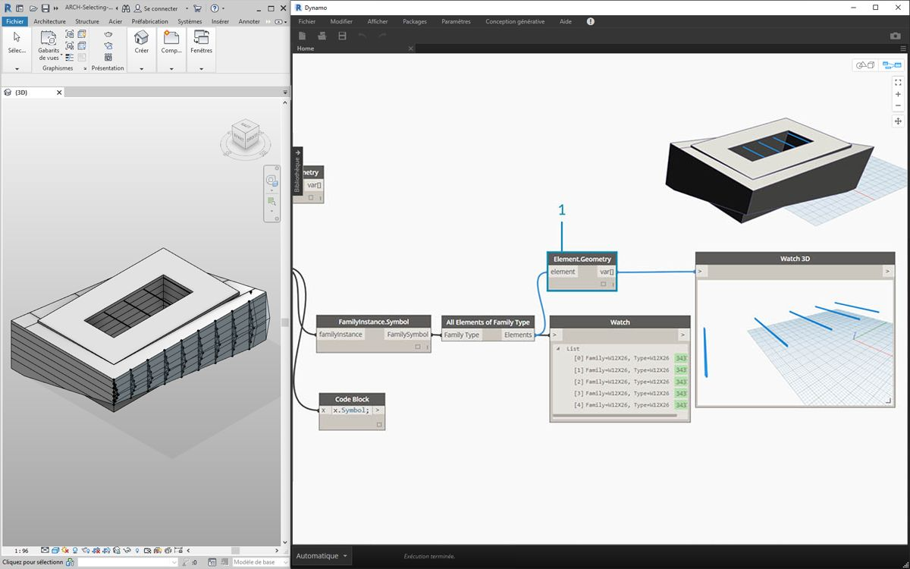

> 1. Vous pouvez également convertir ces cinq éléments en géométrie Dynamo.

Et si vous aviez 500 poutres ? La conversion de tous ces éléments en géométrie Dynamo serait très lente. Si Dynamo prend du temps pour calculer des nœuds, vous pouvez utiliser la fonctionnalité de nœud "geler" pour interrompre l'exécution des opérations Revit lorsque vous développez votre graphique. Pour plus d'informations sur le gel des nœuds, consultez la section "Gel" du [chapitre Solides](../05_Geometry-for-Computational-Design/5-6_solids.md#freezing).

Dans tous les cas, si vous importiez 500 poutres, auriez-vous besoin de toutes les surfaces pour effectuer l'opération paramétrique souhaitée ? Ou pouvez-vous extraire les informations de base des poutres et effectuer des tâches génératives avec une géométrie fondamentale ? Gardez cette question à l'esprit à mesure que vous avancez dans ce chapitre. Prenez l'exemple du système de ferme :

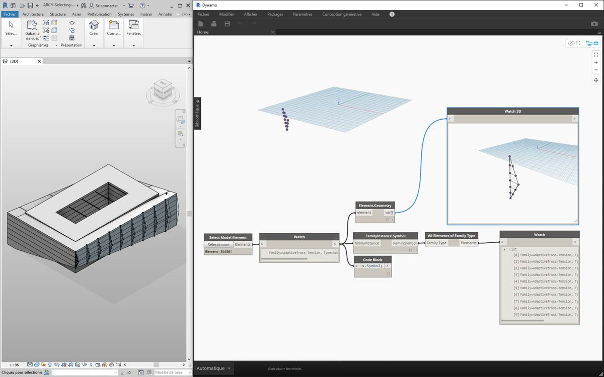

> À l'aide du même graphique de nœuds, sélectionnez l'élément ferme plutôt que l'élément poutre. Avant de procéder ainsi, supprimez Element.Geometry de l'étape précédente.

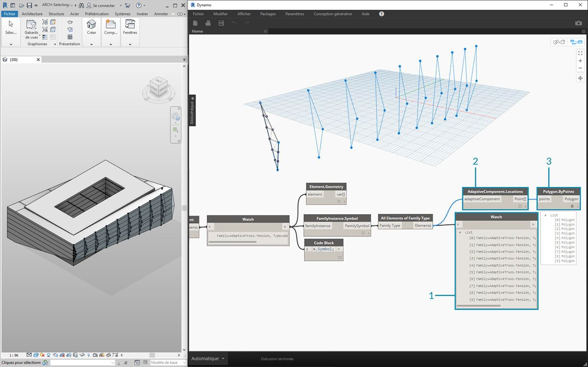

> 1. Le nœud *Watch* contient une liste de composants adaptatifs sélectionnés dans Revit. Étant donné que vous voulez extraire les informations de base, commencez par les points adaptatifs.
2. Connectez le nœud *"All Elements of Family Type"* au nœud *"AdaptiveComponent.Location"*. Vous obtenez une liste de listes, chacune avec trois points qui représentent les emplacements des points adaptatifs.
3. La connexion d'un nœud *"Polygon.ByPoints"* renvoie une polycourbe. Celle-ci apparaît dans la fenêtre Dynamo. Cette méthode vous a permis de visualiser la géométrie d'un élément et de supprimer la géométrie du réseau d'éléments restants (qui peut être plus grand en nombre que dans cet exemple).

**Conseil : si vous cliquez sur le numéro vert d'un élément Revit dans Dynamo, la fenêtre Revit effectue un zoom sur cet élément.*

