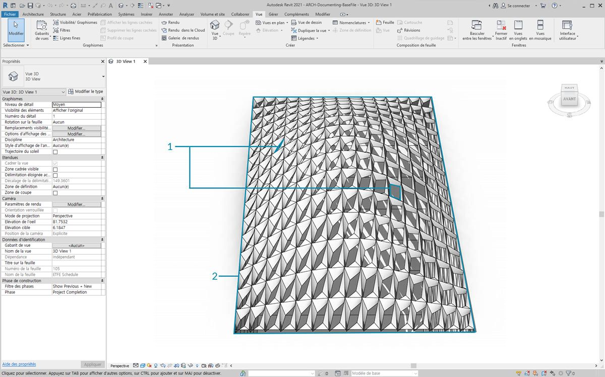
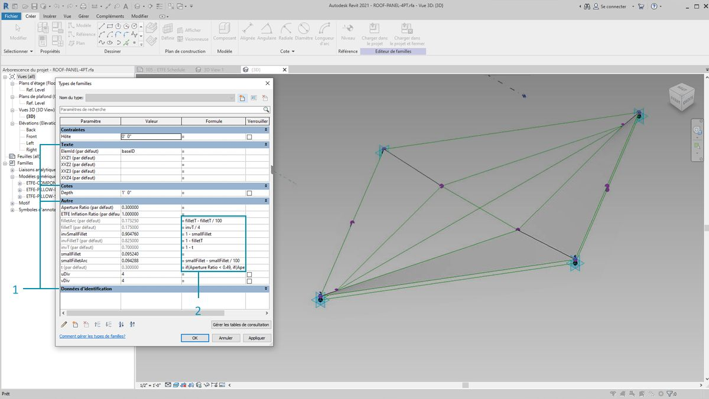
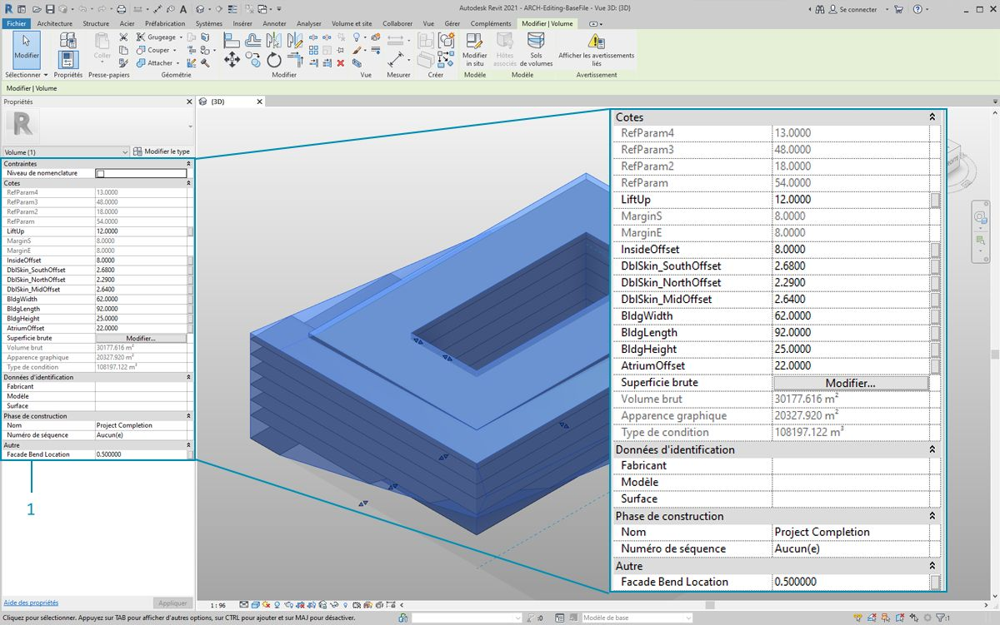
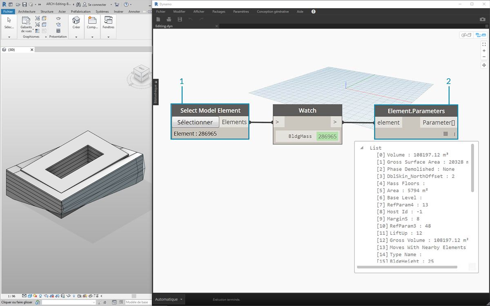
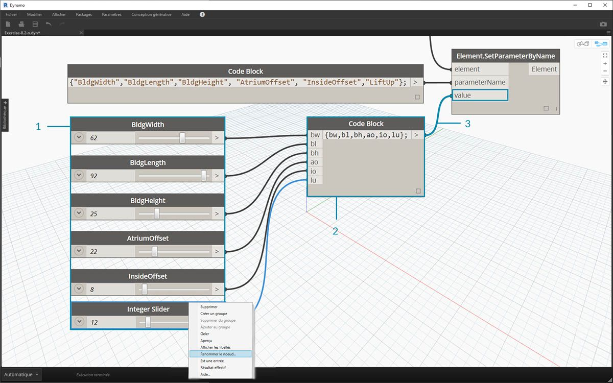
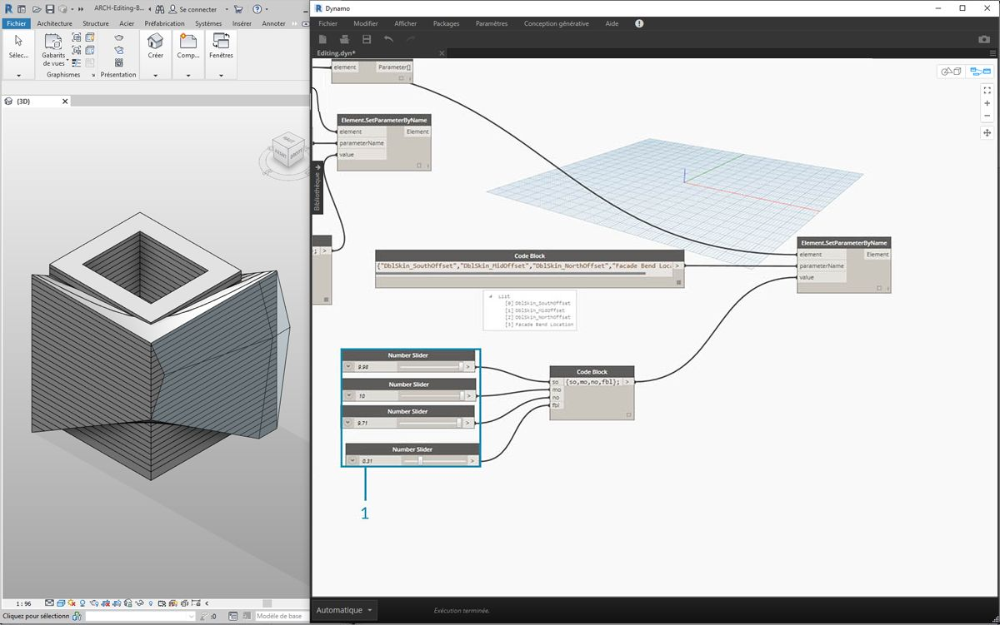

## Édition

Une puissante fonction de Dynamo est la possibilité de modifier les paramètres d'un niveau paramétrique. Par exemple, un algorithme génératif ou les résultats d'une simulation peuvent être utilisés pour piloter les paramètres d'un réseau d'éléments. Ainsi, un jeu d'occurrences de la même famille peut posséder des propriétés personnalisées dans votre projet Revit.

### Paramètres de type et d'occurrence



> 1. Les paramètres d'occurence définissent l'ouverture des panneaux sur la surface du toit, allant d'un rapport d'ouverture de 0,1 à 0,4.
2. Les paramètres basés sur le type sont appliqués à chaque élément de la surface, car ils appartiennent au même type de famille. Le matériau de chaque panneau, par exemple, peut être piloté par un paramètre basé sur le type.



> 1. Si vous avez déjà configuré une famille Revit, n'oubliez pas d'affecter un type de paramètre (chaîne, nombre, cote, etc.) Veillez à utiliser le type de données correct lors de l'affectation de paramètres à partir de Dynamo.
2. Vous pouvez également utiliser Dynamo en combinaison avec les contraintes paramétriques définies dans les propriétés d'une famille Revit.

Pour rappel, Revit comprend des paramètres de type et des paramètres d'occurrence. Les deux peuvent être modifiés à partir de Dynamo, mais vous allez utiliser les paramètres d'occurrence dans l'exercice ci-dessous.

Remarque : lorsque vous découvrez l'application complète de paramètres de modification, vous pouvez modifier un grand nombre d'éléments dans Revit avec Dynamo. Il peut s'agir d'une opération *coûteuse en ressources informatiques*, ce qui signifie qu'elle peut être lente. Si vous modifiez un grand nombre d'éléments, vous pouvez utiliser la fonctionnalité de nœud "Geler" pour interrompre l'exécution des opérations Revit lorsque vous développez votre graphique. Pour plus d'informations sur le gel des nœuds, consultez la section "Gel" du [chapitre Solides](../05_Geometry-for-Computational-Design/5-6_solids.md#freezing).

#### Unités

À partir de la version 0.8, Dynamo est fondamentalement sans unité. Dynamo reste ainsi un environnement de programmation visuel abstrait. Les nœuds Dynamo qui interagissent avec les cotes Revit font référence aux unités du projet Revit. Par exemple, si vous définissez un paramètre de longueur dans Revit à partir de Dynamo, le numéro de la valeur dans Dynamo correspondra aux unités par défaut dans le projet Revit. L'exercice ci-dessous utilise les mètres.


> Pour une conversion rapide des unités, utilisez le nœud *"Convert Between Units"*. Cet outil est pratique pour convertir des unités de longueur, de surface et de volume à la volée.

### Exercice

> Téléchargez les fichiers d'exemple joints à cet exercice (cliquez avec le bouton droit de la souris et choisissez "Enregistrer le lien sous..."). Vous trouverez la liste complète des fichiers d'exemple dans l'annexe.

> 1. [Editing.dyn](datasets/8-3/Editing.dyn)
2. [ARCH-Editing-BaseFile.rvt](datasets/8-3/ARCH-Editing-BaseFile.rvt)

Cet exercice est consacré à la modification d'éléments Revit sans effectuer d'opération géométrique dans Dynamo. Vous n'importez pas la géométrie Dynamo ici, mais modifiez simplement les paramètres dans un projet Revit. Il s'agit d'un exercice de base et pour les utilisateurs de Revit les plus avancés, notez qu'il s'agit de paramètres d'occurrence d'un volume, mais la même logique peut être appliquée à un réseau d'éléments à personnaliser à grande échelle. Cette opération est effectuée à l'aide du nœud "Element.SetParameterByName".



> Commencez par utiliser l'exemple de fichier Revit pour cette section. Les éléments structurels et les fermes adaptatives de la section précédente ont été supprimés. Dans cet exercice, vous allez travailler sur une ossature paramétrique dans Revit et la manipuler dans Dynamo.

> 1. Lorsque vous sélectionnez le bâtiment dans Volume dans Revit, un réseau de paramètres d'occurrence s'affiche dans le groupe de fonctions Propriétés.



> 1. Sélectionnez le volume du bâtiment à l'aide du nœud *"Select Model Element"*.
2. Vous pouvez rechercher tous les paramètres de ce volume à l'aide du nœud *"Element.Parameters"*. Cela inclut les paramètres de type et d'occurrence.


> 1. Référencez le nœud *Element.Parameters* pour rechercher les paramètres cibles. Vous pouvez également afficher le groupe de fonctions Propriétés de l'étape précédente pour choisir les noms de paramètres à modifier. Dans ce cas, vous recherchez les paramètres qui ont une incidence sur les grands déplacements géométriques sur le volume du bâtiment.
2. Modifiez l'élément Revit à l'aide du nœud *Element.SetParameterByName*.
3. À l'aide du *bloc de code*, définissez une liste de ces paramètres, avec des guillemets autour de chaque élément pour indiquer une chaîne. Vous pouvez également utiliser le nœud List.Create avec une série de nœuds *"String"* connectés à plusieurs entrées. Le bloc de code est simplement plus rapide et plus simple. Assurez-vous que la chaîne correspond au nom exact dans Revit, en faisant attention à la casse : ```{"BldgWidth","BldgLength","BldgHeight", "AtriumOffset", "InsideOffset","LiftUp"};```



> 1. Vous devez également désigner des valeurs pour chaque paramètre. Ajoutez six *curseurs d'entier* à la zone de dessin et renommez-les en fonction du paramètre correspondant dans la liste. Définissez également les valeurs de chaque curseur tel qu'illustré ci-dessus. Dans l'ordre de haut en bas : ```62,92,25,22,8,12```
2. Définissez un autre *bloc de code* avec une liste de la même longueur que les noms des paramètres. Dans ce cas, nommez les variables (sans guillemets) qui créent des entrées pour le *bloc de code.* Connectez les *curseurs* à chaque entrée respective : ```{bw,bl,bh,ao,io,lu};```
3. Connectez le *bloc de code* au nœud *"Element.SetParameterByName*"*. Lorsque l'option Exécuter automatiquement est activée, les résultats sont automatiquement affichés.

**Remarque : cette démonstration fonctionne avec les paramètres d'occurrence, mais pas avec les paramètres de type.*

 Tout comme dans Revit, la plupart de ces paramètres sont dépendants l'un de l'autre. Il existe bien entendu des combinaisons dans lesquelles la géométrie peut être rompue. Vous pouvez résoudre ce problème avec des formules définies dans les propriétés des paramètres, ou bien configurer une logique similaire avec des opérations mathématiques dans Dynamo (ce défi supplémentaire est nécessaire si vous souhaitez développer l'exercice).

> 1. Cette combinaison donne une super nouvelle conception au volume du bâtiment : ```100,92,100,25,13,51.4```


> 1. Copiez le graphique et concentrez-vous sur le vitrage de la façade qui va abriter le système de ferme. Dans ce cas, isolez quatre paramètres : ```{"DblSkin_SouthOffset","DblSkin_MidOffset","DblSkin_NorthOffset","Facade Bend Location"};```
2. De plus, créez des *curseurs de numérotation* et renommez-les en fonction des paramètres appropriés. Les trois premiers curseurs, de haut en bas, doivent être remappés avec un domaine de [0,10], tandis que le curseur final, *"Facade Bend Location"*, doit être remappé avec un domaine de [0,1]. Ces valeurs, de haut en bas, doivent commencer par les valeurs suivantes (bien qu'elles soient arbitraires) : ```2.68,2.64,2.29,0.5```
3. Définissez un nouveau *bloc de code* et connectez les curseurs : ```{so,mo,no,fbl};```



> 1. En modifiant les *curseurs* dans cette partie du graphique, vous pouvez rendre le vitrage de la façade beaucoup plus important : ```9.98,10.0,9.71,0.31```

