## Création

Vous pouvez créer un réseau d'éléments Revit dans Dynamo avec un contrôle paramétrique complet. Les nœuds Revit dans Dynamo permettent d'importer des éléments à partir de géométries génériques vers des types de catégorie spécifiques (tels que des murs et des sols). Dans cette section, nous allons nous concentrer sur l'importation d'éléments paramétriquement flexibles avec des composants adaptatifs.


### Composants adaptatifs

Un composant adaptatif est une catégorie de famille flexible qui se prête bien aux applications génératives. Lors de l'instanciation, vous pouvez créer un élément géométrique complexe qui est contrôlé par l'emplacement fondamental des points adaptatifs.

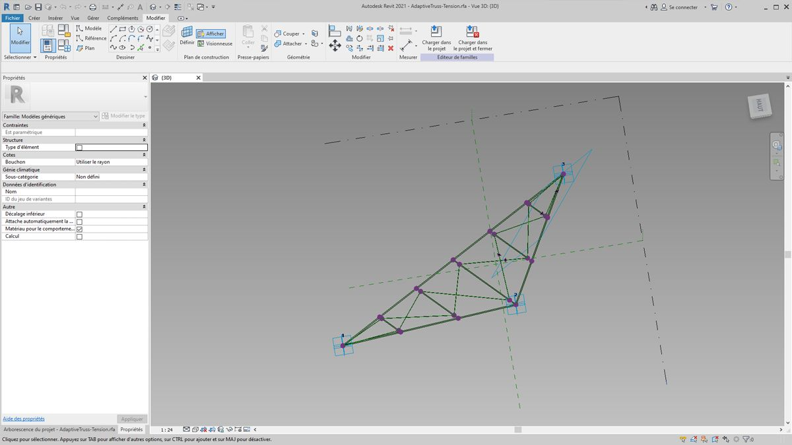

> Exemple de composant adaptatif à trois points dans l'Éditeur de familles. Cela génère une ferme définie par la position de chaque point adaptatif. Dans l'exercice ci-dessous, vous allez utiliser ce composant pour générer une série de fermes sur une façade.

#### Principes d'interopérabilité

Le composant adaptatif est un bon exemple des meilleures pratiques d'interopérabilité. Vous pouvez créer un réseau de composants adaptatifs en définissant les points adaptatifs fondamentaux. Lors du transfert de ces données vers d'autres programmes, vous pouvez réduire la géométrie en données simples. L'importation et l'exportation avec un programme tel qu'Excel suivent une logique similaire.

Supposez qu'un consultant en façade souhaite connaître l'emplacement des éléments de ferme sans avoir à les analyser par le biais d'une géométrie entièrement articulée. Afin de se préparer à la fabrication, le consultant peut faire référence à l'emplacement des points adaptatifs pour régénérer la géométrie dans un programme tel qu'Inventor.

Le workflow que vous allez configurer dans l'exercice ci-dessous vous permet d'accéder à toutes ces données lors de la création de la définition pour la création d'éléments Revit. Grâce à ce processus, vous pouvez fusionner la conceptualisation, la documentation et la fabrication dans un workflow homogène. Cela permet de créer un processus plus intelligent et efficace pour l'interopérabilité.

#### Éléments et listes multiples


L'exercice ci-dessous vous expliquera comment Dynamo référence les données pour la création d'éléments Revit. Pour générer plusieurs composants adaptatifs, définissez une liste de listes dans laquelle chaque liste comporte trois points représentant chaque point du composant adaptatif. Gardez cela à l'esprit lorsque vous gérez les structures de données dans Dynamo.

### Exercice

> Téléchargez les fichiers d'exemple joints à cet exercice (cliquez avec le bouton droit de la souris et choisissez "Enregistrer le lien sous..."). Vous trouverez la liste complète des fichiers d'exemple dans l'annexe.

> 1. [Creating.dyn](datasets/8-4/Creating.dyn)
2. [ARCH-Creating-BaseFile.rvt](datasets/8-4/ARCH-Creating-BaseFile.rvt)

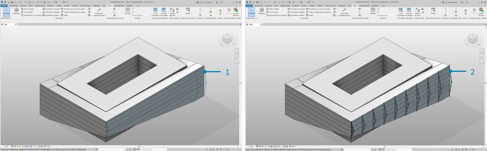

> À partir du fichier d'exemple de cette section (ou en continuant avec le fichier Revit de la session précédente), vous obtenez le même volume Revit.

> 1. Il s'agit du fichier ouvert.
2. Il s'agit du système de ferme créé avec Dynamo et relié intelligemment au volume Revit.

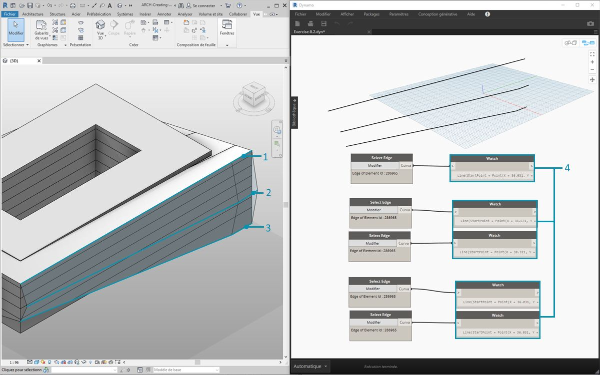

> Après avoir utilisé les nœuds *"Select Model Element"* et *"Select Face"*, vous allez maintenant avancer plus loin dans la hiérarchie de la géométrie et utiliser *Select Edge*. Lorsque le solveur Dynamo est défini pour exécuter la commande *Automatic*, le graphique est constamment mis à jour en fonction des modifications apportées au fichier Revit. L'arête sélectionné est liée dynamiquement à la topologie des éléments Revit. Tant que la topologie* ne change pas, la connexion reste liée entre Revit et Dynamo.

> 1. Sélectionnez la courbe la plus haute de la façade du vitrage. Elle s'étend sur toute la longueur du bâtiment. Si vous ne parvenez pas à sélectionner l'arête, n'oubliez pas de choisir la sélection dans Revit en plaçant le curseur sur l'arête et en appuyant sur la touche *"Tabulation"* jusqu'à ce que l'arête souhaitée soit mise en surbrillance.
2. À l'aide de deux nœuds *"Select Edge"*, sélectionnez chaque arête représentant le dévers de rail au milieu de la façade.
3. Procédez de la même manière pour les arêtes inférieures de la façade dans Revit.
4. Les nœuds *Watch* indiquent que vous avez désormais des lignes dans Dynamo. Cette opération est automatiquement convertie en géométrie Dynamo, car les arêtes elles-mêmes ne sont pas des éléments Revit. Ces courbes sont les références que vous allez utiliser pour instancier des fermes adaptatives sur la façade.

**Remarque : pour conserver une topologie homogène, faites référence à un modèle auquel aucune face ou arête supplémentaire n'a été ajoutée. Bien que les paramètres puissent en modifier la forme, la façon dont il est créé reste cohérente.*


> Vous devez d'abord joindre les courbes et les fusionner en une liste. De cette manière, vous pouvez *"regrouper"* les courbes pour effectuer des opérations de géométrie.

> 1. Créez une liste pour les deux courbes au centre de la façade.
2. Joignez les deux courbes dans une polycourbe en connectant le composant *List.Create* à un nœud *Polycurve.ByJoiningCurves*.
3. Créez une liste pour les deux courbes au bas de la façade.
4. Joignez les deux courbes dans une polycourbe en connectant le composant *List.Create* à un nœud *Polycurve.ByJoiningCurves*.
5. Enfin, joignez les trois courbes principales (une ligne et deux polycourbes) dans une liste.


> Vous voulez tirer parti de la courbe supérieure, qui est une ligne, et représente la portée complète de la façade. Pour ce faire, créez des plans le long de cette ligne pour couper le jeu de courbes regroupées dans une liste.

> 1. Avec un *bloc de code*, définissez un intervalle en utilisant la syntaxe : ```0..1..#numberOfTrusses;```
2. Connectez un *curseur d'entier* à l'entrée du bloc de code. Vous l'aurez deviné, cette valeur représente le nombre de fermes. Le curseur contrôle le nombre d'éléments dans l'intervalle défini de *0* à *1*.
3. Connectez le *bloc de code* à l'entrée *param* d'un nœud *"Curve.PlaneAtParameter"* et connectez l'arête supérieure à l'entrée *curve*. Vous obtiendrez ainsi dix plans, répartis uniformément sur l'ensemble de la façade.


> Un plan est un élément abstrait de la géométrie, représentant un espace 2D infini. Les plans sont idéaux pour le contour et l'intersection, à mesure que vous effectuez la configuration dans cette étape.

> 1. À l'aide du nœud *Geometry.Intersect* (notez la combinaison du produit vectoriel), connectez le nœud *Curve.PlaneAtParameter* à l'entrée *entity* du nœud *Geometry.Intersect*. Connectez le nœud principal *List.Create* à l'entrée *geometry*. Les points sont maintenant affichés dans la fenêtre Dynamo. Ils représentent l'intersection de chaque courbe avec les plans définis.


> Le résultat est une liste de listes. Trop de listes par rapport à vos besoins. Il convient ici d'effectuer un aplatissement partiel. Vous devez descendre d'un niveau dans la liste et aplanir le résultat. Pour ce faire, utilisez l'opération *List.Map*, comme indiqué dans le chapitre relatif aux listes du guide.

> 1. Connectez le nœud *Geometry.Intersect* à l'entrée de liste de *List.Map*.
2. Connectez un nœud *Flatten* à l'entrée f(x) de *List.Map*. Les résultats donnent 3 listes, chacune contenant un nombre égal au nombre de fermes.
3. Vous devez modifier ces données. Si vous souhaitez instancier la ferme, utilisez le même nombre de points adaptatifs que celui défini dans la famille. Il s'agit d'un composant adaptatif à trois points. Par conséquent, au lieu de trois listes contenant 10 éléments chacune (numberOfTrusses), vous souhaitez obtenir 10 listes contenant trois éléments chacune. De cette manière, vous pouvez créer 10 composants adaptatifs.
4. Connectez le fichier *List.Map* à un nœud *List.Transpose*. Vous disposez à présent de la sortie de données souhaitée.
5. Pour confirmer que les données sont correctes, ajoutez un nœud *Polygon.ByPoints* dans la zone de dessin et vérifiez deux fois l'aperçu Dynamo.


> Mettez en réseau les composants adaptatifs de la même façon que vous avez créé les polygones.

> 1. Ajoutez un nœud *AdaptiveComponent.ByPoints* à la zone de dessin et connectez le nœud *List.Transpose* à l'entrée *points*.
2. À l'aide d'un nœud *Family Types*, sélectionnez la famille *"AdaptiveTruss"* et connectez-la à l'entrée *familySymbol* du nœud *AdaptiveComponent.ByPoints*.

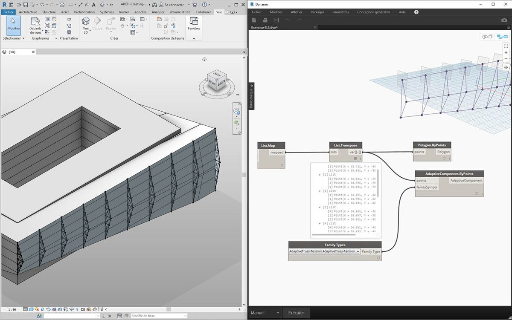

> Dans Revit, les dix fermes sont à présent espacées régulièrement sur la façade.

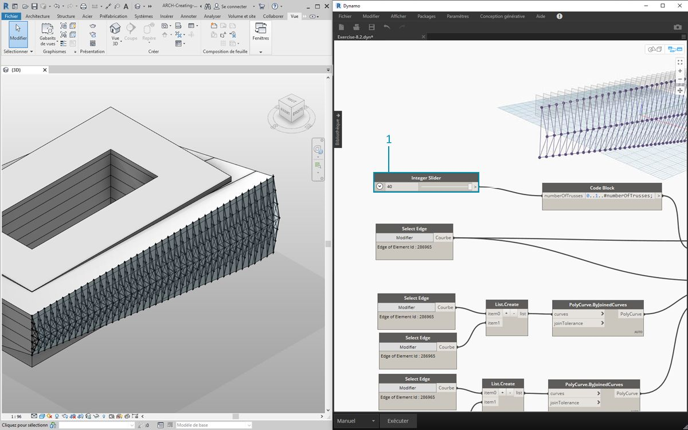

> 1. En ajustant le graphique, augmentez la valeur de *numberOfTrusses* de *40* en déplaçant le *curseur*. Beaucoup de fermes, peu réalistes, mais le lien paramétrique fonctionne.

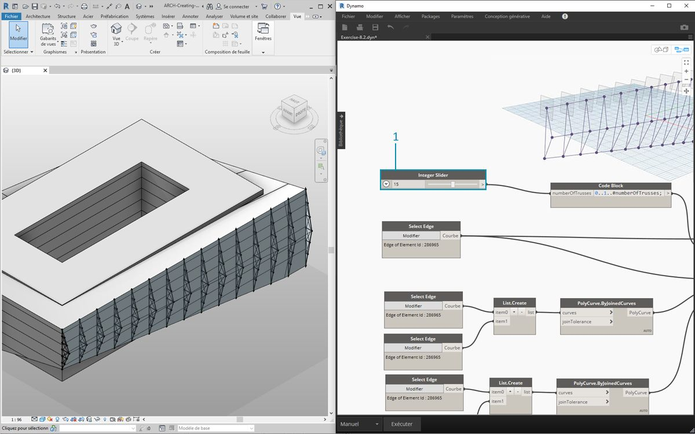

> 1. En utilisant le système de ferme, trouvez un compromis avec une valeur de *15* pour *numberOfTrusses*.

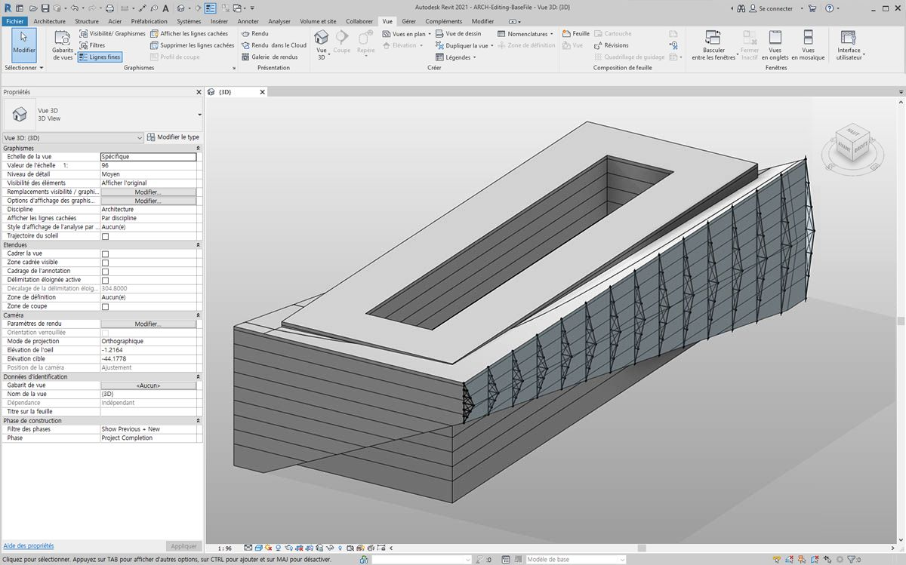

> Pour le dernier test, en sélectionnant le volume dans Revit et en modifiant les paramètres d'occurrence, vous pouvez modifier la forme du bâtiment et observer la ferme. Souvenez-vous que ce graphique Dynamo doit être ouvert pour que cette mise à jour s'affiche, et que le lien sera supprimé dès sa fermeture.

### Éléments DirectShape

Une autre méthode d'importation de géométrie Dynamo paramétrique dans Revit consiste à utiliser DirectShape. En résumé, l'élément DirectShape et les classes associées permettent de stocker des formes géométriques créées en externe dans un document Revit. La géométrie peut inclure des solides ou des maillages fermés. DirectShape sert principalement à importer des formes à partir d'autres formats de données, tels que IFC ou STEP, où il n'y a pas assez d'informations pour créer un élément Revit "réel". Comme les workflows IFC et STEP, la fonctionnalité DirectShape fonctionne bien avec l'importation de géométries créées dans des projets Revit en tant qu'éléments réels.

Vous allez examiner et réaliser des exercices dans le but d'importer une géométrie Dynamo en tant que forme directe dans votre projet Revit. Cette méthode permet d'affecter une catégorie, un matériau et un nom de géométrie importée, tout en maintenant un lien paramétrique vers le graphique Dynamo.

### Exercice

> Téléchargez les fichiers d'exemple joints à cet exercice (cliquez avec le bouton droit de la souris et choisissez "Enregistrer le lien sous..."). Vous trouverez la liste complète des fichiers d'exemple dans l'annexe.

> 1. [DirectShape.dyn](datasets/8-4/DirectShape.dyn)
2. [ARCH-DirectShape-BaseFile.rvt](datasets/8-4/ARCH-DirectShape-BaseFile.rvt)

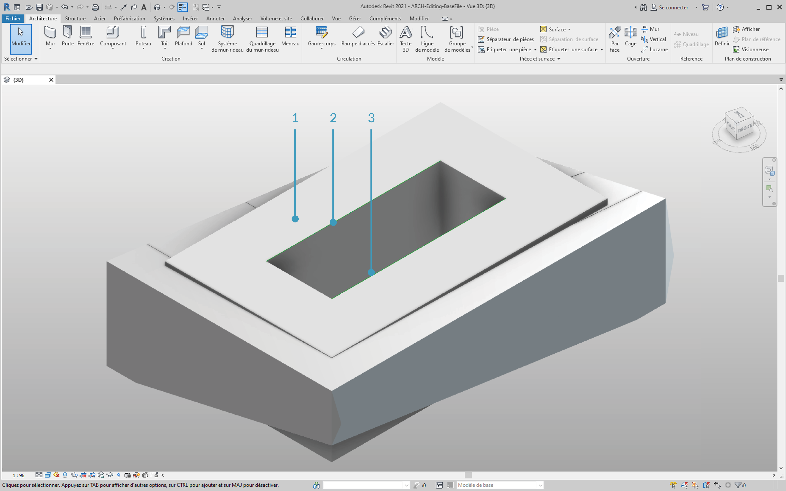

> Ouvrez tout d'abord le fichier d'exemple de cette leçon : ARCH-DirectShape-BaseFile.rvt.

> 1. Dans la vue 3D, vous pouvez voir le volume de votre bâtiment de la leçon précédente.
2. Le long de l'arête de l'atrium se trouve une courbe de référence, que vous allez utiliser comme courbe à référencer dans Dynamo.
3. Le long de l'arête opposée de l'atrium se trouve une autre courbe de référence que vous allez également référencer dans Dynamo.

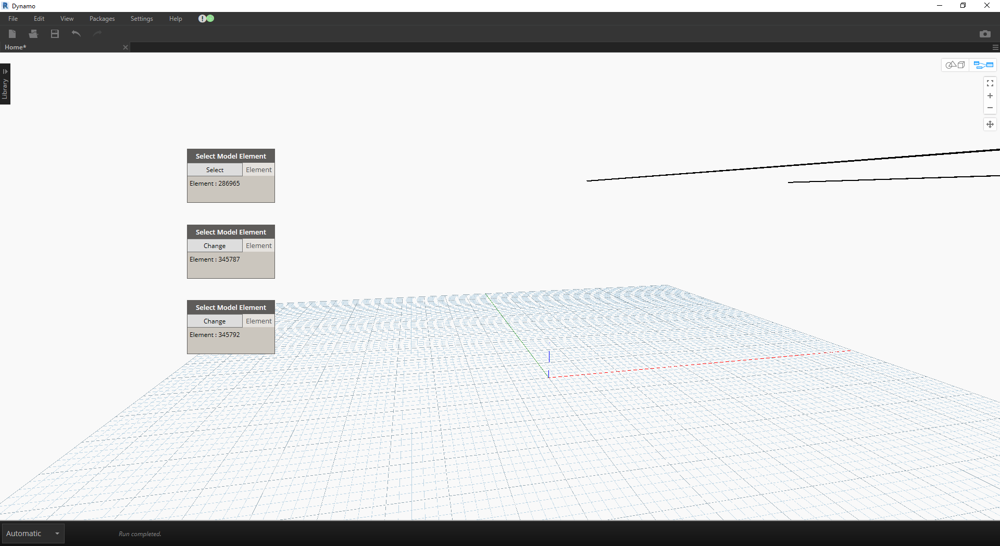

> 1. Pour référencer la géométrie dans Dynamo, utilisez *Select Model Element* pour chaque membre dans Revit. Sélectionnez le volume dans Revit et importez la géométrie dans Dynamo à l'aide de *Element.Faces*. Le volume doit maintenant être visible dans l'aperçu Dynamo.
2. Importez une courbe de référence dans Dynamo à l'aide de *Select Model Element* et *CurveElement.Curve*.
3. Importez l'autre courbe de référence dans Dynamo à l'aide de *Select Model Element* et *CurveElement.Curve*.


> 1. En zoomant et en vous déplaçant vers la droite dans l'exemple de graphique, vous apercevez un grand groupe de nœuds : il s'agit d'opérations géométriques qui génèrent la structure de toiture de treille visible dans l'aperçu Dynamo. Ces nœuds sont générés à l'aide de la fonctionnalité *Nœud vers code*, comme décrit dans la [section de bloc de code](../07_Code-Block/7-2_Design-Script-syntax.md#Node) du guide.
2. La structure est contrôlée par trois paramètres principaux : Décalage diagonale, Contre-flèche et Rayon.


> Effectuez un zoom avant sur les paramètres de ce graphique. Vous pouvez les ajuster pour obtenir différentes sorties de géométrie.

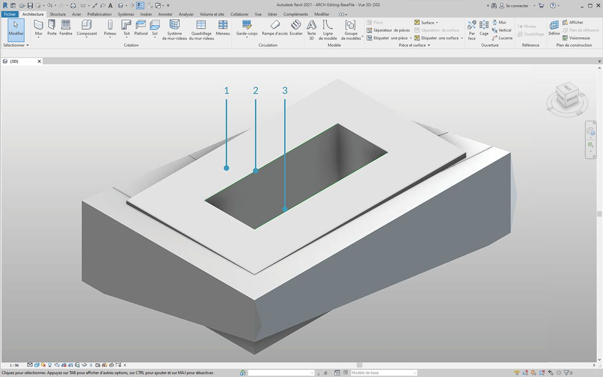

> 1. Lorsque vous déposez le nœud *DirectShape.ByGeometry* sur la zone de dessin, vous voyez qu'il comporte quatre entrées : **geometry, category, material** et **name**.
2. La géométrie sera le solide créé à partir de la partie de création de géométrie du graphique
3. L'entrée de catégorie est sélectionnée à l'aide du nœud déroulant *Categories*. Dans ce cas, vous allez utiliser "Ossature".
4. Vous pouvez sélectionner l'entrée de matériau via le réseau de nœuds ci-dessus, bien qu'il puisse être plus simplement défini comme "Par défaut" dans ce cas.

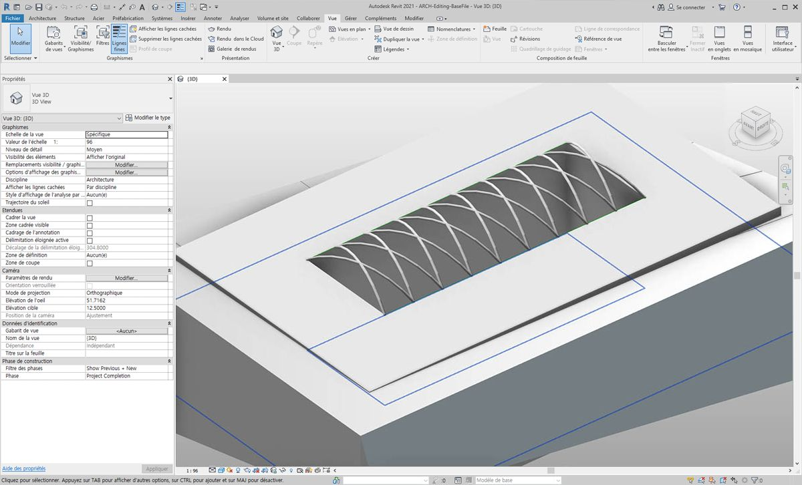

> Après avoir exécuté Dynamo, vous avez la géométrie importée sur le toit dans votre projet dans Revit. Il s'agit d'un élément d'ossature, et non d'un modèle générique. Le lien paramétrique vers Dynamo reste intact.


