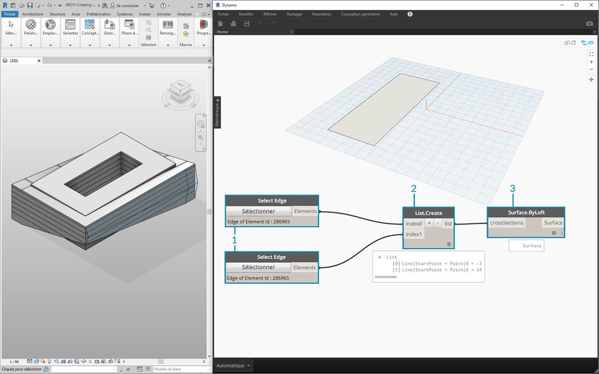
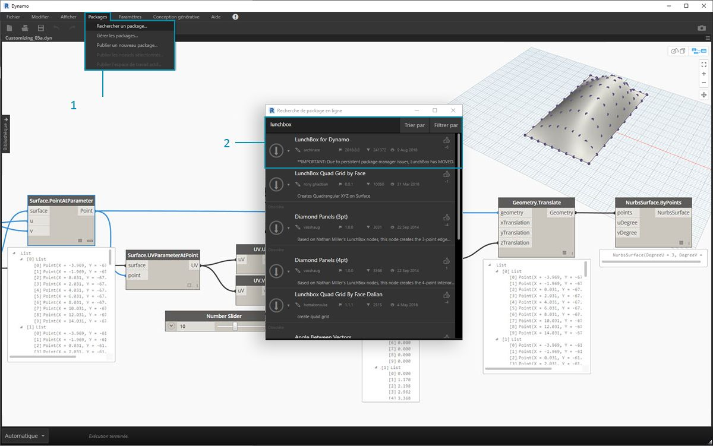
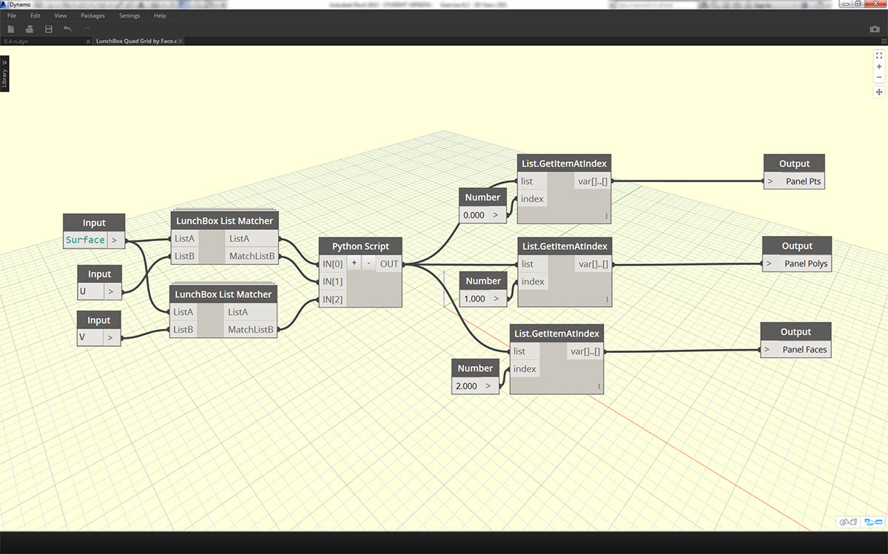
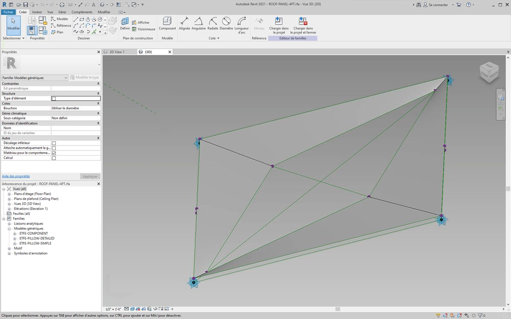
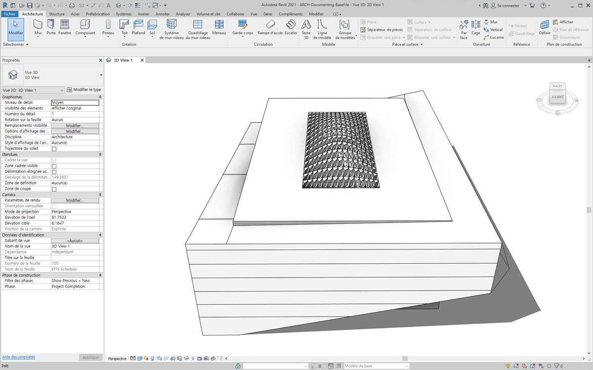
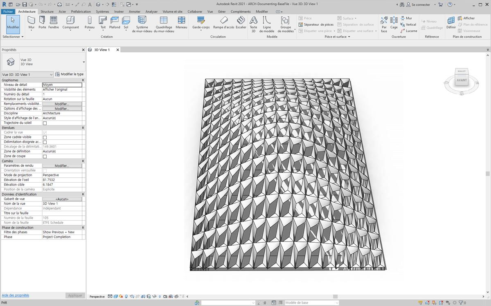
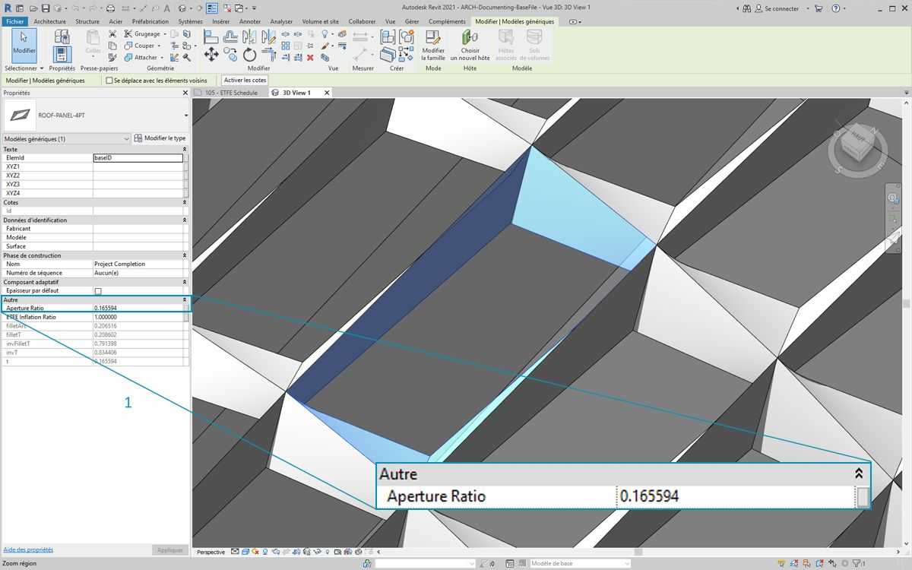
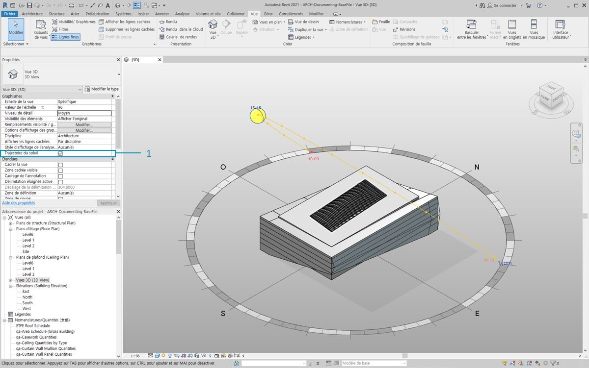
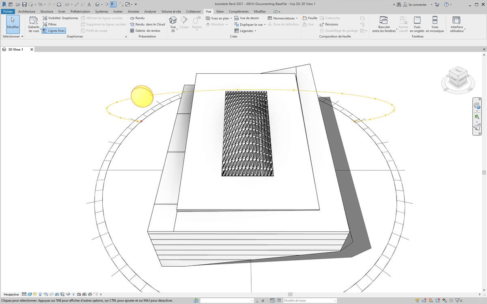

## Personnalisation

Bien que vous ayez précédemment étudié la modification d'un volume de construction de base, vous devez approfondir le lien Dynamo/Revit en modifiant un grand nombre d'éléments en une seule opération. La personnalisation à grande échelle devient plus complexe, car les structures de données nécessitent des opérations de listes plus avancées. Toutefois, les principes sous-jacents de leur exécution sont fondamentalement les mêmes. Examinez certaines possibilités d'effectuer des analyses à partir d'un ensemble de composants adaptatifs.

#### Emplacement du point

Imaginez que vous avez créé une série de composants adaptatifs et que vous souhaitez modifier les paramètres en fonction de leurs emplacements de point. Les points, par exemple, peuvent définir un paramètre d'épaisseur lié à la zone de l'élément. Ils peuvent aussi définir un paramètre d'opacité lié à l'exposition solaire tout au long de l'année. Dynamo permet la connexion de l'analyse aux paramètres en quelques étapes simples. Dans l'exercice ci-dessous, vous allez explorer une version de base.


> Interrogez les points adaptatifs d'un composant adaptatif sélectionné à l'aide du nœud *AdaptiveComponent.Locations*. Cela vous permet de travailler avec une version abstraite d'un élément Revit pour l'analyse.

En extrayant l'emplacement des points des composants adaptatifs, vous pouvez exécuter une série d'analyses pour cet élément. Par exemple, un composant adaptatif à quatre points vous permet d'étudier l'écart par rapport au plan d'un panneau donné.

#### Analyse de l'orientation du soleil


> Utilisez la fonction de remappage pour mapper un jeu de données dans une plage de paramètres. Il s'agit d'un outil fondamental utilisé dans un modèle paramétrique, que vous allez découvrir dans l'exercice ci-dessous.

Avec Dynamo, vous pouvez utiliser les emplacements des points des composants adaptatifs pour créer un plan d'ajustement optimal pour chaque élément. Vous pouvez également interroger la position du soleil dans le fichier Revit et étudier l'orientation relative du plan par rapport au soleil en comparaison avec les autres composants adaptatifs. Étudiez ce cas dans l'exercice ci-dessous en créant un environnement de toiture algorithmique.

### Exercice

> Téléchargez les fichiers d'exemple joints à cet exercice (cliquez avec le bouton droit de la souris et choisissez "Enregistrer le lien sous..."). Vous trouverez la liste complète des fichiers d'exemple dans l'annexe.

> 1. [Customizing.dyn](datasets/8-5/Customizing.dyn)
2. [ARCH-Customizing-BaseFile.rvt](datasets/8-5/ARCH-Customizing-BaseFile.rvt)

Cet exercice fournit des informations sur les techniques présentées dans la section précédente. Dans ce cas, définissez une surface paramétrique à partir d'éléments Revit, instanciant des composants adaptatifs à quatre points, puis modifiez-les en fonction de l'orientation par rapport au soleil.



> 1. Sélectionnez d'abord deux arêtes avec le nœud *"Select Edge"*. Les deux arêtes sont les longues travées de l'atrium.
2. Combinez les deux arêtes dans une liste avec le nœud *List.Create*.
3. Créez une surface entre les deux arêtes avec un nœud *surface.ByLoft*.


> 1. À l'aide du *bloc de code*, définissez une plage comprise entre 0 et 1 avec 10 valeurs équidistantes : ```0..1..#10;```
2. Connectez le *bloc de code* aux entrées *u* et *v* d'un nœud *Surface.PointAtParameter*, puis connectez le nœud *Surface.ByLoft* à l'entrée *surface*. Cliquez avec le bouton droit de la souris sur le nœud et définissez la *combinaison* sur *Produit vectoriel*. Cette action permet de créer une grille de points sur la surface.

Cette grille de points sert de points de contrôle pour une surface définie de manière paramétrique. Vous devez extraire les positions u et v de chacun de ces points afin de pouvoir les relier à une formule paramétrique et conserver la même structure de données. Pour ce faire, vous pouvez interroger les emplacements des paramètres des points que vous venez de créer.


> 1. Ajoutez un nœud *Surface.ParameterAtPoint* à la zone de dessin et connectez les entrées comme indiqué ci-dessus.
2. Interrogez les valeurs *u* de ces paramètres avec le nœud *UV.U*.
3. Interrogez les valeurs *v* de ces paramètres avec le nœud *UV.V*.
4. Les sorties montrent les valeurs *u* et *v* correspondantes pour chaque point de la surface. Vous disposez à présent d'une plage de *0* à *1* pour chaque valeur dans la structure de données appropriée. Vous êtes prêts à appliquer un algorithme paramétrique.


> 1. Ajoutez un *bloc de code* dans la zone de dessin et entrez le code : ```Math.Sin(u*180)*Math.Sin(v*180)*w;```. Il s'agit d'une fonction paramétrique qui crée un sinus à partir d'une surface plane.
2. L'entrée *u* se connecte à *UV.U*.
3. L'entrée *v* se connecte à *UV.V*.
4. Étant donné que l'entrée *w* représente l'*amplitude* de la forme, joignez-y un *curseur de numérotation*.


> 1. La liste des valeurs définies par l'algorithme est maintenant disponible. Utilisez cette liste de valeurs pour déplacer les points vers le haut dans la direction *+Z*. À l'aide de *Geometry.Translate*, connectez le *bloc de code* à *zTranslation* et le nœud *Surface.PointAtParameter* à l'entrée *geometry*. Les nouveaux points doivent s'afficher dans l'aperçu Dynamo.
2. Enfin, créez une surface avec le nœud *NurbsSurface.ByPoints* en connectant le nœud de l'étape précédente à l'entrée des points. Vous obtenez une surface paramétrique. N'hésitez pas à déplacer le curseur pour observer la taille du monticule diminuer ou augmenter.

En ce qui concerne la surface paramétrique, vous devez définir un moyen de la paneliser afin de mettre en réseau les composants adaptatifs à quatre points. Étant donné que Dynamo ne dispose pas de fonctionnalités prêtes à l'emploi pour la panelisation des surfaces, contactez la communauté pour des packages Dynamo utiles.



> 1. Accédez à *Packages > Rechercher un package...*
2. Recherchez *"LunchBox"* et téléchargez *"LunchBox for Dynamo"*. Il s'agit d'un ensemble d'outils très utiles pour les opérations de géométrie telles que celle-ci.


> 1. Après le téléchargement, vous disposez maintenant d'un accès complet à la suite LunchBox. Recherchez *"Quad Grid"* et sélectionnez *"LunchBox Quad Grid By Face"*. Connectez la surface paramétrique à l'entrée *surface* et définissez les divisions *U* et *V* sur *15*. Vous devriez voir apparaître une surface à quatre panneaux dans l'aperçu Dynamo.



> Si vous souhaitez en savoir plus sur la configuration, cliquez deux fois sur le nœud *Lunch Box* pour voir comment il est créé.



> Dans Revit, examinez rapidement le composant adaptatif utilisé ici. Pas besoin de suivre, mais c'est le panneau de toit à instancier. Il s'agit d'un composant adaptatif à quatre points, qui est une représentation grossière d'un système ETFE. L'ouverture du vide au centre se trouve sur un paramètre appelé *"ApertureRatio"*.


> 1. Étant donné que vous allez instancier un grand nombre de géométries dans Revit, veillez à définir le solveur Dynamo sur *Manuel*.
2. Ajoutez un nœud *Family Types* à la zone de dessin et sélectionnez *"ROOF-PANEL-4PT"*.
3. Ajoutez un nœud *AdaptiveComponent.ByPoints* à la zone de dessin, connectez les points *Panel Pts* de la sortie *"LunchBox Quad Grid by Face"* à l'entrée *points*. Connectez le nœud *Family Types* à l'entrée *FamilySymbol*.
4. Cliquez sur *Exécuter*. La création de la géométrie nécessite un peu de *temps* sur Revit. Si l'opération est trop longue, réduisez la valeur du bloc de code qui est égale à *15*. Cela permet de réduire le nombre de panneaux sur le toit.

*Remarque : si Dynamo prend trop de temps pour calculer les nœuds, vous pouvez utiliser la fonctionnalité "geler" du nœud pour interrompre l'exécution des opérations Revit lorsque vous développez votre graphique. Pour plus d'informations sur le gel des nœuds, consultez la section "Gel" du [chapitre Solides](../05_Geometry-for-Computational-Design/5-6_solids.md#freezing).*



> Dans Revit, vous avez le réseau de panneaux sur le toit.



> En zoomant, vous pouvez mieux observer leurs qualités de surface.

### Analyse



> 1. À partir de l'étape précédente, reprenez l'ouverture de chaque panneau en fonction de son exposition au soleil. Dans Revit, en zoomant et en sélectionnant un panneau, vous pouvez constater la présence d'un paramètre appelé *"Aperture Ratio"* dans la barre des propriétés. La famille est configurée de façon à ce que l'ouverture s'étende, approximativement, de *0,05* à *0,45*.



> 1. Si vous activez la trajectoire d'ensoleillement, vous pouvez voir l'emplacement actuel du soleil dans Revit.


> 1. Vous pouvez référencer l'emplacement du soleil à l'aide du nœud *SunSettings.Current*.
2. Connectez l'entrée SunSettings à *Sunsetting.SunDirection* pour obtenir le vecteur solaire.
3. À partir des points *Panel Pts* utilisés pour créer les composants adaptatifs, ayez recours à *Plane.ByBaestFitThroughPoints* pour obtenir une approximation du plan du composant.
4. Interrogez la *normale* de ce plan.
5. Utilisez le *produit scalaire* pour calculer l'orientation du soleil. Le produit scalaire est une formule qui détermine la mesure selon laquelle deux vecteurs sont parallèles ou antiparallèles. Prenez donc la normale du plan de chaque composant adaptatif et comparez-la au vecteur solaire pour simuler l'orientation du soleil de façon approximative.
6. Prenez la *valeur absolue* du résultat. Cela permet de garantir que le produit scalaire est précis si la normale du plan est orientée vers l'arrière.
7. Cliquez sur *Exécuter*.


> 1. Le *produit scalaire* contient une grande quantité de nombres. Pour utiliser leur distribution relative, vous devez condenser les nombres dans la plage appropriée du paramètre *"Aperture Ratio"* à modifier.
2. L'outil *Math.RemapRange* est idéal pour cela. Il prend une liste d'entrée et remappe ses limites en deux valeurs cibles.
3. Définissez les valeurs cibles sur *0,15* et *0,45* dans un *bloc de code*.
4. Cliquez sur *Exécuter*.


> 1. Connectez les valeurs remappées à un nœud *Element.SetParameterByName*.
2. Connectez la chaîne *"Aperture Ratio"* à l'entrée *parameterName*.
3. Connectez les *composants adaptatifs* à l'entrée *element*.
4. Cliquez sur *Exécuter*.



> Dans Revit, à partir d'une distance, vous pouvez définir l'impact de l'orientation du soleil sur l'ouverture des panneaux ETFE.


> En zoomant, vous pouvez voir que plus les panneaux ETFE font face au soleil et plus ils sont fermés. L'objectif ici est de réduire la surchauffe de l'exposition au soleil. Si vous voulez laisser davantage de lumière en fonction de l'exposition solaire, vous devez simplement définir le domaine sur *Math.RemapRange*.

