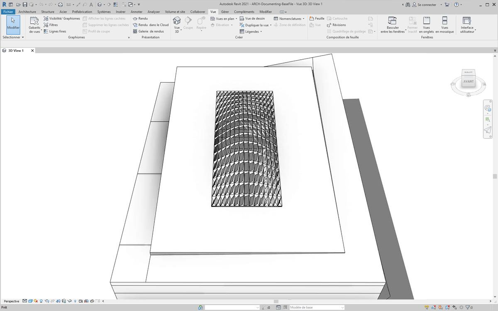
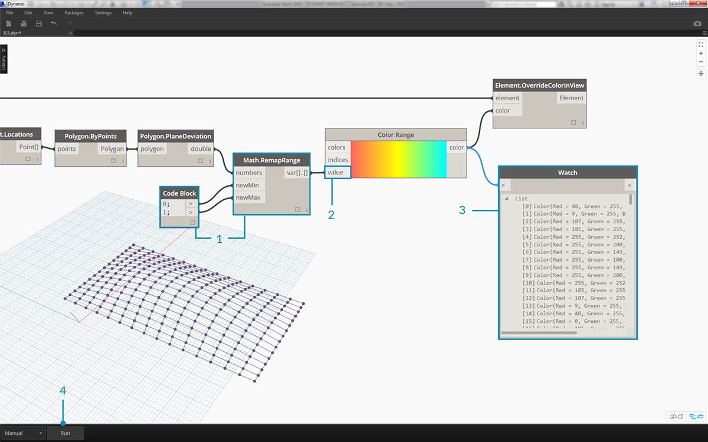
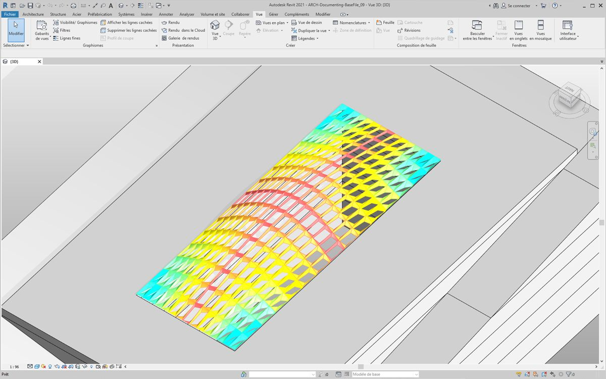
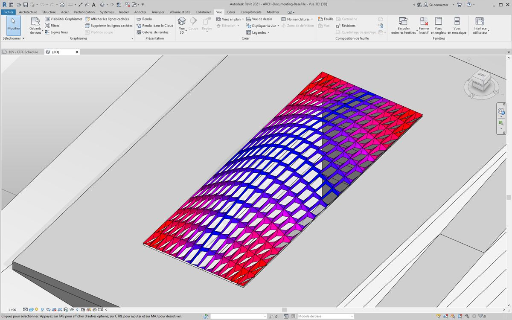
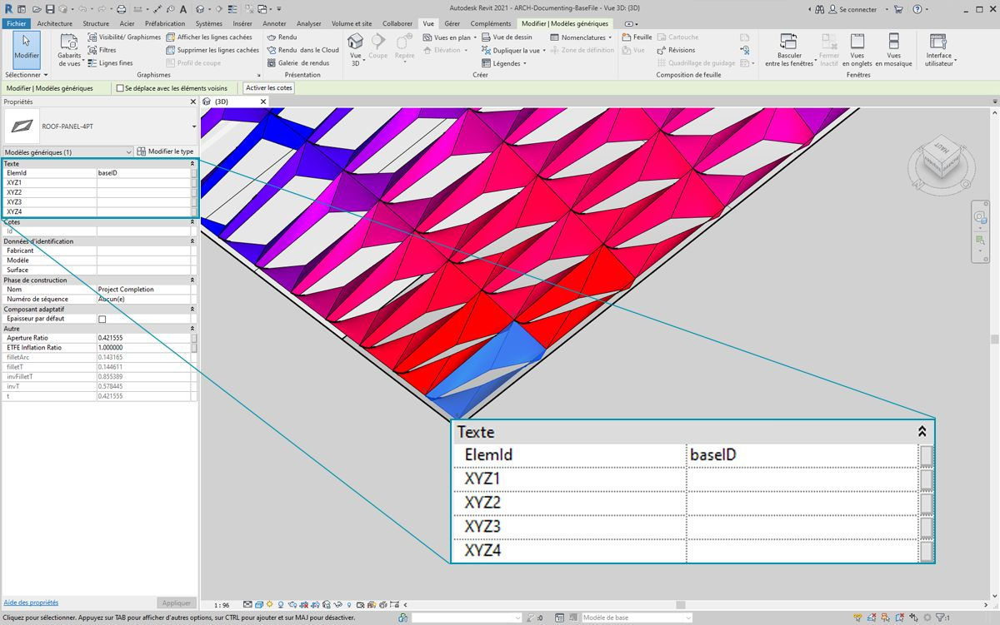
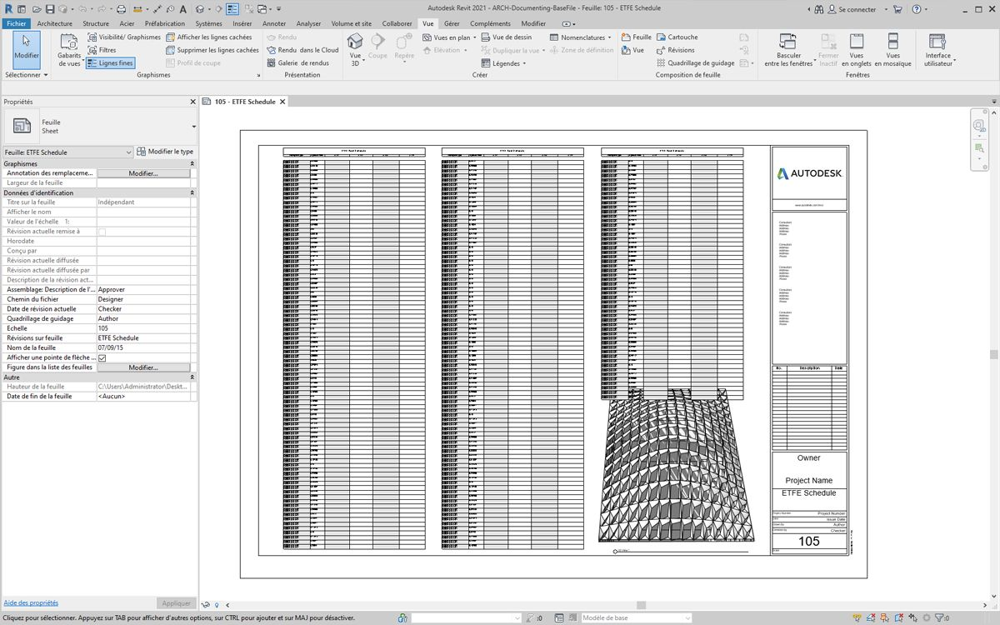
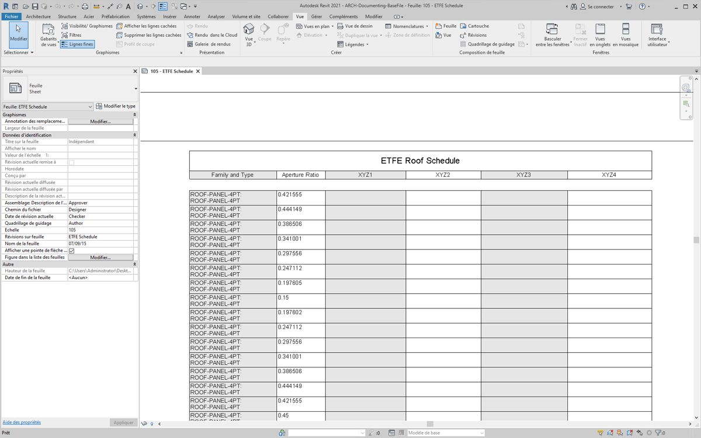
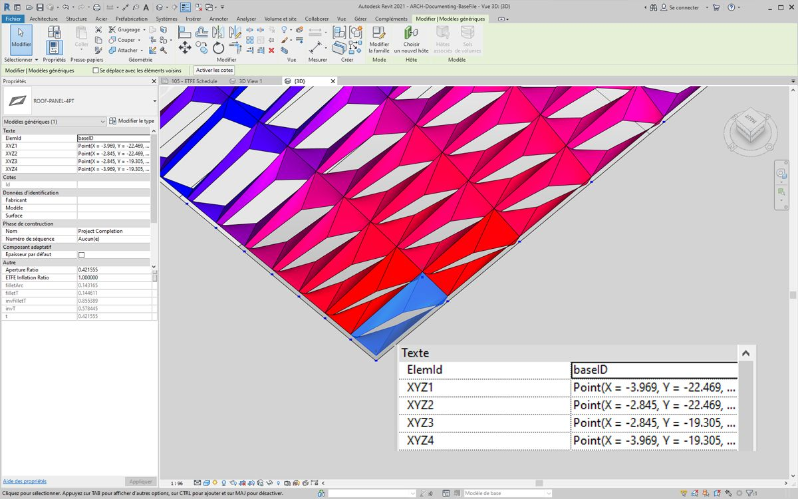
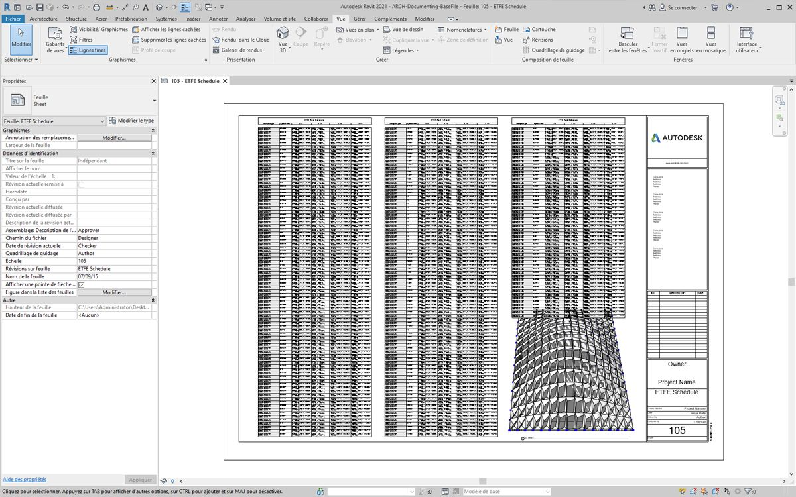
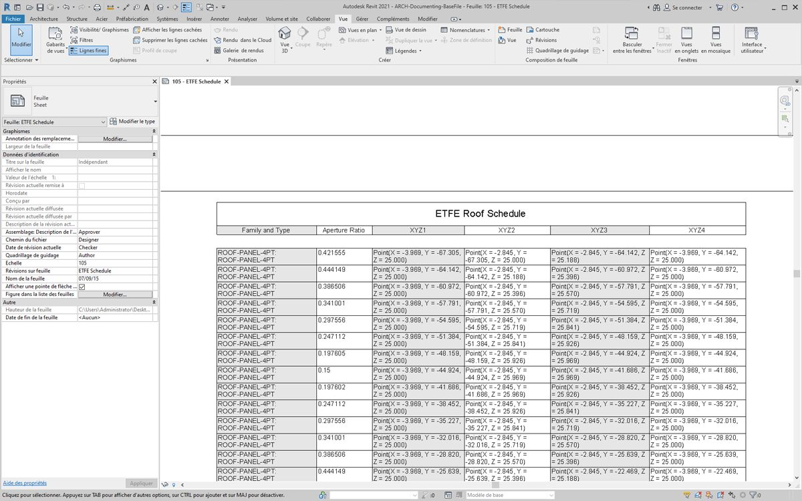

## Documentation

La modification des paramètres de la documentation suit les leçons apprises dans les sections précédentes. Dans cette section, vous allez découvrir les paramètres de modification qui n'affectent pas les propriétés géométriques d'un élément, mais qui permettent de préparer un fichier Revit pour la documentation.

#### Écart

Dans l'exercice ci-dessous, vous allez utiliser un écart de base par rapport au nœud Plane pour créer une feuille Revit pour la documentation. Chaque panneau de la structure de toit définie de façon paramétrique possède une valeur d'écart différente. L'objectif est de définir l'intervalle de valeurs à l'aide de couleurs et en planifiant les points adaptatifs à transmettre à un consultant, un ingénieur ou un entrepreneur responsable de la façade.


> L'écart par rapport au nœud Plane permet de calculer la distance à laquelle l'ensemble de quatre points varie par rapport au plan ajusté au mieux entre eux. Il s'agit d'une méthode simple et rapide pour étudier la constructibilité.

### Exercice

> Téléchargez les fichiers d'exemple joints à cet exercice (cliquez avec le bouton droit de la souris et choisissez "Enregistrer le lien sous..."). Vous trouverez la liste complète des fichiers d'exemple dans l'annexe.

> 1. [Documenting.dyn](datasets/8-6/Documenting.dyn)
2. [ARCH-Documenting-BaseFile.rvt](datasets/8-6/ARCH-Documenting-BaseFile.rvt)

Commencez par utiliser le fichier Revit pour cette section (ou continuez à partir de la section précédente). Ce fichier contient un réseau de panneaux ETFE sur le toit. Faites référence à ces panneaux pour cet exercice.


> 1. Ajoutez un nœud *Family Types* à la zone de dessin et choisissez *"ROOF-PANEL-4PT"*.
2. Connectez ce nœud à un nœud de sélection *All Elements of Family Type* pour transférer tous les éléments de Revit dans Dynamo.


> 1. Recherchez l'emplacement des points adaptatifs pour chaque élément à l'aide du nœud *AdaptiveComponent.Locations*.
2. Créez un polygone à partir de ces quatre points avec le nœud *Polygon.ByPoints*. Vous avez maintenant une version abstraite du système à panneaux dans Dynamo sans avoir à importer la géométrie complète de l'élément Revit.
3. Calculez l'écart planaire grâce au nœud *Polygon.PlaneDeviation*.


> Juste pour voir, comme dans l'exercice précédent, définissez le *rapport d'ouverture* de chaque panneau en fonction de son écart planaire.

> 1. Ajoutez un nœud *Element.SetParameterByName* à la zone de dessin et connectez les composants adaptatifs à l'entrée *element*. Connectez un *bloc de code* indiquant *"Aperture Ratio"* à l'entrée *parameterName*.
2. Vous ne pouvez pas connecter directement les résultats de l'écart à l'entrée value, car vous devez remapper les valeurs avec l'intervalle de paramètres.


> 1. Utilisez *Math.RemapRange* pour remapper les valeurs d'écart avec un domaine compris entre *0.15* et *0.45*.
2. Connectez ces résultats à l'entrée value de *Element.SetParameterByName*.



> Dans Revit, vous pouvez *donner un sens* au changement d'ouverture sur la surface.


> En zoomant, il apparaît plus clairement que les panneaux fermés sont orientés vers les coins de la surface. Les coins ouverts sont orientés vers le haut. Les coins représentent les zones de plus grand écart, tandis que le renflement présente logiquement une courbure minimale.

### Couleur et documentation

La définition du rapport d'ouverture n'indique pas clairement l'écart des panneaux sur le toit, et vous modifiez également la géométrie de l'élément réel. Imaginez que vous souhaitiez simplement étudier l'écart du point de vue de la faisabilité de la fabrication. Il conviendrait de colorer les panneaux en fonction de l'intervalle d'écart de la documentation. Pour ce faire, utilisez la série d'étapes ci-dessous et suivez un procédé très similaire à celui susmentionné.


> 1. Supprimez les nœuds *Element.SetParameterByName* et ajoutez *Element.OverrideColorInView*.
2. Ajoutez un nœud *Color Range* à la zone de dessin et connectez-le à l'entrée color de *Element.OverrideColorInView*. Vous devez toujours connecter les valeurs d'écart à l'intervalle de couleurs pour créer le dégradé.
3. Placez le curseur sur l'entrée *value*. Vous pouvez voir que les valeurs d'entrée doivent être comprises entre *0* et *1* pour mapper une couleur avec chaque valeur. Vous devez remapper les valeurs d'écart avec cet intervalle.



> 1. À l'aide de *Math.RemapRange*, remappez les valeurs d'écart planaire sur un intervalle compris entre *0* et *1* (remarque : vous pouvez utiliser le nœud *"MapTo"* pour définir également un domaine source).
2. Connectez les résultats à un nœud *Color Range*.
3. La sortie est un intervalle de couleurs, et non un intervalle de nombres.
4. Si vous avez défini le paramètre sur Manuel, cliquez sur *Exécuter*. À partir de ce point, vous devez être en mesure de choisir l'option Automatique.



> Dans Revit, le dégradé est bien plus lisible, qui est représentatif de l'écart planaire basé sur l'intervalle de couleurs. Mais que faire si vous voulez personnaliser les couleurs ? Les valeurs d'écart minimal sont représentées en rouge, ce qui semble aller à contre-courant du résultat attendu. L'écart maximal doit être rouge, avec un écart minimal représenté par une couleur plus douce. Retournez dans Dynamo et corrigez le problème.


> 1. À l'aide d'un *bloc de code*, ajoutez deux nombres sur deux lignes différentes : ```0;``` et ```255;```.
2. Pour créer une couleur rouge et une couleur bleue, connectez les valeurs appropriées à deux nœuds *Color.ByARGB*.
3. Créez une liste à partir de ces deux couleurs.
4. Connectez cette liste à l'entrée *colors* de *Color Range* et observez l'intervalle de couleurs personnalisé se mettre à jour.



> Dans Revit, vous pouvez désormais mieux comprendre les zones d'écart maximal dans les coins. Rappelez-vous que ce nœud permet de remplacer une couleur dans une vue. Il serait donc utile si vous aviez une feuille particulière dans le jeu de dessins, axée sur un type particulier d'analyse.

### Planification



> 1. Dans Revit, sélectionnez un panneau ETFE. Quatre paramètres d'occurrence sont disponibles : *XYZ1, XYZ2, XYZ3* et *XYZ4*. Ils sont tous vides après leur création. Il s'agit de paramètres basés sur du texte et des valeurs requises. Utilisez Dynamo pour écrire les emplacements de points adaptatifs sur chaque paramètre. Cela permet d'assurer l'interopérabilité si la géométrie doit être envoyée à un ingénieur consultant en façade.



> Voici une feuille d'exemple qui contient une nomenclature volumineuse et vide. Les paramètres XYZ sont des paramètres partagés dans le fichier Revit, ce qui vous permet de les ajouter à la nomenclature.



> En zoomant, les paramètres XYZ restent à remplir. Les deux premiers paramètres sont pris en charge par Revit.


> L'écriture de ces valeurs requiert une opération de liste complexe. Le graphique lui-même est simple, mais les concepts sont très élaborés à partir du mappage de liste, comme décrit dans le chapitre de liste.

> 1. Sélectionnez tous les composants adaptatifs à l'aide de deux nœuds.
2. Extrayez l'emplacement de chaque point à l'aide de *AdaptiveComponent.Locations*.
3. Convertissez ces points en chaînes. N'oubliez pas que le paramètre est basé sur du texte. Vous devez donc saisir le type de données correct.
4. Créez une liste des quatre chaînes qui définissent les paramètres à modifier : *XYZ1, XYZ2, XYZ3* et *XYZ4*.
5. Connectez cette liste à l'entrée *parameterName* de *Element.SetParameterByName*.
6. Connectez *Element.SetParameterByName* à l'entrée *combinator* de *List.Combine*.
7. Connectez les *composants adaptatifs* à *list1*.
8. Connectez l'élément *String* de l'objet à *list2*.
9. Vous obtenez ici une correspondance de liste, car vous écrivez quatre valeurs pour chaque élément, ce qui crée une structure de données complexe. Le nœud *List.Combine* définit une opération d'un pas vers le bas dans la hiérarchie de données. Par conséquent, les entrées element et value restent vides. *List.Combine* connecte les sous-listes de ses entrées aux entrées vides de *List.SetParameterByName*, en fonction de l'ordre dans lequel elles sont connectées.



> Lorsque vous sélectionnez un panneau dans Revit, il y a désormais des valeurs de chaîne pour chaque paramètre. En réalité, vous créeriez un format plus simple pour écrire un point (X, Y, Z). Cela peut être effectué avec des opérations de chaîne dans Dynamo, mais ce thème n'est pas abordé ici pour ne pas sortir du cadre de ce chapitre.



> Vue de l'exemple de nomenclature avec des paramètres remplis.



> Chaque panneau ETFE possède désormais les coordonnées XYZ écrites pour chaque point adaptatif, représentant les coins de chaque panneau pour la fabrication.

