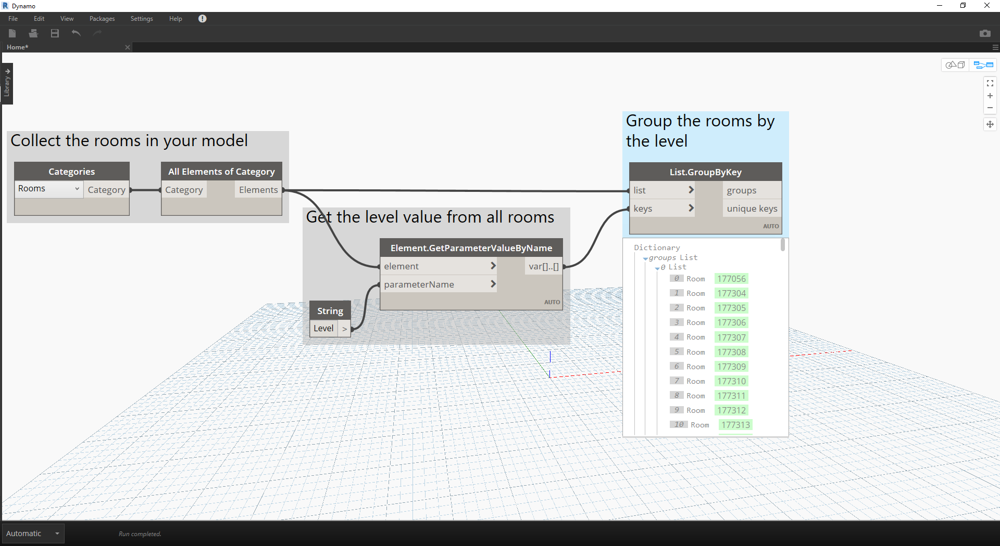

# Dictionnaires - Cas d'utilisation de Revit

Avez-vous déjà voulu rechercher quelque chose dans Revit à partir d'un élément de données qu'il contient ?

#### Il y a des chances si vous avez procédé ainsi :


> Dans l'image ci-dessus, nous rassemblons toutes les pièces dans le modèle Revit, nous obtenons l'index de la pièce souhaitée (par numéro de pièce), puis nous sélectionnons la pièce au niveau de l'index.

### Recréez maintenant cette idée à l'aide de dictionnaires.

> Téléchargez le fichier d'exemple joint à cet exercice (cliquez avec le bouton droit de la souris et choisissez "Enregistrer le lien sous...") : [RoomDictionary.dyn](datasets/9-4_roomDictionary.dyn). Vous trouverez la liste complète des fichiers d'exemple dans l'annexe.

 Vous devez d'abord rassembler toutes les pièces dans votre modèle Revit.

> * Choisissez la catégorie Revit avec laquelle vous voulez travailler (dans le cas présent, vous travaillez avec des pièces).
* Vous indiquez à Dynamo de collecter tous ces éléments.

 Ensuite, vous devez décider des clés que vous allez utiliser pour rechercher ces données. (Pour plus d'informations sur les clés, consultez la section [9-1 Qu'est-ce qu'un dictionnaire ?](9-1_What-is-a-dictionary,md).)

> * Les données que vous utilisez sont les numéros de pièce.

Vous allez maintenant créer le dictionnaire avec les clés et les éléments donnés.

> * Le nœud ```Dictionary.ByKeysValues``` crée un dictionnaire en fonction des entrées appropriées.
* ```Keys``` doit être une chaîne, tandis que ```values``` peut être une variété de types d'objets.

 Enfin, vous pouvez extraire une pièce du dictionnaire avec son numéro de pièce.

> * ```String``` sera la clé que vous utiliserez pour rechercher un objet dans le dictionnaire.
* Désormais, ```Dictionary.ValueAtKey``` obtiendra l'objet à partir du dictionnaire.

---

### Cette logique de dictionnaire permet également de créer des dictionnaires contenant des objets groupés. Si vous voulez rechercher toutes les pièces à un niveau donné, vous pouvez modifier le graphique ci-dessus comme suit.


> * Au lieu d'utiliser le numéro de pièce comme clé, vous pouvez maintenant utiliser une valeur de paramètre (dans le cas présent, vous allez utiliser le niveau).



> * Maintenant, vous pouvez regrouper les pièces selon le niveau sur lequel elles résident.


> * Avec les éléments regroupés par niveau, vous pouvez désormais utiliser les clés partagées (clés uniques) comme clés de votre dictionnaire, ainsi que les listes de pièces comme éléments.


> * Enfin, en utilisant les niveaux du modèle Revit, vous pouvez rechercher les pièces qui résident sur ce niveau dans le dictionnaire. ```Dictionary.ValueAtKey``` prend le nom du niveau et renvoie les objets de pièce à ce niveau.

Les possibilités d'utilisation du dictionnaire sont infinies. La possibilité de lier vos données BIM dans Revit à l'élément lui-même offre une variété de cas d'utilisation.

