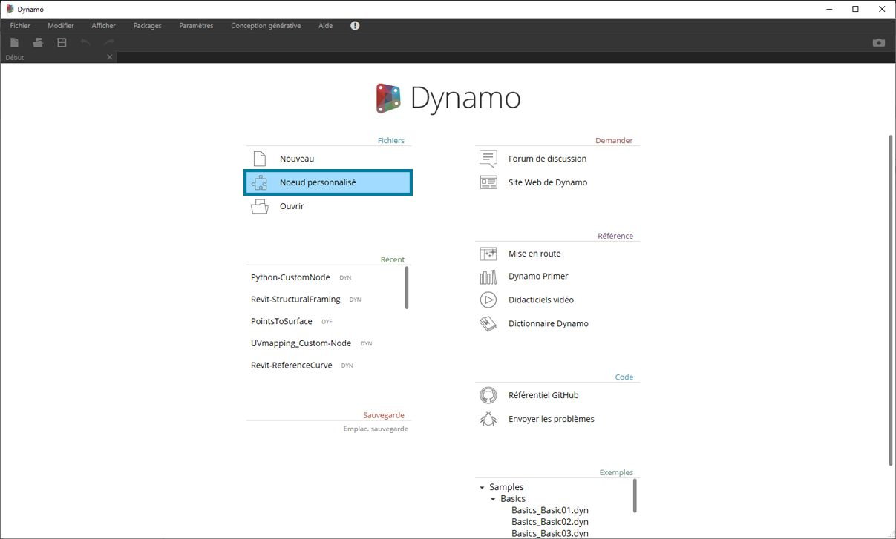
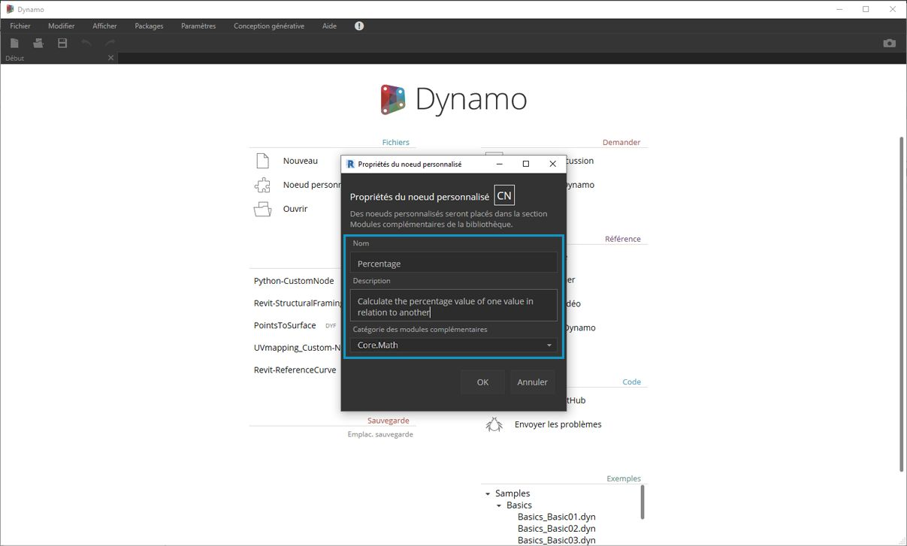
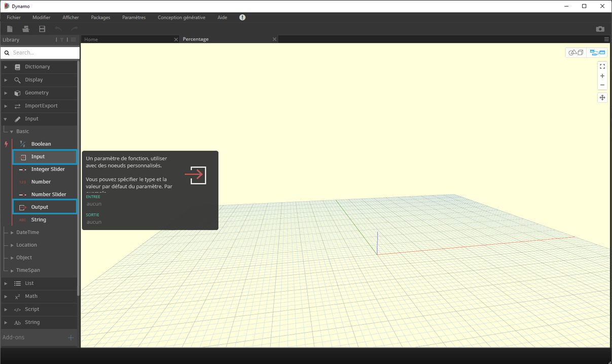

## Noeuds personnalisés

Dynamo propose de nombreux noeuds clés pour une large gamme de tâches de programmation visuelle. Parfois, la création de vos propres noeuds est une solution plus rapide, plus élégante ou plus facilement partageable. Ces noeuds peuvent être réutilisés dans différents projets, ils rendent votre graphique plus clair et plus propre, et ils peuvent être transférés vers le gestionnaire de packages et partagés avec la communauté Dynamo mondiale.

### Nettoyage de votre graphique

Les noeuds personnalisés sont construits en imbriquant d'autres noeuds et noeuds personnalisés dans un "noeud personnalisé Dynamo", que vous pouvez comparer à un conteneur. Lorsque ce noeud conteneur est exécuté dans votre graphique, tous les éléments qu'il contient sont exécutés pour vous permettre de réutiliser et de partager une combinaison utile de noeuds.

### Adaptation au changement

Lorsque votre graphique contient plusieurs copies d'un noeud personnalisé, vous pouvez tous les mettre à jour en modifiant le noeud personnalisé de base. Cela vous permet de mettre à jour votre graphique de manière fluide en l'adaptant aux modifications susceptibles de se produire dans le workflow ou la conception.

### Travail collaboratif

La meilleure fonctionnalité des noeuds personnalisés est sans doute leur capacité de partage de travail. Si un "utilisateur avancé" crée un graphique Dynamo complexe et le transmet à un concepteur qui débute avec Dynamo, il peut condenser le graphique en ne gardant que l'essentiel pour l'interaction. Le noeud personnalisé peut être ouvert pour modifier le graphique interne, mais le "conteneur" peut rester simple. Avec ce processus, les noeuds personnalisés permettent aux utilisateurs de Dynamo de concevoir un graphique propre et intuitif.

### Les différentes méthodes de création d'un noeud

Il existe de nombreuses façons de créer des noeuds personnalisés dans Dynamo. Dans les exemples de ce chapitre, vous allez créer des noeuds personnalisés directement à partir de l'interface utilisateur de Dynamo. Si vous êtes programmeur et que vous souhaitez utiliser le formatage C# ou Zero Touch, vous pouvez consulter [cette page](https://github.com/DynamoDS/Dynamo/wiki/How-To-Create-Your-Own-Nodes) sur le wiki Dynamo pour des informations plus approfondies.

### Environnement de noeud personnalisé

Passez maintenant à l'environnement de noeud personnalisé et créez un noeud simple pour calculer un pourcentage. L'environnement de noeud personnalisé est différent de l'environnement graphique Dynamo, mais l'interaction est similaire. Cela étant dit, vous allez maintenant créer votre premier noeud personnalisé.

> Pour créer un noeud personnalisé à partir de zéro, lancez Dynamo et choisissez Noeud personnalisé, ou tapez Ctrl + Maj + N dans la zone de dessin.

> Ajoutez un nom, une description et une catégorie dans la boîte de dialogue Propriétés du noeud personnalisé.

> 1. **Nom :** Pourcentage
2. **Description** : Calcule le pourcentage d'une valeur par rapport à une autre.
3. **Catégorie :** Core.Math

> Une zone de dessin s'ouvre avec un arrière-plan jaune, indiquant que vous travaillez dans un noeud personnalisé. Dans cette zone de dessin, vous avez accès à tous les noeuds Dynamo de base, ainsi qu'aux noeuds **Input** et **Output**, qui définissent le flux de données entrant et sortant du noeud personnalisé. Ils sont disponibles dans *Core > Input*.

> 1. **Inputs :** les noeuds d'entrée créent des ports d'entrée sur le noeud personnalisé. La syntaxe d'un noeud d'entrée est *nom_entrée : typededonnées = valeur_défaut (facultatif).*

2. **Outputs :** semblables aux entrées, elles créent et nomment des ports de sortie sur le noeud personnalisé. Ajoutez un **commentaire personnalisé** aux ports d'entrée et de sortie pour indiquer les types d'entrée et de sortie. Cette opération est décrite plus en détail dans la section [Création de noeuds personnalisés](10-2_Creating.md).

Vous pouvez enregistrer ce noeud personnalisé en tant que fichier .dyf (par opposition au fichier .dyn standard) et il sera automatiquement ajouté à votre session et aux sessions ultérieures. Le noeud personnalisé se trouve dans votre bibliothèque, dans la catégorie spécifiée dans les propriétés du noeud personnalisé.

> À gauche : catégorie Core > Math de la bibliothèque par défaut. 
À droite : Core > Math avec le nouveau noeud personnalisé.

### Pour continuer

Maintenant que vous avez créé votre premier noeud personnalisé, les sections suivantes approfondiront la fonctionnalité des noeuds personnalisés et la publication de workflows génériques. Dans la section suivante, vous allez développer un noeud personnalisé qui transfère la géométrie d'une surface à une autre.

