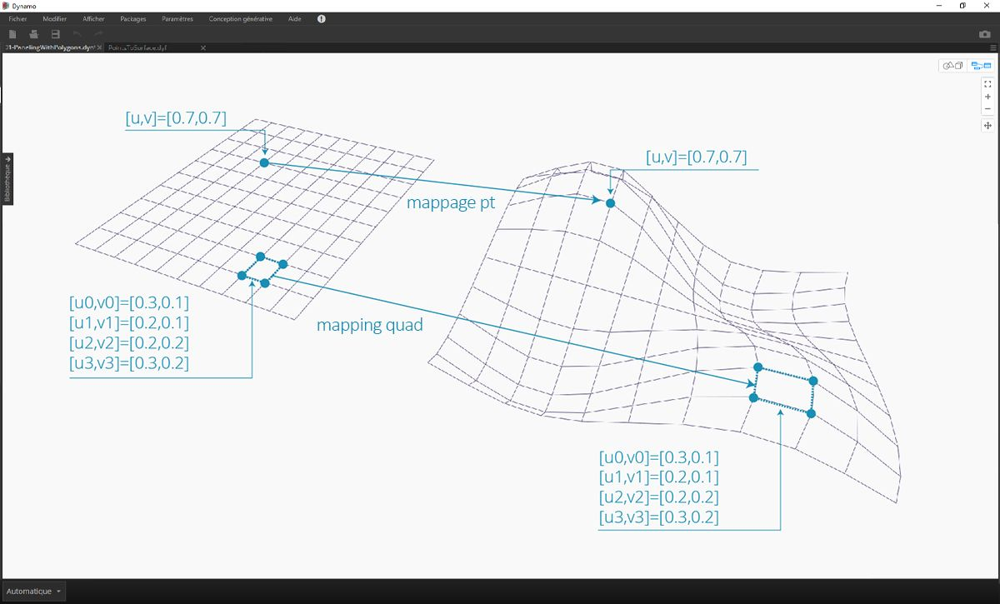
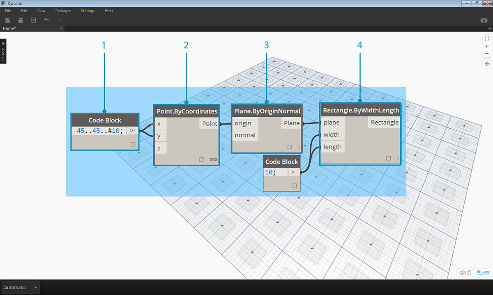
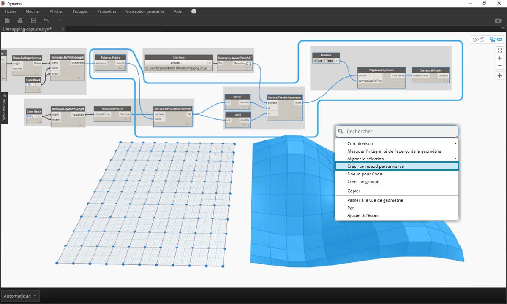
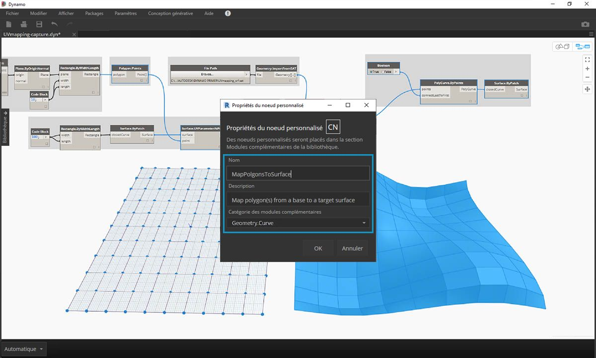
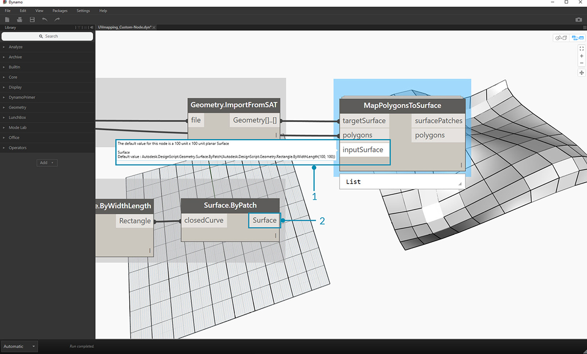

## Création d'un nœud personnalisé

Dynamo propose plusieurs méthodes de création de nœuds personnalisés. Vous pouvez créer des nœuds personnalisés à partir de zéro, à partir d'un graphique existant ou de façon explicite en C#. Dans cette section, vous allez découvrir comment créer un nœud personnalisé dans l'interface utilisateur de Dynamo à partir d'un graphique existant. Cette méthode est idéale pour nettoyer l'espace de travail, ainsi que pour regrouper une séquence de nœuds à réutiliser ailleurs.

### Nœuds personnalisés pour le mappage UV

Dans l'image ci-dessous, un point d'une surface est mappé sur une autre surface à l'aide des coordonnées UV. Ce concept va vous permettre de créer une surface de panneaux qui référence des courbes dans le plan XY. Dans le cadre de la construction de panneaux, vous allez créer ici des panneaux quadrilatéraux. En utilisant la même logique, vous pouvez créer un grand nombre de panneaux avec le mappage UV. C'est une excellente opportunité pour le développement de nœuds personnalisés, car vous pourrez répéter un processus similaire plus facilement dans ce graphique ou dans d'autres workflows Dynamo.

### Création d'un nœud personnalisé à partir d'un graphique existant

> Téléchargez et décompressez les fichiers d'exemple de cet exercice (cliquez avec le bouton droit de la souris et choisissez "Enregistrer le lien sous..."). Vous trouverez la liste complète des fichiers d'exemple dans l'annexe. [UV-CustomNode.zip](datasets/10-2/UV-CustomNode.zip)

Commencez par créer un graphique à imbriquer dans un nœud personnalisé. Dans cet exemple, vous allez créer un graphique qui mappe des polygones d'une surface de base vers une surface cible, à l'aide de coordonnées UV. Ce processus de mappage UV est fréquemment utilisé, ce qui en fait un bon candidat pour un nœud personnalisé. Pour plus d'informations sur les surfaces et l'espace UV, reportez-vous à la section 5.5. Le graphique complet est *UVmapping_Custom-Node.dyn* du fichier .zip téléchargé ci-dessus.

> 1. **Bloc de code :** créez un intervalle de 10 nombres compris entre 45 et -45 à l'aide d'un bloc de code.
2. **Point.ByCoordinates :** connectez la sortie du bloc de code aux entrées "x" et "y" et définissez la combinaison sur Référence croisée. Vous devez maintenant avoir une grille de points.
3. **Plane.ByOriginNormal :** connectez la sortie *"Point"* à l'entrée *"origin"* pour créer un plan au niveau de chacun des points. Le vecteur normal par défaut de (0,0,1) est utilisé.
4. **Rectangle.ByWidthLength :** connectez les plans de l'étape précédente à l'entrée *"plan"*, puis utilisez un bloc de code avec une valeur de *10* pour spécifier la largeur et la longueur.

Vous devez maintenant voir une grille de rectangles. Mappez ces rectangles sur une surface cible à l'aide des coordonnées UV.

> 1. **Polygon.Points :** connectez la sortie Rectangle de l'étape précédente à l'entrée *"polygon"* pour extraire les points de coin de chaque rectangle. Il s'agit des points que vous allez mapper sur la surface cible.
2. **Rectangle.ByWidthLength :** utilisez un bloc de code avec une valeur de *100* pour spécifier la largeur et la longueur d'un rectangle. Il s'agit de la limite de la surface de base.
3. **Surface.ByPatch :** connectez le rectangle de l'étape précédente à l'entrée *"closedCurve"* pour créer une surface de base.
4. **Surface.UVParameterAtPoint :** connectez la sortie *"Point"* du nœud *Polygon.Points* et la sortie *"Surface"* du nœud *Surface.ByPatch* pour renvoyer le paramètre UV à chaque point.

Maintenant que vous avez une surface de base et un ensemble de coordonnées UV, importez une surface cible et mappez les points entre les surfaces.

> 1. **File Path :** sélectionnez le chemin d'accès au fichier de la surface à importer. Le type de fichier doit être .SAT. Cliquez sur le bouton *"Parcourir..."* et accédez au fichier *UVmapping_srf.sat* à partir du fichier .zip téléchargé ci-dessus.
2. **Geometry.ImportFromSAT :** connectez le chemin d'accès au fichier pour importer la surface. Vous devez voir la surface importée dans l'aperçu de la géométrie.
3. **UV :** connectez la sortie du paramètre UV à un nœud *UV.U* et à un nœud *UV.V*.
4. **Surface.PointAtParameter :** connectez la surface importée ainsi que les coordonnées u et v. Vous devez maintenant voir une grille de points 3D sur la surface cible.

La dernière étape consiste à utiliser les points 3D pour construire des corrections de surface rectangulaires.

> 1. **PolyCurve.ByPoints :** connectez les points de la surface pour construire une polycourbe à travers les points.
2. **Booléen :** ajoutez un objet booléen à l'espace de travail et connectez-le à l'entrée *"connectLastToFirst"* et sélectionnez True pour fermer les polycourbes. Vous devez maintenant voir des rectangles mappés sur la surface.
3. **Surface.ByPatch :** connectez les polycourbes à l'entrée *"closedCurve"* pour construire des corrections de surface.

Sélectionnez les nœuds à imbriquer dans un nœud personnalisé, en choisissant les entrées et les sorties de votre nœud. Étant donné que votre nœud personnalisé doit être aussi flexible que possible, il doit être en mesure de mapper des polygones, pas seulement des rectangles.

> Sélectionnez les nœuds ci-dessus (en commençant par *Polygon.Points*), cliquez avec le bouton droit de la souris sur l'espace de travail et choisissez *"Nouveau nœud de la sélection"*.

> Dans la boîte de dialogue Propriétés du nœud personnalisé, attribuez un nom, une description et une catégorie au nœud personnalisé.

> Le nœud personnalisé a considérablement nettoyé l'espace de travail. Notez que les entrées et les sorties ont été nommées en fonction des nœuds d'origine. Modifiez le nœud personnalisé pour rendre les noms plus descriptifs.

> Cliquez deux fois sur le nœud personnalisé pour le modifier. Un espace de travail à l'arrière-plan jaune représentant l'intérieur du nœud s'affiche.

> 1. **Entrées :** remplacez les noms d'entrée par *baseSurface* et *targetSurface*.
2. **Sorties :** ajoutez une sortie supplémentaire pour les polygones mappés.
> Enregistrez le nœud personnalisé et revenez à l'espace de travail de base.

> Le nœud **MapPolygonsToSurface** reflète les modifications apportées.

Vous pouvez également renforcer la robustesse du nœud personnalisé en ajoutant des **commentaires personnalisés**. Les commentaires peuvent vous aider à indiquer les types d'entrée et de sortie ou à expliquer la fonctionnalité du nœud. Des commentaires s'affichent lorsque l'utilisateur place le curseur sur une entrée ou une sortie d'un nœud personnalisé.

> Cliquez deux fois sur le nœud personnalisé pour le modifier. Cette action permet de rouvrir l'espace de travail à l'arrière-plan jaune.

> 1. Commencez par modifier le bloc de code d'entrée. Pour commencer un commentaire, saisissez "//" suivi du texte du commentaire. Tapez tout ce qui peut aider à clarifier le nœud : ici, c'est la *surface cible* qui est décrite.
2. Définissez également la valeur par défaut pour *inputSurface* en définissant le type d'entrée sur une valeur équivalente. Ici, la valeur par défaut est définie sur le jeu Surface.ByPatch d'origine.

> Vous pouvez également appliquer les commentaires aux sorties. Commencez par modifier le texte dans le bloc de code de sortie. Pour commencer un commentaire, saisissez "//" suivi du texte du commentaire. Ici, une description plus détaillée est ajoutée pour clarifier les sorties de *Polygons* et de *surfacePatches*.

 >

1. Placez le curseur sur les entrées de nœud personnalisé pour afficher les commentaires.
2. Étant donné que la valeur par défaut est définie sur *inputSurface*, vous pouvez également exécuter la définition sans entrée de surface.

