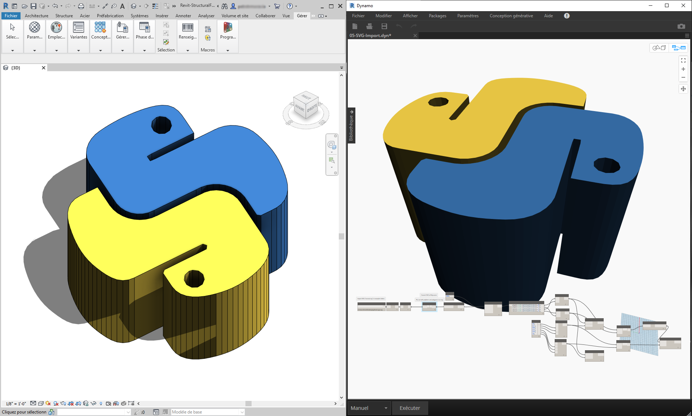
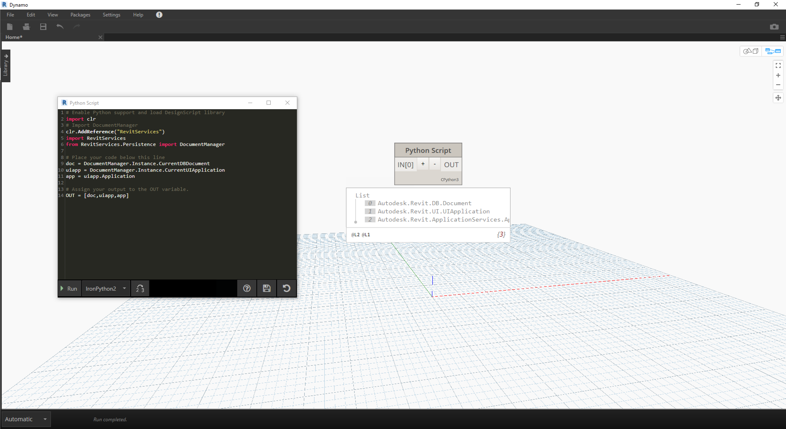
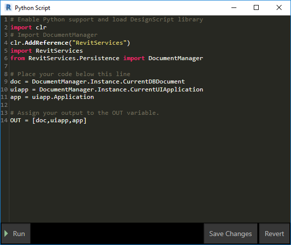
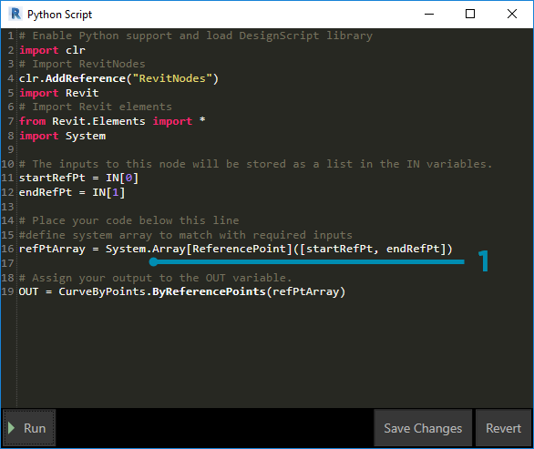
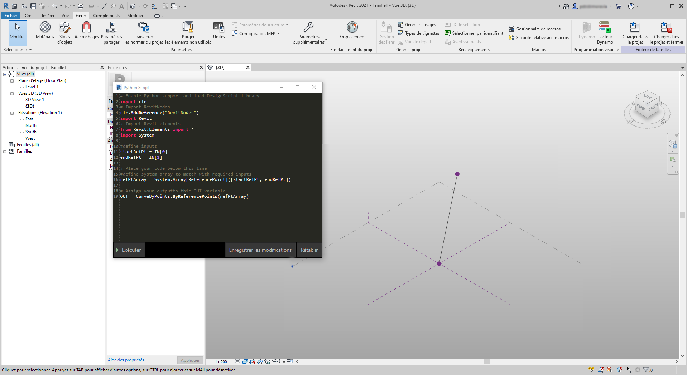
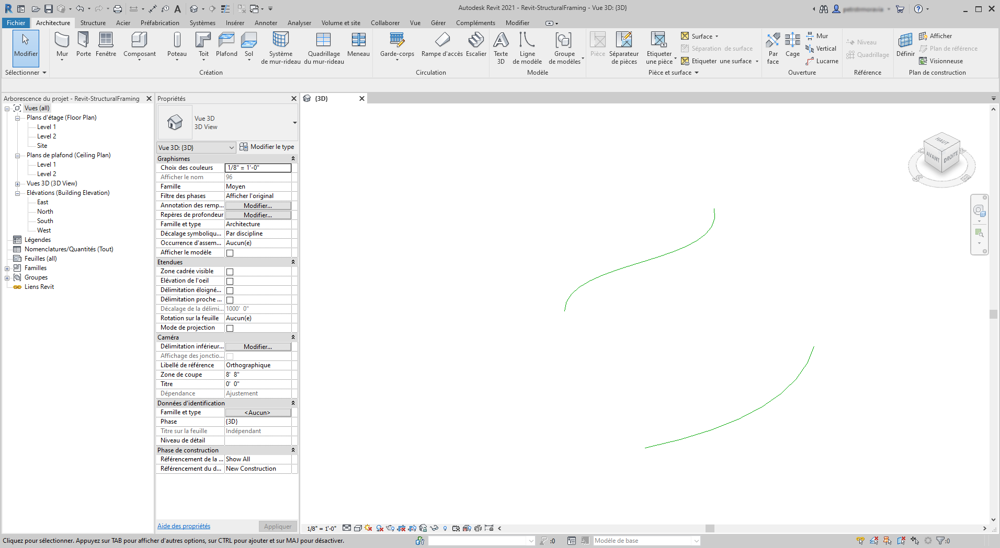
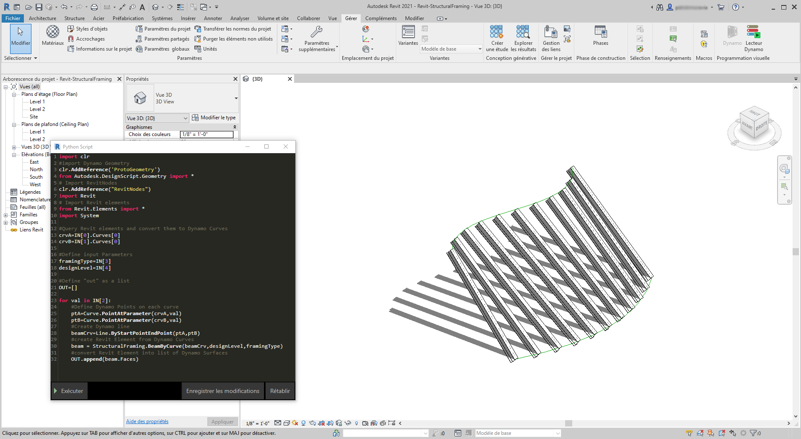

## Python et Revit

Maintenant que vous savez comment utiliser les scripts Python dans Dynamo, découvrez comment connecter les bibliothèques Revit à l'environnement de script. Rappelez-vous que vous avez importé vos nœuds Dynamo avec les trois premières lignes du bloc de code ci-dessous. Pour importer les nœuds Revit, les éléments Revit et le gestionnaire de documents Revit, il vous suffit d'ajouter quelques lignes supplémentaires :

```
import clr
clr.AddReference('ProtoGeometry')
from Autodesk.DesignScript.Geometry import *

# Import RevitNodes
clr.AddReference("RevitNodes")
import Revit

# Import Revit elements
from Revit.Elements import *

# Import DocumentManager
clr.AddReference("RevitServices")
import RevitServices
from RevitServices.Persistence import DocumentManager

import System
```

Ces lignes vous donnent accès à l'API de Revit et vous offre des scripts personnalisés pour toutes les tâches Revit. La combinaison du processus de programmation visuelle et du script de l'API de Revit permet d'améliorer considérablement la collaboration et le développement des outils. Par exemple, un responsable BIM et un concepteur schématique peuvent travailler ensemble sur le même graphique. Dans le cadre de cette collaboration, ils peuvent améliorer la conception et l'exécution du modèle.



### API spécifiques de la plate-forme

Le plan du projet Dynamo est d'élargir la portée de la mise en oeuvre de la plate-forme. Étant donné que Dynamo ajoute d'autres programmes au registre, les utilisateurs ont accès aux API spécifiques de la plate-forme depuis l'environnement de script Python. Même si l'étude de cas de cette section est consacrée à Revit, d'autres chapitres, offrant des didacticiels complets sur les scripts sur d'autres plates-formes, sont à prévoir. De plus, de nombreuses bibliothèques [IronPython](http://ironpython.net/) sont désormais accessibles et peuvent être importées dans Dynamo.

Les exemples ci-dessous montrent comment mettre en oeuvre des opérations spécifiques de Revit à partir de Dynamo et à l'aide de Python. Pour une révision plus détaillée des relations de Python avec Dynamo et Revit, reportez-vous à la [page Wiki de Dynamo](https://github.com/DynamoDS/Dynamo/wiki/Python-0.6.3-to-0.7.x-Migration). Le projet [Revit Python Shell ](https://github.com/architecture-building-systems/revitpythonshell)constitue une autre ressource utile pour Python et Revit.

### Exercice 1

> Créez un projet Revit. Téléchargez le fichier d'exemple joint à cet exercice (cliquez avec le bouton droit de la souris et choisissez "Enregistrer le lien sous..."). Vous trouverez la liste complète des fichiers d'exemple dans l'annexe. [Revit-Doc.dyn](datasets/10-5/Revit-Doc.dyn)

Dans ces exercices, vous allez explorer les scripts élémentaires de Python dans Dynamo for Revit. Cet exercice est axé sur la gestion des fichiers et des éléments Revit, ainsi que sur la communication entre Revit et Dynamo.



> Il s'agit d'une méthode de découpe et de séchage permettant de récupérer les éléments *doc*, *uiapp* et *app* du fichier Revit lié à votre session Dynamo. Les programmeurs qui ont déjà travaillé dans l'API de Revit reconnaîtront peut-être les éléments dans la liste d'observation. Si ces éléments ne vous semblent pas familiers, pas d'inquiétude. Vous allez utiliser d'autres exemples dans les exercices ci-dessous.

Voici comment importer les services Revit et récupérer les données du document dans Dynamo : 

> Aperçu du nœud Python dans Dynamo. Le code commenté est ci-dessous.

```
# Enable Python support and load DesignScript library
import clr
# Import DocumentManager
clr.AddReference("RevitServices")
import RevitServices
from RevitServices.Persistence import DocumentManager

# Place your code below this line
doc = DocumentManager.Instance.CurrentDBDocument
uiapp = DocumentManager.Instance.CurrentUIApplication
app = uiapp.Application

# Assign your output to the OUT variable.
OUT = [doc,uiapp,app]
```

### Exercice 2

> Téléchargez les fichiers d'exemple joints à cet exercice (cliquez avec le bouton droit de la souris et choisissez "Enregistrer le lien sous..."). Vous trouverez la liste complète des fichiers d'exemple dans l'annexe. [Revit-ReferenceCurve.dyn](datasets/10-5/Revit-ReferenceCurve.dyn)

Dans cet exercice, vous allez créer une courbe de modèle simple dans Revit à l'aide du nœud Dynamo Python.


> Commencez par le jeu de nœuds dans l'image ci-dessus. Vous allez d'abord créer deux points de référence dans Revit à partir de nœuds Dynamo.

> Commencez par créer une famille de volumes conceptuels dans Revit. Lancez Dynamo et créez le jeu de nœuds dans l'image ci-dessus. Vous allez d'abord créer deux points de référence dans Revit à partir de nœuds Dynamo.

> 1. Créez un bloc de code et attribuez-lui la valeur "0;".
2. Connectez cette valeur dans un nœud ReferencePoint.ByCoordinates pour les entrées X, Y et Z.
3. Créez trois curseurs, compris entre -100 et 100, avec une taille de pas de 1.
4. Connectez chaque curseur à un nœud ReferencePoint.ByCoordinates.
5. Ajoutez un nœud Python à l'espace de travail, cliquez sur le bouton "+" du nœud pour ajouter une autre entrée et connectez les deux points de référence dans chaque entrée. Ouvrez le nœud Python.



> Aperçu du nœud Python dans Dynamo. Le code commenté est ci-dessous.

> 1. **System.Array :** Revit requiert un réseau système comme entrée (et non une liste Python). Il s'agit juste d'une ligne de code supplémentaire, mais prêter attention aux types d'argument facilite la programmation Python dans Revit.

```
import clr

# Import RevitNodes
clr.AddReference("RevitNodes")
import Revit
# Import Revit elements
from Revit.Elements import *
import System

#define inputs
startRefPt = IN[0]
endRefPt = IN[1]

#define system array to match with required inputs
refPtArray = System.Array[ReferencePoint]([startRefPt, endRefPt])
#create curve by reference points in Revit
OUT = CurveByPoints.ByReferencePoints(refPtArray)
```



> Dans Dynamo, vous avez créé deux points de référence avec une ligne les reliant à l'aide de Python. Le prochain exercice va vous permettre d'aller un peu plus loin.

### Exercice 3

> Téléchargez et décompressez les fichiers d'exemple joints à cet exercice (cliquez avec le bouton droit de la souris et choisissez "Enregistrer le lien sous..."). Vous trouverez la liste complète des fichiers d'exemple dans l'annexe. [Revit-StructuralFraming.zip](datasets/10-5/Revit-StructuralFraming.zip)

> Cet exercice est simple, mais il illustre les rubriques de connexion de données et de géométrie de Revit à Dynamo et vice-versa. Commencez par ouvrir Revit-StructuralFraming.rvt. Une fois ouvert, lancez Dynamo et ouvrez le fichier Revit-StructuralFraming.dyn.



> Ce fichier Revit est des plus basiques. Il comporte deux courbes de référence : une sur le niveau 1 et l'autre sur le niveau 2. Votre objectif est d'intégrer ces courbes dans Dynamo et de conserver un lien actif.


> Ce fichier contient un ensemble de nœuds connectés à cinq entrées d'un nœud Python.

> 1. **Nœuds Select Model Element :** cliquez sur le bouton Sélectionner de chaque nœud et sélectionnez une courbe correspondante dans Revit.
2. **Code Block :** à l'aide de la syntaxe *"0..1..#x;"*, connectez un curseur de type entier compris entre 0 et 20 à l'entrée *x*. Celui-ci indique le nombre de poutres à dessiner entre les deux courbes.
3. **Structural Framing Types :** choisissez la poutre W12x26 par défaut dans le menu déroulant.
4. **Levels :** sélectionnez "Level 1".


> Dans Python, ce code est un peu plus dense, mais les commentaires à l'intérieur du code décrivent ce qui se passe dans le processus :

```
import clr
#import Dynamo Geometry
clr.AddReference('ProtoGeometry')
from Autodesk.DesignScript.Geometry import *
# Import RevitNodes
clr.AddReference("RevitNodes")
import Revit
# Import Revit elements
from Revit.Elements import *
import System

#Query Revit elements and convert them to Dynamo Curves
crvA=IN[0].Curves[0]
crvB=IN[1].Curves[0]

#Define input Parameters
framingType=IN[3]
designLevel=IN[4]

#Define "out" as a list
OUT=[]

for val in IN[2]:
#Define Dynamo Points on each curve
ptA=Curve.PointAtParameter(crvA,val)
ptB=Curve.PointAtParameter(crvB,val)
#Create Dynamo line
beamCrv=Line.ByStartPointEndPoint(ptA,ptB)
#create Revit Element from Dynamo Curves
beam = StructuralFraming.BeamByCurve(beamCrv,designLevel,framingType)
#convert Revit Element into list of Dynamo Surfaces
OUT.append(beam.Faces)
```



> Dans Revit, un réseau de poutres s'étend sur les deux courbes en tant qu'éléments structurels. Remarque : cet exemple n'est pas réaliste... Les éléments structurels sont utilisés comme exemple pour les occurrences Revit d'origine créées à partir de Dynamo.  Dans Dynamo, les résultats sont également visibles. Les poutres du nœud Watch3D font référence à la géométrie interrogée à partir des éléments Revit.

Il existe un processus continu de conversion des données de l'environnement Revit vers l'environnement Dynamo. En résumé, voici comment le processus se déroule :

1. Sélectionnez l'élément Revit.
2. Convertissez l'élément Revit en courbe Dynamo.
3. Divisez la courbe Dynamo en une série de points Dynamo.
4. Utilisez les points Dynamo entre deux courbes pour créer des lignes Dynamo.
5. Créez des poutres Revit en référençant les lignes Dynamo.
6. Générez des surfaces Dynamo en interrogeant la géométrie des poutres Revit.

Ce processus peut sembler compliqué, mais grâce au script, il est aussi simple que modifier la courbe dans Revit et exécuter à nouveau le solveur (pour ce faire, vous devrez peut-être supprimer les poutres précédentes). *Cela est dû au placement des poutres dans Python, ce qui rompt l'association des nœuds OOTB.*


> Avec une mise à jour des courbes de référence dans Revit, vous obtenez un nouveau réseau de poutres.

