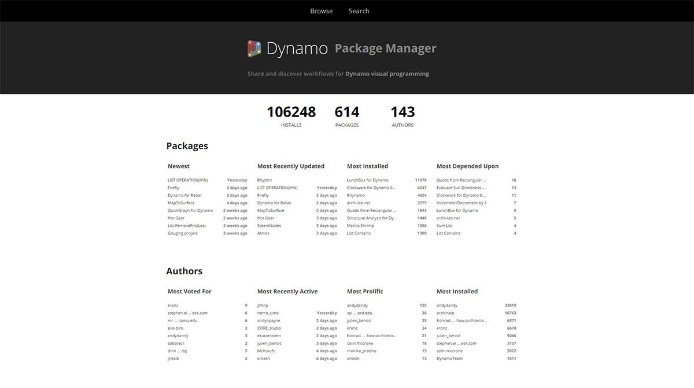
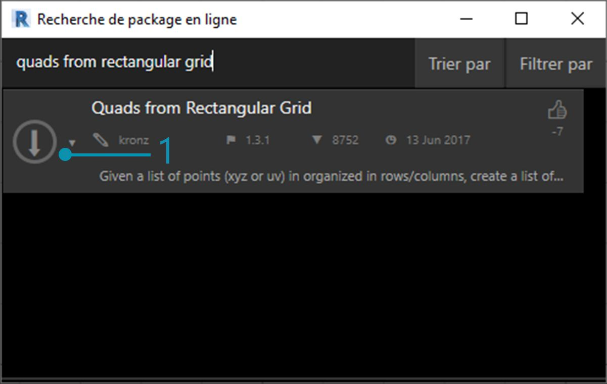
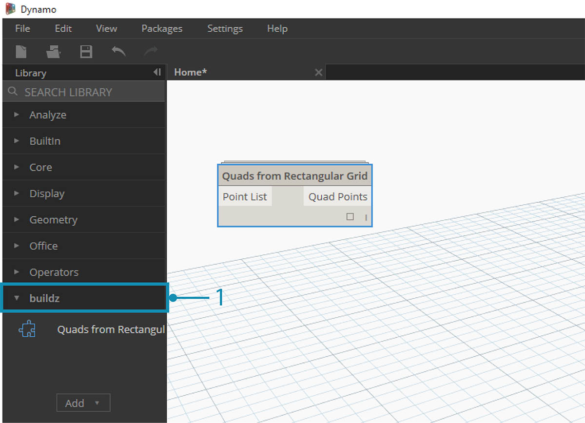
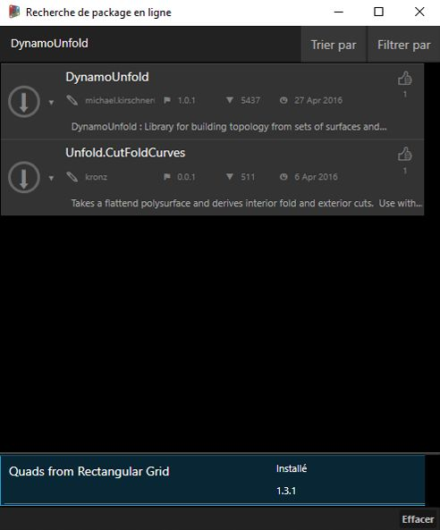
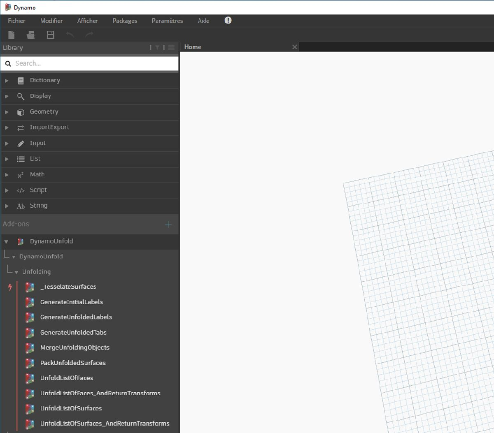
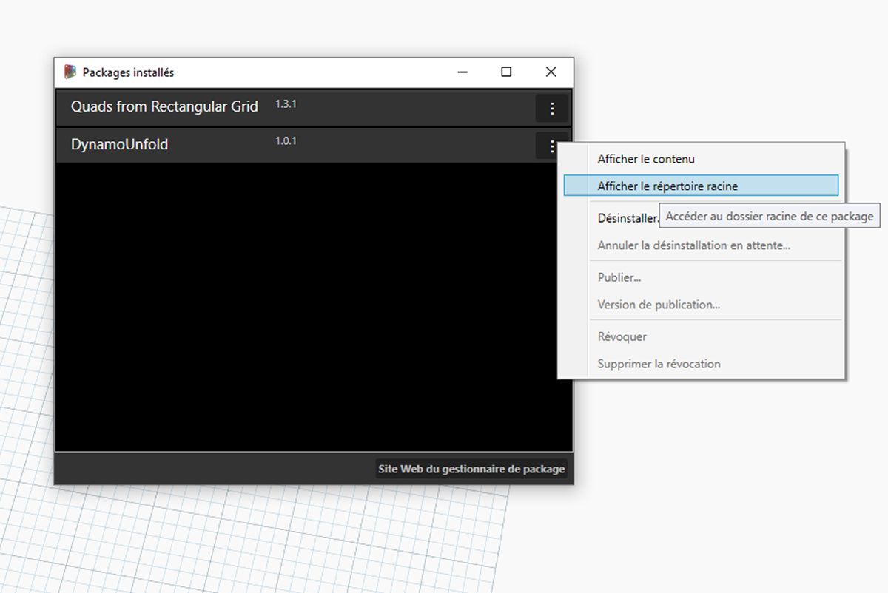
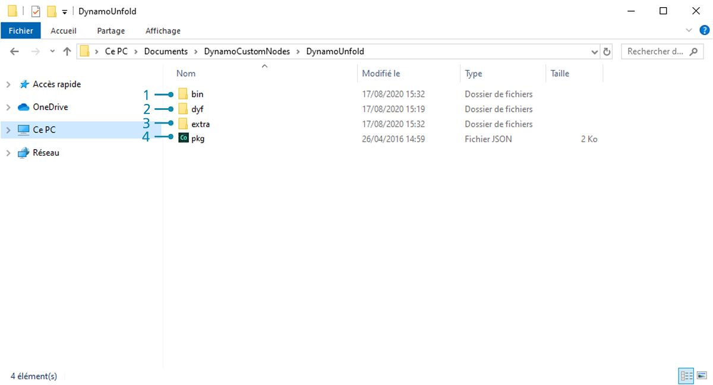
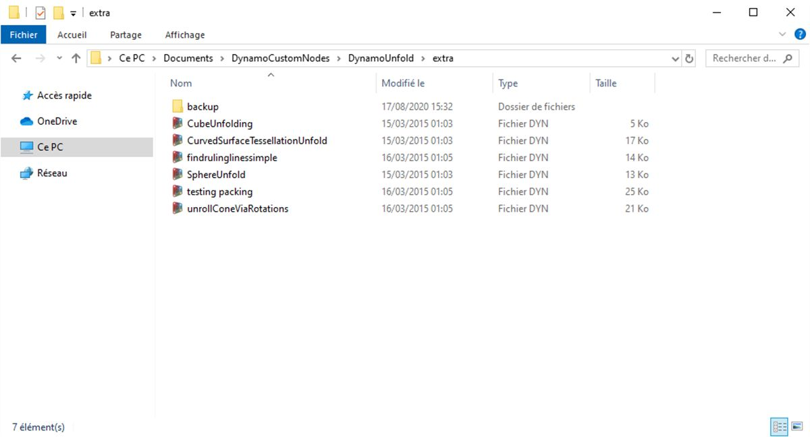
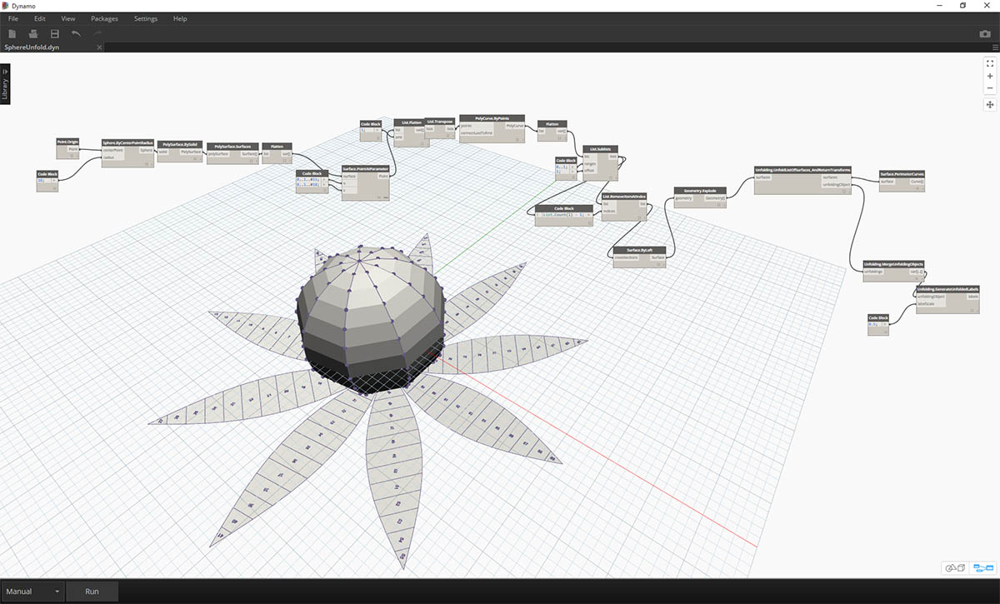
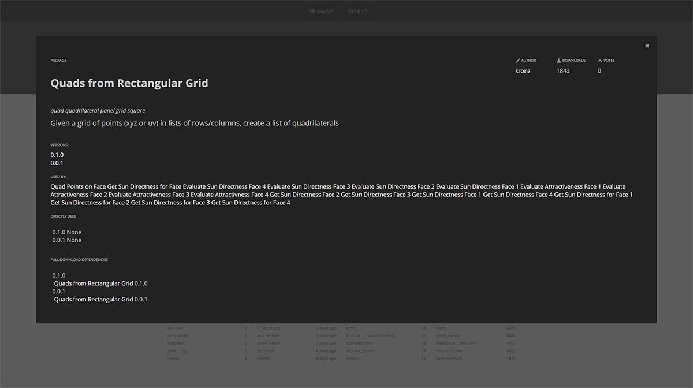

## Packages

En résumé, un package est un ensemble de nœuds personnalisés. Le gestionnaire de package Dynamo est un portail permettant à la communauté de télécharger tout package publié en ligne. Ces jeux d'outils sont développés par des tiers afin d'étendre les fonctionnalités clés de Dynamo, accessibles à tous, et prêts à être téléchargés en un clic.

Un projet Open Source comme Dynamo s'appuie sur ce type d'implication de la communauté. Avec ses développeurs tiers dédiés, Dynamo peut étendre sa portée aux workflows dans différents secteurs d'activité. Par conséquent, l'équipe de Dynamo a entrepris de rationaliser le développement et la publication des packages (sujets abordés plus en détail dans les sections suivantes).

### Installation d'un package

La méthode la plus simple pour installer un package consiste à utiliser la barre d'outils Packages de l'interface Dynamo. Passez à présent au vif du sujet et installez-en un. Dans cet exemple rapide, vous allez installer un package très utilisé pour créer des panneaux quadrilatéraux sur une grille. 

> 1. Dans Dynamo, accédez à *Packages > Rechercher un package...*

> Dans la barre de recherche, recherchez "quadrilatères à partir de la grille rectangulaire". Au bout de quelques instants, l'ensemble des packages correspondants à cette demande de recherche apparaissent. Sélectionnez le premier package avec le nom correspondant.

> 1. Cliquez sur la flèche de téléchargement située à gauche du nom du package pour installer ce dernier. Terminé !

> 1. Vous avez maintenant un autre groupe appelé *"buildz"* dans la bibliothèque Dynamo. Son nom fait référence au [développeur](http://buildz.blogspot.com/) du package. Le nœud personnalisé est placé dans ce groupe. Vous pouvez commencer à l'utiliser immédiatement.

> Une opération de bloc de code rapide pour définir une grille rectangulaire a permis de créer une liste de panneaux rectangulaires.

### Dossiers de packages

L'exemple ci-dessus est axé sur un package avec un nœud personnalisé, mais vous utilisez le même processus pour télécharger des packages avec plusieurs nœuds personnalisés et des fichiers de données de prise en charge. Démontrez-le maintenant avec un package plus complet : Dynamo Unfold.

> Comme dans l'exemple ci-dessus, commencez par sélectionner *Packages > Rechercher un package...*. Cette fois, recherchez *"DynamoUnfold"*, en un mot, en gardant les majuscules. Lorsque les packages s'affichent, cliquez sur la flèche à gauche du nom de chaque package pour les télécharger. Dynamo Unfold va maintenant être installé dans votre bibliothèque Dynamo.

> La bibliothèque Dynamo contient un groupe *DynamoUnfold* avec plusieurs catégories et nœuds personnalisés.

> Examinez maintenant la structure de fichiers du package. Sélectionnez *"Packages > Gérer les packages..."* dans Dynamo. La fenêtre ci-dessus s'affiche avec les deux bibliothèques installées. Cliquez sur le bouton situé à droite de *DynamoUnfold* et sélectionnez *"Afficher le répertoire racine"*.

> Cette action permet d'accéder au répertoire racine du package. Il contient trois dossiers et un fichier.

> 1. Le dossier *bin* contient les fichiers .dll. Ce package Dynamo a été développé à l'aide de la commande Zero Touch, de sorte que les nœuds personnalisés sont conservés dans ce dossier.
2. Le dossier *dyf* contient les nœuds personnalisés. Ce package n'a pas été développé à l'aide de nœuds personnalisés Dynamo. Ce dossier est donc vide pour ce package.
3. Le dossier supplémentaire contient tous les fichiers supplémentaires, y compris les fichiers d'exemple.
4. Le fichier pkg est un fichier texte de base qui définit les paramètres du package. Pour l'instant, vous pouvez l'ignorer.

> Lorsque vous ouvrez le dossier *"extra"*, vous découvrez la présence de fichiers d'exemple téléchargés lors de l'installation. Les packages ne possèdent pas tous des fichiers d'exemple, mais lorsque ces derniers font partie d'un package, ils sont enregistrés ici. Ouvrez *"SphereUnfold"*.

> Après avoir ouvert le fichier et cliqué sur *"Exécuter"* dans le solveur, vous obtenez une sphère dépliée. Les fichiers d'exemple comme ceux-ci sont utiles pour apprendre à utiliser un nouveau package Dynamo.

### Gestionnaire de package Dynamo

Une autre façon de découvrir les packages Dynamo est d'explorer le [Gestionnaire de packages Dynamo](http://dynamopackages.com/) en ligne. C'est une bonne façon de rechercher des packages, car le référentiel trie les packages par ordre de nombre de téléchargements et de popularité. Il s'agit également d'un moyen facile de collecter des informations sur les dernières mises à jour des packages, car certains packages Dynamo sont soumis au contrôle des versions et aux dépendances des versions de Dynamo.

> En cliquant sur *"Quadrilatères à partir de la grille rectangulaire* dans le gestionnaire de package Dynamo, vous pouvez voir ses descriptions, ses versions, le développeur et les éventuelles dépendances.

Vous pouvez également télécharger les fichiers de package à partir du gestionnaire de package Dynamo, mais le processus de Dynamo est plus simple.

### Où sont les fichiers stockés localement ?

Si vous téléchargez des fichiers à partir du gestionnaire de package Dynamo ou si vous souhaitez voir où sont conservés tous vos fichiers de package, cliquez sur *Paramètres > Gérer les chemins d'accès de nœud et de package...*. En cliquant sur les points de suspension situés à côté du répertoire de dossiers, vous pouvez copier le dossier racine et explorer le package dans la fenêtre de l'explorateur. Par défaut, les modules sont installés dans un emplacement similaire à celui du dossier suivant : *C:/Utilisateurs/[nom d'utilisateur]/AppData/Itinérance/Dynamo/[Version Dynamo]*.

### Repousser les limites des modules

La communauté Dynamo est en constante évolution. Explorez le gestionnaire de package Dynamo de temps en temps : vous y découvrirez de nouvelles avancées intéressantes. Dans les sections suivantes, vous allez examiner les packages de manière plus approfondie, du point de vue de l'utilisateur final à la création de votre propre package Dynamo.

