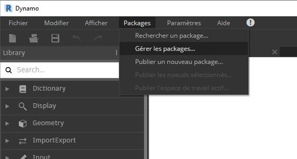
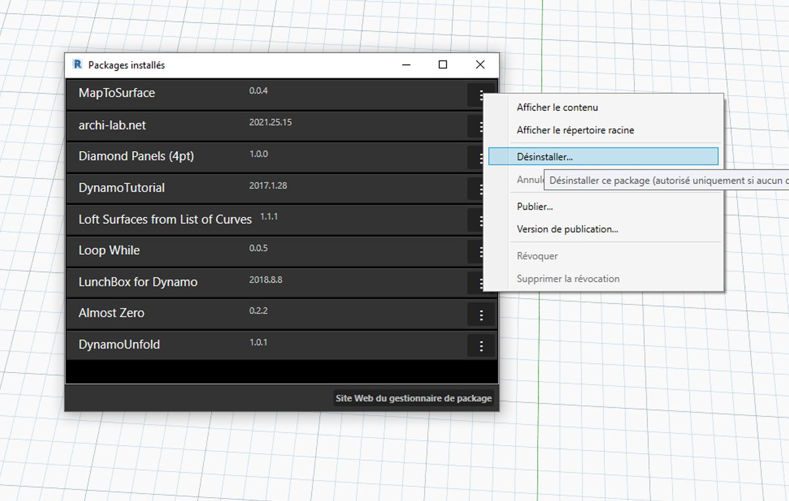
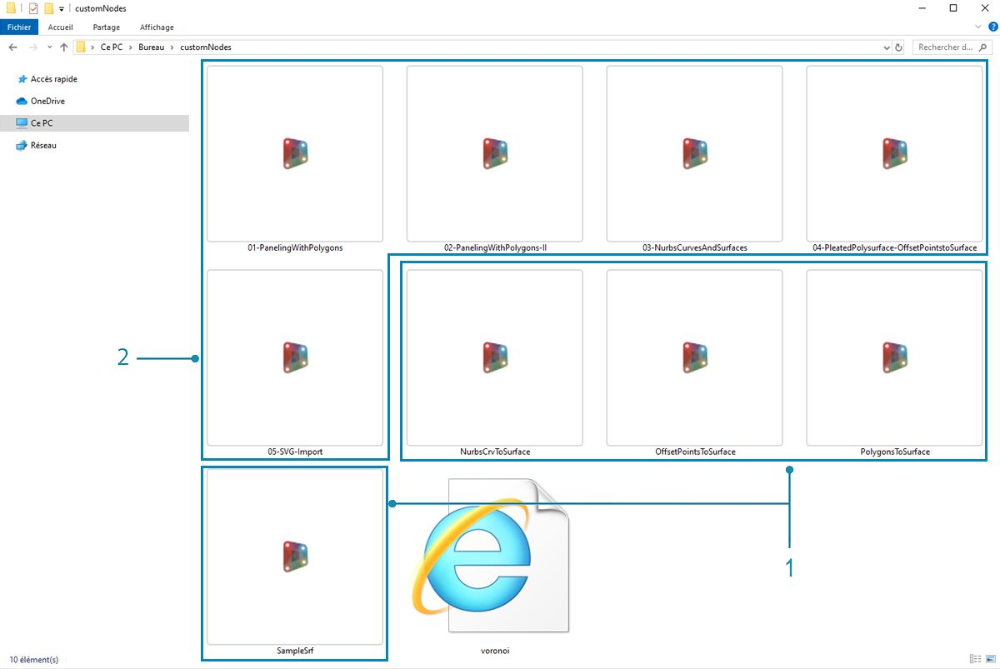
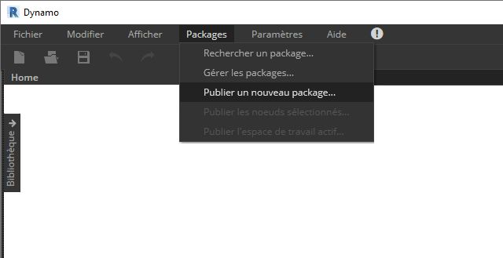
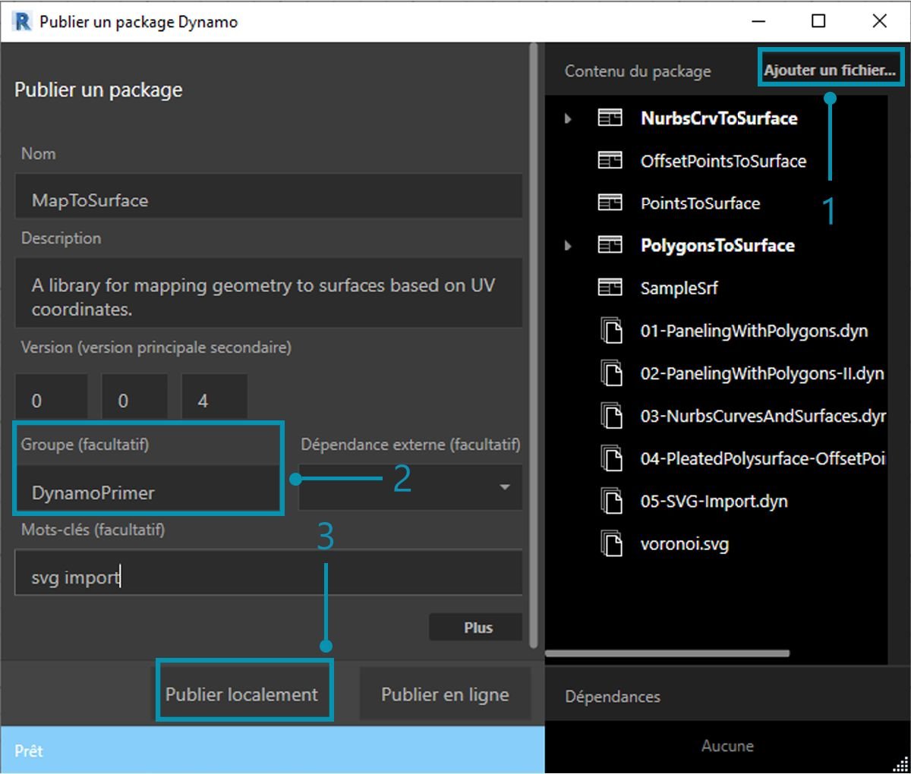
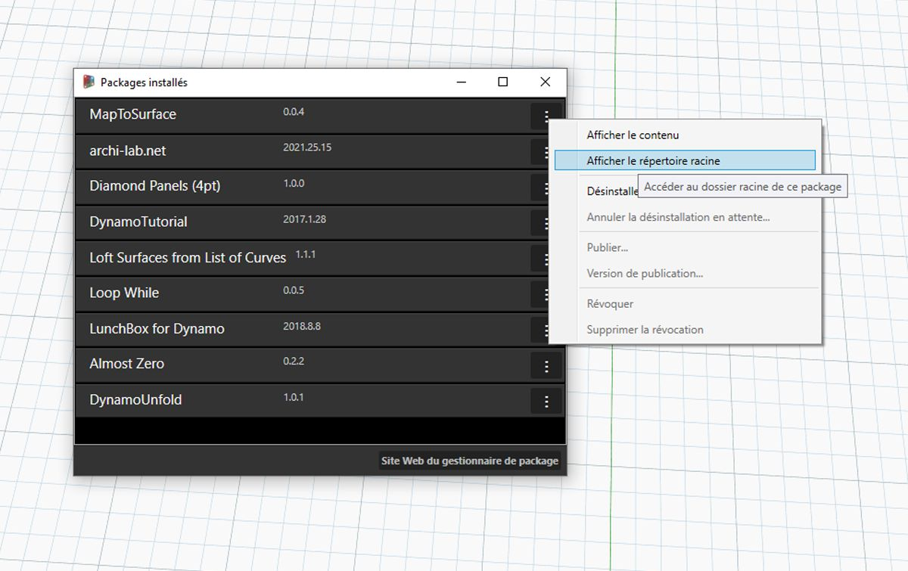
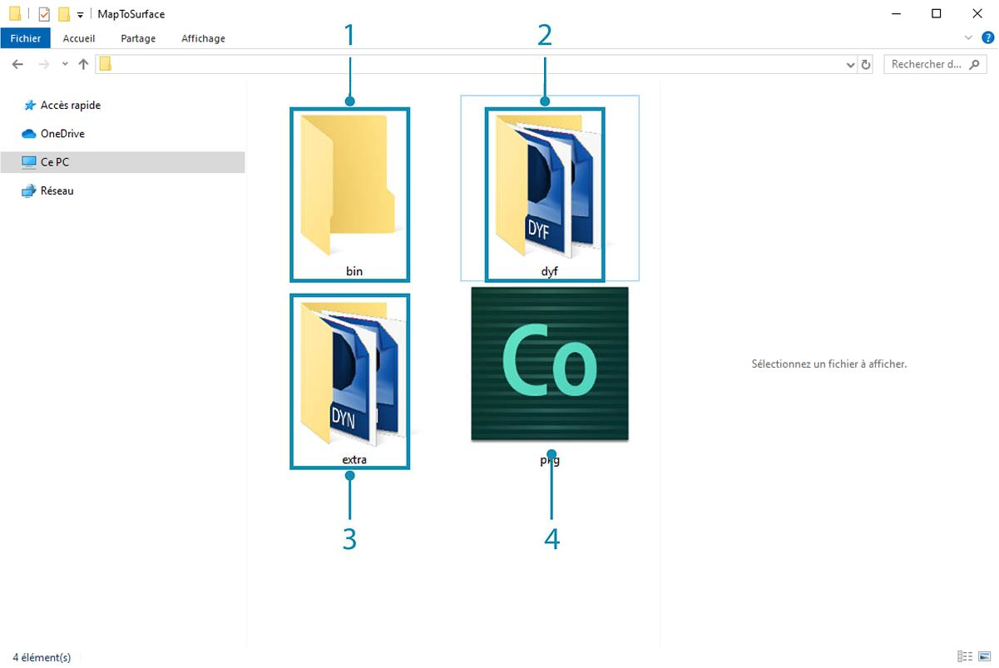
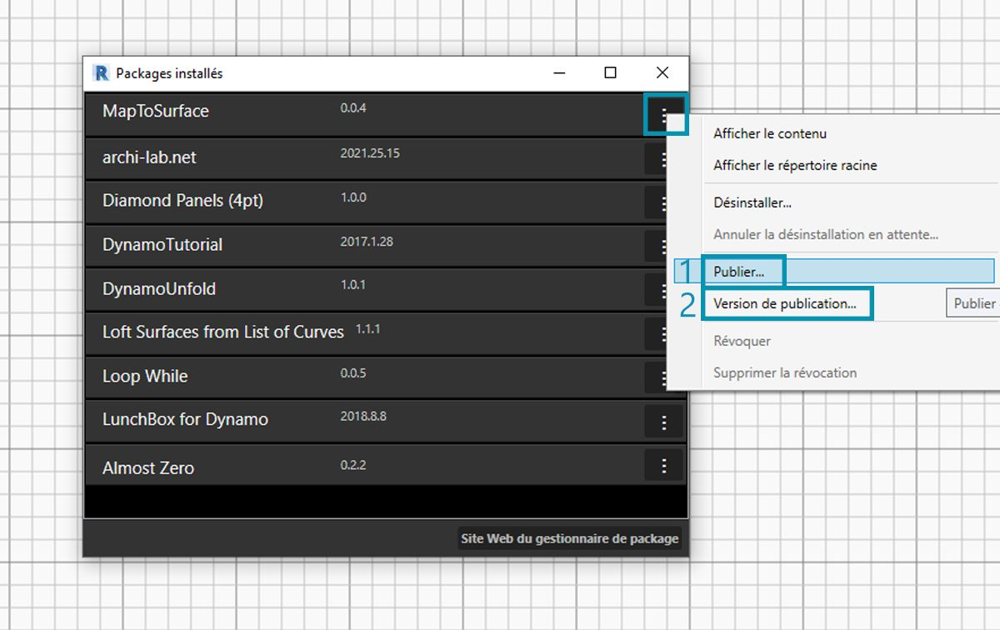

## Publication d'un package

Dans les sections précédentes, vous avez découvert en détail comment configurer le package *MapToSurface* avec des nœuds personnalisés et des fichiers d'exemple. Mais comment publier un package développé localement ? Cette étude de cas montre comment publier un package à partir d'un ensemble de fichiers dans un dossier local.  Il existe plusieurs façons de publier un package. Voici le processus recommandé :** publier localement, développer localement, puis publier en ligne**. Vous allez commencer par un dossier contenant tous les fichiers du package.

### Désinstallation d'un package

Avant de commencer la publication du package MapToSurface, si vous avez installé le package à partir de la leçon précédente, désinstallez-le afin de ne pas utiliser les mêmes packages.

> Tout d'abord, accédez à*Packages > Gérer les packages...*

> Cliquez sur le bouton correspondant à *"MapToSurface"* et sélectionnez *"Désinstaller..."*. Ensuite, redémarrez Dynamo. Lors de la réouverture, vérifiez la fenêtre *"Gérer les packages"* : le package *MapToSurface* ne doit plus être présent. Vous pouvez désormais commencer !

### Publication locale d'un package

*Remarque : au moment de rédiger cette rubrique, la publication du package Dynamo est activée uniquement dans Dynamo Studio ou Dynamo for Revit. Dynamo Sandbox ne dispose pas de la fonctionnalité de publication.*

> Téléchargez et décompressez les fichiers d'exemple joints à cette étude de cas de package (cliquez avec le bouton droit de la souris et choisissez "Enregistrer le lien sous..."). Vous trouverez la liste complète des fichiers d'exemple dans l'annexe. [MapToSurface.zip](datasets/11-4/MapToSurface.zip)

> Il s'agit de la première soumission du package, et tous les fichiers d'exemple et les nœuds personnalisés sont placés dans un dossier unique. Maintenant que ce dossier est prêt, vous pouvez effectuer le chargement dans le gestionnaire de package Dynamo.

> 1. Ce dossier contient cinq nœuds personnalisés (.dyf).
2. Ce dossier contient également cinq fichiers d'exemple (.dyn) et un fichier vectoriel importé (.svg). Ces fichiers serviront d'exercices préliminaires pour montrer à l'utilisateur comment utiliser les nœuds personnalisés.

> Dans Dynamo, cliquez sur *Packages > Publier un nouveau package...*

> Dans la fenêtre *"Publier un package Dynamo"*, remplissez les formulaires pertinents à gauche de la fenêtre comme illustré.

> 1. Cliquez sur *"Ajouter un fichier"* afin d'ajouter les fichiers de la structure de dossiers sur le côté droit de l'écran (pour ajouter des fichiers qui ne sont pas des fichiers .dyf, définissez le type de fichier dans la fenêtre du navigateur sur **"Tous les fichiers(*.*)"**. Tous les fichiers, nœuds personnalisés (.dyf) ou fichiers d'exemple (.dyn) ont été ajoutés, sans distinction. Dynamo classe ces éléments lors de la publication du package.
2. Le champ "Groupe" définit le groupe dans lequel rechercher les nœuds personnalisés dans l'interface utilisateur de Dynamo.
3. Cliquez sur "Publier localement" afin d'effectuer la publication. Si vous suivez, veillez à cliquer sur *"Publier localement"* et **non** sur *"Publier en ligne"*. Vous ne voulez pas de packages en double dans le gestionnaire de package.

> 1. Une fois la publication terminée, les nœuds personnalisés doivent être disponibles sous le groupe "DynamoPrimer" ou votre bibliothèque Dynamo.

> Examinez maintenant le répertoire racine pour découvrir comment Dynamo a mis en forme le package créé. Pour ce faire, cliquez sur *Packages > Gérer les packages...*

> Dans la fenêtre Gérer les packages, cliquez sur les trois points verticaux à droite de *"MapToSurface"* et choisissez *"Afficher le répertoire racine".*

> Le répertoire racine se trouve à l'emplacement local de votre package (n'oubliez pas que vous avez publié le package "localement"). Dynamo utilise actuellement ce dossier pour lire les nœuds personnalisés. Il est donc important de publier localement le répertoire dans un emplacement permanent (par exemple, pas sur votre bureau). Voici la répartition du dossier du package Dynamo :

> 1. Le dossier *bin* contient les fichiers .dll créés avec des bibliothèques C# ou Zero Touch. Étant donné qu'il n'en existe pas pour ce package, ce dossier est vide pour cet exemple.
2. Le dossier *dyf* contient les nœuds personnalisés. L'ouverture de ce dossier permet d'afficher tous les nœuds personnalisés (fichiers .dyf) de ce package.
3. Le dossier supplémentaire contient tous les fichiers supplémentaires. Il est probable que ces fichiers soient des fichiers Dynamo (.dyn) ou d'autres fichiers requis (.svg, .xls, .jpeg, .sat, etc.).
4. Le fichier pkg est un fichier texte de base qui définit les paramètres du package. Cette opération est automatisée dans Dynamo, mais elle peut être modifiée si vous souhaitez obtenir des détails.

### Publication d'un package en ligne

> **Remarque : ne suivez pas cette étape, sauf si vous publiez réellement un package de votre choix.**

> 1. Lorsque vous êtes prêt à effectuer la publication, cliquez sur le bouton situé à droite de MapToSurface dans la fenêtre Gérer les modules et choisissez *Publier...*
2. Si vous mettez à jour un package qui a déjà été publié, choisissez "Publier la version" et Dynamo mettra à jour votre package en ligne en fonction des nouveaux fichiers contenus dans le répertoire racine de ce package. C'est aussi simple que ça !

### Version de publication...

Lorsque vous mettez à jour les fichiers dans le dossier racine de votre package publié, vous pouvez publier une nouvelle version du package en sélectionnant *"Publier la version..."* dans la fenêtre *Gérer les packages*. Cette méthode vous permet d'apporter les mises à jour nécessaires à votre contenu et de le partager en toute transparence avec la communauté. La * version de publication* fonctionne uniquement si vous êtes le gestionnaire du package.

