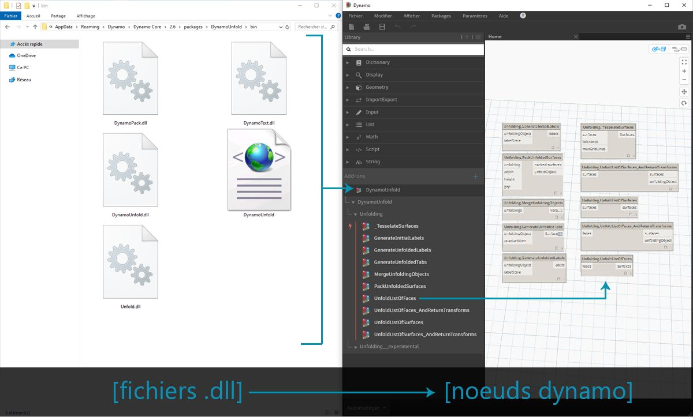
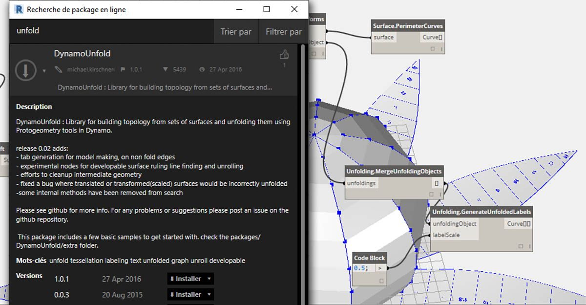
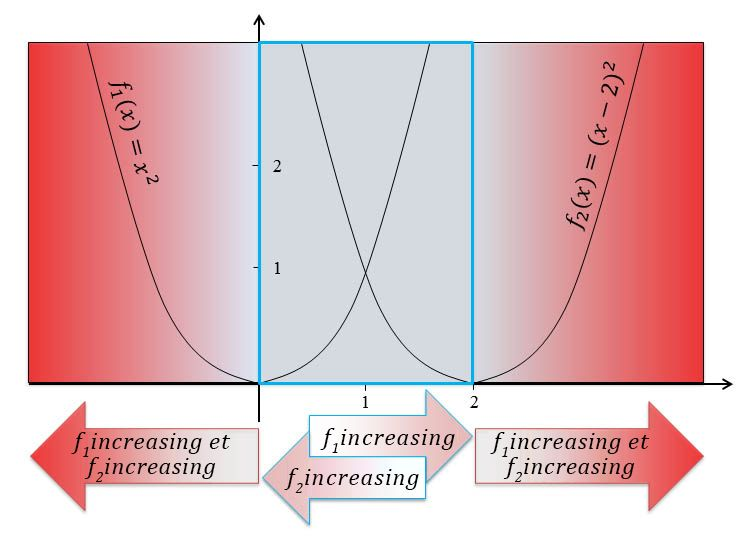
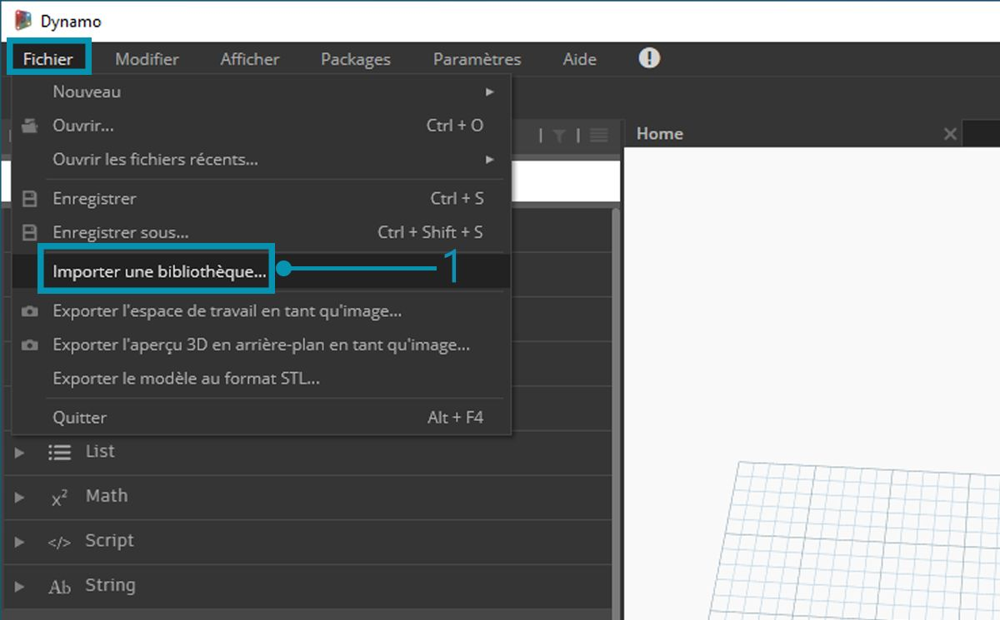
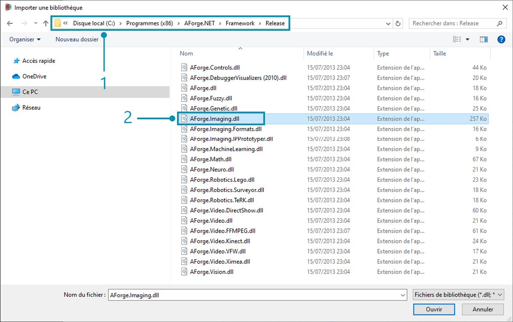
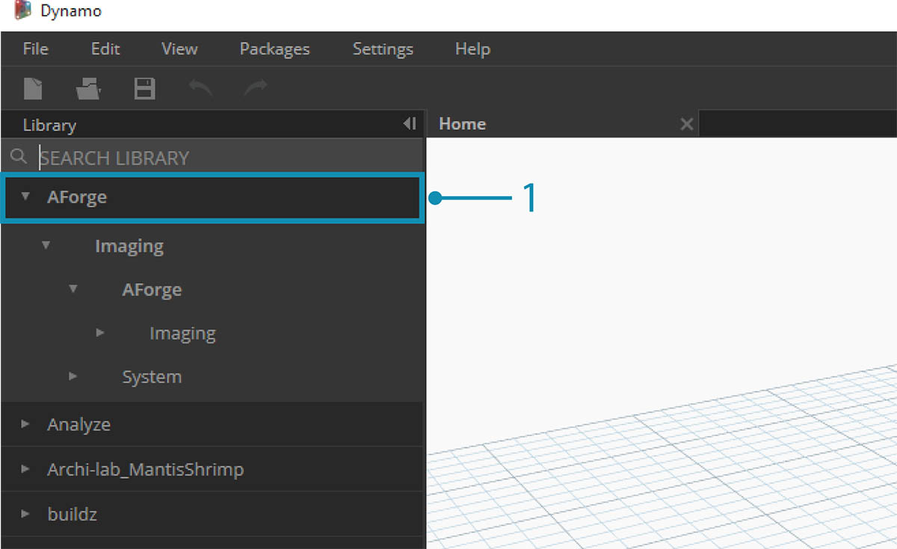
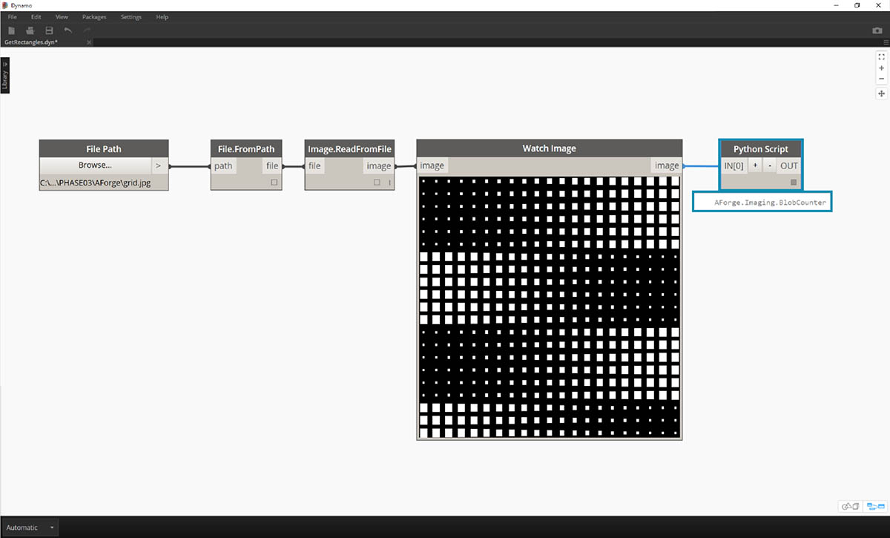
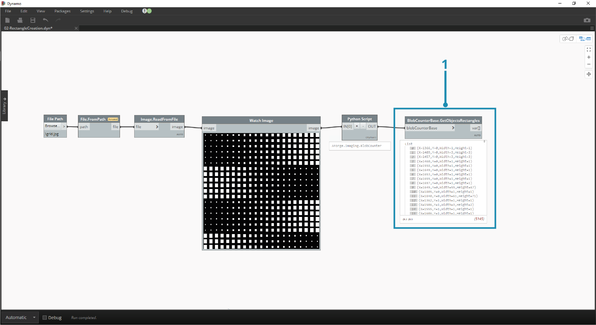
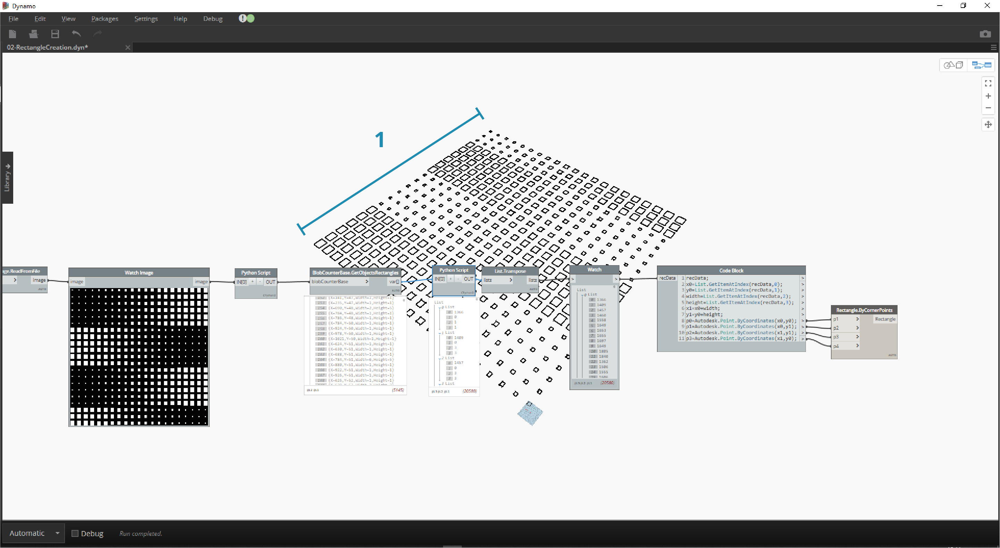

<style>
table{box-shadow: 2px 2px 2px #BBBBBB;max-width:75%;display:block;margin-left: auto;   margin-right: auto }
thead {display: none}
img{display:block;margin-left: auto;   margin-right: auto }
</style>

## Qu'est-ce que le Zero Touch ?

L'importation Zero Touch fait référence à une méthode pointer-cliquer simple permettant d'importer des bibliothèques C#. Dynamo lit les méthodes publiques d'un fichier *.dll* et les convertit en nœuds Dynamo. Vous pouvez utiliser le Zero Touch pour développer vos propres nœuds et packages personnalisés, et importer des bibliothèques externes dans l'environnement Dynamo.



Le Zero Touch vous permet d'importer une bibliothèque qui n'a pas été nécessairement développée pour Dynamo, et de créer une suite de nouveaux nœuds. La fonctionnalité Zero Touch actuelle montre le caractère multi-plateforme du projet Dynamo.

Cette section explique comment utiliser le Zero Touch pour importer une bibliothèque tierce. Pour plus d'informations sur le développement de votre propre bibliothèque Zero Touch, consultez la [page wiki de Dynamo](https://github.com/DynamoDS/Dynamo/wiki/Zero-Touch-Plugin-Development).

### Packages Zero Touch

Les packages Zero Touch sont un complément utile aux nœuds personnalisés définis par l'utilisateur. Le tableau ci-dessous présente quelques packages qui utilisent des bibliothèques C#. Pour plus d'informations sur les packages, consultez la [section Packages ](../Appendix/A-3_packages.md)de l'annexe.


<table width="100%">
    <tr>
    <td width="20%"><b>Logo/Image</b></td>
    <td><b>Nom</b></td>
</tr>
  <tr>
    <td></img></td>
    <td><a href="https://github.com/DynamoDS/Dynamo/wiki/Dynamo-Mesh-Toolkit">Mesh Toolkit</td></a>
  </tr>
  <tr>
    <td></img></td>
    <td><a href="http://dynamobim.com/dynamounfold/">Dynamo Unfold</td></a>
  </tr>
  <tr>
    <td></img></td>
    <td><a href="http://www.case-inc.com/blog/what-is-rhynamo">Rhynamo</td></a>
  </tr>
  <tr>
    <td></img></td>
    <td><a href="https://github.com/BPOpt/Optimo">Optimo</td></a>
  </tr>
</table>

### Étude de cas - Importation AForge

Dans cette étude de cas, vous découvrirez comment importer la bibliothèque *.dll* externe [AForge](http://www.aforgenet.com/). AForge est une bibliothèque robuste qui offre une gamme de fonctionnalités allant du traitement d'images à l'intelligence artificielle. Vous allez utiliser la classe d'images dans AForge pour effectuer quelques exercices de traitement d'images ci-dessous.

> Téléchargez et décompressez les fichiers d'exemple joints à cette étude de cas de package (cliquez avec le bouton droit de la souris et sélectionnez "Enregistrer le lien sous..."). Vous trouverez la liste complète des fichiers d'exemple dans l'annexe. [Zero-Touch-Examples.zip](datasets/11-5/Zero-Touch-Examples.zip).

> 1. Tout d'abord, téléchargez AForge. Sur la [page de téléchargement AForge](http://www.aforgenet.com/framework/downloads.html), sélectionnez *[Download Installer]* (Télécharger le programme d'installation). À l'issue du téléchargement, effectuez l'installation.



> 1. Dans Dynamo, créez un fichier et sélectionnez *Fichier > Importer une bibliothèque...*



> 1. Dans la fenêtre contextuelle, accédez au dossier de version de l'installation AForge. Il se trouve probablement dans un dossier semblable à celui-ci : *C:\Program Files (x86)\AForge.NET\Framework\Release*.
2. **AForge.Imaging.dll :** pour cette étude de cas, utilisez uniquement ce fichier de la bibliothèque AForge. Sélectionnez ce fichier *.dll* et cliquez sur *"Ouvrir".*



> 1. De retour dans Dynamo, un groupe de nœuds *"AForge" *doit apparaître dans la barre d'outils de la bibliothèque. Vous avez désormais accès à la bibliothèque d'images AForge à partir du programme visuel.

### Exercice 1 - Détection des arêtes

Maintenant que la bibliothèque a été importée, commencez le premier exercice. Vous effectuerez quelques traitements d'images de base sur une image d'exemple pour découvrir comment les filtres d'images AForge sont appliqués. Vous allez utiliser le nœud *"Watch Image"* pour afficher les résultats et appliquer dans Dynamo des filtres semblables à ceux de Photoshop.

> Téléchargez et décompressez les fichiers d'exemple joints à cette étude de cas de package (cliquez avec le bouton droit de la souris et sélectionnez "Enregistrer le lien sous..."). Vous trouverez la liste complète des fichiers d'exemple dans l'annexe. [ZeroTouchImages.zip](datasets/11-5/ZeroTouchImages.zip)

Maintenant que la bibliothèque a été importée, commencez simplement par le premier exercice (*01-EdgeDetection.dyn*). Vous effectuerez quelques traitements d'images de base sur une image d'exemple pour découvrir comment les filtres d'images AForge sont appliqués. Vous allez utiliser le nœud *"Watch Image"* pour afficher les résultats et appliquer dans Dynamo des filtres semblables à ceux de Photoshop.


> Tout d'abord, importez une image à utiliser. Ajoutez un nœud *File Path* dans la zone de dessin et sélectionnez "soapbubbles.jpg" dans le dossier des exercices téléchargés (crédit photo : [flickr](https://www.flickr.com/photos/wwworks/667298782)).


> 1. Le nœud File Path fournit simplement une chaîne du chemin d'accès à l'image sélectionnée. Vous devez convertir ce nœud File Path en image dans l'environnement Dynamo.
2. Connectez le nœud File Path au nœud File.FromPath.
3. Pour convertir ce nœud File Path, utilisez le nœud Image.ReadFromFile.
4. Enfin, découvrez le résultat ! Déposez un nœud Watch Image sur la zone de dessin et connectez-vous à Image.ReadFromFile. Vous n'avez pas encore utilisé AForge, mais vous avez importé une image dans Dynamo.


> Sous AForge.Imaging.AForge.Filters (dans le menu de navigation), un large éventail de filtres est disponible. Vous allez utiliser l'un de ces filtres pour désaturer une image en fonction des valeurs de seuil.

> 1. Déposez trois curseurs sur la zone de dessin, modifiez leur intervalle pour qu'il soit compris entre 0 et 1 et leur valeur de pas pour qu'elle soit de 0.01.
2. Ajoutez le nœud Grayscale.Grayscale à la zone de dessin. Il s'agit d'un filtre AForge qui applique un filtre de nuances de gris à une image. Connectez les trois curseurs de l'étape 1 à cr, cg et cb. Définissez la valeur des curseurs supérieur et inférieur sur 1 et celle du curseur central sur 0.
3. Pour appliquer le filtre Nuances de gris, vous devez effectuer une action sur l'image. Pour ce faire, utilisez IFilter.Apply. Connectez l'image à l'entrée de l'image et Grayscale.Grayscale à l'entrée iFilter.
4. Lorsque vous connectez le nœud Watch Image, vous obtenez une image désaturée.


> Vous pouvez contrôler la désaturation de cette image en fonction des valeurs de seuil pour le rouge, le vert et le bleu. Ces paramètres sont définis par les entrées du nœud Grayscale.Grayscale. L'image semble assez sombre, car la valeur du vert est définie sur 0 dans le curseur.

> 1. Définissez la valeur des curseurs supérieur et inférieur sur 0 et celle du curseur central sur 1. De cette manière, vous obtenez une image désaturée plus lisible.


> Utilisez l'image désaturée et appliquez-lui un autre filtre. Étant donné que l'image désaturée est un peu contrastée, testez la détection des arêtes.

> 1. Ajoutez un nœud SobelEdgeDetector.SobelEdgeDetector à la zone de dessin. Connectez-le en tant que IFilter à un nouveau nœud IFilter et connectez l'image désaturée à l'entrée de l'image du nœud IFilter.
2. Le filtre de détection d'arêtes Sobel a mis en surbrillance les arêtes dans une nouvelle image.


> En zoomant, on constate que le filtre de détection d'arêtes a appelé les contours des bulles avec des pixels. La bibliothèque AForge contient des outils permettant de prendre des résultats similaires et de créer une géométrie Dynamo. Vous allez explorer ce point dans le prochain exercice.

### Exercice 2 - Création de rectangles

> Téléchargez et décompressez les fichiers d'exemple joints à cette étude de cas de package (cliquez avec le bouton droit de la souris et sélectionnez "Enregistrer le lien sous..."). Vous trouverez la liste complète des fichiers d'exemple dans l'annexe. [ZeroTouchImages.zip](datasets/11-5/ZeroTouchImages.zip)

Maintenant que vous avez découvert le traitement d'images de base, vous allez utiliser une image pour piloter la géométrie Dynamo. Dans le cadre d'un exercice élémentaire, réalisez un *tracé en direct* d'une image à l'aide d'AForge et de Dynamo. Pour rester simple, vous allez extraire des rectangles d'une image de référence. Cependant, AForge propose des outils permettant d'effectuer des opérations plus complexes. Vous allez travailler avec *02-RectangleCreation.dyn* à partir des fichiers d'exercice téléchargés.


> 1. À l'aide du nœud File Path, accédez au fichier grid.jpg dans le dossier des exercices.
2. Connectez les séries de nœuds restantes ci-dessus pour afficher une grille paramétrique de parcours.

Dans cette étape, vous allez référencer les carrés blancs de l'image et les convertir en géométrie Dynamo réelle. AForge dispose d'un grand nombre d'outils puissants de vision par ordinateur. Ici, vous allez utiliser un outil particulièrement important pour la bibliothèque appelé [BlobCounter](http://www.aforgenet.com/framework/docs/html/d7d5c028-7a23-e27d-ffd0-5df57cbd31a6.htm).


> 1. Après avoir ajouté un outil BlobCounter à la zone de dessin, vous devez procéder au traitement de l'image (de la même façon qu'avec l'outil IFilter dans l'exercice précédent). Malheureusement, le nœud "Process Image" n'est pas immédiatement visible dans la bibliothèque Dynamo. Cela est dû au fait que la fonction n'est peut-être pas visible dans le code source AForge. Pour résoudre ce problème, vous devez trouver une solution.


> 1. Ajoutez un nœud Python à la zone de dessin.

```
import clr
clr.AddReference('AForge.Imaging')
from AForge.Imaging import *

bc= BlobCounter()
bc.ProcessImage(IN[0])
OUT=bc
```

> Ajoutez le code ci-dessus au nœud Python. Ce code importe la bibliothèque AForge, puis traite l'image importée.



> Lorsque vous connectez la sortie de l'image à l'entrée du nœud Python, vous obtenez un résultat AForge.Imaging.BlobCounter à partir du nœud Python.

Les étapes suivantes vous montreront quelques astuces pour vous permettre de vous familiariser avec l'[API AForge Imaging](http://www.aforgenet.com/framework/docs/html/d087503e-77da-dc47-0e33-788275035a90.htm). Il n'est pas nécessaire de savoir faire tout ça pour travailler sur Dynamo. Cette démonstration sert davantage à montrer l'utilisation de bibliothèques externes au sein de l'environnement Dynamo.



> 1. Connectez la sortie du script Python à BlobCounterBase.GetObjectRectangles. Cette opération permet de lire les objets d'une image, en fonction d'une valeur de seuil, et d'extraire les rectangles quantifiés de l'espace de pixel.


> 1. Ajoutez un autre nœud Python à la zone de dessin, connectez-vous à GetObjectRectangles et entrez le code ci-dessous. Cela permet de créer une liste organisée d'objets Dynamo.

```
OUT = []
for rec in IN[0]:
subOUT=[]
subOUT.append(rec.X)
subOUT.append(rec.Y)
subOUT.append(rec.Width)
subOUT.append(rec.Height)
OUT.append(subOUT)
```


> 1. Transposez la sortie du nœud Python de l'étape précédente. Cela crée 4 listes, chacune représentant X, Y, Largeur et Hauteur pour chaque rectangle.
2. À l'aide d'un bloc de code, organisez les données dans une structure qui s'adapte au nœud Rectangle.ByCornerPoints (code ci-dessous).

```
recData;
x0=List.GetItemAtIndex(recData,0);
y0=List.GetItemAtIndex(recData,1);
width=List.GetItemAtIndex(recData,2);
height=List.GetItemAtIndex(recData,3);
x1=x0+width;
y1=y0+height;
p0=Autodesk.Point.ByCoordinates(x0,y0);
p1=Autodesk.Point.ByCoordinates(x0,y1);
p2=Autodesk.Point.ByCoordinates(x1,y1);
p3=Autodesk.Point.ByCoordinates(x1,y0);
```



> En faisant un zoom arrière, vous obtenez un réseau de rectangles représentant les carrés blancs de l'image. Grâce à la programmation, vous avez fait quelque chose qui ressemble à un tracé en direct dans Illustrator !


> Vous devez néanmoins effectuer un peu de nettoyage. En zoomant, vous pouvez voir que vous avez un petit groupe de rectangles non souhaités.


> 1. Pour supprimer les rectangles non souhaités, insérez un nœud Python entre le nœud GetObjectRectangles et un autre nœud Python. Le code du nœud est indiqué ci-dessous. Il supprime tous les rectangles dont la taille est inférieure à la taille définie.

```
rectangles=IN[0]
OUT=[]
for rec in rectangles:
if rec.Width>8 and rec.Height>8:
OUT.append(rec)
```


> Après avoir supprimé les rectangles superflus, vous pouvez créer une surface à partir de ces rectangles et les extruder d'une distance basées sur leurs zones.


> 1. Enfin, définissez l'entrée both_sides sur Faux (False). Vous obtenez une extrusion dans une direction. Votre création est maintenant prête à devenir une super table de geek.

Ce sont des exemples de base, mais les concepts présentés ici sont transférables à des applications réelles passionnantes. La vision par ordinateur peut être utilisée pour une multitude de processus. En voici quelques-uns : lecteurs de codes-barres, mise en correspondance des perspectives, [mappage de projection](https://www.youtube.com/watch?v=XSR0Xady02o) et [réalité augmentée](http://aforgenet.com/aforge/articles/gratf_ar/). Pour les rubriques plus avancées ayant trait à AForge dans le cadre de cet exercice, lisez [cet article](http://aforgenet.com/articles/shape_checker/).

