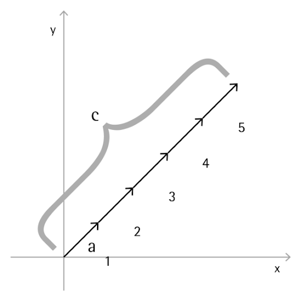

# Calcul vectoriel

Les objets dans les conceptions de calcul sont rarement créés explicitement dans leur position et leur forme finales. Le plus souvent, ils font l'objet d'opération de conversion et de rotation, et sont positionnés par rapport à la géométrie existante. Le calcul vectoriel sert d'"armature" à la géométrie en lui donnant une direction et une orientation, ainsi qu'en conceptualisant les mouvements dans l'espace 3D sans représentation visuelle.

Sous sa forme de base, un vecteur représente une position dans un espace 3D et est souvent considéré comme l'extrémité d'une flèche partant de la position (0, 0, 0) et allant jusqu'à cette position. Les vecteurs peuvent être créés avec le constructeur *ByCoordinates*, qui prend la position x, y et z de l'objet Vector venant d'être créé. Notez que les objets Vector ne sont pas des objets géométriques et n'apparaissent pas dans la fenêtre Dynamo. Toutefois, les informations sur un vecteur nouvellement créé ou modifié peuvent être imprimées dans la fenêtre de la console :


```
// construct a Vector object
v = Vector.ByCoordinates(1, 2, 3);

s = v.X + " " + v.Y + " " + v.Z;
```

Un ensemble d'opérations mathématiques est défini sur des objets Vector, ce qui vous permet d'ajouter, de soustraire, de multiplier et de déplacer des objets dans l'espace 3D, de la même manière que vous déplaceriez des nombres réels dans un espace 1D sur une ligne de nombres.

L'addition de vecteurs est définie comme la somme des composants de deux vecteurs. Elle peut être considérée comme le vecteur résultant si les deux flèches de vecteur des composants sont placées "bout à bout". L'addition de vecteurs est effectuée à l'aide de la méthode *Add* et est représentée par le diagramme sur la gauche.


```
a = Vector.ByCoordinates(5, 5, 0);
b = Vector.ByCoordinates(4, 1, 0);

// c has value x = 9, y = 6, z = 0
c = a.Add(b);
```

De même, deux objets Vector peuvent être soustraits l'un à l'autre à l'aide de la méthode *Subtract*. La soustraction de vecteurs peut être considérée comme la direction à partir du premier vecteur vers le second vecteur.


```
a = Vector.ByCoordinates(5, 5, 0);
b = Vector.ByCoordinates(4, 1, 0);

// c has value x = 1, y = 4, z = 0
c = a.Subtract(b);
```

La multiplication de vecteurs peut être considérée comme le déplacement de l'extrémité d'un vecteur dans sa propre direction en fonction d'un facteur d'échelle donné.



```
a = Vector.ByCoordinates(4, 4, 0);

// c has value x = 20, y = 20, z = 0
c = a.Scale(5);
```

Souvent, lors de la mise à l'échelle d'un vecteur, on souhaite que la longueur du vecteur résultant soit exactement la même que la valeur mise à l'échelle. Pour ce faire, il faut d'abord normaliser un vecteur, c'est-à-dire définir la longueur du vecteur comme exactement égale à un.


```
a = Vector.ByCoordinates(1, 2, 3);
a_len = a.Length;

// set the a's length equal to 1.0
b = a.Normalized();
c = b.Scale(5);

// len is equal to 5
len = c.Length;
```

c pointe toujours dans la même direction que a (1, 2, 3), bien qu'il ait maintenant une longueur exactement égale à 5.

Deux autres méthodes, qui n'ont pas de similitudes avec les mathématiques 1D, existent en mathématiques vectorielles. Il s'agit du produit vectoriel et du produit scalaire. Le produit vectoriel permet de générer un vecteur orthogonal (de 90 degrés) par rapport à deux vecteurs existants. Par exemple, le produit vectoriel des axes x et y est l'axe z, bien que les deux vecteurs d'entrée n'aient pas besoin d'être orthogonaux les uns par rapport aux autres. Un vecteur de produit vectoriel est calculé avec la méthode *Cross*.


```
a = Vector.ByCoordinates(1, 0, 1);
b = Vector.ByCoordinates(0, 1, 1);

// c has value x = -1, y = -1, z = 1
c = a.Cross(b);
```

Le produit scalaire est une autre fonction plus avancée de calcul vectoriel. Le produit scalaire entre deux vecteurs est un nombre réel (et non un objet Vector) qui fait référence, mais ne correspond pas exactement, à l'angle entre deux vecteurs. L'une des propriétés utiles de cette fonction est que le produit scalaire entre deux vecteurs sera égal à 0 si ces derniers sont perpendiculaires (et uniquement à cette condition). Le produit scalaire est calculé à l'aide de la méthode *Dot*.


```
a = Vector.ByCoordinates(1, 2, 1);
b = Vector.ByCoordinates(5, -8, 4);

// d has value -7
d = a.Dot(b);
```

