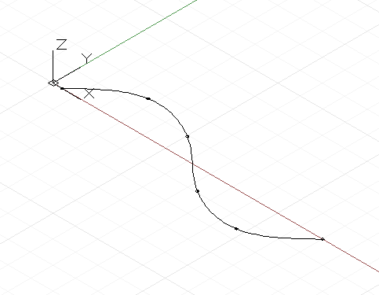

# Courbes : points de contrôle et interpolés

Il existe deux manières fondamentales de créer des courbes de forme libre dans Dynamo. Vous pouvez spécifier un ensemble de points et faire en sorte que Dynamo interpole une courbe lisse entre eux. Une méthode plus accessible consiste à spécifier les points de contrôle sous-jacents d'une courbe d'un certain degré. Les courbes interpolées sont utiles lorsqu'un concepteur sait exactement quelle forme une ligne doit prendre, ou si la conception comporte des contraintes spécifiques concernant les endroits où la courbe peut et ne peut pas passer. Les courbes spécifiées via des points de contrôle correspondent en substance à une série de segments de lignes droites qu'un algorithme lisse pour obtenir une forme de courbe finale. La définition d'une courbe par le biais de points de contrôle peut s'avérer utile pour explorer des formes de courbes avec différents degrés de lissage ou lorsqu'une continuité lisse est requise entre les segments de courbe.

Pour créer une courbe interpolée, il suffit de transférer un ensemble de points à la méthode *NurbsCurve.ByPoints*.



```js
num_pts = 6;

s = Math.Sin(0..360..#num_pts) * 4;

pts = Point.ByCoordinates(1..30..#num_pts, s, 0);

int_curve = NurbsCurve.ByPoints(pts);
```

La courbe générée coupe chacun des points d'entrée, en commençant et en finissant respectivement au premier et au dernier point de l'ensemble. Un paramètre périodique facultatif peut être utilisé pour créer une courbe périodique fermée. Dynamo remplira automatiquement le segment manquant, de sorte qu'un point d'arrivée en double (identique au point de départ) n'est pas nécessaire.


```js
pts = Point.ByCoordinates(Math.Cos(0..350..#10),
    Math.Sin(0..350..#10), 0);

// create an closed curve
crv = NurbsCurve.ByPoints(pts, true);

// the same curve, if left open:
crv2 = NurbsCurve.ByPoints(pts.Translate(5, 0, 0),
    false);
```

Les courbes NURBS sont générées de la même façon, les points d'entrée représentant les extrémités d'un segment de ligne droite, et un second paramètre spécifiant le degré et le type de lissage de la courbe, appelé degré.* Une courbe de degré 1 n'a pas de lissage ; il s'agit d'une polyligne.


```js
num_pts = 6;

pts = Point.ByCoordinates(1..30..#num_pts,
    Math.Sin(0..360..#num_pts) * 4, 0);

// a B-Spline curve with degree 1 is a polyline
ctrl_curve = NurbsCurve.ByControlPoints(pts, 1);
```

Une courbe de degré 2 est lissée de façon à ce que la courbe coupe et soit tangente au milieu des segments de polyligne :


```js
num_pts = 6;

pts = Point.ByCoordinates(1..30..#num_pts,
    Math.Sin(0..360..#num_pts) * 4, 0);

// a B-Spline curve with degree 2 is smooth
ctrl_curve = NurbsCurve.ByControlPoints(pts, 2);
```

Dynamo prend en charge les courbes NURBS (Non-Uniform Rational B-spline) jusqu'au degré 20, et le script suivant illustre l'effet de l'augmentation des niveaux de lissage sur la forme d'une courbe :


```js
num_pts = 6;

pts = Point.ByCoordinates(1..30..#num_pts,
    Math.Sin(0..360..#num_pts) * 4, 0);

def create_curve(pts : Point[], degree : int) 
{
	return = NurbsCurve.ByControlPoints(pts,
        degree);
}

ctrl_crvs = create_curve(pts, 1..11);
```

Notez que vous devez disposer d'au moins un point de contrôle supplémentaire par rapport au degré de la courbe.

Un autre avantage de la construction de courbes par le biais de sommets de contrôle est la possibilité de conserver la tangence entre des segments de courbe individuels. Pour ce faire, il convient d'extraire la direction entre les deux derniers points de contrôle et de poursuivre dans cette direction avec les deux premiers points de contrôle de la courbe suivante. L'exemple suivant crée deux courbes NURBS distinctes qui sont néanmoins aussi lisses qu'une seule courbe :


```js
pts_1 = {};

pts_1[0] = Point.ByCoordinates(0, 0, 0);
pts_1[1] = Point.ByCoordinates(1, 1, 0);
pts_1[2] = Point.ByCoordinates(5, 0.2, 0);
pts_1[3] = Point.ByCoordinates(9, -3, 0);
pts_1[4] = Point.ByCoordinates(11, 2, 0);

crv_1 = NurbsCurve.ByControlPoints(pts_1, 3);

pts_2 = {};

pts_2[0] = pts_1[4];
end_dir = pts_1[4].Subtract(pts_1[3].AsVector());

pts_2[1] = Point.ByCoordinates(pts_2[0].X + end_dir.X,
    pts_2[0].Y + end_dir.Y, pts_2[0].Z + end_dir.Z);

pts_2[2] = Point.ByCoordinates(15, 1, 0);
pts_2[3] = Point.ByCoordinates(18, -2, 0);
pts_2[4] = Point.ByCoordinates(21, 0.5, 0);

crv_2 = NurbsCurve.ByControlPoints(pts_2, 3);
```

* Il s'agit d'une description très simplifiée de la géométrie des courbes NURBS. Pour obtenir des informations plus précises et détaillées, reportez-vous à Pottmann et al, 2007, dans les références.

