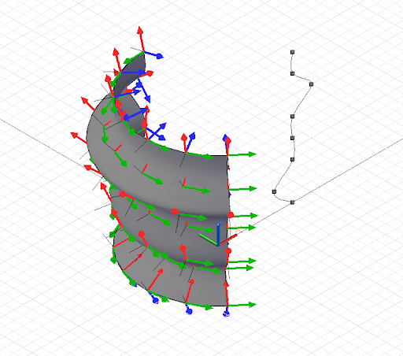

# Définition des paramètres géométriques

Dans les conceptions informatiques, les courbes et les surfaces sont souvent utilisées comme une armature sous-jacente à des constructions géométriques ultérieures. Pour que cette première géométrie puisse être utilisée comme base pour une géométrie ultérieure, le script doit pouvoir extraire des qualités telles que la position et l'orientation sur toute la zone de l'objet. Les courbes et les surfaces prennent en charge cette extraction, appelée définition des paramètres.

Tous les points d'une courbe peuvent être considérés comme ayant un paramètre unique compris entre 0 et 1. Si nous devions créer une NurbsCurve basée sur plusieurs points de contrôle ou interpolés, le premier point aurait le paramètre 0 et le dernier point le paramètre 1. Il est impossible de savoir à l'avance quel est le paramètre exact d'un point intermédiaire, ce qui peut sembler être une limitation importante, bien qu'atténuée par une série de fonctions utilitaires. Les surfaces ont une définition des paramètres similaire en tant que courbes, mais avec deux paramètres au lieu d'un, appelés u et v. Si nous voulons créer une surface avec les points suivants :

```js
pts = [ [p1, p2, p3],
        [p4, p5, p6],
        [p7, p8, p9] ];
````

p1 aurait le paramètre u = 0 v = 0, tandis que p9 aurait les paramètres u = 1 v = 1.

La définition des paramètres n'est pas particulièrement utile lors de la détermination des points utilisés pour générer des courbes. Elle permet principalement de déterminer les emplacements si des points intermédiaires sont générés par les constructeurs NurbsCurve et NurbsSurface.

Les courbes ont une méthode *PointAtParameter*, qui prend un double argument entre 0 et 1, et renvoie l'objet Point à ce paramètre. Par exemple, ce script recherche les points aux paramètres 0, 0.1, 0.2, 0.3, 0.4, 0.5, 0.6, 0.7, 0.8, 0.9 et 1 :


```js
pts = {};
pts[0] = Point.ByCoordinates(4, 0, 0);
pts[1] = Point.ByCoordinates(6, 0, 1);
pts[2] = Point.ByCoordinates(4, 0, 2);
pts[3] = Point.ByCoordinates(4, 0, 3);
pts[4] = Point.ByCoordinates(4, 0, 4);
pts[5] = Point.ByCoordinates(3, 0, 5);
pts[6] = Point.ByCoordinates(4, 0, 6);

crv = NurbsCurve.ByPoints(pts);

pts_at_param = crv.PointAtParameter(0..1..#11);

// draw Lines to help visualize the points
lines = Line.ByStartPointEndPoint(pts_at_param, 
    Point.ByCoordinates(4, 6, 0));
```

De même, les surfaces ont une méthode *PointAtParameter* qui prend deux arguments, le paramètre u et v du point généré.

Alors que l'extraction de points individuels sur une courbe et une surface peut être utile, les scripts requièrent souvent la connaissance des caractéristiques géométriques spécifiques d'un paramètre, telles que la direction dans laquelle la courbe ou la surface est orientée. La méthode *CoordinateSystemAtParameter* trouve non seulement la position, mais également un CoordinateSystem orienté au niveau du paramètre d'une courbe ou d'une surface. Par exemple, le script suivant extrait des CoordinateSystems orientés le long d'une surface de révolution et utilise leur orientation pour générer des lignes qui dépassent normalement par rapport à la surface :



```js
pts = {};
pts[0] = Point.ByCoordinates(4, 0, 0);
pts[1] = Point.ByCoordinates(3, 0, 1);
pts[2] = Point.ByCoordinates(4, 0, 2);
pts[3] = Point.ByCoordinates(4, 0, 3);
pts[4] = Point.ByCoordinates(4, 0, 4);
pts[5] = Point.ByCoordinates(5, 0, 5);
pts[6] = Point.ByCoordinates(4, 0, 6);
pts[7] = Point.ByCoordinates(4, 0, 7);

crv = NurbsCurve.ByPoints(pts);

axis_origin = Point.ByCoordinates(0, 0, 0);
axis = Vector.ByCoordinates(0, 0, 1);

surf = Surface.ByRevolve(crv, axis_origin, axis, 90,
    140);

cs_array = surf.CoordinateSystemAtParameter(
    (0..1..#7)<1>, (0..1..#7)<2>);

def make_line(cs : CoordinateSystem) { 
	lines_start = cs.Origin;
    lines_end = cs.Origin.Translate(cs.ZAxis, -0.75);
    
    return = Line.ByStartPointEndPoint(lines_start, 
        lines_end);
}

lines = make_line(Flatten(cs_array));
```

Comme mentionné précédemment, la définition des paramètres n'est pas toujours uniforme sur toute la longueur d'une courbe ou d'une surface, ce qui signifie que le paramètre 0.5 ne correspond pas toujours au milieu et 0.25 ne correspond pas toujours au premier quart d'une courbe ou d'une surface. Pour contourner cette limitation, les courbes possèdent un jeu supplémentaire de commandes de définition de paramètres qui vous permettent de trouver un point à des longueurs spécifiques le long d'une courbe.

