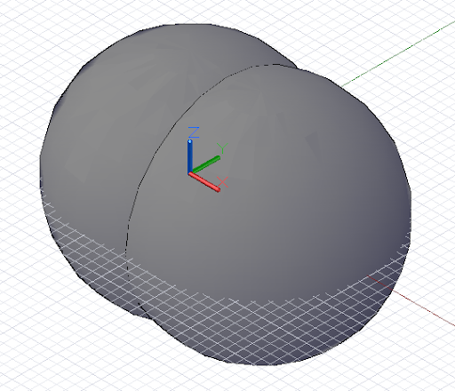

# Opérations booléennes géométriques

Les méthodes *Intersect*, *Trim* et *SelectTrim* sont principalement utilisées sur la géométrie dimensionnelle inférieure, comme les points, les courbes et les surfaces. La géométrie solide, en revanche, dispose d'un ensemble de méthodes supplémentaires pour modifier la forme après sa construction, en soustrayant de la matière de manière comparable à la méthode *Trim* et en combinant les éléments pour former un ensemble plus grand.

La méthode *Union* prend deux objets solides et crée un objet solide unique à partir de l'espace couvert par les deux objets. L'espace de chevauchement entre les objets est combiné dans la forme finale. Cet exemple combine une sphère et un cuboïde en une forme de sphère-cube solide unique :



```
s1 = Sphere.ByCenterPointRadius(
CoordinateSystem.Identity().Origin, 6);

s2 = Sphere.ByCenterPointRadius(
CoordinateSystem.Identity().Origin.Translate(4, 0,
0), 6);

combined = s1.Union(s2);
```

La méthode *Difference*, comme *Trim*, soustrait le contenu du solide de l'outil d'entrée du solide de base. Dans cet exemple, nous allons creuser une petite indentation dans une sphère :


```
s = Sphere.ByCenterPointRadius(
CoordinateSystem.Identity().Origin, 6);

tool = Sphere.ByCenterPointRadius(
CoordinateSystem.Identity().Origin.Translate(10, 0,
0), 6);

result = s.Difference(tool);
```

La méthode *Intersect* renvoie le solide se chevauchant entre deux entrées de solide. Dans l'exemple suivant, la méthode *Difference* a été changée en *Intersect* et le solide résultant correspond au vide manquant initialement creusé :


```
s = Sphere.ByCenterPointRadius(
CoordinateSystem.Identity().Origin, 6);

tool = Sphere.ByCenterPointRadius(
CoordinateSystem.Identity().Origin.Translate(10, 0,
0), 6);

result = s.Intersect(tool);
```

