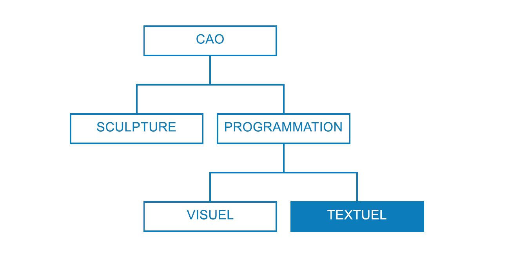

## Stratégies de script

L'utilisation de scripts basés sur du texte dans l'environnement de script visuel permet d'établir des relations visuelles efficaces à l'aide de DesignScript, Python et ZeroTouch (C#). L'utilisateur peut exposer des éléments tels que des curseurs d'entrée, condenser des opérations importantes dans DesignScript et accéder à de puissants outils et bibliothèques via Python ou C#, le tout dans le même espace de travail. Si elle est gérée efficacement, la combinaison de ces stratégies peut améliorer significativement la personnalisation, la clarté et l'efficacité du programme global. Les instructions suivantes vous aideront à enrichir votre script visuel avec un script de texte.



### Quand écrire un script ?

Les scripts de texte peuvent établir des relations plus complexes que la programmation visuelle, même si certaines de leurs fonctionnalités sont assez comparables. Cela est logique car les nœuds correspondent effectivement à du code pré-intégré, et nous pourrions probablement écrire un programme Dynamo dans DesignScript ou Python. Toutefois, nous utilisons les scripts visuels, car l'interface des nœuds et des fils crée un flux intuitif d'informations graphiques. Le fait de savoir quand les fonctionnalités du script de texte dépassent celles du script visuel vous permettra de déterminer lorsque ce script doit être utilisé sans renoncer à la nature intuitive des nœuds et des fils. Les instructions suivantes indiquent quand écrire des scripts et le langage à utiliser.

**Utilisez les scripts de texte aux fins suivantes :**

* Création de boucle

* Récursion

* Accès aux bibliothèques externes

**Choisissez une langue :**

||Création de boucle|Récursion|Condenser les nœuds|Bibliothèques ext.|Abréviations|
| -- | -- | 
|**DesignScript**|Oui|Oui|Oui|Non|Oui|
|**Python**|Oui|Oui|Partiellement|Oui|Non|
|**ZeroTouch (C#)**|Non|Non|Non|Oui|Non|

> Reportez-vous à la rubrique [Référence relative à la création et à la gestion des scripts](http://primer.dynamobim.org/en/12_Best-Practice/12-3_Scripting-Reference.html) pour obtenir une liste des éléments auxquels chaque bibliothèque Dynamo vous donne accès.

### Penser de manière paramétrique

Lorsque vous créez des scripts dans Dynamo, un environnement inévitablement paramétrique, il est judicieux de structurer votre code par rapport à la structure des nœuds et des fils dans lesquels il se trouvera. Considérez le nœud contenant votre script de texte comme s'il s'agissait d'un autre nœud du programme avec quelques entrées spécifiques, une fonction et une sortie attendue. Cela donne immédiatement à votre code à l'intérieur du nœud un petit jeu de variables à partir duquel travailler. C'est la clé d'un système paramétrique propre. Voici quelques conseils pour une meilleure intégration du code dans un programme visuel.

**Identifiez les variables externes :**

* Essayez de déterminer les paramètres donnés dans votre problème de conception afin de pouvoir développer un modèle qui se construit directement à partir de ces données.

* Avant d'écrire du code, identifiez les variables suivantes :

  * Un jeu minimal d'entrées

  * La sortie prévue

  * Des constantes


> Plusieurs variables ont été établies avant l'écriture du code.

> 1. La surface sur laquelle nous allons simuler l'eau de pluie.
2. Le nombre de gouttes de pluie (agents) que nous voulons.
3. La distance que nous voulons que les gouttes de pluie parcourent.
4. Le basculement entre descendre le parcours le plus raide ou traverser la surface.
5. Le nœud Python avec le nombre d'entrées correspondant.
6. Un bloc de code rendant les courbes renvoyées bleues.

**Concevez les relations internes :**

* Le paramétrisme permet de modifier certains paramètres ou variables afin de manipuler ou de modifier le résultat final d'une équation ou d'un système.

* Lorsque des entités de votre script sont liées de façon logique, définissez-les comme des fonctions les unes des autres. De cette façon, si l'une d'entre elle est modifiée, l'autre peut être mise à jour proportionnellement.

* Réduisez le nombre d'entrées en exposant uniquement les paramètres clés :

  * Si un jeu de paramètres peut provenir de plusieurs paramètres parent, affichez uniquement les paramètres parent sous forme d'entrées de script. Cela permet d'accroître la facilité d'utilisation de votre script tout en réduisant la complexité de son interface.


> "Modules" de code issus de l'exemple dans [Nœud Python](http://primer.dynamobim.org/en/09_Custom-Nodes/9-4_Python.html).

> 1. Entrées.
2. Variables internes au script.
3. Boucle qui utilise ces entrées et variables pour exécuter sa fonction.
> Conseil : mettez l'accent sur le processus, comme vous le faites pour la solution.

**Ne vous répétez pas (principe DRY) :**

* Lorsque vous disposez de plusieurs méthodes pour exprimer la même chose dans votre script, les représentations dupliquées ne sont pas synchronisées parfois, ce qui peut entraîner des problèmes de maintenance, des mauvaises factorisations et des contradictions internes.

* Le principe du DRY est le suivant : "Chaque connaissance doit avoir une représentation unique, non ambiguë et autorisée au sein d'un système" :

  * Lorsque ce principe est appliqué correctement, tous les éléments associés de votre script changent de manière prévisible et uniforme, et tous les éléments non liés n'ont pas de conséquences logiques les uns sur les autres.

```
### BAD
for i in range(4):
for j in range(4):
point = Point.ByCoordinates(3*i, 3*j, 0)
points.append(point)
```

```
### GOOD
count = IN[0]
pDist = IN[1]

for i in range(count):
for j in range(count):
point = Point.ByCoordinates(pDist*i, pDist*j, 0)
points.append(point)
```

> Conseil : avant de dupliquer des entités dans votre script (par exemple, une constante dans l'exemple ci-dessus), demandez-vous si vous pouvez établir un lien vers la source.

### Structurer de manière modulaire

Lorsque votre code devient de plus long et plus complexe, l'idée principale ou l'algorithme global devient de plus en plus illisible. Il est également plus difficile d'en suivre le cours, de trouver des bogues quand des problèmes surviennent, d'intégrer d'autres lignes de code et d'assigner des tâches de développement. Pour éviter ces problèmes, il est judicieux d'écrire du code dans les modules. Il s'agit d'une stratégie d'organisation qui décompose le code en fonction de la tâche qu'elle exécute. Voici quelques conseils pour rendre vos scripts plus gérables par le biais de la modularisation.

**Écrivez du code dans des modules :**

* Un "module" est un groupe de lignes de code qui effectue une tâche spécifique et qui est semblable à un nœud Dynamo dans l'espace de travail.

* Il peut s'agir de tout ce qui doit être visuellement séparé du code adjacent (une fonction, une classe, un groupe d'entrées ou les bibliothèques que vous importez).

* Le développement de code dans des modules exploite la qualité visuelle intuitive des nœuds, ainsi que les relations complexes que seuls les scripts de texte peuvent atteindre.


> Ces boucles appellent une classe nommée "agent" que nous allons développer dans l'exercice.

> 1. Module de code qui définit le point de départ de chaque agent.
2. Module de code qui met à jour l'agent.
3. Module de code qui trace une trajectoire pour le parcours de l'agent.

**Détectez le code réutilisé :**

* Si vous constatez que votre code produit un résultat identique (ou très similaire) à plusieurs endroits, trouvez des moyens de le regrouper dans une fonction qui peut être appelée.

* Les fonctions "Gestionnaire" contrôlent le flux de programmes et contiennent principalement des appels aux fonctions "Exécutant" qui gèrent les détails de bas niveau, comme le déplacement de données entre les structures.


> Dans cet exemple, des sphères sont créées avec des rayons et des couleurs basés sur la valeur Z des points centraux.

> 1. Deux fonctions parent "Executant" : une fonction qui crée des sphères avec des rayons et des couleurs d'affichage en fonction de la valeur Z du point central.
2. Une fonction parent "Gestionnaire" qui combine les deux fonctions "Executant". L'appel de cette fonction appellera les deux fonctions qu'elle contient.

**Montrez uniquement ce qui doit être vu :**

* Une interface de module représente les éléments fournis et requis par le module.

* Une fois les interfaces entre les unités définies, la conception détaillée de chaque unité peut être effectuée séparément.

**Séparabilité/Remplacement :**

* Les modules n'ont pas de lien entre eux.

**Formes générales de modularisation :**

* Regroupement des lignes de code :

```
# IMPORT LIBRARIES
import random
import math
import clr
clr.AddReference('ProtoGeometry')
from Autodesk.DesignScript.Geometry import *

# DEFINE PARAMETER INPUTS
surfIn = IN[0]
maxSteps = IN[1]
```

* Fonctions :

```
def get_step_size():
area = surfIn.Area
stepSize = math.sqrt(area)/100
return stepSize

stepSize = get_step_size()
```

* Classes :

```
class MyClass:
i = 12345

def f(self):
return 'hello world'

numbers = MyClass.i
greeting = MyClass.f
```

### Flexibilité continue

Lors du développement de scripts de texte dans Dynamo, il est préférable de s'assurer en permanence que ce que vous créez est conforme à vos attentes. Ainsi, vous vous assurez que des événements inattendus, tels que des erreurs de syntaxe, des écarts logiques, des inexactitudes de valeur, des sorties inhabituelles, etc.,sont rapidement détectés et sont traités au fur et à mesure, et non en une seule fois à la fin. Comme les scripts de texte figurent dans les nœuds de la zone de dessin, ils sont déjà intégrés au flux de données de votre programme visuel. La surveillance successive de votre script est facilitée : il suffit d'attribuer des données à générer, d'exécuter le programme et d'évaluer les flux découlant du script à l'aide d'un nœud Watch. Voici quelques conseils pour inspecter en continu vos scripts au fur et à mesure de leur construction.

**Testez en fonction de vos besoins :**

* Chaque fois que vous complétez un cluster de fonctionnalités, procédez comme suit :

  * Revenez en arrière et examinez votre code.

  * Soyez critique. Un collaborateur peut-il comprendre à quoi sert le code ? Est-ce que j'ai besoin de faire ça ? Cette fonction peut-elle être réalisée plus efficacement ? Suis-je en train de créer des doublons ou des dépendances inutiles ?

  * Testez rapidement votre code pour vérifier qu'il renvoie des données "logiques".

* Affectez les données les plus récentes que vous utilisez dans votre script comme sortie afin que le nœud génère toujours les données pertinentes lors de la mise à jour du script :


> Ajustement de l'exemple de code issu de [Nœud Python](http://primer.dynamobim.org/en/09_Custom-Nodes/9-4_Python.html).

> 1. Vérifiez que toutes les arêtes du solide sont renvoyées en tant que courbes pour créer une zone de contour.
2. Vérifiez que les entrées sous forme de nombres sont converties en intervalles.
3. Vérifiez que les systèmes de coordonnées ont été correctement convertis et pivotés dans cette boucle.

**Anticiper les "cas extrêmes" :**

* Lors du processus de script, définissez les paramètres d'entrée sur les valeurs minimale et maximale de leur domaine alloué pour vérifier si le programme fonctionne toujours dans des conditions extrêmes.

* Même si le programme fonctionne à ses extrémités, vérifiez s'il renvoie des valeurs nulles/vides/zéro non voulues.

* Parfois, les bogues et les erreurs qui révèlent un problème sous-jacent avec votre script ne se produiront que lors de ces cas extrêmes.

  * Trouvez la cause de l'erreur et déterminez si elle doit être corrigée en interne ou si un domaine de paramètre doit être redéfini pour éviter le problème.

> Conseil : supposez toujours que l'utilisateur utilise toutes les combinaisons de chaque valeur d'entrée qui lui a été exposée. Cela permettra d'éliminer les mauvaises surprises.

### Débogage efficace

Le débogage consiste à éliminer les "bogues" de votre script. Les bogues peuvent être des erreurs, des inefficacités, des imprécisions ou des résultats inattendus. La résolution d'un bogue peut être aussi simple que la correction d'un nom de variable mal orthographié ou des problèmes structurels plus graves avec votre script. Dans l'idéal, l'ajustement de votre script au fur et à mesure de sa construction permettra de détecter ces problèmes potentiels au plus tôt, bien que cela ne garantit pas qu'il soit exempt de bogues. Voici un examen des meilleures pratiques présentées ci-dessus pour vous aider à résoudre systématiquement les bogues.

**Utilisez la bulle Watch :**

* Vérifiez les données renvoyées à différents emplacements du code en l'affectant à la variable OUT, comme dans le concept d'ajustement du programme.

**Écrivez des commentaires ayant du sens :**

* Un module de code sera beaucoup plus facile à déboguer si le résultat attendu est clairement décrit.

```
# Loop through X and Y
for i in range(xCount):
for j in range(yCount):

# Rotate and translate the coordinate system
toCoord = fromCoord.Rotate(solid.ContextCoordinateSystem.Origin,Vector.ByCoordinates(0,0,1),(90*(i+j%seed)))
vec = Vector.ByCoordinates((xDist*i),(yDist*j),0)
toCoord = toCoord.Translate(vec)

# Transform the solid from the source coord system to the target coord system and append to the list
solids.append(solid.Transform(fromCoord,toCoord))
```

> On considère généralement qu'un tel exemple contient trop de commentaires et de lignes vierges, mais lors du débogage, il peut être utile de diviser le code en éléments gérables.

**Utilisez la modularité du code :**

* La source d'un problème peut être attribuée à certains modules.

* Une fois le module défectueux identifié, il est beaucoup plus simple de corriger le problème.

* Lorsqu'un programme doit être modifié, le code développé dans les modules sera beaucoup plus facile à modifier :

  * Vous pouvez insérer des modules nouveaux ou débogués dans un programme existant avec la certitude que le reste du programme ne changera pas.


> Débogage du fichier d'exemple issu de [Nœud Python](http://primer.dynamobim.org/en/09_Custom-Nodes/9-4_Python.html).

> 1. Comme vous pouvez le voir lors de l'affectation de xDist et yDist à OUT, la géométrie d'entrée renvoie une zone de contour plus grande qu'elle.
2. Les courbes d'arête de la géométrie d'entrée renvoient une zone de contour appropriée avec des distances correctes pour xDist et yDist.
3. Le "module" de code inséré permet de résoudre le problème des valeurs xDist et yDist.

### Exercice - Parcours le plus raide

> Téléchargez le fichier d'exemple joint à cet exercice (cliquez avec le bouton droit de la souris et sélectionnez "Enregistrer le lien sous..."). Vous trouverez la liste complète des fichiers d'exemple dans l'annexe. [SteepestPath.dyn](datasets/13-1/SteepestPath.dyn)

Utilisons les meilleures pratiques en matière de script de texte pour écrire un script de simulation de pluie. Même si vous avez pu appliquer les meilleures pratiques à un programme visuel désorganisé dans Graph Strategies, il est beaucoup plus difficile de le faire avec des scripts de texte. Les relations logiques établies dans les scripts de texte sont moins visibles et sont parfois presque impossibles à délimiter dans un code désordonné. Les scripts de texte impliquent une plus grande responsabilité dans l'organisation. Vous allez effectuer chaque étape et appliquer les meilleures pratiques.


> Votre script s'applique à une surface déformée par l'attraction.

La première chose à faire est d'importer les bibliothèques Dynamo nécessaires. Cette première opération permet d'accéder à la fonctionnalité Dynamo dans Python.


> Toutes les bibliothèques que vous voulez utiliser doivent être importées ici.

Ensuite, vous devez définir les entrées et la sortie du script, qui s'afficheront comme ports d'entrée sur le nœud. Ces entrées externes constituent la base de votre script et la clé pour établir un environnement paramétrique.


> Vous devez définir des entrées qui correspondent aux variables du script Python et déterminer une sortie souhaitée :

> 1. La surface à parcourir.
2. Le nombre d'agents que nous voulons voir marcher.
3. Le nombre maximal de pas que les agents sont autorisés à effectuer.
4. Une option permettant de prendre le chemin le plus court vers le bas de la surface ou de la parcourir.
5. Le nœud Python avec des identificateurs d'entrée qui correspondent aux entrées du script (IN[0], IN[1]).
6. Les courbes de sortie pouvant être affichées avec une couleur différente.

Vous allez maintenant utiliser la modularité et créer le corps de votre script. La simulation du chemin le plus court vers le bas d'une surface pour plusieurs points de départ est une tâche importante qui nécessitera plusieurs fonctions. Plutôt que d'appeler les différentes fonctions dans le script, vous pouvez modulariser votre code en les regroupant dans une classe unique, votre agent. Les différentes fonctions de cette classe ou de ce "module" peuvent être appelées avec différentes variables ou même réutilisées dans un autre script.


> Vous devez définir une classe, ou un "plan", pour un agent avec l'intention de parcourir une surface en choisissant le déplacement dans la direction la plus abrupte possible à chaque fois qu'il fait un pas :

> 1. Nom.
2. Attributs globaux que tous les agents partagent.
3. Attributs d'instance uniques à chaque agent.
4. Fonction permettant de faire un pas.
5. Fonction permettant de cataloguer la position de chaque pas dans une liste de trajectoires.

Initialisons les agents en définissant leur emplacement de départ. C'est une bonne occasion d'ajuster votre script et de s'assurer que la classe d'agent fonctionne.


> Vous devez instancier tous les agents qui doivent parcourir la surface, et définir leurs attributs initiaux :

> 1. Une nouvelle liste de trajectoires vide.
2. Le point de départ de leur parcours sur la surface.
3. Vous avez attribué la liste des agents comme sortie pour vérifier ce que le script renvoie ici. Le nombre correct d'agents est renvoyé, mais vous devrez ajuster le script à nouveau ultérieurement pour vérifier la géométrie qu'il renvoie.

Mettez à jour les agents à chaque pas.


> Vous devez ensuite entrer une boucle imbriquée où vous mettez à jour et enregistrez la position de chaque agent à chaque pas dans la liste de trajectoires correspondante. À chaque pas, vous allez également vous assurer que l'agent n'a pas atteint de point sur la surface où il ne peut plus descendre. Si cette condition est remplie, terminez le parcours de cet agent.

Maintenant que les agents ont été entièrement mis à jour, revenez à la géométrie qui les représente.


> Une fois que tous les agents ont atteint leur limite de descente ou leur nombre maximal de pas, vous allez créer une polycourbe à l'aide des points de leur liste de trajectoires, et générer les trajectoires polycourbes.

Votre script permettant de trouver les chemins les plus abrupts.


> 1. Valeur prédéfinie qui simule l'eau de pluie sur la surface sous-jacente.
2. Au lieu de trouver le chemin le plus abrupt, les agents peuvent être basculés pour parcourir la surface sous-jacente.


> Le script de texte Python complet.

