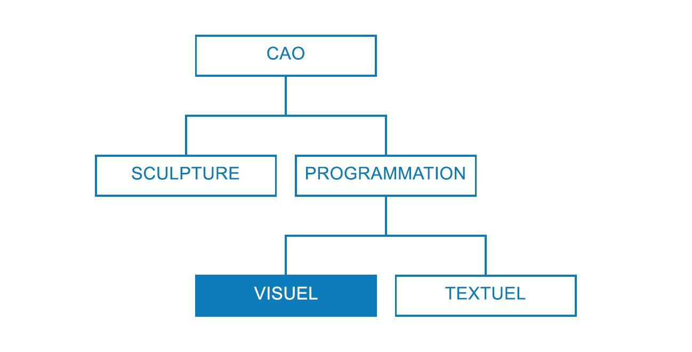
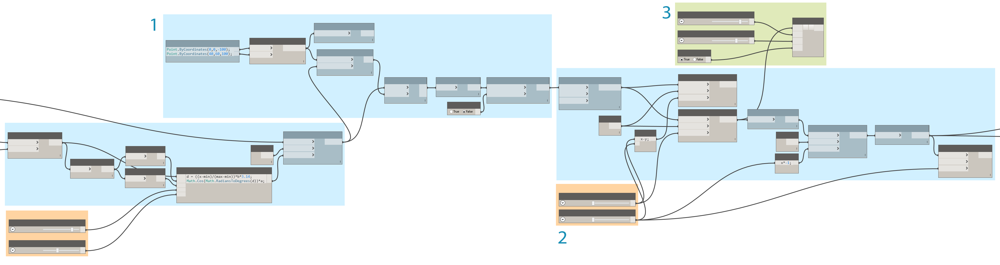
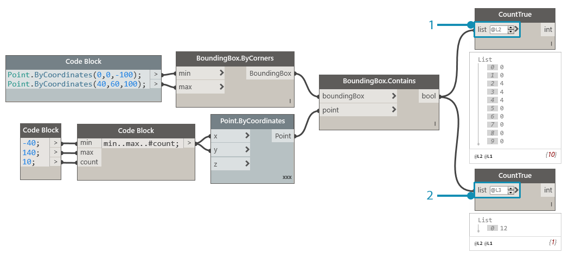
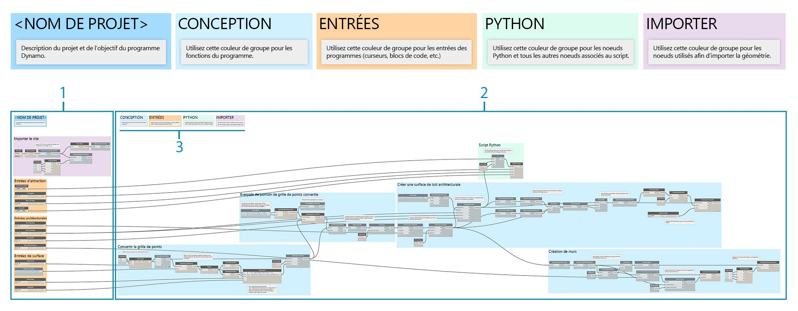
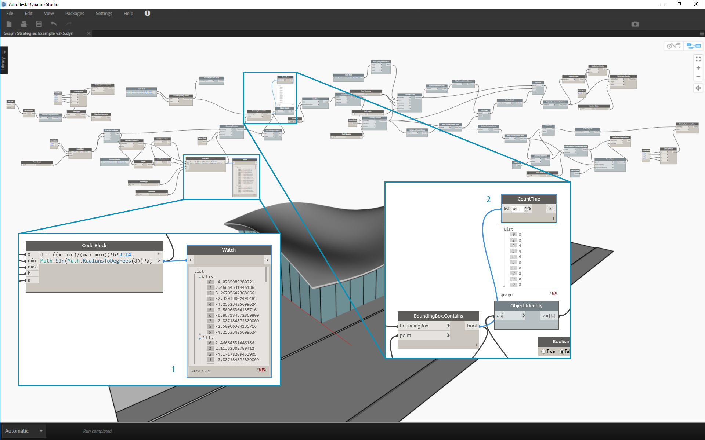

## Stratégies de graphiques

Avant ce chapitre, le guide a présenté les étapes à suivre pour mettre en œuvre les puissantes fonctionnalités de script visuel de Dynamo. Une bonne compréhension de ces fonctionnalités est une base solide et la première étape dans la construction de programmes visuels fiables. Lorsque vous utilisez vos programmes visuels sur le terrain, partagez-les avec vos collègues, corrigez les erreurs ou testez les limites avec lesquelles vous rencontrez d'autres problèmes. Si une autre personne va utiliser votre programme ou si vous souhaitez l'ouvrir dans six mois, il doit être clair d'un point de vue graphique et logique dès l'ouverture. Dynamo dispose de nombreux outils pour gérer la complexité de votre programme. Ce chapitre vous expliquera les conditions d'utilisation de ces derniers.

### Simplification des processus

Lorsque vous développez votre graphique Dynamo et testez vos idées, la taille et la complexité de ce dernier peuvent rapidement augmenter. Bien qu'il soit important de créer un programme fonctionnel, il est tout aussi crucial de le faire aussi simplement que possible. Non seulement votre graphique s'exécutera plus rapidement et de manière plus prévisible, mais vous comprendrez sa logique ultérieurement. Les méthodes suivantes vous aideront à clarifier la logique de votre graphique.

#### Modularisation avec les groupes

* Les groupes vous permettent de **créer des pièces fonctionnellement distinctes** lorsque vous construisez un programme
* Les groupes vous permettent de **déplacer de grandes parties du programme** tout en maintenant la modularité et l'alignement
* Vous pouvez modifier la **couleur du groupe pour différencier** ce que font les groupes (entrées et fonctions)
* Vous pouvez utiliser des groupes pour commencer à **organiser votre graphique afin de simplifier la création de nœuds personnalisés**

> Les couleurs de ce programme identifient l'objectif de chaque groupe. Cette stratégie sert à créer une hiérarchie dans les normes graphiques ou les gabarits que vous développez.

> 1. Groupe de fonctions (bleu)
2. Groupe d'entrées (orange)
3. Groupe de scripts (vert)
> Pour savoir comment utiliser les groupes, reportez-vous à la rubrique [Gestion de votre programme](http://primer.dynamobim.org/en/03_Anatomy-of-a-Dynamo-Definition/3-4_best_practices.html).

#### Développement efficace avec les blocs de code

* Vous pouvez parfois utiliser un bloc de code pour **saisir un nombre ou une méthode de nœud plus rapidement qu'en effectuant une recherche** (Point.ByCoordinates, Number, String, Formula)

* Les blocs de code sont utiles **lorsque vous souhaitez définir des fonctions personnalisées dans DesignScript afin de réduire le nombre de nœuds dans un graphique**

> Les deux encadrés exécutent la même fonction. Il était beaucoup plus rapide d'écrire quelques lignes de code que de rechercher et d'ajouter chaque nœud individuellement. Le bloc de code est également beaucoup plus concis.

> 1. Script de conception écrit en bloc de code
2. Programme équivalent en nœuds
> Pour savoir comment utiliser le bloc de code, reportez-vous à la rubrique [Définition d'un bloc de code](http://primer.dynamobim.org/en/07_Code-Block/7-1_what-is-a-code-block.html).

#### Condenser grâce à Nœud vers code

* Vous pouvez **réduire la complexité d'un graphique en utilisant la fonctionnalité Nœud vers code** : elle permet de sélectionner un ensemble de nœuds simples et d'en écrire le DesignScript correspondant dans un bloc de code unique
* La fonctionnalité Nœud vers code permet de ** condenser du code sans éliminer la clarté du programme**
* Voici les **avantages** de l'utilisation de Nœud vers code :
* Condense facilement du code en un composant qui reste modifiable
* Peut simplifier une partie significative du graphique
* Utile si le mini-programme ne sera pas souvent modifié
* Utile pour intégrer d'autres fonctionnalités de bloc de code, telles que des fonctions

* Voici les **inconvénients** de l'utilisation de Nœud vers code :
* L'attribution de noms génériques réduit la lisibilité
* Plus difficile à comprendre pour les autres utilisateurs
* Aucun moyen simple de revenir à la version de programmation visuelle

> 1. Programme existant
2. Bloc de code créé à partir de Nœud vers code
> Pour savoir comment utiliser la fonctionnalité Nœud vers code, reportez-vous à la rubrique [Syntaxe du script de conception](http://primer.dynamobim.org/en/07_Code-Block/7-2_Design-Script-syntax.html).

#### Accès aux données en toute flexibilité grâce à List@Level

* L'utilisation de List@Level vous permet de **réduire la complexité de votre graphique en remplaçant les nœuds List.Map et List.Combine** qui peuvent occuper une grande partie de la zone de dessin
* List@Level fournit une **méthode plus rapide que List.Map/List.Combine pour construire la logique de nœud** en vous permettant d'accéder aux données à n'importe quel niveau d'une liste, directement à partir du port d'entrée d'un nœud

> Vous pouvez vérifier le nombre de valeurs True renvoyées par BoundingBox.Contains et dans quelles listes ces valeurs sont renvoyées en activant List@Level pour l'entrée "list" de CountTrue. La fonction List@Level permet à l'utilisateur de déterminer à quel niveau l'entrée va extraire des données. La fonction List@Level est flexible, efficace et vivement recommandée par rapport à d'autres méthodes impliquant List.Map et List.Combine.

> 1. Comptage des valeurs True au niveau de la liste 2
2. Comptage de valeurs True au niveau de la liste 3
> Pour savoir comment utiliser List@Level, reportez-vous à la rubrique [Listes de listes](http://primer.dynamobim.org/en/06_Designing-with-Lists/6-3_lists-of-lists.html#list@level).

### Maintenir la lisibilité

En plus de rendre le graphique aussi simple et efficace que possible, essayez d'améliorer la clarté graphique. Malgré vos efforts pour rendre votre graphique intuitif grâce à des regroupements logiques, les relations risquent de ne pas être évidentes. L'insertion d'une note simple dans un groupe ou l'attribution de nouveaux noms aux curseurs permet aux utilisateurs d'éviter tout malentendu ou mouvement panoramique inutile sur le graphique. Les méthodes suivantes vous aideront à appliquer la cohérence graphique dans vos graphiques.

#### Continuité visuelle grâce à l'alignement des nœuds

* Pour réduire votre charge de travail après avoir créé votre graphique, assurez-vous que la disposition des nœuds est lisible en **alignant les nœuds régulièrement et au fur et à mesure de votre travail**
* Si d'autres utilisateurs vont travailler avec votre graphique, **assurez-vous que la disposition des liaisons de nœud s'enchaîne facilement avant la livraison**
* Pour vous aider avec la tâche d'alignement, **utilisez la fonction "Arranger l'affichage des nœuds" pour aligner automatiquement** votre graphique, même si elle est moins précise que vous-même

> 1. Graphique non organisé
2. Graphe aligné
> Pour utiliser l'alignement de nœud, reportez-vous à la rubrique [Gestion de votre programme](http://primer.dynamobim.org/en/03_Anatomy-of-a-Dynamo-Definition/3-4_best_practices.html).

#### Étiquetage descriptif par changement de nom

* L'attribution de nouveaux noms aux entrées permet aux autres utilisateurs de comprendre facilement votre graphique, **notamment si ce qu'ils connectent n'est pas affiché à l'écran**
* **Veillez à renommer les nœuds en plus des entrées.** Une autre solution consiste à créer un nœud personnalisé à partir d'un cluster de nœuds et à le renommer. Il sera alors évident qu'il contient autre chose

> 1. Entrées pour la manipulation de surfaces
2. Entrées pour les paramètres architecturaux
3. Entrées du script de simulation de drainage
> Pour renommer un nœud, cliquez avec le bouton droit de la souris sur son nom et sélectionnez "Renommer le nœud...".

#### Explication avec des notes

* Vous devez ajouter une note si quelque chose dans le **graphique requiert une explication en langage simple** que les nœuds ne peuvent pas exprimer
* Vous devez ajouter une note si un ensemble de **nœuds ou de groupes est trop volumineux ou trop complexe et ne peut pas être facilement compris immédiatement**

> 1. Note décrivant la partie du programme qui renvoie les distances de conversion brutes
2. Note décrivant le code qui mappe ces valeurs avec une onde sinusoïdale
> Pour savoir comment ajouter une note, reportez-vous à la rubrique [Gestion de votre programme](http://primer.dynamobim.org/en/03_Anatomy-of-a-Dynamo-Definition/3-4_best_practices.html).

### Flexibilité continue

Lors de la création de votre script visuel, il est important de vérifier que le résultat renvoyé est celui attendu. Les erreurs ou les problèmes ne provoqueront pas tous l'échec immédiat du programme, notamment les valeurs nulles qui peuvent avoir une incidence sur un élément en aval. Cette stratégie est également abordée dans le contexte de la création de scripts de texte dans [Stratégies de script](http://primer.dynamobim.org/en/12_Best-Practice/13-2_Scripting-Strategies.html). La pratique suivante permet de vous assurer que vous obtenez le résultat attendu.

#### Surveiller les données avec les bulles Watch et d'aperçu

* Utilisez les bulles Watch et d'aperçu lorsque vous créez le programme pour** vérifier que les sorties clés renvoient le résultat attendu**

> Les nœuds Watch sont utilisés pour comparer :

> 1. Distances de conversion brutes
2. Valeurs transmises par l'équation sinusoïdale
> Pour savoir comment utiliser Watch, reportez-vous à la rubrique [Bibliothèque](http://primer.dynamobim.org/en/03_Anatomy-of-a-Dynamo-Definition/3-2_dynamo_libraries.html).

### Garantir la réutilisation

Il est fort probable qu'une autre personne ouvre votre programme à un moment donné, même si vous travaillez indépendamment. Cette personne doit pouvoir comprendre rapidement ce dont le programme a besoin et ce qu'il produit à partir de ses entrées et sorties. Cela est particulièrement important lorsque vous développez un nœud personnalisé à partager avec la communauté Dynamo et à utiliser dans le programme d'un autre utilisateur. Ces pratiques permettent de construire des programmes et des nœuds robustes et réutilisables.

#### Gérer les E/S

* Pour garantir la lisibilité et l'évolutivité, essayez de **réduire les entrées et les sorties autant que possible**
* Essayez de **déterminer la méthode de création de la logique en créant d'abord une ébauche** de la manière dont la logique peut fonctionner avant d'ajouter un nœud à la zone de dessin. Lorsque vous développez la première ébauche, effectuez un suivi des entrées et des sorties qui seront converties en scripts

#### Utiliser les valeurs prédéfinies pour incorporer les valeurs d'entrée

* Si vous souhaitez **intégrer des options ou conditions particulières au graphique**, utilisez les valeurs prédéfinies pour y accéder rapidement
* Vous pouvez également utiliser les valeurs prédéfinies pour **réduire la complexité en mettant en cache des valeurs de curseur spécifiques** dans un graphique avec des temps d'exécution longs

> Pour savoir comment utiliser les valeurs prédéfinies, reportez-vous à la rubrique [Gestion des données grâce aux valeurs prédéfinies](http://primer.dynamobim.org/en/03_Anatomy-of-a-Dynamo-Definition/3-5_presets.html).

#### Limiter les programmes grâce aux nœuds personnalisés

* Vous devez utiliser un nœud personnalisé si votre **programme peut être regroupé dans un seul conteneur**
* Vous devez utiliser un nœud personnalisé **lorsqu'une partie du graphique sera réutilisée souvent** dans d'autres programmes
* Vous devez utiliser un nœud personnalisé pour **partager une fonctionnalité avec la communauté Dynamo**

> La collecte du programme de conversion de points dans un nœud personnalisé permet de simplifier et de rendre transférable un programme robuste et unique. Les ports d'entrée bien nommés aideront d'autres utilisateurs à comprendre comment utiliser le nœud. N'oubliez pas d'ajouter des descriptions et des types de données requis pour chaque entrée.

> 1. Programme d'attraction existant
2. Nœud personnalisé qui collecte ce programme, PointGrid
> Pour savoir comment utiliser les nœuds personnalisés, reportez-vous à la rubrique [Introduction aux nœuds personnalisés](http://primer.dynamobim.org/en/09_Custom-Nodes/9-1_Introduction.html).

#### Créer des gabarits

* Vous pouvez créer des gabarits pour **établir des normes graphiques dans vos graphiques visuels afin de vous assurer que les collaborateurs comprennent le graphique de manière standardisée**
* Lors de la création d'un gabarit, vous pouvez normaliser **les tailles de police et les couleurs de groupe** afin de classer les types de workflow ou d'actions de données.
* Lors de la création d'un gabarit, vous pouvez même normaliser la façon dont vous souhaitez **étiqueter, colorer ou styliser la différence entre les workflows front-end et back-end** dans votre graphique.

> 1. L'interface utilisateur, ou la partie frontale, du programme inclut un nom de projet, des curseurs d'entrée et une géométrie d'importation.
2. La partie back-end du programme.
3. Regroupez les catégories de couleurs (conception générale, entrées, scripts Python, géométrie importée).

### Exercice - Toit architectural

> Téléchargez le fichier d'exemple joint à cet exercice (cliquez avec le bouton droit de la souris et sélectionnez "Enregistrer le lien sous..."). Vous trouverez la liste complète des fichiers d'exemple dans l'annexe. [RoofDrainageSim.zip](datasets/13-2/RoofDrainageSim.zip)

Maintenant que vous avez établi plusieurs meilleures pratiques, appliquez-les à un programme qui a été mis en place rapidement. Bien que le programme réussisse à générer le toit, l'état du graphique reflète le cheminement de pensée de l'auteur, à la manière d'une carte mentale. Il n'y a aucune organisation ou description de son utilisation. Vous allez parcourir les meilleures pratiques pour organiser, décrire et analyser le programme afin que d'autres utilisateurs puissent comprendre comment l'utiliser.

> Le programme fonctionne, mais le graphique est désorganisé.

Commençons par déterminer les données et la géométrie renvoyées par le programme.

> Comprendre quand des modifications importantes des données se produisent est crucial pour établir des divisions logiques, ou des modularités. Inspectez le reste du programme avec les nœuds Watch pour voir si vous pouvez déterminer les groupes avant de passer à l'étape suivante.

> 1. Ce bloc de code avec une équation mathématique semble être un élément crucial du programme. Un nœud Watch indique qu'il renvoie des listes de distances de conversion.
2. L'objectif de cette zone n'est pas évident. La disposition des valeurs True au niveau de la liste L2 de BoundingBox.Contains et la présence de List.FilterByBoolMask suggèrent que vous échantillonnez une partie de la grille de points.

Une fois que vous avez identifié les composantes essentielles du programme, placez-les dans des groupes.

> Les groupes permettent à l'utilisateur de différencier visuellement les parties du programme.

> 1. Importer un modèle de site 3D
2. Convertir la grille de points en fonction de l'équation sinusoïdale
3. Exemple de portion de grille de points
4. Créer une surface de toit architecturale
5. Créer un mur-rideau en verre

Lorsque les groupes sont établis, alignez les nœuds pour créer une continuité visuelle sur le graphique.

> La continuité visuelle aide l'utilisateur à voir le flux du programme et les relations implicites entre les nœuds.

Rendez le programme plus accessible en ajoutant un autre calque d'améliorations graphiques. Ajoutez des notes pour décrire le fonctionnement d'une zone spécifique du programme, donnez des noms personnalisés aux entrées et affectez des couleurs à différents types de groupes.

> Ces améliorations graphiques permettent à l'utilisateur de mieux connaître les activités du programme. Les différentes couleurs de groupe permettent de distinguer les entrées des fonctions.

> 1. Notes
2. Entrées avec des noms descriptifs

Avant de commencer à condenser le programme, identifions un emplacement stratégique pour présenter le simulateur de drainage du script Python. Branchez la sortie de la première surface de toit mise à l'échelle dans l'entrée de script correspondante.

> Vous avez choisi d'intégrer les scripts à ce stade du programme afin que la simulation de drainage puisse être exécutée sur la surface de toit unique d'origine. Cette surface spécifique n'est pas affichée en aperçu, mais elle vous évite d'avoir à choisir la surface supérieure de la polysurface chanfreinée.

> 1. Géométrie source pour l'entrée du script
2. Nœud Python
3. Curseurs d'entrée
4. "Commutateur" activé/désactivé

Maintenant que tout est en place, simplifions le graphique.

> La condensation du programme grâce à Nœud vers code et à Nœud personnalisé a permis de réduire considérablement la taille du graphique. Les groupes qui créent la surface du toit et les murs ont été convertis en code, car ils sont très spécifiques de ce programme. Le groupe de conversion de points est contenu dans un nœud personnalisé, car il peut être utilisé dans un autre programme. Dans le fichier d'exemple, créez votre propre nœud personnalisé à partir du groupe Convertir les points.

> 1. Nœud personnalisé contenant le groupe "Convertir la grille de points"
2. Nœud vers code permettant de condenser les groupes "Créer une surface de toit architecturale et un mur-rideau"

Pour finir, créez des valeurs prédéfinies pour des formes de toit représentatives.

> Ces entrées sont les principaux pilotes de la forme du toit et permettent aux utilisateurs de découvrir le potentiel du programme.

Votre programme avec des vues de deux valeurs prédéfinies.

> Les motifs de drainage du toit permettent à l'utilisateur d'obtenir une vue analytique des valeurs prédéfinies respectives.

