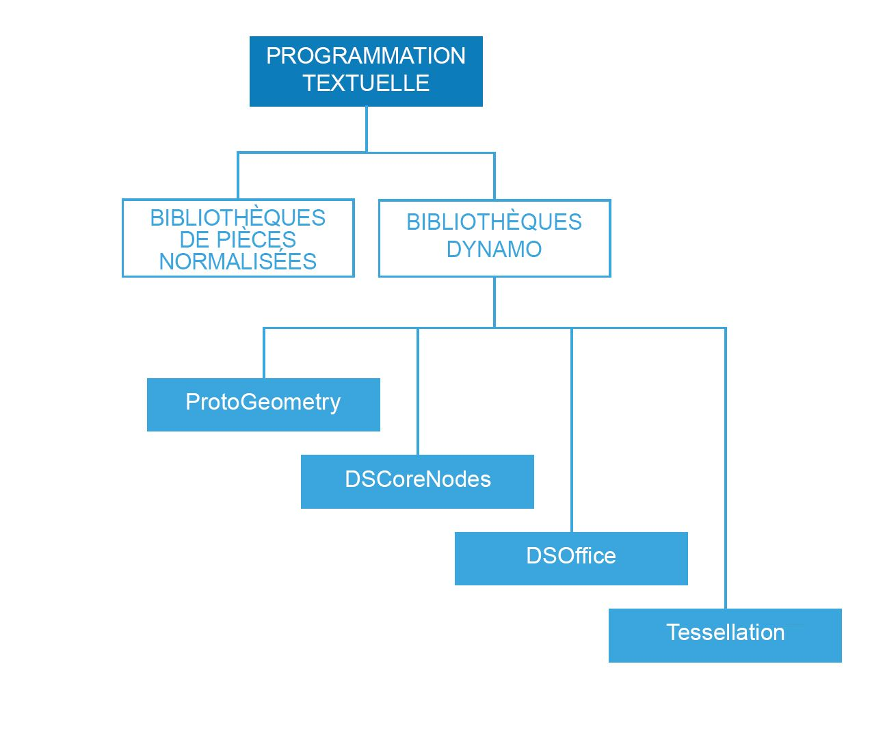

## Références concernant la création et la gestion des scripts

Cette page de référence présente les meilleures pratiques décrites dans la section Stratégies de script, avec plus de détails sur les bibliothèques de codes, l'étiquetage et le style. Vous allez utiliser Python pour illustrer les concepts ci-dessous. Les mêmes principes s'appliquent à Python et C# (Zerotouch), mais la syntaxe est différente.

### Bibliothèques à utiliser

Les bibliothèques standard sont externes à Dynamo et sont présentes dans les langages de programmation Python et C# (Zerotouch). Dynamo possède également son propre ensemble de bibliothèques qui correspondent directement à sa hiérarchie de nœuds, permettant à l'utilisateur de coder tout ce qui peut être fait avec des nœuds et des fils. Voici un guide qui présente le contenu auquel chaque bibliothèque Dynamo permet d'accéder et qui explique quand utiliser une bibliothèque standard.



**Bibliothèques standard et bibliothèques Dynamo**

* Les bibliothèques standard de Python et C# peuvent être utilisées pour créer des données avancées et des structures de flux dans l'environnement Dynamo.
* Les bibliothèques Dynamo correspondent directement à la hiérarchie des nœuds pour la création de géométries et d'autres objets Dynamo.

**Bibliothèques Dynamo**

* ProtoGeometry
  * Fonctionnalités : Arc, Zone de contour, Cercle, Cône, Système de coordonnées, Cuboïde, Courbe, Cylindre, Arête, Ellipse, Arc d'ellipse, Face, Géométrie, Hélice, Groupe d'index, Ligne, Maillage, Courbe NURBS, Surface NURBS, Plan, Point, Polygone, Rectangle, Solide, Sphère, Surface, Topologie, T-Spline, UV, Vecteur, Sommet.
  * Comment importer : ```import Autodesk.DesignScript.Geometry```
  * **Notez que lorsque vous utilisez ProtoGeometry via Python ou C#**, vous créez des objets non gérés dont la mémoire doit être gérée manuellement. Pour plus d'informations, reportez-vous à la section **Objets non gérés**.
* DSCoreNodes
  * Fonctionnalités : Couleur, Intervalle de couleurs 2D, Date et heure, Durée, E/S, Formule, Logique, Liste, Math, Arbre quadratique, Chaîne, Thread.
  * Comment importer : ```import DSCore```
* Tessellation
  * Fonctionnalités : Coque convexe, Delaunay, Voronoi.
  * Comment importer : ```import Tessellation```
* DSOffice
  * Fonctionnalité : Excel.
  * Comment importer : ```import DSOffice```

### Étiquetage soigneux

Lors de la création du script, vous utilisez en permanence des identificateurs pour indiquer des éléments tels que des variables, des types, des fonctions et d'autres entités. Grâce à ce système de notation symbolique, et à la création d'algorithmes, vous pouvez facilement vous référer à des informations par le biais de libellés, généralement composés d'une séquence de caractères. Le fait de nommer les choses correctement joue un rôle important dans l'écriture de code pour que ce dernier soit facilement lu et compris par d'autres personnes, ainsi que par vous-même dans le futur ! Voici quelques conseils à retenir lorsque vous nommez des éléments dans votre script :

**Il est correct d'utiliser des abréviations, mais il convient d'expliquer l'abréviation par un commentaire :**

```
### BAD
csfX = 1.6
csfY= 1.3
csfZ = 1.0
```

```
### GOOD
# column scale factor (csf)
csfX = 1.6
csfY= 1.3
csfZ = 1.0
```

**Évitez les libellés redondants :**

```
### BAD
import car
seat = car.CarSeat()
tire = car.CarTire()
```

```
### GOOD
import car
seat = car.Seat()
tire = car.Tire()
```

**Utilisez une logique positive pour les noms de variables au lieu d'une logique négative :**

```
### BAD
if 'mystring' not in text:
print 'not found'
else:
print 'found'
print 'processing'
```

```
### GOOD
if 'mystring' in text:
print 'found'
print 'processing'
else:
print 'not found'
```

**Préférez la "notation inverse" :**

```
### BAD
agents = …
active_agents = …
dead_agents ...
```

```
### GOOD
agents = …
agents_active = …
agents_dead = ...
```

> Il est plus logique d'utiliser des termes structurels.

**Les alias doivent être utilisés pour raccourcir les chaînes trop longues et souvent répétées :**

```
### BAD
from RevitServices.Persistence import DocumentManager

DocumentManager = DM

doc = DM.Instance.CurrentDBDocument
uiapp = DM.Instance.CurrentUIApplication
```

```
### GOOD
from RevitServices.Persistence import DocumentManager as DM

doc = DM.Instance.CurrentDBDocument
uiapp = DM.Instance.CurrentUIApplication
```

> L'utilisation d'alias peut rapidement conduire à des programmes déroutants et non standard.

**Utilisez uniquement les mots nécessaires :**

```
### BAD
rotateToCoord = rotateFromCoord.Rotate(solid.ContextCoordinateSystem.Origin,Vector.ByCoordinates(0,0,1),5)
```

```
### GOOD
toCoord = fromCoord.Rotate(solid.ContextCoordinateSystem.Origin,Vector.ByCoordinates(0,0,1),5)
```

> "Rendez les choses aussi simples que possible, mais pas plus simples." - Albert Einstein

### Style cohérent

En règle générale, il existe plusieurs méthodes pour programmer à peu près tout ce que l'on veut. Votre "style personnel" de script est donc le résultat des innombrables petites décisions que vous choisissez de prendre (ou de ne pas prendre). Cela dit, la lisibilité et la pérennité de votre code sont le résultat direct de sa cohérence interne et de sa conformité aux conventions stylistiques générales. En règle générale, des lignes de code qui se ressemblent à deux emplacements différents doivent également fonctionner de la même manière. Voici quelques conseils pour écrire du code clair et cohérent.

**Conventions d'appellation :** (choisissez l'une des conventions ci-dessous pour chaque type d'entité de votre code et associez-la à votre système.)

* Variables, fonctions, méthodes, packages, modules :
`minuscules_avec_traits_soulignement`

* Classes et exceptions :
`MotsAvecMajInitiale`

* Méthodes protégées et fonctions internes :
`_un_trait_soulignement_au_début(self, ...)`

* Méthodes privées :
`__deux_traits_soulignement_au_début(self, ...)`

* Constantes :
`MAJUSCULES_AVEC_TRAITS_SOULIGNEMENT`

> Conseil : évitez les variables d'une lettre (p. ex. l, O, I) sauf dans des blocs très courts, quand la signification est clairement visible dans le contexte immédiat.

**Utilisation de lignes vierges :**

* Entourez les définitions de classe et de fonction de niveau supérieur de deux lignes vierges.

  * Les définitions de méthode à l'intérieur d'une classe sont entourées d'une seule ligne vierge.

  * Des lignes vierges supplémentaires peuvent être utilisées (occasionnellement) pour séparer des groupes de fonctions associées.

**Évitez les espaces superflus :**

* Immédiatement entre des parenthèses, des crochets ou des accolades :

```
### BAD
function( apples[ 1 ], { oranges: 2 } )
```

```
### GOOD:
function(apples[1], {oranges: 2})
```

* Immédiatement avant une virgule, un point-virgule ou un signe deux-points :

```
### BAD
if x == 2 : print x , y ; x , y = y , x
```

```
### GOOD
if x == 2: print x, y; x, y = y, x
```

* Immédiatement avant la parenthèse ouvrante qui lance la liste d'arguments d'un appel de fonction :

```
### BAD
function (1)
```

```
### GOOD
function(1)
```

* Immédiatement avant la parenthèse ouverte qui démarre l'indexation ou l'extraction :

```
### BAD
dict ['key'] = list [index]
```

```
### GOOD
dict['key'] = list[index]
```

* Entourez toujours ces opérateurs binaires d'un seul espace de part et d'autre :

```
assignment ( = )
augmented assignment ( += , -= etc.)
comparisons ( == , < , > , != , <> , <= , >= , in , not in , is , is not )
Booleans ( and , or , not )
```

**Faites attention à la longueur des lignes :**

* Ne dépassez pas les 79 caractères.

* Limiter la largeur de la fenêtre de l'éditeur requise permet d'ouvrir plusieurs fichiers côte à côte et facilite l'utilisation d'outils de révision de code qui présentent les deux versions dans des colonnes adjacentes.

* Vous pouvez couper les longues lignes sur plusieurs lignes en mettant les expressions entre parenthèses :

**Évitez les commentaires évidents et redondants :**

* Parfois, réduire le nombre de commentaires permet de rendre le code plus lisible, notamment si cela vous oblige à utiliser des noms de symboles significatifs à la place.

* L'adoption de bonnes habitudes de codage réduit la dépendance aux commentaires :

```
### BAD
# get the country code
country_code = get_country_code(address)

# if country code is US
if (country_code == 'US'):
# display the form input for state
print form_input_state()
```

```
### GOOD
# display state selection for US users
country_code = get_country_code(address)
if (country_code == 'US'):
print form_input_state()
```

> Conseil : les commentaires vous expliquent pourquoi, le code vous explique comment.

**Examinez attentivement le code source ouvert :**

* Les projets Open Source reposent sur les efforts de collaboration de nombreux développeurs. Ces projets doivent garantir un niveau élevé de lisibilité du code afin que l'équipe puisse travailler ensemble le plus efficacement possible. Par conséquent, il est recommandé de parcourir le code source de ces projets pour observer ce que font ces développeurs.

* Améliorez vos conventions :

  * Demandez-vous si chaque convention fonctionne ou non pour les besoins définis.

  * Les fonctionnalités et l'efficacité sont-elles compromises ?

### Normes C# (Zerotouch)

**Consultez ces pages wiki pour obtenir des conseils sur l'écriture de C# pour Zerotouch et la participation à Dynamo :**

  * Cette page wiki traite de certaines normes générales de codage pour la documentation et le test de votre code : [https://github.com/DynamoDS/Dynamo/wiki/Coding-Standards](https://github.com/DynamoDS/Dynamo/wiki/Coding-Standards)

  * Cette page wiki traite spécifiquement des normes d'attribution de noms pour les bibliothèques, les catégories, les noms de nœuds, les noms de ports et les abréviations : [https://github.com/DynamoDS/Dynamo/wiki/Naming-Standards](https://github.com/DynamoDS/Dynamo/wiki/Naming-Standards)

  **Objets non gérés :**

  Lorsque vous utilisez la bibliothèque de géométrie de Dynamo *(ProtoGeometry)* à partir de Python ou de C#, les objets de géométrie créés ne sont pas gérés par la machine virtuelle, et la mémoire d'un grand nombre de ces objets doit être nettoyée manuellement. Pour nettoyer des objets natifs ou non gérés, vous pouvez utiliser la méthode **Dispose** ou le mot-clé **using**. Consultez cette entrée Wiki pour obtenir un aperçu : [https://github.com/DynamoDS/Dynamo/wiki/Zero-Touch-Plugin-Development#dispose—using-statement](https://github.com/DynamoDS/Dynamo/wiki/Zero-Touch-Plugin-Development#dispose--using-statement).

  Il vous suffit de supprimer les ressources non gérées que vous ne renvoyez pas dans le graphique ou pour lesquelles vous n'enregistrez pas de référence. Le reste de cette section fait référence à ces objets comme étant une *géométrie intermédiaire*. Vous pouvez voir un exemple de cette classe d'objets dans l'exemple de code ci-dessous. La fonction C# Zero Touch **singleCube** renvoie un seul cube, mais permet de créer 10 000 cubes supplémentaires au cours de son exécution. Il est possible que cette autre géométrie ait été utilisée comme géométrie de construction intermédiaire.

  **Cette fonction Zero Touch risque de bloquer Dynamo**, étant donné que vous avez créé 10 000 solides, mais n'avez enregistré qu'un seul d'entre eux et n'avez renvoyé que celui-ci. Vous devez plutôt éliminer tous les cubes intermédiaires, sauf celui renvoyé. Il est préférable de ne pas supprimer les objets renvoyés, car ces derniers sont propagés dans le graphique et utilisés par d'autres nœuds.

```
public Cuboid singleCube(){

var output = Cuboid.ByLengths(1,1,1);

for(int i = 0; i<10000;i++){
output = Cuboid.ByLengths(1,1,1);
}
return output;
}
```

Le code réparé doit ressembler à ceci :

```
public Cuboid singleCube(){

var output = Cuboid.ByLengths(1,1,1);
var toDispose = new List<Geometry>();

for(int i = 0; i<10000;i++){
toDispose.Add(Cuboid.ByLengths(1,1,1));
}

foreach(IDisposable item in toDispose ){
item.Dispose();
}

return output;
}
```

En général, il vous suffit de supprimer la géométrie comme ```Surfaces```, ```Curves``` et ```Solids```. Pour être sûr, vous pouvez supprimer tous les types de géométrie (```Vectors```, ```Points```, ```CoordinateSystems```).

