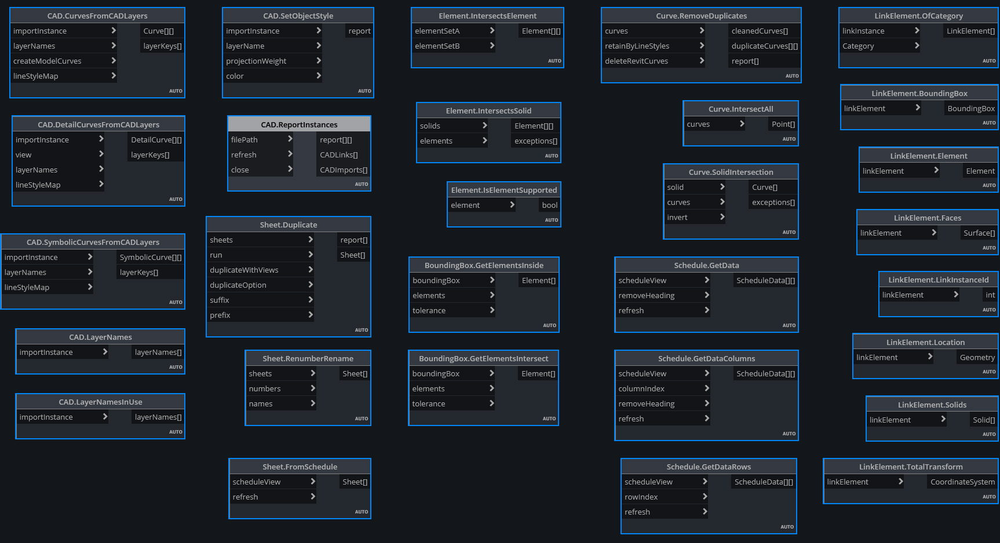
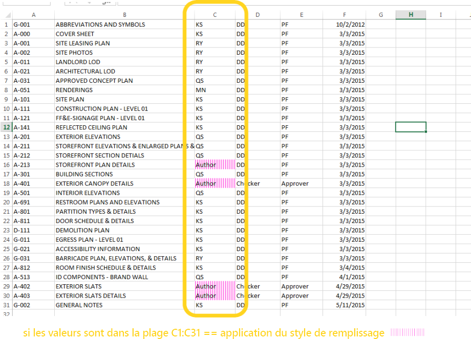
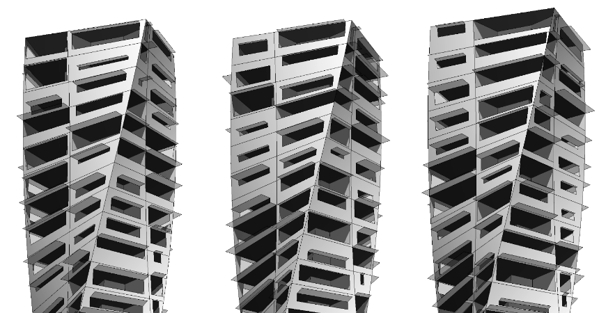

## Packages dynamo
Voici la liste de certains des packages les plus populaires de la communauté Dynamo. Merci aux développeurs de compléter la liste. N'oubliez pas que [Dynamo Primer](https://github.com/DynamoDS/DynamoPrimer ) est Open Source.

<table>
   <tr>
      <td width="10%">
         </img>
      </td>
      <td width="55%">
         <b>ARCHI-LAB</b>
      </td>
      <td>
         <a href="http://archi-lab.net/">Consulter le site officiel d'archi-lab
      </td>
      </a>
   </tr>
   <tr>
      <td colspan="2">archi-lab est un ensemble de plus de 50 packages personnalisés qui étendent considérablement la capacité de Dynamo à interagir avec Revit. Les nœuds contenus dans le package archi-lab varient d'une liste d'opérations de base à des nœuds Analysis Visualization Framework avancés pour Revit. </td>
      <td>
         </img>
      </td>
   </tr>
</table>

<table>
  <tr>
    <td width="10%"></img></td>
    <td width="55%"><b>BIMORPH NODES</b></td>
    <td><a href="https://bimorph.com/bimorph-nodes/">Consulter le dictionnaire BimorphNodes</td></a>
  </tr>
  <tr>
    <td colspan="2">BimorphNodes est un ensemble polyvalent de nœuds utilitaires puissants. Le package comprend notamment des nœuds d'intersection de géométrie et de détection des conflits très efficaces, des nœuds de conversion de courbes ImportInstance (CAO), et des collecteurs d'éléments liés qui résolvent les limitations dans l'API Revit. Pour en savoir plus sur la gamme complète des nœuds disponibles, consultez le dictionnaire BimorphNodes.</td>
    <td></img></td>
  </tr>
</table>

<table>
  <tr>
    <td width="10%"></img></td>
    <td width="55%"><b>BUMBLEBEE FOR DYNAMO</b></td>
    <td><a href="http://archi-lab.net/bumblebee-dynamo-and-excel-interop/">Consulter le site officiel de BumbleBee</td></a>
  </tr>
  <tr>
    <td colspan="2">Bumblebee est un plug-in d'interopérabilité avec Excel et Dynamo qui améliore considérablement la capacité de Dynamo à lire et à écrire des fichiers Excel. </td>
    <td></img></td>
  </tr>
</table>

<table>
  <tr>
    <td width="10%"></img></td>
    <td width="55%"><b>CLOCKWORK FOR DYNAMO</b></td>
    <td><a href="https://github.com/CAAD-RWTH/ClockworkForDynamo">Consulter l'outil Clockwork for Dynamo sur GitHub</td></a>
  </tr>
  <tr>
    <td colspan="2">Clockwork est un ensemble de nœuds personnalisés dédiés à l'environnement de programmation visuelle Dynamo. Il contient un grand nombre de nœuds liés à Revit, mais également de nombreux nœuds permettant d'effectuer d'autres opérations, telles que la gestion des listes, les opérations mathématiques, les opérations de chaîne, les conversions d'unités, les opérations géométriques (principalement des zones de délimitation, des maillages, des plans, des points, des surfaces, des UV et des vecteurs) et la création de panneaux. </td>
    <td></img></td>
  </tr>
</table>

<table>
  <tr>
    <td width="10%"></img></td>
    <td width="55%"><b>DATA|SHAPES</b></td>
    <td><a href="https://github.com/MostafaElAyoubi/Data-shapes">Consulter l'outil Data|Shapes sur GitHub</td></a>
  </tr>
  <tr>
    <td colspan="2"> DataShapes est un package qui vise à étendre les fonctionnalités utilisateur des scripts Dynamo. Son objectif est d'ajouter des fonctionnalités supplémentaires au lecteur Dynamo. Pour en savoir plus, consultez le site https://data-shapes.net/. Vous souhaitez créer de fantastiques workflows de lecteur Dynamo ? Utilisez ce module.</td>
    <td></img></td>
  </tr>
</table>

<table>
  <tr>
    <td width="10%"></img></td>
    <td width="55%"><b>DYNAMO SAP</b></td>
    <td><a href="http://core.thorntontomasetti.com/dynamosap-is-now-open-source/">Consulter le projet DynamoSAP sur Core Studio</td></a>
  </tr>
  <tr>
    <td colspan="2">DynamoSAP est une interface paramétrique pour SAP2000 reposant sur Dynamo. Le projet permet aux concepteurs et aux ingénieurs de créer et d'analyser de manière générative des systèmes de structures dans SAP, en utilisant Dynamo pour piloter le modèle SAP. Le projet prescrit quelques workflows courants, décrits dans les fichiers d'exemple inclus, et offre une large gamme d'opportunités d'automatisation des tâches types dans SAP. </td>
    <td></img></td>
  </tr>
</table>

<table>
  <tr>
    <td width="10%"></img></td>
    <td width="55%"><b>DYNAMO UNFOLD</b></td>
    <td><a href="https://github.com/mjkkirschner/DynamoUnfold">Consulter l'outil DynamoUnfold sur GitHub</td></a>
  </tr>
  <tr>
    <td colspan="2">Cette bibliothèque étend les fonctionnalités de Dynamo/Revit en permettant aux utilisateurs de déployer la géométrie de surface et de polysurface. La bibliothèque permet aux utilisateurs de convertir d'abord des surfaces en topologie de maillage par approximation planaire, puis de les déployer à l'aide des outils de protogéométrie dans Dynamo. Ce package inclut également des nœuds expérimentaux ainsi que quelques fichiers d'exemple de base. </td>
    <td></img></td>
  </tr>
</table>

<table>
  <tr>
    <td width="10%"></img></td>
    <td width="55%"><b>DYNASTRATOR</b></td>
    <td><a href="http://dynamopackages.com/">Télécharger Dynastrator dans le gestionnaire de package</td></a>
  </tr>
  <tr>
    <td colspan="2">Importez des motifs vectoriels à partir d'Illustrator ou du Web à l'aide du fichier .svg.  Cela vous permet d'importer dans Dynamo des dessins créés manuellement pour des opérations paramétriques. </td>
    <td></img></td>
  </tr>
</table>

<table>
  <tr>
    <td width="10%"></img></td>
    <td width="55%"><b>ENERGY ANALYSIS FOR DYNAMO</b></td>
    <td><a href="https://github.com/tt-acm/EnergyAnalysisForDynamo">Consulter le projet Energy Analysis for Dynamo sur GitHub</td></a>
  </tr>
  <tr>
    <td colspan="2">Energy Analysis for Dynamo permet de modéliser l'énergie paramétrique et d'effectuer des workflows d'analyse énergétique d'un bâtiment entier dans Dynamo 0.8. Energy Analysis for Dynamo permet à l'utilisateur de configurer le modèle énergétique dans Autodesk Revit, de le soumettre à Green Building Studio pour l'analyse d'énergie DOE2 et d'examiner les résultats renvoyés par l'analyse. Le module est développé par le studio CORE de Thornton Tomasetti.  </td>
    <td></img></td>
  </tr>
</table>

<table>
  <tr>
    <td width="10%"></img></td>
    <td width="55%"><b>FIREFLY FOR DYNAMO</b></td>
    <td><a href="http://dynamopackages.com/">Télécharger Firefly dans le gestionnaire de package Dynamo</td></a>
  </tr>
  <tr>
    <td colspan="2">Firefly est un ensemble de nœuds qui permettent à Dynamo de communiquer avec des périphériques d'entrée/de sortie, comme le micro contrôleur Arduino. Étant donné que le flux de données est "actif", Firefly ouvre de nombreuses opportunités de prototypage interactif entre les environnements numérique et physique, via des webcams, des téléphones mobiles, des contrôleurs de jeu, des capteurs, etc. </td>
    <td></img></td>
  </tr>
</table>

<table>
  <tr>
    <td width="10%"></img></td>
    <td width="55%"><b>LUNCHBOX FOR DYNAMO</b></td>
    <td><a href="http://provingground.io/tools/lunchbox/">Télécharger Lunchbox for Dynamo depuis Proving Ground</td></a>
  </tr>
  <tr>
    <td colspan="2">LunchBox est un ensemble de nœuds de gestion des données et de géométrie réutilisables. Les outils ont été testés avec Dynamo 0.8.1 et Revit 2016. L'outil inclut des nœuds pour la création de panneaux de surface, la géométrie, la collecte de données Revit, etc.</td>
    <td></img></td>
  </tr>
</table>

<table>
  <tr>
    <td width="10%"></img></td>
    <td width="55%"><b>MANTIS SHRIMP</b></td>
    <td><a href="http://archi-lab.net/mantis-shrimp-getting-started/">Consulter le site officiel de Mantis Shrimp</td></a>
  </tr>
  <tr>
    <td colspan="2">Mantis Shrimp est un projet d'interopérabilité qui vous permet d'importer facilement la géométrie de Grasshopper ou Rhino dans Dynamo.</td>
    <td></img></td>
  </tr>
</table>

<table>
  <tr>
    <td width="10%"></img></td>
    <td width="55%"><b>MESH TOOLKIT</b></td>
    <td><a href="https://github.com/DynamoDS/Dynamo/wiki/Dynamo-Mesh-Toolkit">Consulter l'outil Dynamo Mesh Toolkit sur GitHub</td></a>
  </tr>
  <tr>
    <td colspan="2">Le package Mesh Toolkit de Dynamo fournit un grand nombre d'outils utiles à la conception d'une géométrie de maillage. Les fonctionnalités de ce package permettent d'importer des maillages à partir de formats de fichiers externes, de générer des maillages à partir d'objets de géométrie Dynamo existants et de générer manuellement des maillages à l'aide de sommets et d'informations de connectivité. En outre, ce package comprend des outils permettant de modifier et de réparer la géométrie de maillage. </td>
    <td></img></td>
  </tr>
</table>

<table>
  <tr>
    <td width="10%"></img></td>
    <td width="55%"><b>OPTIMO</b></td>
    <td><a href="https://github.com/BPOpt/Optimo/wiki/0_-Home">Consulter l'outil Optimo sur GitHub</td></a>
  </tr>
  <tr>
    <td colspan="2">Optimo permet aux utilisateurs de Dynamo d'optimiser les problèmes de conception auto-définis en utilisant différents algorithmes révolutionnaires. Les utilisateurs peuvent définir l'objectif ou l'ensemble des objectifs du problème, ainsi que des fonctions de qualité spécifiques. </td>
    <td></img></td>
  </tr>
</table>

<table>
  <tr>
    <td width="10%"></img></td>
    <td width="55%"><b>RHYNAMO</b></td>
    <td><a href="https://bitbucket.org/caseinc/rhynamo">Consulter l'outil Rhynamo Bitbucket</td></a>
  </tr>
  <tr>
    <td colspan="2">La bibliothèque de nœuds Rhynamo permet aux utilisateurs de lire et d'écrire des fichiers Rhino 3DM dans Dynamo. Rhynamo convertit la géométrie Rhino en géométrie Dynamo utilisable grâce à la bibliothèque OpenNURBS de McNeel, qui permet d'échanger facilement des géométries et des données entre Rhino et Revit. Ce package contient également des nœuds expérimentaux qui permettent un accès "en direct" à la ligne de commande Rhino. </td>
    <td></img></td>
  </tr>
</table>

<table>
  <tr>
    <td width="10%"></img></td>
    <td width="55%"><b>RHYTHM</b></td>
    <td><a href="https://github.com/sixtysecondrevit/RhythmForDynamo">Consulter Rhythm sur GitHub</td></a>
  </tr>
  <tr>
    <td colspan="2"> À première vue, Rhythm n'a rien de spécial. Il ne comprend aucun code sophistiqué ou autre élément de cette nature. Cependant, Rhythm est le résultat d'expérience et de réflexion. Ce package aide les utilisateurs à conserver le rythme dans Revit avec Dynamo. Rhythm se compose principalement de nœuds Dynamo prêts à l'emploi utilisés de manière intelligente lorsqu'ils s'appliquent à l'environnement Revit. </td>
    <td></img></td>
  </tr>
</table>
