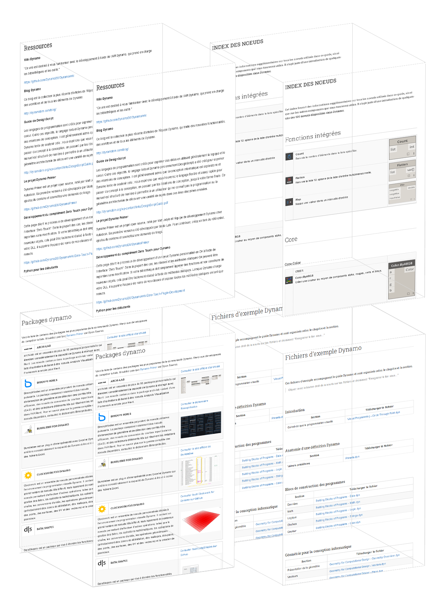

# Annexe A : Ressources

Dans cette section, vous trouverez des ressources supplémentaires pour repousser les limites de Dynamo. Nous avons également ajouté un index de nœuds importants, un ensemble de packages utiles et un référentiel des fichiers d'exemple de ce guide. N'hésitez pas à ajouter des informations dans cette section. N'oubliez pas que [Dynamo Primer](https://github.com/DynamoDS/DynamoPrimer) est open source. 

