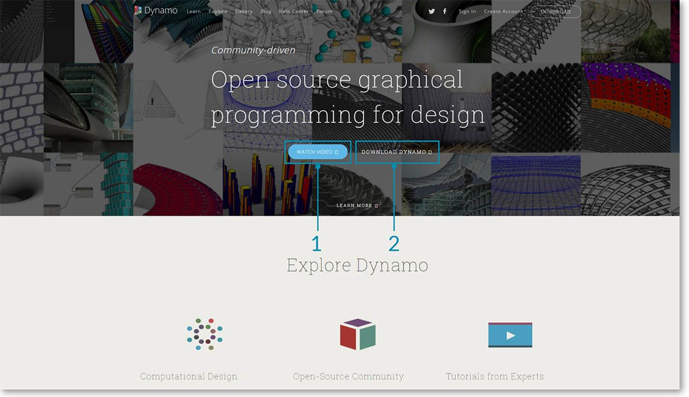
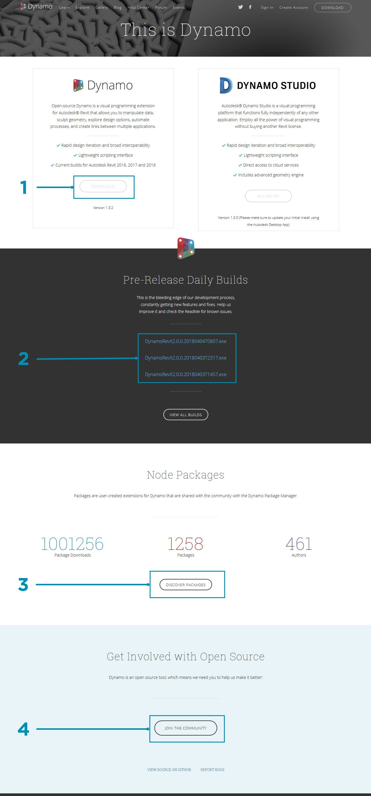
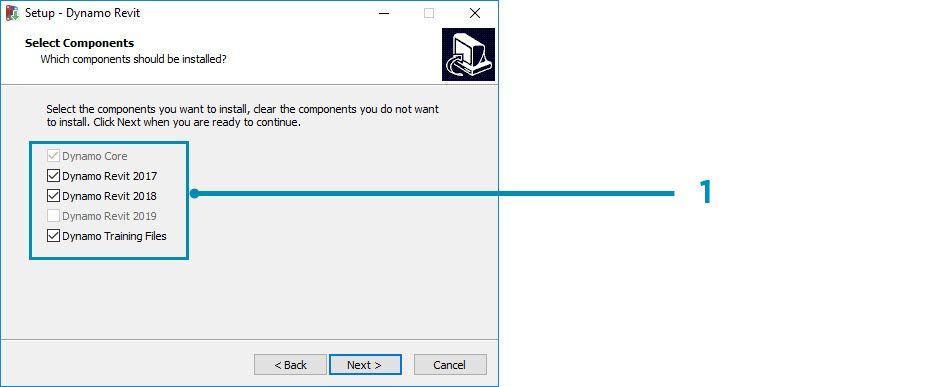
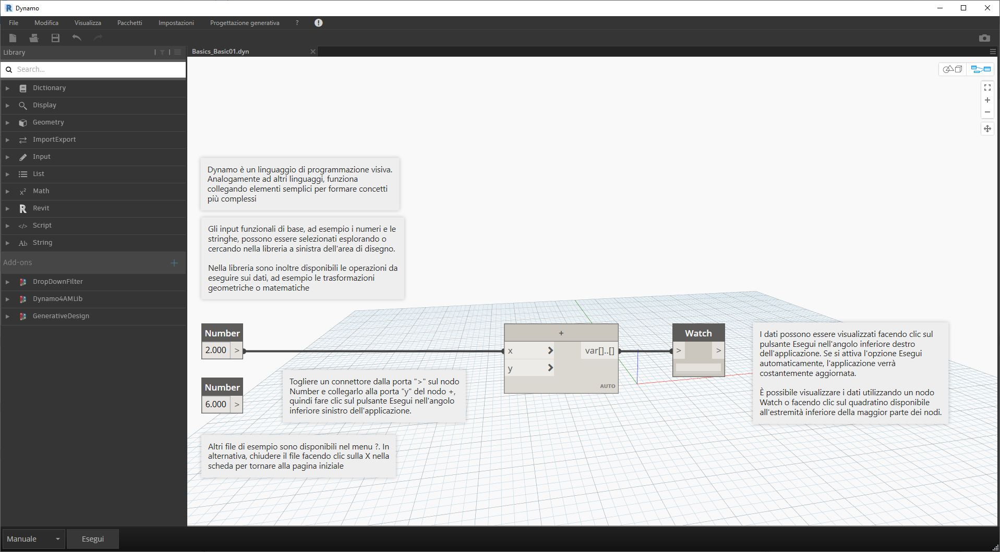

## Installazione e avvio di Dynamo

Dynamo è un progetto di sviluppo open source attivo con programmi di installazione scaricabili sia per la versione ufficiale che per la versione pre-release, ovvero versioni "di build giornaliera". Scaricare la versione ufficiale per iniziare o contribuire a ciò che Dynamo diventa attraverso le build giornaliere o il progetto su GitHub.

### Download

Per scaricare la versione ufficiale di Dynamo, visitare il [sito Web di Dynamo](http://dynamobim.com/). Avviare immediatamente il download facendo clic sulla home page o accedere alla pagina di download dedicata.

> 1. Guardare un video sulla progettazione computazionale con Dynamo for Architecture.
2. In alternativa, accedere alla pagina di download.

Qui è possibile scaricare le versioni di sviluppo "bleeding edge" o passare al progetto [Dynamo su Github](https://github.com/DynamoDS/Dynamo).

> 1. Scaricare il programma di installazione della release ufficiale.
2. Scaricare i programmi di installazione della build giornaliera.
3. Scoprire i pacchetti personalizzati della comunità di sviluppatori.
4. Partecipare allo sviluppo di Dynamo su GitHub.

### Installazione

Individuare la directory del programma di installazione scaricato ed eseguire il file eseguibile. Durante il processo di installazione, è possibile personalizzare i componenti che verranno installati.

> 1. Selezionare i componenti da installare.

Qui è necessario decidere se includere i componenti che collegano Dynamo ad altre applicazioni installate, ad esempio Revit. Per ulteriori informazioni sulla piattaforma Dynamo, vedere il **capitolo 1.2**.

### Avvio

Per avviare Dynamo, individuare \Programmi\Dynamo\Dynamo Revit\x.y, quindi selezionare DynamoSandbox.exe. In questo modo verrà aperta la versione indipendente e verrà visualizzata la *pagina iniziale* di Dynamo. In questa pagina sono presenti i menu e la barra degli strumenti standard, nonché una raccolta di collegamenti che consentono di accedere alle funzionalità dei file o a risorse aggiuntive.

> 1. FILE: consente di aprire un nuovo file o uno esistente.
2. RECENTI: consente scorrere i file recenti.
3. BACKUP: consente di accedere ai backup.
4. CHIEDI: consente di ottenere l'accesso diretto al forum degli utenti o al sito Web di Dynamo.
5. RIFERIMENTO: consente di approfondire con risorse per l'apprendimento aggiuntive.
6. CODICE: consente di partecipare al progetto di sviluppo open source.
7. ESEMPI: consente di controllare gli esempi forniti con l'installazione.

Aprire il primo file di esempio per aprire la prima area di lavoro e verificare che Dynamo funzioni correttamente. Fare clic su Samples > Basics > **Basics_Basic01.dyn**.

> 1. Verificare che la barra di esecuzione sia impostata su "Automatica" o fare clic su Esegui.
2. Seguire le istruzioni e collegare il nodo **Number** al nodo **+**.
3. Verificare che questo nodo di controllo mostri un risultato.

Se il file viene caricato correttamente, si dovrebbe essere in grado di eseguire il primo programma visivo con Dynamo.

