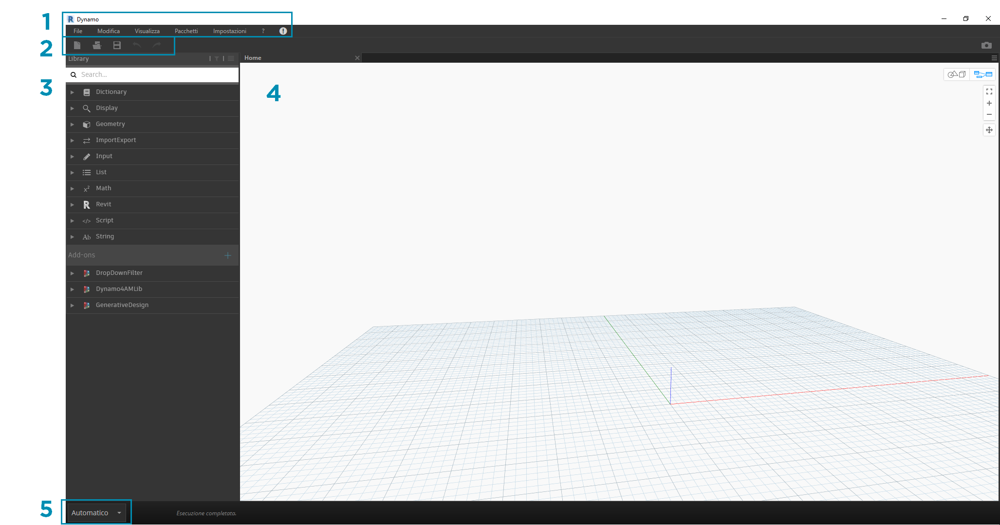
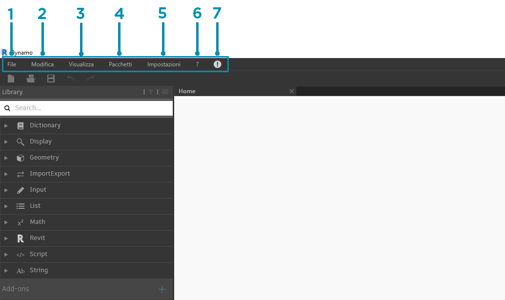
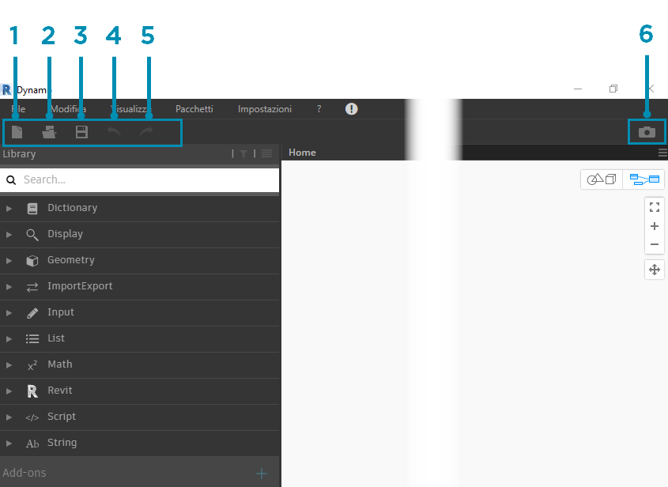
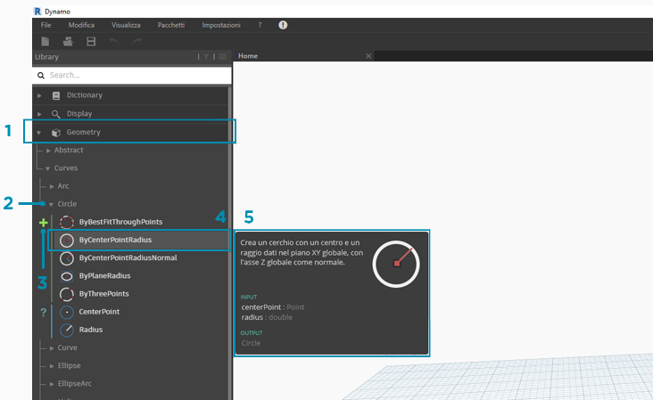
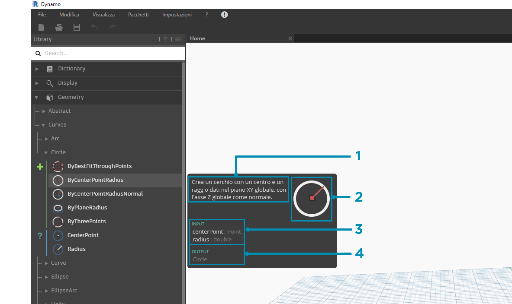
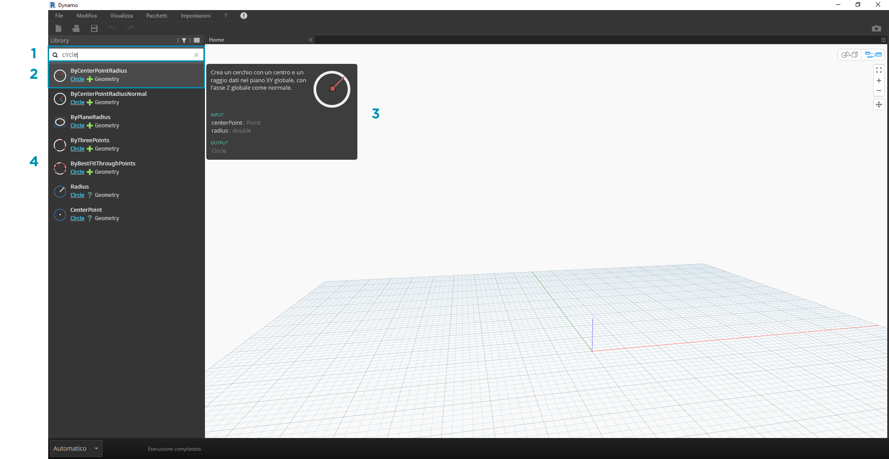
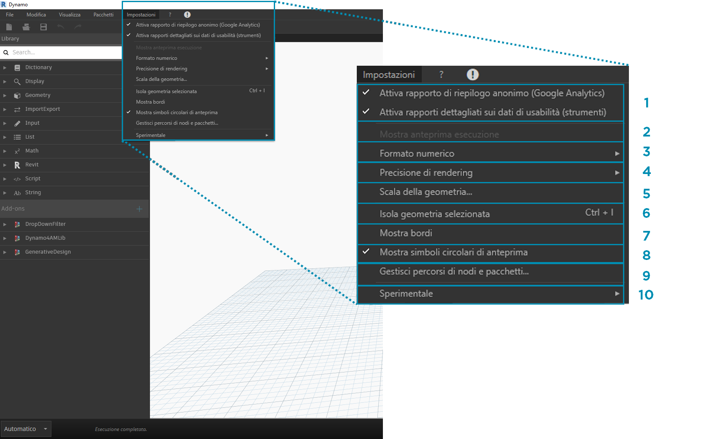
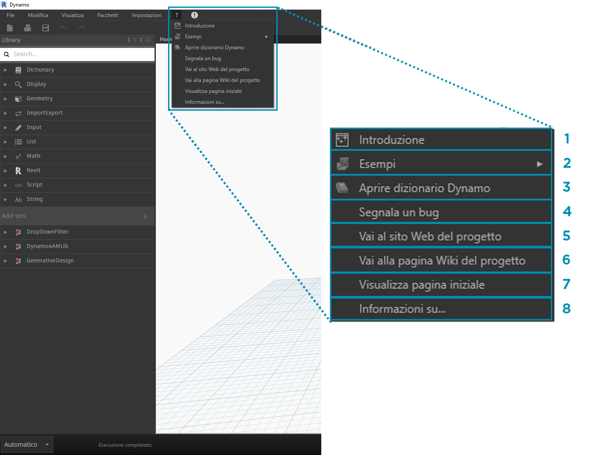

## Interfaccia utente di Dynamo

L'interfaccia utente di Dynamo è organizzata in cinque regioni principali, la più grande delle quali è l'area di lavoro dove si compongono i programmi visivi.

> 1. Menu
2. Barra degli strumenti
3. Libreria
4. Area di lavoro
5. Barra di esecuzione

Verrà esaminata più in dettaglio l'interfaccia utente e si esploreranno le funzionalità di ogni regione.

#### Menu

I menu a discesa sono un'ottima posizione per trovare alcune delle funzionalità di base dell'applicazione Dynamo. Come per la maggior parte del software Windows, le azioni relative alla gestione di file e operazioni per la selezione e la modifica del contenuto sono disponibili nei primi due menu. I menu rimanenti sono più specifici di Dynamo.

> 1. File
2. Modifica
3. Visualizza
4. Pacchetti
5. Impostazioni
6. Guida
7. Notifiche

#### Barra degli strumenti

La barra degli strumenti di Dynamo contiene una serie di pulsanti per l'accesso rapido ai file, nonché i comandi Annulla [CTRL+Z] e Ripeti [CTRL+Y]. All'estrema destra è presente un altro pulsante che consente di esportare un'istantanea dell'area di lavoro, che è estremamente utile per la documentazione e la condivisione.

> 1. Nuovo: consente di creare un nuovo file .dyn.
2. Apri: consente di aprire un file .dyn (area di lavoro) o .dyf (nodo personalizzato) esistente.
3. Salva/Salva con nome: consente di salvare il file .dyn o .dyf attivo.
4. Annulla: consente di annullare l'ultima azione.
5. Ripeti: consente di ripetere l'azione successiva.
6. Esporta area di lavoro come immagine: consente di esportare l'area di lavoro visibile come file PNG.

#### Libreria

La libreria contiene tutti i nodi caricati, compresi i nodi di default forniti con l'installazione, nonché eventuali pacchetti o nodi personalizzati caricati aggiuntivi. I nodi della libreria sono organizzati in modo gerarchico all'interno di librerie, categorie e, dove appropriato, sottocategorie a seconda che i nodi **creino** dei dati, eseguano un'**azione** o una **query** sui dati.

##### Navigazione

Per default, la **libreria** conterrà otto categorie di nodi. **Core** e **Geometry** sono menu di grande utilità per iniziare ad esplorare poiché contengono la maggior quantità di nodi. Sfogliare queste categorie è il modo più rapido per comprendere la gerarchia di ciò che è possibile aggiungere all'area di lavoro e il modo migliore per scoprire nuovi nodi non utilizzati in precedenza.

> Ora ci si concentrerà sulla raccolta di default di nodi, ma notare che questa libreria verrà estesa con nodi personalizzati, librerie aggiuntive e Package Manager in un secondo momento.

> 1. Dictionary
2. Display
3. Geometry
4. ImportExport
5. Input
6. List
7. Matches
8. Revit
9. Script
10. String
11. Add-ons

Sfogliare la libreria facendo clic sui menu. Fare clic su Geometry > Curves > Circle. Notare la nuova parte del menu che viene visualizzata e in particolare le etichette **Create** e **Query**.

> 1. Libreria
2. Categoria
3. Sottocategoria: Create/Actions/Query
4. Nodo
5. Descrizione e proprietà del nodo: viene visualizzata quando si posiziona il cursore del mouse sull'icona del nodo.

Dallo stesso menu Circle, posizionare il cursore del mouse su **ByCenterPointRadius**. La finestra mostra informazioni più dettagliate sul nodo oltre al nome e all'icona. Questo offre un modo rapido per comprendere cosa fa il nodo, cosa richiederà per gli input e cosa verrà fornito come output.

> 1. Descrizione: descrizione con linguaggio normale del nodo
2. Icona: versione più grande dell'icona nel menu Libreria
3. Input: nome, tipo di dati e struttura di dati
4. Output: tipo di dati e struttura

##### Ricerca

Se si conosce con relativa specificità il nodo che si desidera aggiungere all'area di lavoro, il campo **Cerca** è il migliore strumento. Quando non si modificano le impostazioni o si specificano valori nell'area di lavoro, il cursore è sempre presente in questo campo. Se si inizia a digitare, nella libreria di Dynamo viene mostrata la corrispondenza più adatta selezionata (con il percorso di navigazione relativo a dove si trova nelle categorie del nodo) e un elenco di corrispondenze alternative per la ricerca. Quando si preme INVIO o si fa clic sull'elemento nel browser troncato, il nodo evidenziato viene aggiunto al centro dell'area di lavoro.

> 1. Campo di ricerca
2. Il risultato più adatto/selezionato
3. Corrispondenze alternative

### Impostazioni

Dalle impostazioni geometriche a quelle utente, queste opzioni sono disponibili nel menu **Impostazioni**. Qui è possibile scegliere di acconsentire o rifiutare esplicitamente la condivisione dei dati utente al fine di migliorare Dynamo, nonché definire la precisione con punti decimali e la qualità di rendering della geometria dell'applicazione.

> 1. Attivazione della generazione di rapporti: sono opzioni per la condivisione dei dati utente per migliorare Dynamo.
2. Mostra anteprima esecuzione: consente di visualizzare in anteprima lo stato di esecuzione del grafico. I nodi pianificati per l'esecuzione verranno evidenziati nel grafico.
3. Opzioni di Formato numero: consentono di modificare le impostazioni del documento per i decimali.
4. Precisione di rendering: consente di alzare o abbassare la qualità di rendering del documento.
5. Scala della geometria: consente di selezionare l'intervallo della geometria su cui si sta lavorando.
6. Isola geometria selezionata: consente di isolare la geometria di sfondo in base alla selezione del nodo.
7. Mostra bordi: consente di attivare/disattivare i bordi della geometria 3D.
8. Mostra simboli circolari di anteprima: consente di attivare/disattivare i simboli circolari di anteprima dei dati sotto i nodi.
9. Gestisci percorsi di nodi e pacchetti: consente di gestire i percorsi di file per mostrare nodi e pacchetti nella libreria.
10. Sperimentale: consente di utilizzare le funzionalità beta nuove di Dynamo.

### Guida

Se si è bloccati, consultare il menu **?**. Qui è possibile trovare i file di esempio forniti con l'installazione, nonché accedere a uno dei siti Web di riferimento di Dynamo tramite il browser Internet. Se necessario, verificare la versione di Dynamo installata e se è aggiornata mediante l'opzione **Informazioni su**.

> 1. Introduzione: mostra una breve introduzione all'utilizzo di Dynamo.
2. Esempi: fornisce file di esempio di riferimento.
3. Aprire dizionario Dynamo: offre una risorsa con documentazione su tutti i nodi.
4. Segnala un bug: consente di aprire un problema in GitHub.
5. Vai al sito Web del progetto: consente di visualizzare il progetto Dynamo in GitHub.
6. Vai alla pagina Wiki del progetto: consente di visitare la pagina Wiki per informazioni sullo sviluppo mediante l'API di Dynamo, gli strumenti e le librerie di supporto.
7. Visualizza pagina iniziale: consente di tornare alla pagina iniziale di Dynamo quando ci si trova all'interno di un documento.
8. Informazioni su: mostra i dati sulla versione di Dynamo.

