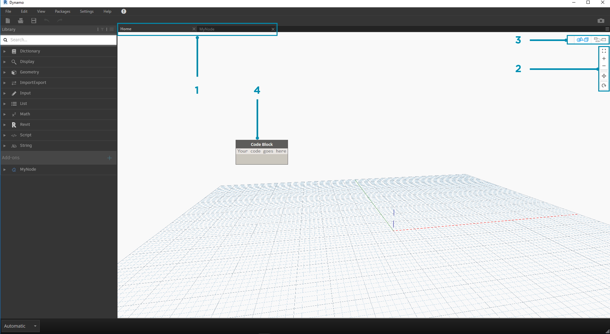
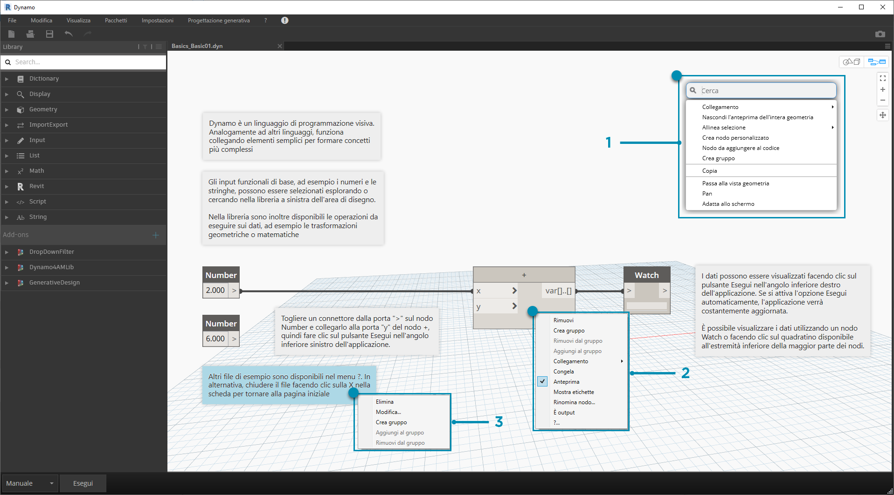
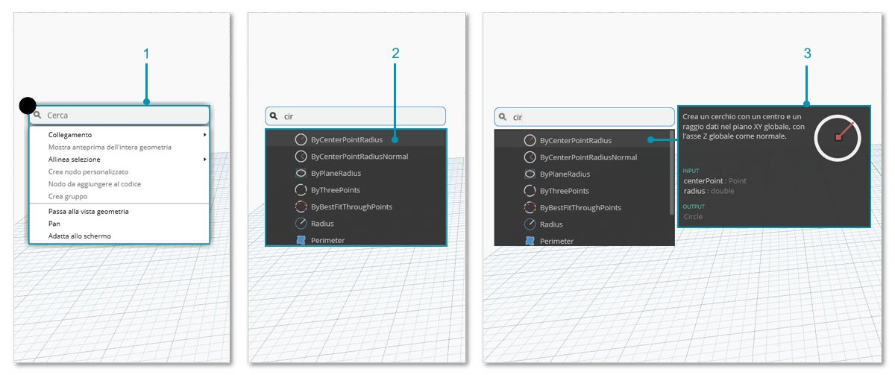

## Area di lavoro

L'**area di lavoro** di Dynamo è dove si sviluppano i programmi visivi, ma è anche dove viene visualizzata l'anteprima di qualsiasi geometria risultante. Sia che si stia lavorando in un'area di lavoro iniziale sia in un nodo personalizzato, è possibile spostarsi con il mouse o i pulsanti in alto a destra. Alternando le varie modalità all'altra in basso a destra, si passa all'anteprima in cui navigare.

> Nota: i nodi e la geometria presentano un ordine di visualizzazione che consente di eseguire il rendering degli oggetti uno sopra l'altro. Ciò può creare confusione durante l'aggiunta di più nodi in sequenza, poiché potrebbero essere sottoposti a rendering nella stessa posizione nell'area di lavoro.

> 1. Schede
2. Pulsanti di zoom/panoramica
3. Modalità anteprima
4. Doppio clic sull'area di lavoro

### Schede

La scheda dell'area di lavoro attiva consente di individuare e modificare il programma. Quando si apre un nuovo file, per default si apre una nuova area di lavoro **iniziale**. È inoltre possibile aprire una nuova area di lavoro del **nodo personalizzato** dal menu File o mediante l'opzione visualizzata facendo clic con il pulsante destro del mouse *Nuovo nodo da selezione* quando si selezionano i nodi (ulteriori informazioni su questa funzionalità saranno fornite più avanti).

> Nota: è possibile tenere aperta una sola area di lavoro iniziale alla volta. Tuttavia, più aree di lavoro di nodi personalizzati potrebbero essere aperte in schede aggiuntive.

### Grafico e navigazione nell'anteprima 3D

In Dynamo, il grafico e i risultati 3D del grafico (se si sta creando la geometria) vengono entrambi sottoposti a rendering nell'area di lavoro. Per default, il grafico è l'anteprima attiva, pertanto utilizzando i pulsanti di navigazione o il pulsante centrale del mouse per eseguire la panoramica e lo zoom ci si sposterà nel grafico. È possibile alternare le anteprime attive in tre modi:

> 1. Pulsanti di attivazione/disattivazione dell'anteprima nell'area di lavoro
2. Clic con il pulsante destro del mouse nell'area di lavoro e selezionando *Passa alla _vista geometria...*
3. Tasto di scelta rapida (CTRL+B)

La modalità di navigazione nell'anteprima 3D offre anche la possibilità di **manipolazione diretta** dei punti, come evidenziato in [Introduzione](http://primer.dynamobim.org/02_Hello-Dynamo/2-6_the_quick_start_guide.html).

### Zoom per la ricentratura

È possibile eseguire facilmente la panoramica, lo zoom e la rotazione liberamente attorno ai modelli nella modalità di navigazione nell'anteprima 3D. Tuttavia, per eseguire lo zoom in modo specifico di un oggetto creato da un nodo della geometria, è possibile utilizzare l'icona dello zoom di tutta la vista con un singolo nodo selezionato.

> 1. Selezionare il nodo corrispondente alla geometria che centrerà la vista.
2. Passare alla navigazione nell'anteprima 3D.

> 1. Fare clic sull'icona dello zoom di tutta la vista in alto a destra.
2. La geometria selezionata verrà centrata all'interno della vista.

### Ciao mouse!

In base alla modalità di anteprima attiva, i pulsanti del mouse agiranno in modo diverso. In generale, fare clic con il pulsante sinistro del mouse consente di selezionare e specificare gli input, fare clic con il pulsante destro del mouse consente di accedere alle opzioni e fare clic con il pulsante centrale del mouse consente di spostarsi nell'area di lavoro. Facendo clic con il pulsante destro del mouse, verranno visualizzate opzioni basate sul contesto in cui si sta facendo clic.

> 1. Fare clic con il pulsante destro del mouse sull'area di lavoro.
2. Fare clic con il pulsante destro del mouse su un nodo.
3. Fare clic con il pulsante destro del mouse su una nota.

Di seguito è riportata una tabella di interazioni del mouse per ogni anteprima:

|**Azione del mouse**|**Anteprima del grafico**|**Anteprima 3D**|
| -- | -- | -- |
|Clic con il pulsante sinistro del mouse|Selezionare|N/A|
|Clic con il pulsante destro del mouse|Menu contestuale|Opzioni di zoom|
|Clic con il pulsante centrale del mouse|Panoramica|Panoramica|
|Scorrimento|Zoom avanti/Zoom indietro|Zoom avanti/Zoom indietro|
|Doppio clic|Creazione del blocco di codice|N/A|

### Ricerca nell'area di disegno

L'utilizzo della ricerca nell'area di disegno consente di aggiungere una notevole velocità al workflow di Dynamo, fornendo l'accesso alle descrizioni dei nodi e alle descrizioni comando senza allontanarsi dal posto occupato sul grafico. Facendo semplicemente clic con il pulsante destro del mouse, è possibile accedere a tutte le utili funzionalità di ricerca nella libreria da qualsiasi punto in cui si lavora nell'area di disegno.

> 1. Fare clic con il pulsante destro del mouse in un punto qualsiasi dell'area di disegno per visualizzare la funzionalità di ricerca. Quando la barra di ricerca è vuota, l'elenco a discesa sarà un menu di anteprima.
2. Mentre si digita nella barra di ricerca, il menu a discesa verrà aggiornato costantemente per mostrare i risultati della ricerca più rilevanti.
3. Posizionare il cursore del mouse sui risultati della ricerca per visualizzare le descrizioni e le descrizioni comando corrispondenti.

## Semplifica layout nodi

Mantenere organizzata l'area di disegno di Dynamo diventa sempre più importante quando i file aumentano di complessità. Sebbene sia disponibile lo strumento **Allinea selezione** per utilizzare piccole quantità di nodi selezionati, Dynamo include anche lo strumento **Semplifica layout nodi** per aiutare a ottenere una pulizia generale dei file.

#### Prima della correzione del posizionamento dei nodi

> 1. Selezionare i nodi da organizzare automaticamente oppure lasciarli tutti deselezionati per correggere il posizionamento di tutti i nodi nel file.
2. La funzionalità Semplifica layout nodi si trova nella scheda Modifica.
#### Dopo la correzione del posizionamento dei nodi

3. I nodi verranno ridistribuiti e allineati automaticamente, correggendo il posizionamento di eventuali nodi sfalsati o sovrapposti e allineandoli con nodi adiacenti.

