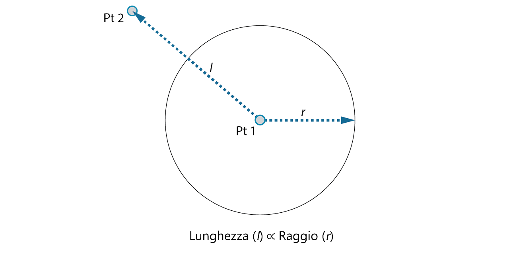
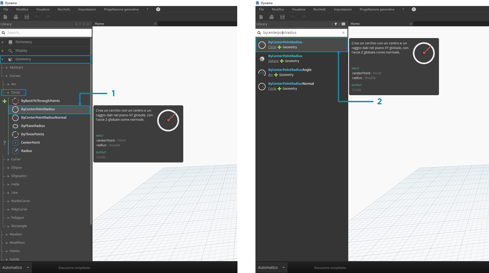

## GUIDA INTRODUTTIVA

Ora che è stata acquisita familiarità con il layout dell'interfaccia e con l'esplorazione dell'area di lavoro, il passaggio successivo consiste nel comprendere il workflow tipico per lo sviluppo di un grafico in Dynamo. Per iniziare, creare un cerchio di dimensioni dinamiche, quindi creare una serie di cerchi con raggi variabili.

### Definizione di obiettivi e relazioni

Prima di aggiungere qualsiasi elemento all'area di lavoro di Dynamo, è fondamentale comprendere appieno ciò che si sta cercando di ottenere e quali saranno le relazioni significative. Tenere presente che ogni volta che si collegano due nodi, tra di essi viene creato un collegamento esplicito; è possibile modificare il flusso di dati in un secondo momento, ma una volta collegati, si è vincolati a tale relazione. In questo esercizio si desidera creare un cerchio (*obiettivo*) in cui l'input del raggio è definito dalla distanza rispetto ad un punto vicino (*relazione*).



> Un punto che definisce una relazione basata sulla distanza viene comunemente chiamato "attrattore". Qui la distanza dal punto attrattore verrà utilizzata per specificare la dimensione del cerchio.

### Aggiunta di nodi all'area di lavoro

Ora che sono stati definiti gli obiettivi e le relazioni, è possibile iniziare a creare il grafico. Sono necessari i nodi che rappresenteranno la sequenza di azioni che verranno eseguite da Dynamo. Poiché si sta cercando di creare un cerchio, iniziare individuando un nodo che rispetti questo requisito. Utilizzando il campo di ricerca o sfogliando nella libreria, si troverà che esistono più modi per creare un cerchio.



> 1. Geometry > Curves > Circle > **Circle.ByPointRadius**
2. Cerca > ByCenterPointRadius...

Aggiungere il nodo **Circle.ByPointRadius** all'area di lavoro facendo clic su di esso nella libreria. In questo modo, il nodo verrà aggiunto al centro dell'area di lavoro.


> 1. Il nodo Circle.ByPointandRadius nella libreria
2. Facendo clic sul nodo nella libreria, questo viene aggiunto all'area di lavoro

Saranno inoltre necessari i nodi **Point.ByCoordinates**, **Number** e **Number Slider**.


> 1. Geometry > Points > Point > **Point.ByCoordinates**
2. Geometry > Geometry > **Geometry.DistanceTo**
3. Core > Input > **Number**
4. Core > Input > **Number Slider**

### Collegamento di nodi con fili

Ora che sono presenti alcuni nodi, è necessario collegare le porte dei nodi con dei fili. Questi collegamenti definiranno il flusso di dati.


> 1. Da **Number** a **Point.ByCoordinates**
2. Da **Number Slider** a **Point.ByCoordinates**
3. Da **Point.ByCoordinates** (2) a **Geometry.DistanceTo**
4. Da **Point.ByCoordinates** e **Geometry.DistanceTo** a **Circle.ByCenterPointRadius**

### Esecuzione del programma

Una volta definito il flusso del programma, è sufficiente comunicare a Dynamo di eseguirlo. Una volta eseguito il programma (automaticamente o quando si fa clic su Esegui in modalità Manuale), i dati passeranno attraverso i fili e i risultati dovrebbero essere visualizzati nell'anteprima 3D.


> 1. (Fare clic su Esegui): se la barra di esecuzione è in modalità Manuale, è necessario fare clic su Esegui per eseguire il grafico.
2. Anteprima del nodo: se si posiziona il cursore del mouse sopra la casella nell'angolo inferiore destro di un nodo, verrà visualizzata una finestra popup dei risultati.
3. Anteprima 3D: se uno dei nodi crea la geometria, verrà visualizzata nell'anteprima 3D.
4. Indica la geometria di output sul nodo della creazione.

### Aggiunta di dettagli

Se il programma funziona, nell'anteprima 3D dovrebbe essere visualizzato un cerchio che passa attraverso il punto attrattore. Questa operazione è ottima, ma potrebbe essere utile aggiungere ulteriori dettagli o più controlli. Regolare l'input sul nodo circolare in modo da poter calibrare l'influenza sul raggio. Aggiungere un altro **Number Slider** all'area di lavoro, quindi fare doppio clic su un punto vuoto dell'area di lavoro per aggiungere un nodo **Code Block**. Modificare il campo in Code Block specificando ```X/Y```.


> 1. **Code Block**
2. Da **Geometry.DistanceTo** e **Number Slider** a **Code Block**
3. Da **Code Block** a **Circle.ByCenterPointRadius**

### Aggiunta di complessità

Iniziare in modo semplice e aumentare la complessità rappresentano un modo efficace per sviluppare il programma in modo incrementale. Quando funziona per un cerchio, applicare la potenza del programma a più cerchi. Invece di un punto centrale, se si utilizza una griglia di punti e si adatta la modifica nella struttura dei dati risultante, ora il programma creerà molti cerchi, ciascuno con un valore di raggio univoco definito dalla distanza calibrata dal punto attrattore.


> 1. Aggiungere un nodo **Number Sequence** e sostituire gli input di **Point.ByCoordinates**. Fare clic con il pulsante destro del mouse su Point.ByCoordinates e selezionare Collegamento > Globale.
2. Aggiungere un nodo **List.Flatten** dopo Point.ByCoordinates. Per ridurre completamente di livelli un elenco, lasciare l'input ```amt``` sull'impostazione di default ```-1```.
3. L'anteprima 3D verrà aggiornata con una griglia di cerchi.

### Regolazione con la manipolazione diretta

A volte la manipolazione numerica non è l'approccio giusto. Ora è possibile spingere e trascinare manualmente la geometria del punto durante la navigazione nell'anteprima sfondo 3D. Si possono anche controllare altre geometrie costruite da un punto. Ad esempio, anche **Sphere.ByCenterPointRadius** è in grado di eseguire la manipolazione diretta. È possibile controllare la posizione di un punto da una serie di valori X, Y e Z con **Point.ByCoordinates**. Con l'approccio della manipolazione diretta, tuttavia, è possibile aggiornare i valori dei dispositivi di scorrimento spostando manualmente il punto nella modalità di **navigazione nell'anteprima 3D**. Ciò offre un approccio più intuitivo per controllare una serie di valori discreti che identificano la posizione di un punto.


> 1. Per utilizzare la **manipolazione diretta**, selezionare il pannello del punto da spostare; verranno visualizzate delle frecce sopra il punto selezionato.
2. Passare alla modalità di **navigazione nell'anteprima 3D**.


> 1. Posizionare il cursore del mouse sul punto per visualizzare gli assi X, Y e Z.
2. Fare clic e trascinare la freccia colorata per spostare l'asse corrispondente; i valori di **Number Slider** verranno aggiornati in tempo reale con il punto spostato manualmente.


> 1. Notare che prima della **manipolazione diretta** solo un dispositivo di scorrimento era collegato al componente **Point.ByCoordinates**. Quando si sposta manualmente il punto nella direzione X, Dynamo genererà automaticamente un nuovo **Number Slider** per l'input X.

