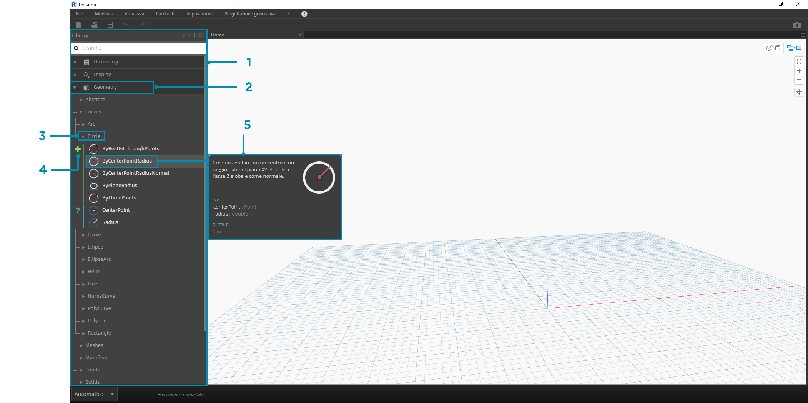
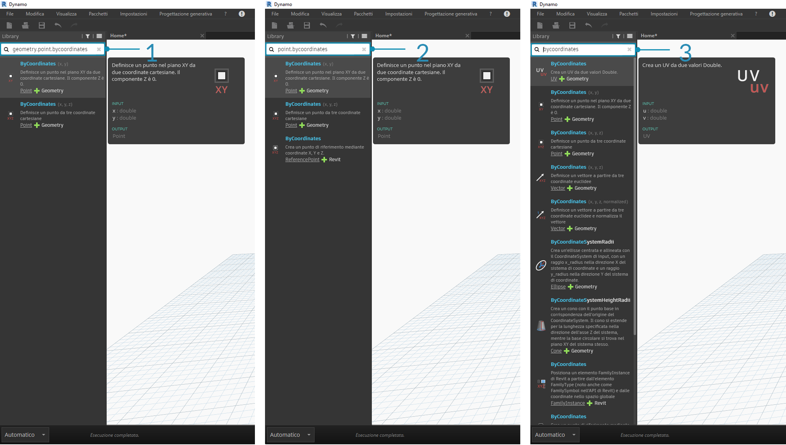

## Libreria di Dynamo

La **libreria di Dynamo** contiene i nodi che vengono aggiunti all'area di lavoro per definire i programmi visivi per l'esecuzione. Nella libreria, è possibile cercare o individuare nodi. I nodi contenuti in questa sezione, ovvero i nodi di base installati, i nodi personalizzati definiti e i nodi di Package Manager che si aggiungono a Dynamo, sono organizzati in modo gerarchico per categoria. Si esaminerà questa organizzazione e si esploreranno i nodi chiave utilizzate di frequente.

### Libreria della librerie

La **libreria** di Dynamo con cui si interagisce nell'applicazione è in realtà una raccolta di librerie funzionali, ciascuna contenente nodi raggruppati per categoria. Sebbene possa sembrare ottuso all'inizio, è un framework flessibile per organizzare i nodi forniti con l'installazione di default di Dynamo; inoltre, è ancora meglio strada facendo quando si inizia ad estendere questa funzionalità di base con nodi personalizzati e pacchetti aggiuntivi.

#### Schema organizzativo

La sezione **Libreria** dell'interfaccia utente di Dynamo è costituita da librerie organizzate in modo gerarchico. Mentre si analizza la libreria, si esplora in sequenza una libreria, le categorie della libreria e le sottocategorie della categoria per trovare il nodo.



> 1. Libreria: regione dell'interfaccia di Dynamo
2. Una libreria: una raccolta di categorie correlate, ad esempio **Geometry**
3. Una categoria: una raccolta di nodi correlati, ad esempio ogni elemento correlato a **Circle**
4. Una sottocategoria: suddivisione dei nodi all'interno della categoria, in genere tramite **Create**, **Action** o **Query**
5. Un nodo: oggetti aggiunti all'area di lavoro per eseguire un'azione

#### Convenzioni di denominazione

La gerarchia di ogni libreria viene rispecchiata nel nome dei nodi aggiunti all'area di lavoro, che è possibile utilizzare anche nel campo di ricerca o con blocchi di codice (che utilizzano il *linguaggio di testo di Dynamo*). Oltre a utilizzare parole chiave per trovare i nodi, è possibile digitare la gerarchia separata con un punto.

Digitando parti differenti della posizione del nodo nella gerarchia della libreria nel formato ```library.category.nodeName```, vengono restituiti risultati diversi:



> 1. ```library.category.nodeName```
2. ```category.nodeName```
3. ```nodeName``` o ```keyword```

In genere, il nome del nodo nell'area di lavoro verrà sottoposto a rendering nel formato ```category.nodeName```, con alcune eccezioni significative, in particolare nelle categorie Input e View. Tenere presente i nodi denominati in modo simile e osservare la differenza della categoria:


> 1. I nodi della maggior parte delle librerie includeranno il formato della categoria.
2. ```Point.ByCoordinates``` e ```UV.ByCoordinates``` hanno lo stesso nome ma provengono da categorie differenti.
3. Eccezioni importanti includono funzioni integrate, Core.Input, Core.View e operatori.

### Nodi utilizzati di frequente

Con centinaia di nodi inclusi nell'installazione di base di Dynamo, quali sono essenziali per lo sviluppo dei programmi visivi? Ci si concentrerà su quelli che consentono di definire i parametri del programma (**Input**), vedere i risultati dell'azione di un nodo (**Watch**) e definire gli input o le funzionalità mediante una scorciatoia (**Code Block**).

#### Input

I nodi di input sono il mezzo principale per l'utente del programma visivo, sia che si tratti dell'utente corrente sia di qualcun altro, per interfacciarsi con i parametri chiave. Di seguito sono riportati i nodi disponibili nella categoria Input della libreria Core:


> 1. Booleano
2. Numero
3. String
4. Dispositivo di scorrimento numero
5. Dispositivo di scorrimento numero intero
6. Percorso di directory
7. Percorso file

#### Watch

I nodi Watch sono essenziali per gestire i dati che fluiscono nel programma visivo. Sebbene sia possibile mostrare il risultato di un nodo tramite l'anteprima dei dati del nodo, è possibile mantenerlo visualizzato in un nodo **Watch** o vedere i risultati della geometria mediante un nodo **Watch 3D**. Entrambi sono disponibili nella categoria View della libreria Core.

> Suggerimento: talvolta l'anteprima 3D può distrarre l'utente quando il programma visivo contiene molti nodi. Per visualizzare l'anteprima della geometria, è consigliabile deselezionare l'opzione Mostra anteprima sfondo 3D nel menu Impostazioni e utilizzare un nodo Watch 3D.


> 1. Watch: quando si seleziona un elemento nel nodo Watch, questo viene contrassegnato nelle anteprime 3D e Watch 3D.
2. Watch 3D: trascinare il grip inferiore destro per ridimensionare ed esplorare con il mouse come si farebbe nell'anteprima 3D.

#### Code Block

I nodi **Code Block** possono essere utilizzati per definire un blocco di codice con righe separate da punti e virgola. Questo può essere semplice come ```X/Y```. È inoltre possibile utilizzare i blocchi di codice come scorciatoia per definire un input numerico o chiamare la funzionalità di un altro nodo. La sintassi da eseguire è conforme alla convenzione di denominazione del linguaggio testuale di Dynamo, DesignScript, ed è descritta nella sezione 7.2. Si tenterà di creare un cerchio con questa scorciatoia:


> 1. Fare doppio clic per creare un nodo **Code Block**.
2. Digitare ```Circle.ByCenterPointRadius(x,y);```.
3. Se si fa clic sull'area di lavoro per annullare la selezione, gli input ```x``` e ```y``` devono essere aggiunti automaticamente.
4. Creare un nodo **Point.ByCoordinates** e **Number Slider**, quindi collegarli agli input di Code Block.
5. Il risultato dell'esecuzione del programma visivo deve essere un cerchio nell'anteprima 3D.

