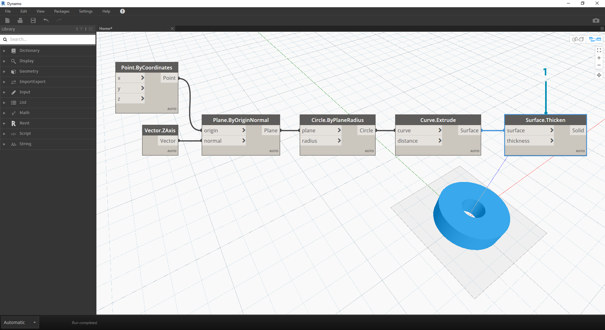

## Dati

I dati sono gli oggetti dei nostri programmi. Viaggiano attraverso i fili, fornendo input per i nodi in cui vengono elaborati in una nuova forma di dati di output. Quindi si esaminerà la definizione di dati e la relativa struttura e si inizierà ad utilizzarli in Dynamo.

### Cosa sono i dati?

I dati sono un insieme di valori di variabili qualitative o quantitative. Il formato più semplice di dati è costituito da numeri quali ```0```, ```3.14``` o ```17```. Tuttavia, i dati possono anche essere di diversi tipi: una variabile che rappresenta numeri che cambiano (```height```), caratteri (```myName```), geometria (```Circle```) o un elenco di elementi di dati (```1, 2, 3, 5, 8, 13,...```). Sono necessari dati da aggiungere alle porte di input dei nodi di Dynamo: è possibile disporre di dati senza azioni, ma sono necessari dati per elaborare le azioni rappresentate dai nodi. Quando è stato aggiunto un nodo all'area di lavoro, se non sono stati forniti eventuali input, il risultato sarà una funzione, non il risultato dell'azione stessa.


> 1. Dati semplici
2. Dati ed esecuzione corretta di un'azione (un nodo)
3. Restituzione di una funzione generica tramite un'azione (nodo) senza input di dati

### Attenzione ai valori null

Il tipo ```"null"``` rappresenta l'assenza di dati. Sebbene si tratti di un concetto astratto, è probabile incontrarlo utilizzando la programmazione visiva. Se un'azione non crea un risultato valido, il nodo restituirà un valore null. I test per i valori null e la rimozione dei valori null dalla struttura dei dati sono una parte fondamentale per la creazione di programmi efficienti.

|Icona|Nome/Sintassi|Input|Output|
| -- | -- | -- | -- |
||Object.IsNull|obj|booleano|

### Strutture dei dati

Quando si è in presenza della programmazione visiva, è possibile generare molto rapidamente parecchi dati e richiedere un metodo per gestirne la gerarchia. Questo è il ruolo delle strutture dei dati, ovvero gli schemi organizzativi in cui si memorizzano i dati. Le specifiche delle strutture dei dati e il loro utilizzo variano a seconda del linguaggio di programmazione. In Dynamo, si aggiunge la gerarchia ai dati tramite gli elenchi. Questo argomento verrà approfondito nei capitoli successivi. Si inizierà in maniera semplice:

Un elenco rappresenta una raccolta di elementi posizionati in una struttura di dati:

* Ho cinque dita (*elementi*) sulla mia mano (*elenco*).
* Ci sono dieci case (*elementi*) sulla mia strada (*elenco*).


> 1. Un nodo **Number Sequence** definisce un elenco di numeri utilizzando un input *start*, *amount* e *step*. Con questi nodi, sono stati creati due elenchi distinti di dieci numeri, uno che comprende *100-109* e un altro che include *0-9*.
2. Il nodo **List.GetItemAtIndex** seleziona una voce di un elenco in corrispondenza di un indice specifico. Quando si sceglie *0*, viene visualizzata la prima voce dell'elenco (in questo caso *100*).
3. Applicando lo stesso processo al secondo elenco, si ottiene un valore di *0*, la prima voce dell'elenco.
4. Ora si uniscono i due elenchi in uno utilizzando il nodo **List.Create**. Notare che il nodo crea un *elenco di elenchi.* Questa operazione modifica la struttura dei dati.
5. Quando si utilizza di nuovo **List.GetItemAtIndex**, con l'indice impostato su *0*, si ottiene il primo elenco nell'elenco di elenchi. Questo è ciò che significa considerare un elenco come voce, che è in qualche modo diverso da altri linguaggi di scripting. Nei capitoli successivi verranno fornite informazioni più avanzate sulla manipolazione degli elenchi e sulla struttura dei dati.

Il concetto chiave da comprendere sulla gerarchia dei dati in Dynamo: **rispetto alla struttura dei dati, gli elenchi vengono considerati come voci.** In altre parole, Dynamo funziona con un processo dall'alto in basso per la comprensione delle strutture dei dati. Ciò che cosa significa? Si esaminerà un esempio.

### Utilizzo di dati per creare una catena di cilindri

> Scaricare il file di esempio fornito con questo esercizio (fare clic con il pulsante destro del mouse e scegliere Salva link con nome...): [Building Blocks of Programs - Data.dyn](datasets/4-1/Building Blocks of Programs - Data.dyn). Un elenco completo di file di esempio è disponibile nell'Appendice.

In questo primo esempio, si assembla un cilindro svuotato che mostra la gerarchia della geometria descritta in questa sezione. 

> 1. **Point.ByCoordinates:** dopo aver aggiunto il nodo all'area di disegno, viene visualizzato un punto in corrispondenza dell'origine della griglia di anteprima di Dynamo. I valori di default degli input *x, y* e *z* sono *0.0*, per fornire un punto in questa posizione.


> 1. **Plane.ByOriginNormal:** il passaggio successivo nella gerarchia della geometria è un piano. Esistono diversi modi per costruire un piano e si sta utilizzando un'origine e una normale per l'input. L'origine è il nodo del punto creato nel passaggio precedente.
2. **Vector.ZAxis:** questo è un vettore unitario nella direzione z. Notare che non sono presenti input, ma solo un vettore di valore [0,0,1]. Viene utilizzato come input *normal* per il nodo *Plane.ByOriginNormal*. In questo modo si ottiene un piano rettangolare nell'anteprima di Dynamo.


> 1. **Circle.ByPlaneRadius:** passando al livello superiore nella gerarchia, a questo punto si crea una curva dal piano del passaggio precedente. Dopo il collegamento al nodo, si ottiene un cerchio in corrispondenza dell'origine. Il raggio di default sul nodo è il valore di *1*.


> 1. **Curve.Extrude:** ora è possibile far comparire questo oggetto assegnandogli profondità e rendendolo tridimensionale. Questo nodo crea una superficie da una curva tramite l'estrusione. La distanza di default sul nodo è *1*. Nella finestra dovrebbe essere visualizzato un cilindro.



> 1. **Surface.Thicken:** questo nodo fornisce un solido chiuso eseguendo l'offset della superficie ad una determinata distanza e chiudendo la forma. Il valore dello spessore di default è *1*. Nella finestra viene visualizzato un cilindro svuotato in linea con questi valori.


> 1. **Number Slider:** anziché utilizzare i valori di default per tutti questi input, aggiungere al modello un controllo parametrico.
2. **Modifica del dominio:** dopo aver aggiunto il dispositivo di scorrimento numerico all'area di disegno, fare clic sull'accento circonflesso in alto a sinistra per visualizzare le opzioni di dominio.
3. **Min/Max/Step:** modificare rispettivamente i valori *min*, *max* e *step* in *0*, *2* e *0.01*. Questa operazione consente di controllare la dimensione della geometria complessiva.


> 1. **Number Slider:** in tutti gli input di default, copiare e incollare questo dispositivo di scorrimento numerico (selezionare il dispositivo di scorrimento, premere CTRL+C, quindi CTRL+V) più volte, finché tutti gli input con valori di default non mostreranno un dispositivo di scorrimento. Alcuni dei valori del dispositivo di scorrimento devono essere maggiori di zero per far funzionare la definizione (ossia, è necessaria una profondità di estrusione per avere una superficie da ispessire).

Ora è stato creato un cilindro svuotato parametrico con questi dispositivi di scorrimento. Provare a regolare alcuni di questi parametri e vedere l'aggiornamento dinamico della geometria nella finestra di Dynamo.


> 1. **Dispositivi di scorrimento**: per fare un ulteriore passo avanti, sono stati aggiunti molti dispositivi di scorrimento all'area di disegno e occorre ripulire l'interfaccia dello strumento appena creato. Fare clic con il pulsante destro del mouse su un dispositivo di scorrimento, selezionare "Rinomina..." e assegnare ad ogni dispositivo di scorrimento il nome appropriato per il relativo parametro. È possibile fare riferimento all'immagine riportata sopra per i nomi.

A questo punto, è stato creato un fantastico cilindro ispessito. Attualmente, questo è un oggetto. Si può vedere come creare una serie di cilindri che restano dinamicamente collegati. Per eseguire questa operazione, si creerà un elenco di cilindri, anziché utilizzare un singolo elemento.


> 1. **Aggiunta (+):** l'obiettivo è aggiungere una fila di cilindri accanto al cilindro creato. Se si desidera aggiungere un cilindro adiacente a quello corrente, è necessario considerare sia il raggio del cilindro che lo spessore dell'involucro. Si ottiene questo numero aggiungendo i due valori dei dispositivi di scorrimento.


> Questo passaggio è più complicato, quindi occorre esaminarlo lentamente: l'obiettivo finale è creare un elenco di numeri che definiscano le posizioni di ogni cilindro in una riga.

> 1. **Moltiplicazione (*):** per prima cosa, si desidera moltiplicare il valore del passaggio precedente per 2. Il valore del passaggio precedente rappresenta un raggio e si desidera spostare il cilindro in base al diametro completo.
2. **Number Sequence:** viene creata una serie di numeri con questo nodo. Il primo input è il nodo della *moltiplicazione* del passaggio precedente che viene collegato al valore *step*. Il valore *start* può essere impostato su *0.0* utilizzando un nodo *Number*.
3. **Dispositivo di scorrimento di numeri interi:** per il valore *amount*, collegare un dispositivo di scorrimento di numeri interi. In questo modo si definirà il numero di cilindri creati.
4. **Output:** questo elenco mostra la distanza di spostamento per ogni cilindro nella serie e viene parametricamente determinato dai dispositivi di scorrimento originali.


> 1. Questo passaggio è abbastanza semplice: collegare la sequenza definita nel passaggio precedente all'input *x* del nodo *Point.ByCoordinates* originale. Questa operazione sostituirà il dispositivo di scorrimento *pointX* che è possibile eliminare. Ora nella finestra è visibile una serie di cilindri (assicurarsi che il dispositivo di scorrimento di numeri interi sia maggiore di 0).


> La catena di cilindri è ancora collegata dinamicamente a tutti i dispositivi di scorrimento. Regolare ogni dispositivo di scorrimento per controllare l'aggiornamento della definizione.

