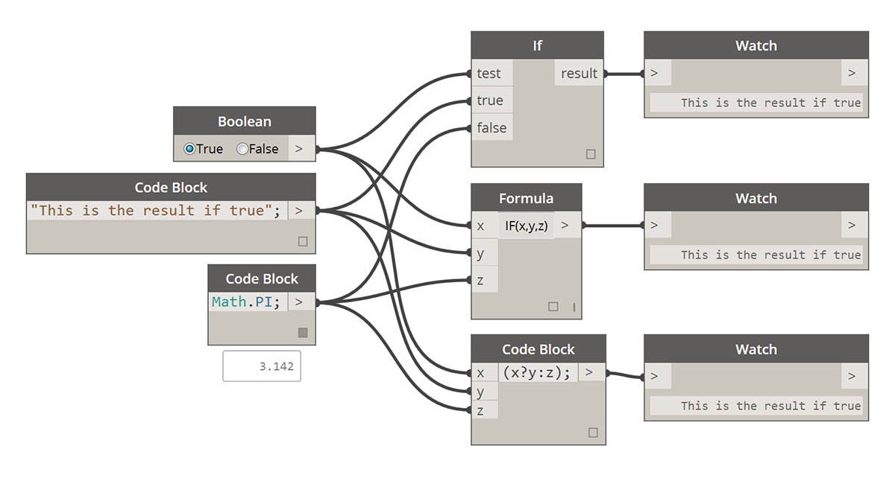
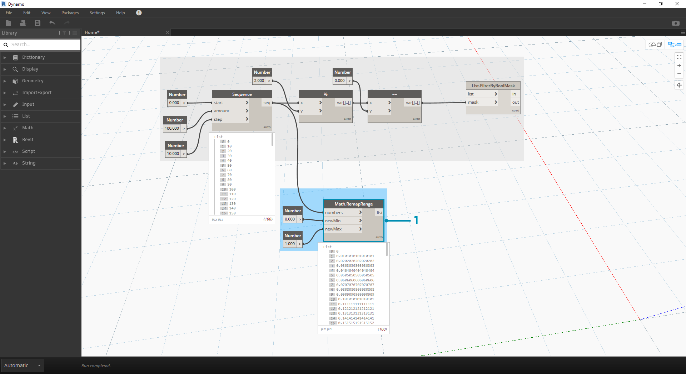

## Logica

La **logica**, o più specificatamente, la **logica condizionale**, consente di specificare un'azione o un gruppo di azioni in base ad un test. Dopo aver valutato il test, sarà presente un valore booleano che rappresenta ```True``` o ```False``` che è possibile utilizzare per controllare il flusso del programma.

### Valori booleani

Le variabili numeriche possono memorizzare un intero intervallo di numeri diversi. Le variabili booleane possono memorizzare solo due valori indicati come True o False, Yes o No, 1 o 0. Per eseguire i calcoli, raramente vengono utilizzati valori booleani a causa del loro intervallo limitato.

### Istruzioni condizionali

L'istruzione "If" è un concetto chiave nella programmazione: "Se *ciò* è vero, allora accade *questo*, altrimenti succede *qualcos'altro*. L'azione risultante dell'istruzione è determinata da un valore booleano. Esistono diversi modi per definire un'istruzione "If" in Dynamo:

|Icona|Nome|Sintassi|Input|Output|
| -- | -- | -- | -- | -- |
||Se|Se|test, true, false|risultato|
||Formula|IF(x,y,z)|x, y, z|risultato|
||Code Block|(x?y:z)|x, y, z|risultato|

Si esaminerà un breve esempio per ciascuno di questi tre nodi in azione utilizzando l'istruzione "If" condizionale:



> In questa immagine, *Boolean* è impostato su *True*, ovvero il risultato è una stringa che riporta: *"This is the result if true";.* I tre nodi che creano l'istruzione *If* funzionano in modo identico in questo contesto.


> Anche in questo caso, i nodi funzionano in modo identico. Se *Boolean* viene modificato in *False*, il risultato è il numero *Pi*, come definito nell'istruzione *If* originale.

### Filtraggio di un elenco

> Scaricare il file di esempio fornito con questo esercizio (fare clic con il pulsante destro del mouse e scegliere Salva link con nome...): [Building Blocks of Programs - Logic.dyn](datasets/4-3/Building Blocks of Programs - Logic.dyn). Un elenco completo di file di esempio è disponibile nell'Appendice.

Si utilizzerà la logica per separare un elenco di numeri in un elenco di numeri pari e un elenco di numeri dispari.


> 1. **Range:** aggiungere un intervallo di numeri all'area di disegno.
2. **Number:** aggiungere tre nodi di numeri all'area di disegno. Il valore per ogni nodo Number deve essere: *0.000* per *start*, *10.000* per *end* e *1.000* per *step*.
3. **Output: **l'output è un elenco di 11 numeri da 0 a 10.
4. **% (modulo):** collegare *Range* a *x* e *2.000* a *y*. In questo modo viene calcolato il resto per ogni numero dell'elenco diviso per 2. L'output di questo elenco fornisce un elenco di valori alternati tra 0 e 1.
5. **= = (test di uguaglianza):** aggiungere un test di uguaglianza all'area di disegno. Collegare l'output del *modulo* all'input *x* e *0.000* all'input *y*.
6. **Watch:** l'output del test di uguaglianza è un elenco di valori alternati tra true e false. Questi sono i valori utilizzati per separare le voci dell'elenco. *0* (o *true*) rappresenta i numeri pari e (*1* o *false*) rappresenta i numeri dispari.
7. **List.FilterByBoolMask:** questo nodo filtra i valori in due elenchi diversi in base al valore booleano di input. Collegare il nodo *Range* originale all'input *list* e l'output del *test di uguaglianza* all'input *mask*. L'output *in* rappresenta valori true, mentre l'output *out* rappresenta valori false.
8. **Watch:** il risultato è ora un elenco di numeri pari e un elenco di numeri dispari. Sono stati utilizzati operatori logici per separare gli elenchi in modelli.

### Dalla logica alla geometria

Partendo dalla logica stabilita nel primo esercizio, si applicherà questa configurazione ad un'operazione di modellazione.

 Partire dall'esercizio precedente con gli stessi nodi. Le uniche eccezioni (oltre a modificare il formato sono):

> 1. I valori di input sono stati modificati.
2. È stato scollegato l'input list da *List.FilterByBoolMask*. Questi nodi verranno messi da parte per ora, ma saranno presto utili più avanti nell'esercizio.


> Iniziare collegando i nodi insieme come mostrato nell'immagine riportata sopra. Questo gruppo di nodi rappresenta un'equazione parametrica per definire una curva di linea. Ecco alcune note:

> 1. Il **primo dispositivo di scorrimento** deve avere un minimo di 1, un massimo di 4 e un incremento di 0.01.
2. Il **secondo dispositivo di scorrimento** deve avere un minimo di 0, un massimo di 1 e un incremento di 0.01.
3. **PolyCurve.ByPoints:** se il diagramma dei nodi riportato sopra viene copiato, il risultato è una curva seno nella finestra di anteprima di Dynamo.

Il metodo indicato qui per gli input è questo: utilizzare i nodi Number per ottenere proprietà più statiche e i dispositivi di scorrimento numerici su quelle più flessibili. Si desidera mantenere l'intervallo di numeri originale definito all'inizio di questo passaggio. Tuttavia, la curva seno creata qui dovrebbe avere una certa flessibilità. È possibile spostare questi dispositivi di scorrimento per controllare l'aggiornamento della frequenza e dell'ampiezza della curva.


> Si passerà alla definizione, quindi si osserverà il risultato finale in modo da poter fare riferimento a quello che si sta ottenendo. I primi due passaggi vengono eseguiti separatamente. Ora si desidera collegarli. Si utilizzerà la curva seno di base per determinare la posizione dei componenti della cerniera e si utilizzerà la logica true/false per alternare tra caselle di piccole dimensioni e caselle più grandi.



> 1. **Math.RemapRange:** utilizzando la sequenza numerica creata nel passaggio 01, creare una nuova serie di numeri riassociando l'intervallo. I numeri originali del passaggio 01 sono compresi tra 0 e 100. Questi numeri variano da 0 a 1, rispettivamente in base agli input *newMin* e *newMax*.


> 1. **Curve.PointAtParameter: **collegare *Polycurve.ByPoints* (del passaggio 2) a *curve* e *Math.RemapRange* a *param*. Questo passaggio crea punti lungo la curva. I numeri sono stati riassociati da 0 a 1 perché l'input di *param* sta cercando valori in questo intervallo. Un valore di *0* rappresenta il punto iniziale, mentre un valore di *1* rappresenta i punti finali. Tutti i numeri compresi vengono valutati nell'intervallo *[0,1]*.


> 1. **List.FilterByBoolMask:** collegare *Curve.PointAtParameter* del passaggio precedente all'input *list*.
2. **Watch:** un nodo di controllo per *in* e un nodo di controllo per *out* indicano che sono presenti due elenchi che rappresentano indici pari e indici dispari. Questi punti sono ordinati nello stesso modo sulla curva, che è possibile mostrare nel passaggio successivo.


> 1. **Cuboid.ByLengths:** ricreare i collegamenti visti nell'immagine riportata sopra per ottenere una cerniera lungo la curva seno. Un cuboide qui è solo un parallelepipedo e si sta definendo la sua dimensione in base al punto della curva al centro del parallelepipedo stesso. La logica della divisione pari/dispari dovrebbe ora essere chiara nel modello.


> 1. **Dispositivo di scorrimento numerico:** tornando all'inizio della definizione, è possibile regolare il dispositivo di scorrimento numerico e controllare l'aggiornamento della cerniera. La riga superiore delle immagini rappresenta un intervallo di valori per il dispositivo di scorrimento numerico superiore. Questa è la frequenza dell'onda.
2. **Dispositivo di scorrimento numerico**: la riga inferiore delle immagini rappresenta un intervallo di valori per il dispositivo di scorrimento inferiore. Questa è l'ampiezza dell'onda.

