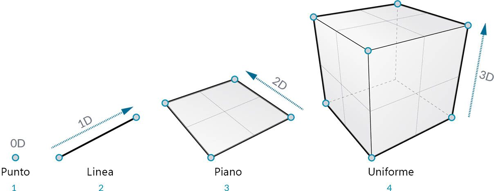
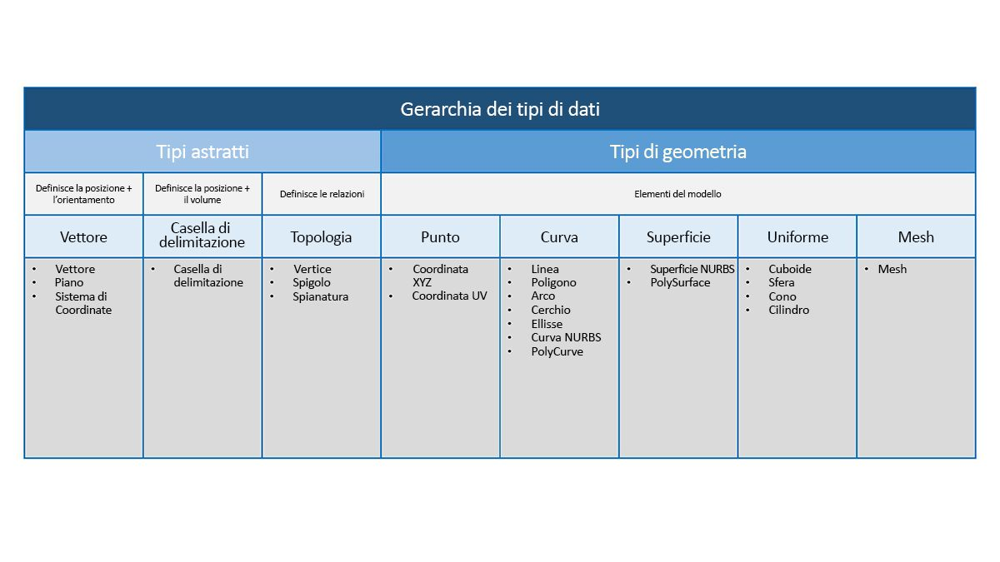

## Panoramica sulla geometria
La **geometria** è il linguaggio per la progettazione. Quando un ambiente o un linguaggio di programmazione ha un kernel geometrico alla base, si possono sfruttare le possibilità di progettazione di modelli precisi ed efficienti, di automazione delle routine di progettazione e di generazione delle iterazioni di progettazione con algoritmi.

### Nozioni di base
La geometria, tradizionalmente definita, è lo studio della forma, della dimensione, della posizione relativa delle figure e delle proprietà dello spazio. Questo campo ha una ricca storia che risale a migliaia di anni fa. Con l'avvento e la diffusione del computer, si è ottenuto un potente strumento per definire, esplorare e generare la geometria. È ora così semplice calcolare il risultato di interazioni geometriche complesse; il fatto che lo stiamo facendo è quasi trasparente.

> Se si è curiosi di vedere come la geometria complessa e diversificata possa utilizzare la potenza del computer, eseguire una rapida ricerca sul Web del coniglio Stanford, un modello canonico utilizzato per testare gli algoritmi.

La comprensione della geometria nel contesto di algoritmi, elaborazione e complessità può sembrare scoraggiante; tuttavia, esistono alcuni principi chiave, relativamente semplici, che si possono stabilire come concetti fondamentali per iniziare a creare applicazioni più avanzate:

1. La geometria riguarda **dati**: per il computer e Dynamo, un coniglio non è poi così diverso da un numero.
2. La geometria si basa sull'**astrazione**: fondamentalmente, gli elementi geometrici sono descritti da numeri, relazioni e formule all'interno di un determinato sistema di coordinate spaziali.
3. La geometria ha una **gerarchia**: i punti sono uniti per creare linee, le linee si uniscono per creare superfici e così via.
4. La geometria descrive contemporaneamente sia **la parte che il tutto**: quando si ha una curva, è sia la forma che tutti i punti possibili lungo di essa.

In pratica, questi principi implicano che bisogna essere consapevoli di ciò che si sta utilizzando (quale tipo di geometria, com'è stata creata, ecc.) in modo da poter comporre, scomporre e ricomporre in modo fluido diverse geometrie durante lo sviluppo di modelli più complessi.

### Scorrimento della gerarchia
Sarà esaminata la relazione tra le descrizioni astratte e gerarchiche della geometria. Poiché questi due concetti sono correlati, ma non sempre ovvi all'inizio, è possibile arrivare rapidamente ad una barriera concettuale quando si iniziano a sviluppare modelli o workflow più profondi. Per i principianti, verrà utilizzata la dimensionalità come un facile descrittore del "materiale" che si modella. Il numero di dimensioni necessarie per descrivere una forma offre una finestra che mostra come la geometria è organizzata gerarchicamente.

> 1. Un **punto** (definito dalle coordinate) non ha dimensioni; sono solo numeri che descrivono ogni coordinata.
2. Una **linea** (definita da due punti) ora presenta *una* dimensione: è possibile "percorrere" la linea in avanti (direzione positiva) o all'indietro (direzione negativa).
3. Un **piano** (definito da due linee) presenta *due* dimensioni: ora è possibile passeggiare più a sinistra o più a destra.
4. Un **parallelepipedo** (definito da due piani) ha *tre* dimensioni: è possibile definire una posizione rispetto all'alto o all basso.

La dimensionalità è un metodo comodo per iniziare a classificare la geometria, ma non è necessariamente il migliore. Dopotutto, non si modellano solo con punti, linee, piani e parallelepipedi. E se si desidera qualcosa di curvo? Inoltre, esiste un'altra categoria di tipi geometrici che sono completamente astratti, ossia definiscono proprietà quali l'orientamento, il volume o le relazioni tra le parti. Non è possibile afferrare un vettore in modo da definirlo rispetto a ciò che viene visualizzato nello spazio? Una categorizzazione più dettagliata della gerarchia geometrica dovrebbe riflettere la differenza tra tipi astratti o "helper", ognuno dei quali può essere raggruppato in base alle operazioni che essi consentono di fare e ai tipi che consentono di descrivere la forma degli elementi del modello.

### Geometria in Dynamo Sandbox

Cosa significa questo per l'utilizzo di Dynamo? La comprensione dei tipi di geometria e della relativa correlazione consente di spostarsi all'interno della raccolta di **nodi della geometria** disponibili nella libreria. I nodi della geometria sono organizzati in ordine alfabetico, anziché gerarchico. Qui vengono visualizzati in modo simile al loro layout nell'interfaccia di Dynamo.

Inoltre, la realizzazione di modelli in Dynamo e la connessione dell'anteprima di ciò che viene visualizzato nell'anteprima sfondo al flusso di dati nel grafico dovrebbero diventare più intuitive nel tempo.

> 1. Si noti il sistema di coordinate presunto sottoposto a rendering mediante griglia e assi colorati.
3. I nodi selezionati eseguiranno il rendering della geometria corrispondente (se il nodo crea la geometria) nel colore di evidenziazione dello sfondo.

> Scaricare il file di esempio fornito questa immagine (fare clic con il pulsante destro del mouse e scegliere Salva link con nome...): [Geometry for Computational Design - Geometry Overview.dyn](datasets/5-1/Geometry for Computational Design - Geometry Overview.dyn). Un elenco completo di file di esempio è disponibile nell'Appendice.

### Ulteriori informazioni sulla geometria
La creazione di modelli in Dynamo non è limitata a ciò che è possibile generare con i nodi. Di seguito sono riportati alcuni metodi chiave per portare il processo al livello successivo con la geometria:

1. Dynamo consente di importare file. Provare ad utilizzare un file CSV per le nuvole di punti o un file SAT per l'importazione di superfici.
2. Quando si utilizza Revit, è possibile fare riferimento ad elementi di Revit da utilizzare in Dynamo.
3. Dynamo Package Manager offre funzionalità aggiuntive per le operazioni e i tipi di geometria estesi. Visitare la pagina sul pacchetto [Mesh Toolkit](https://github.com/DynamoDS/Dynamo/wiki/Dynamo-Mesh-Toolkit).

