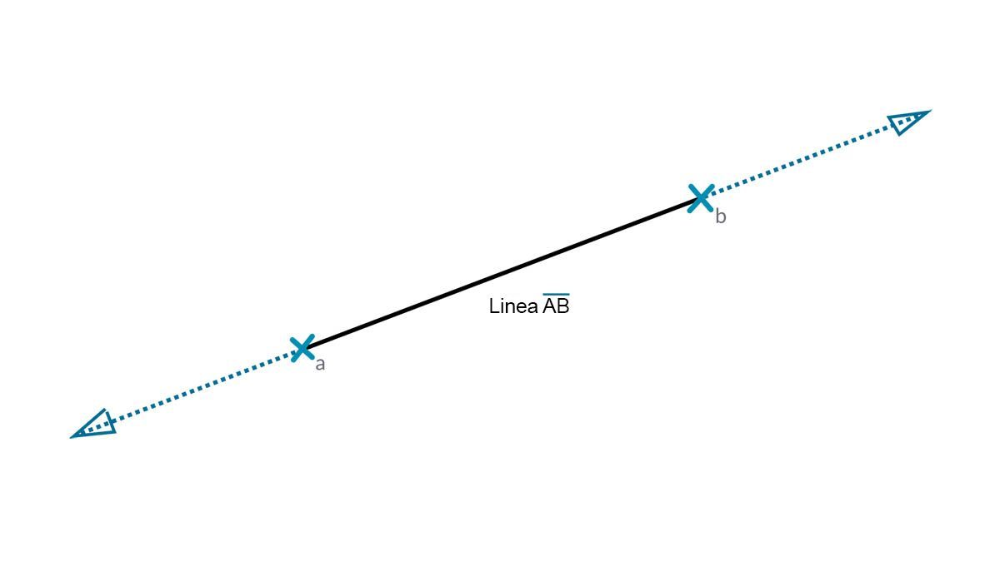
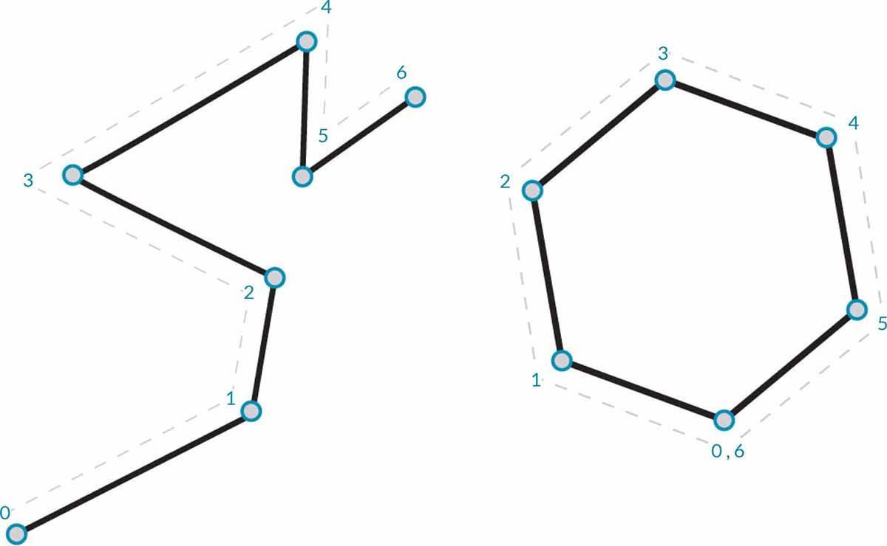
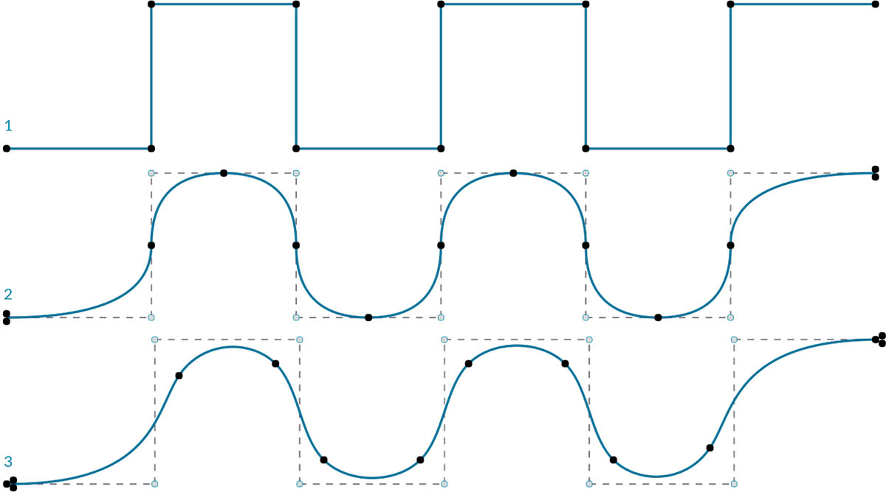

## Curve

Le curve sono il primo tipo di dati geometrici descritto e hanno un insieme più familiare di proprietà descrittive della forma: Quanto curve o diritte? Quanto lunghe o corte? Ricordarsi che i punti sono ancora i blocchi predefiniti per definire qualsiasi elemento da una linea ad una spline e tutti i tipi di curva compresi tra loro.


> 1. Linea
2. Polilinea
3. Arco
4. Cerchio
5. Ellisse
6. Curva NURBS
7. PolyCurve

### Cos'è una curva?

Il termine **curva** è generalmente un elemento interessante per tutte le diverse forme curve (anche se diritte). La Curva con la "C" maiuscola è la categorizzazione principale per tutti questi tipi di forma: linee, cerchi, spline e così via. Più tecnicamente, una curva descrive ogni possibile punto che si può trovare immettendo "t" in una raccolta di funzioni, che possono variare dal semplice (```x = -1,26*t, y = t```) alle funzioni che prevedono il calcolo infinitesimale. Indipendentemente dal tipo di curva utilizzata, questo **parametro** denominato "t" è una proprietà che è possibile valutare. Inoltre, indipendentemente dall'aspetto della forma, tutte le curve hanno anche un punto iniziale e un punto finale, che si allineano in modo coincidente con i valori t minimo e massimo utilizzati per creare la curva. Questo aiuta anche a capire la sua direzionalità.


> È importante notare che Dynamo presuppone che il dominio dei valori "t" per una curva sia compreso tra 0.0 e 1.0.

Tutte le curve presentano inoltre diverse proprietà o caratteristiche che possono essere utilizzate per descriverle o analizzarle. Quando la distanza tra i punti iniziale e finale è pari a zero, la curva è "chiusa". Inoltre, ogni curva presenta diversi punti di controllo; se tutti questi punti si trovano nello stesso piano, la curva è "planare". Alcune proprietà si applicano alla curva nel suo insieme, mentre altre si applicano solo a punti specifici lungo la curva. Ad esempio, la planarità è una proprietà globale, mentre un vettore tangente in corrispondenza di un determinato valore t è una proprietà locale.

### Linee

Le **linee** sono la forma più semplice di curve. Potrebbero non sembrare curve, ma in realtà sono curve, solo senza alcuna curvatura. Esistono diversi modi per creare linee, dove la più intuitiva è dal punto A al punto B. La forma della linea AB verrà disegnata tra i punti ma matematicamente si estende all'infinito in entrambe le direzioni.



Quando si collegano due linee, è presente una **polilinea**. Di seguito è riportata una rappresentazione diretta di che cos'è un punto di controllo. La modifica di una qualsiasi di queste posizioni dei punti modificherà la forma della polilinea. Se la polilinea è chiusa, si ha un poligono. Se le lunghezze dei bordi del poligono sono tutte uguali, vengono descritte come normali.



### Archi, cerchi, archi di ellisse ed ellissi

Man mano che si aggiunge maggiore complessità alle funzioni parametriche che definiscono una forma, è possibile fare un passo avanti rispetto ad una linea per creare un **arco**, un **cerchio**, un **arco di ellisse** o un'**ellisse** descrivendo uno o due raggi. Le differenze tra la versione dell'arco e il cerchio o l'ellisse sono solo se la forma è chiusa o meno.


### NURBS + PolyCurve

**NURBS** (spline a base razionale non uniformi) sono rappresentazioni matematiche che consentono di modellare in modo accurato qualsiasi forma, da una semplice linea bidimensionale, un cerchio, un arco o un rettangolo, fino alla curva organica di forma libera tridimensionale più complessa. Grazie alla loro flessibilità (relativamente pochi punti di controllo, ma interpolazione uniforme basata sulle impostazioni dei gradi) e alla loro precisione (legata ad una matematica affidabile), i modelli NURBS possono essere utilizzati in qualsiasi processo, dall'illustrazione e dall'animazione fino alla produzione.


**Grado**: il grado della curva determina l'intervallo di influenza dei punti di controllo su una curva; dove più alto è il grado, maggiore sarà l'intervallo. Il valore del grado è un numero intero positivo. Questo numero è in genere 1, 2, 3 o 5, ma può essere qualsiasi numero intero positivo. Le linee e le polilinee NURBS sono in genere di grado 1 e la maggior parte delle curve di forma libera è di grado 3 o 5.

**Punti di controllo**: i punti di controllo sono un elenco di punti di almeno grado+1. Uno dei modi più semplici per modificare la forma di una curva NURBS consiste nello spostare i punti di controllo.

**Peso**: ai punti di controllo è associato un numero denominato peso. In genere i pesi sono numeri positivi. Quando i punti di controllo di una curva hanno tutti lo stesso peso (in genere 1), la curva viene chiamata non razionale, altrimenti la curva viene chiamata razionale. La maggior parte delle curve NURBS non è razionale.

**Nodi**: i nodi sono un elenco di numeri (grado+N-1), dove N è il numero di punti di controllo. I nodi vengono utilizzati insieme ai pesi per controllare l'influenza dei punti di controllo sulla curva risultante. Un uso per i nodi è creare deviazioni in determinati punti nella curva.



> 1. Grado = 1
2. Grado = 2
3. Grado = 3

Notare che più alto è il valore del grado, maggiore sarà il numero di punti di controllo utilizzati per interpolare la curva risultante.

Si procederà con la creazione di una curva seno in Dynamo utilizzando due diversi metodi per creare curve NURBS e confrontare i risultati.


> 1. *NurbsCurve.ByControlPoints* utilizza l'elenco di punti come punti di controllo.
2. *NurbsCurve.ByPoints* disegna una curva attraverso l'elenco di punti.
> Scaricare il file di esempio fornito con questa immagine (fare clic con il pulsante destro del mouse e scegliere Salva link con nome...): [Geometry for Computational Design - Curves.dyn](datasets/5-4/Geometry for Computational Design - Curves.dyn). Un elenco completo di file di esempio è disponibile nell'Appendice.

