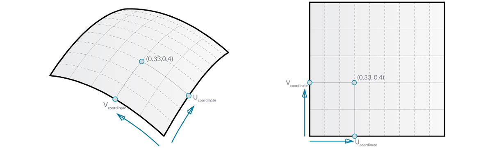

## Superfici

Mentre si passa dall'utilizzo di curve all'uso di superfici in un modello, è possibile cominciare a rappresentare gli oggetti visti nel mondo tridimensionale. Mentre le curve non sono sempre piane, ossia sono tridimensionali, lo spazio che definiscono è sempre associato ad una dimensione. Le superfici offrono un'altra dimensione e una raccolta di proprietà aggiuntive utilizzabili in altre operazioni di modellazione.

### Che cos'è una superficie?

Una superficie è una forma matematica definita da una funzione e due parametri. Anziché ```t``` per le curve, si utilizzano ```U``` e ```V``` per descrivere lo spazio del parametro corrispondente. Ciò significa che sono presenti più dati geometrici in base a cui eseguire disegni quando si utilizza questo tipo di geometria. Ad esempio, le curve hanno vettori tangenti e piani normali (che possono ruotare o torcersi per la lunghezza della curva), mentre le superfici hanno vettori normali e piani tangenti che saranno coerenti nel loro orientamento.


> 1. Superficie
2. Isocurva U
3. Isocurva V
4. Coordinata UV
5. Piano perpendicolare
6. Vettore normale

**Dominio di superficie**: un dominio di superficie viene definito come intervallo di parametri (U,V) che vengono valutati in un punto tridimensionale su tale superficie. Il dominio in ogni dimensione (U o V) viene in genere descritto come due numeri (U minimo a U massimo) e (V da minimo a V massimo).



Sebbene la forma della superficie non sembri "rettangolare" e localmente potrebbe avere un insieme di isocurve più serrato o più ampio, lo "spazio" definito dal relativo dominio è sempre bidimensionale. In Dynamo, le superfici sono sempre note per aver un dominio definito da un minimo di 0.0 e un massimo di 1.0 in entrambe le direzioni U e V. Le superfici piane o tagliate possono avere domini diversi.

**Isocurva** (o curva isoparametrica): una curva definita da un valore U o V costante sulla superficie e da un dominio di valori per l'altra direzione U o V corrispondente.

**Coordinata UV**: il punto nello spazio del parametro UV definito da U, V e talvolta W.


**Piano perpendicolare**: un piano perpendicolare ad entrambe le isocurve U e V in corrispondenza di una determinata coordinata UV.

**Vettore perpendicolare**: un vettore che definisce la direzione di "alto" rispetto al piano perpendicolare.

### Superfici NURBS

Le **superfici NURBS** sono molto simili alle curve NURBS. Le superfici NURBS possono essere considerate come una griglia di curve NURBS che vanno in due direzioni. La forma di una superficie NURBS è definita da diversi punti di controllo e dal grado di tale superficie nelle direzioni U e V. Gli stessi algoritmi vengono utilizzati per calcolare la forma, le normali, le tangenti, le curvature e altre proprietà mediante punti di controllo, spessori e grado.


Nel caso delle superfici NURBS, vi sono due direzioni implicite nella geometria, poiché le superfici NURBS sono, indipendentemente dalla forma vista, griglie rettangolari dei punti di controllo. Anche se queste direzioni sono spesso arbitrarie rispetto al sistema di coordinate globale, verranno utilizzate di frequente per analizzare i modelli o generare altra geometria in base alla superficie.


> 1. Grado (U,V) = (3,3)
2. Grado (U,V) = (3,1)
3. Grado (U,V) = (1,2)
4. Grado (U,V) = (1,1)

### PolySurface

Le **PolySurface** sono costituite da superfici unite su uno spigolo. Le PolySurface offrono più di una definizione UV bidimensionale nel senso che ora è possibile muoversi tra le forme collegate tramite la loro topologia.

> Sebbene la "topologia" in genere descriva un concetto che illustra come le parti sono collegate e/o la topologia correlata, in Dynamo è anche un tipo di geometria. In particolare, si tratta di una categoria principale per superfici, PolySurface e solidi.


Talvolta chiamate superfici chiuse, unire le superfici in questo modo consente di creare forme più complesse e definire i dettagli attraverso la giuntura. Comodamente è possibile applicare un'operazione di raccordo o smusso agli spigoli di una PolySurface.

Verrà importata e valutata una superficie in corrispondenza di un parametro in Dynamo per vedere il tipo di informazioni che è possibile estrarre.


> 1. *Surface.PointAtParameter* restituisce il punto in corrispondenza di una coordinata UV specificata.
2. *Surface.NormalAtParameter* restituisce il vettore normale in corrispondenza di una determinata coordinata UV.
3. *Surface.GetIsoline* restituisce la curva isoparametrica in corrispondenza di una coordinata U o V. Notare l'input isoDirection.
> Scaricare i file di esempio forniti con questa immagine (fare clic con il pulsante destro del mouse e scegliere Salva link con nome...). Un elenco completo di file di esempio è disponibile nell'Appendice.

> 1. [Geometry for Computational Design - Surfaces.dyn](datasets/5-5/Geometry for Computational Design - Surfaces.dyn)
2. [Surface.sat](datasets/5-5/Surface.sat)

