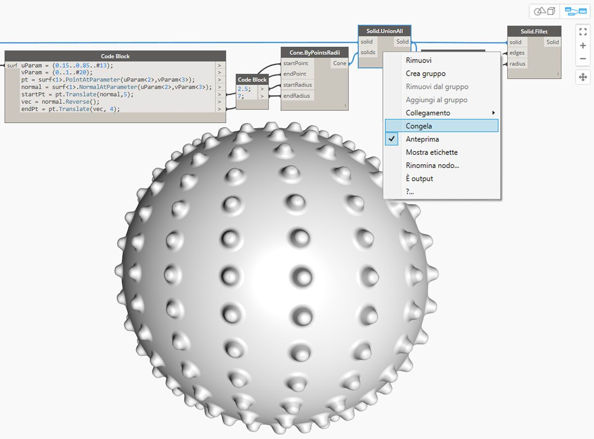
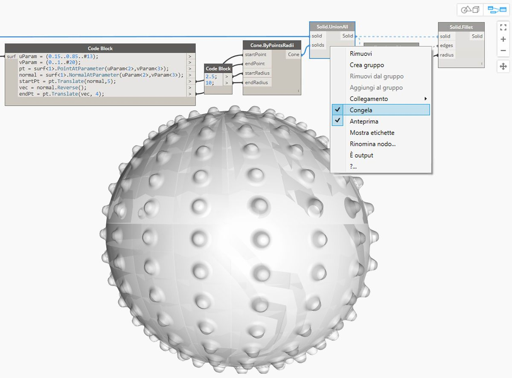

## Solidi

Se si desidera costruire modelli più complessi che non possono essere creati da una singola superficie o se si vuole definire un volume esplicito, occorre ora entrare nel regno dei solidi (e delle PolySurface). Anche un cubo semplice è sufficientemente complesso da richiedere sei superfici, una per ogni faccia. I solidi introducono due concetti chiave a differenza delle superfici: una descrizione topologica più rifinita (facce, spigoli, vertici) e operazioni booleane.

### Cos'è un solido?

I solidi sono costituiti da una o più superfici che contengono volume mediante un contorno chiuso che definisce l'"entrata" o l'"uscita". Indipendentemente dal numero di superfici presenti, è necessario che formino un volume "ermetico" per essere considerate un solido. È possibile creare solidi unendo superfici o PolySurface o utilizzando operazioni quali loft, sweep e rivoluzione. Anche le primitive sfera, cubo, cono e cilindro sono solidi. Un cubo con almeno una faccia rimossa viene considerato come PolySurface, che presenta proprietà simili, ma non è un solido.

> 1. Un piano è composto da una singola superficie e non è un solido.
2. Una sfera è costituita da una superficie, ma *è* un solido.
3. Un cono è composto da due superfici unite per creare un solido.
4. Un cilindro è composto da tre superfici unite per creare un solido.
5. Un cubo è composto da sei superfici unite per creare un solido.

### Topologia

I solidi sono costituiti da tre tipi di elementi: vertici, spigoli e facce. Le facce sono le superfici che compongono il solido. Gli spigoli sono le curve che definiscono il collegamento tra facce adiacenti, mentre i vertici rappresentano i punti iniziale e finale di tali curve. Questi elementi possono essere sottoposti a query utilizzando i nodi della topologia.

> 1. Facce
2. Spigoli
3. Vertici

### Operazioni

I solidi possono essere modificati raccordando o smussando i loro spigoli per eliminare angoli acuti. L'operazione di smusso crea una superficie rigata tra due facce, mentre un raccordo si unisce tra le facce per mantenere la tangenza. 

> 1. Cubo
2. Cubo smussato
3. Cubo raccordato

### Operazioni booleane

Le operazioni booleane sui solidi sono metodi per combinare due o più solidi. Una singola operazione booleana significa in realtà eseguire quattro operazioni:

1. **Intersecare** due o più oggetti.
2. **Dividerli** in corrispondenza delle intersezioni.
3. **Eliminare** le parti della geometria indesiderate.
4. **Unire** tutto di nuovo insieme.

Ciò rende le operazioni booleane sui solidi un potente processo che consente di risparmiare tempo. Sono disponibili tre operazioni booleane sui solidi che consentono di distinguere quali parti della geometria vengono mantenute. 

> 1. **Unione:** consente di rimuovere le parti sovrapposte dei solidi e di unirle in un unico solido.
2. **Differenza:** consente di sottrarre un solido da un altro. Il solido da sottrarre è noto come strumento. Si noti che è possibile cambiare il solido che costituisce lo strumento per mantenere il volume inverso.
3. **Intersezione:** consente di mantenere solo il volume intersecante dei due solidi.

Oltre a queste tre operazioni, in Dynamo sono disponibili i nodi **Solid.DifferenceAll** e **Solid.UnionAll** per l'esecuzione di operazioni di differenza e unione con più solidi. 

> 1. **UnionAll:** operazione di unione con sfera e coni rivolti verso l'esterno.
2. **DifferenceAll:** operazione di differenza con sfera e coni rivolti verso l'interno.

Si utilizzeranno alcune operazioni booleane per creare una palla riccio.

> 1. **Sphere.ByCenterPointRadius**: creare il solido di base.
2. **Topology.Faces**, **Face.SurfaceGeometry**: eseguire una query sulle facce del solido e convertirle in geometria di superficie. In questo caso, la sfera presenta un'unica faccia.
3. **Cone.ByPointsRadii**: costruire coni utilizzando punti sulla superficie.
4. **Solid.UnionAll**: unire i coni e la sfera.
5. **Topology.Edges**: eseguire una query sugli spigoli del nuovo solido.
6. **Solid.Fillet**: raccordare gli spigoli della palla riccio.
> Scaricare i file di esempio forniti questa immagine (fare clic con il pulsante destro del mouse e scegliere Salva link con nome...). Un elenco completo di file di esempio è disponibile nell'Appendice. [Geometry for Computational Design - Solids.dyn](datasets/5-6/Geometry for Computational Design - Solids.dyn)

### Congelamento

Le operazioni booleane sono complesse e possono essere lente da calcolare. Utilizzare la funzionalità Congela per sospendere l'esecuzione dei nodi selezionati e dei nodi a valle interessati.

> Utilizzare il menu contestuale accessibile con il pulsante destro del mouse per congelare l'operazione di unione dei solidi.

> Il nodo selezionato e tutti i nodi a valle verranno visualizzati in anteprima in modalità semitrasparente di colore grigio chiaro e i fili interessati verranno visualizzati come linee tratteggiate. Anche l'anteprima della geometria interessata sarà semitrasparente. È ora possibile modificare i valori a monte senza calcolare l'unione booleana.

> Per scongelare i nodi, fare clic con il pulsante destro del mouse e deselezionare Congela.

> Tutti i nodi interessati e le anteprime della geometria associata verranno aggiornati e ripristineranno la modalità di anteprima standard.

