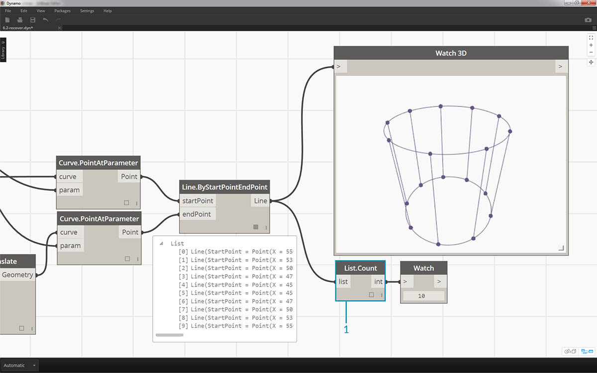
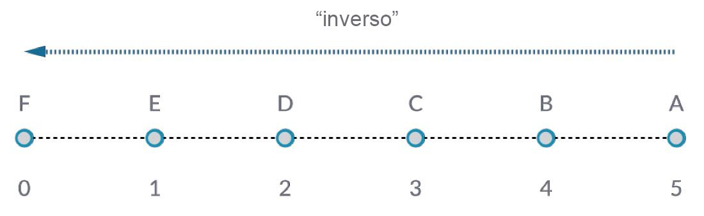
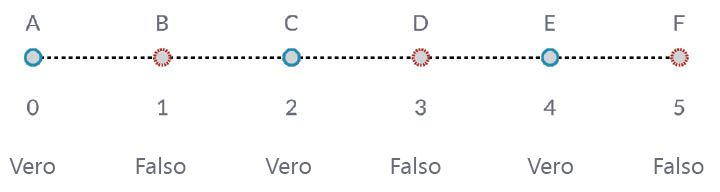
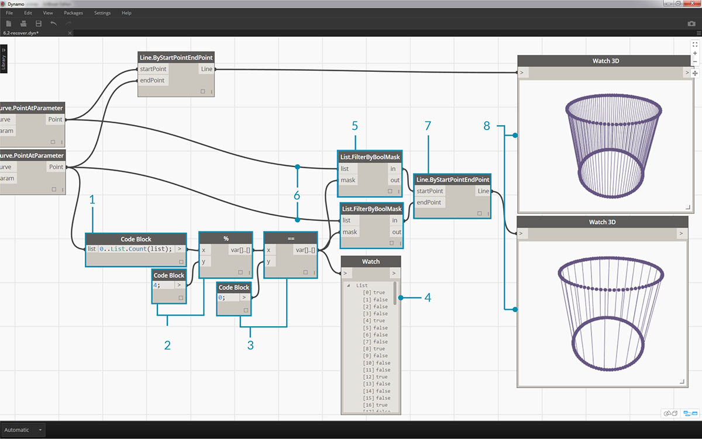

## Utilizzo di elenchi

Ora che è stato definito un elenco, si può parlare delle operazioni eseguibili su di esso. Si immagini un elenco come un mazzo di carte da gioco. Un mazzo è l'elenco e ogni carta da gioco rappresenta una voce.


> Foto di [Christian Gidlöf](https://commons.wikimedia.org/wiki/File:Playing_cards_modified.jpg)

Quali **query** è possibile eseguire dall'elenco? Consente di accedere alle proprietà esistenti.

* Numero di carte nel mazzo? 52.
* Numero di semi? 4.
* Materiale? Carta.
* Lunghezza? 3,5" o 89 mm.
* Larghezza? 2,5" o 64 mm.

Quali **azioni** è possibile eseguire nell'elenco? In questo modo l'elenco cambia in base ad una determinata operazione.

* È possibile mischiare il mazzo.
* È possibile ordinare il mazzo in base al valore.
* È possibile ordinare il mazzo in base al seme.
* È possibile dividere il mazzo.
* È possibile spartire il mazzo con singole mani.
* È possibile selezionare una carta specifica nel mazzo.

Tutte le operazioni elencate sopra hanno nodi di Dynamo analoghi per l'utilizzo di elenchi di dati generici. Nelle lezioni riportate di seguito saranno illustrate alcune delle operazioni fondamentali che è possibile eseguire sugli elenchi.

## Operazioni sugli elenchi

L'immagine riportata di seguito è il grafico di base che verrà utilizzato per mostrare le operazioni di base sugli elenchi. Verrà illustrato come gestire i dati all'interno di un elenco e mostrare i risultati visivi.

#### Esercizio - Operazioni sugli elenchi

> Scaricare il file di esempio fornito con questo esercizio (fare clic con il pulsante destro del mouse e scegliere Salva link con nome...): [List-Operations.dyn](datasets/6-2/List-Operations.dyn). Un elenco completo di file di esempio è disponibile nell'Appendice.


> 1. Iniziare con un *Code Block* con un valore di ```500;```.
2. Collegarlo all'input *x* di un nodo *Point.ByCoordinates*.
3. Collegare il nodo del passaggio precedente all'input origin di un nodo *Plane.ByOriginNormal*.
4. Utilizzando un nodo *Circle.ByPlaneRadius*, collegare il nodo del passaggio precedente all'input plane.
5. Utilizzando *Code Block*, designare un valore di ```50;``` per *radius*. Questo è il primo cerchio che verrà creato.
6. Con un nodo *Geometry.Translate*, spostare il cerchio verso l'alto di 100 unità nella direzione Z.
7. Con un nodo *Code Block*, definire un intervallo di dieci numeri compreso tra 0 e 1 con questa riga di codice: ```0..1..#10;```.
8. Collegare il Code Block del passaggio precedente all'input *param* di due nodi *Curve.PointAtParameter*. Collegare *Circle.ByPlaneRadius* all'input curve del nodo superiore e *Geometry.Translate* all'input curve del nodo sottostante.
9. Utilizzando *Line.ByStartPointEndPoint*, collegare i due nodi *Curve.PointAtParameter*.


> 1. Un nodo *Watch 3D* mostra i risultati di *Line.ByStartPointEndPoint*. Si stanno disegnando linee tra due cerchi per rappresentare le operazioni di base sugli elenchi e verrà utilizzato questo grafico di Dynamo di base per spiegare in maniera dettagliata le azioni sugli elenchi riportate di seguito.

### List.Count


> Il nodo *List.Count* è semplice: calcola il numero di valori in un elenco e restituisce tale numero. Questo nodo si diversifica sempre di più quando si utilizzano elenchi di elenchi, cosa che verrà dimostrata nelle sezioni successive.

#### Esercizio - List.Count

> Scaricare il file di esempio fornito con questo esercizio (fare clic con il pulsante destro del mouse e scegliere Salva link con nome...): [List-Count.dyn](datasets/6-2/List-Count.dyn). Un elenco completo di file di esempio è disponibile nell'Appendice.



> 1. Il nodo *List.Count* restituisce il numero di linee nel nodo *Line.ByStartPointEndPoint*. In questo caso, il valore è 10, che corrisponde al numero di punti creati dal nodo *Code Block* originale.

### List.GetItemAtIndex


> *List.GetItemAtIndex* è un modo fondamentale per eseguire una query su una voce dell'elenco. Nell'immagine riportata sopra, si sta utilizzando un indice di *"2"* per eseguire una query sul punto etichettato *"C"*.

#### Esercizio - List.GetItemAtIndex

> Scaricare il file di esempio fornito con questo esercizio (clic con il pulsante destro del mouse e Salva link con nome...): [List-GetItemAtIndex.dyn](datasets/6-2/List-GetItemAtIndex.dyn). Un elenco completo di file di esempio è disponibile nell'Appendice.


> 1. Utilizzando il nodo *List.GetItemAtIndex*, selezionare l'indice *"0"* o la prima voce dell'elenco di linee.
2. Il nodo *Watch 3D* mostra che è stata selezionata una linea. Nota: per ottenere l'immagine riportata sopra, assicurarsi di disattivare l'anteprima di *Line.ByStartPointEndPoint*.

### List.Reverse



> *List.Reverse* inverte l'ordine di tutte le voci di un elenco.

#### Esercizio - List.Reverse

> Scaricare il file di esempio fornito con questo esercizio (fare clic con il pulsante destro del mouse e scegliere Salva link con nome...): [List-Reverse.dyn](datasets/6-2/List-Reverse.dyn). Un elenco completo di file di esempio è disponibile nell'Appendice.


> 1. Per visualizzare correttamente l'elenco invertito di linee, creare più linee modificando Code Block in ```0..1..#100;```.
2. Inserire un nodo *List.Reverse* tra *Curve.PointAtParameter* e *Line.ByStartPointEndPoint* per uno degli elenchi di punti.
3. I nodi *Watch 3D* mostrano due risultati diversi. Il primo mostra il risultato senza un elenco invertito. Le linee si collegano verticalmente ai punti adiacenti. L'elenco invertito, tuttavia, collegherà tutti i punti all'ordine opposto nell'altro elenco.

### List.ShiftIndices


> *List.ShiftIndices* è un buono strumento per creare torsioni o modelli elicoidali o qualsiasi altra manipolazione di dati simile. Questo nodo sposta le voci di un elenco in base ad un determinato numero di indici.

#### Esercizio - List.ShiftIndices

> Scaricare il file di esempio fornito con questo esercizio (clic con il pulsante destro del mouse e Salva link con nome...): [List-ShiftIndices.dyn](datasets/6-2/List-ShiftIndices.dyn). Un elenco completo di file di esempio è disponibile nell'Appendice.


> 1. Nello stesso processo dell'elenco inverso, inserire *List.ShiftIndices* in *Curve.PointAtParameter* e *Line.ByStartPointEndPoint*.
2. Utilizzando un *Code Block*, è stato designato un valore di *"1"* per spostare l'elenco in base ad un indice.
3. Notare che la modifica è lieve, ma tutte le linee nel nodo *Watch 3D* inferiore sono state spostate in base ad un indice quando vengono collegate all'altro gruppo di punti.


> 1. Modificando *Code Block* in un valore superiore, ad esempio *"30"*, si noterà una differenza significativa nelle linee diagonali. In questo caso, lo spostamento funziona come il diaframma di una fotocamera, creando una torsione nella forma cilindrica originale.

### List.FilterByBooleanMask



> *List.FilterByBooleanMask* rimuoverà alcune voci in base ad un elenco di valori booleani o valori che riportano "true" o "false".

#### Esercizio - List.FilterByBooleanMask

> Scaricare il file di esempio fornito con questo esercizio (clic con il pulsante destro del mouse e Salva link con nome...): [List-FilterByBooleanMask.dyn](datasets/6-2/List-FilterByBooleanMask.dyn). Un elenco completo di file di esempio è disponibile nell'Appendice.



> Per creare un elenco di valori che riportano "true" o "false", è necessario un po' più di lavoro.

> 1. Utilizzando un *Code Block*, definire un'espressione con la sintassi: ```0..List.Count(list);```. Collegare il nodo *Curve.PointAtParameter* all'input *list*. Si esaminerà in maniera dettagliata questa configurazione nel capitolo sul blocco di codice, ma in questo caso la riga di codice fornisce un elenco che rappresenta ogni indice del nodo *Curve.PointAtParameter*.
2. Utilizzando un nodo *%* (modulo), collegare l'output di *Code Block* all'input *x* e un valore di *4* all'input *y*. Questo fornirà il resto quando si divide l'elenco di indici per 4. % (modulo) è un nodo molto utile per la creazione di modelli. Tutti i valori verranno letti come possibili resti di 4: 0, 1, 2, 3.
3. Dal nodo *%* (modulo), si sa che un valore di 0 indica che l'indice è divisibile per 4 (0, 4, 8 e così via). Utilizzando un nodo *"= ="*, è possibile verificare la divisibilità provando con un valore di *"0"*.
4. Il nodo *Watch* mostra solo questo: è presente un modello true/false che riporta: *true, false, false, false...*.
5. Utilizzando questo modello true/false, collegarlo all'input mask di due nodi *List.FilterByBooleanMask*.
6. Collegare il nodo *Curve.PointAtParameter* ad ogni input list per *List.FilterByBooleanMask*.
7. L'output di *Filter.ByBooleanMask* riporta *"in"* e *"out"*. *"In"* rappresenta i valori che hanno un valore mask di *"true"*, mentre *"out"* rappresenta i valori che hanno un valore di *"false"*. Collegando gli output *"in"* agli input *startPoint* ed *endPoint* di un nodo *Line.ByStartPointEndPoint*, è stato creato un elenco filtrato di linee.
8. Il nodo *Watch 3D* mostra che le linee sono minori dei punti. È stato selezionato solo il 25% dei nodi filtrando solo i valori true.

