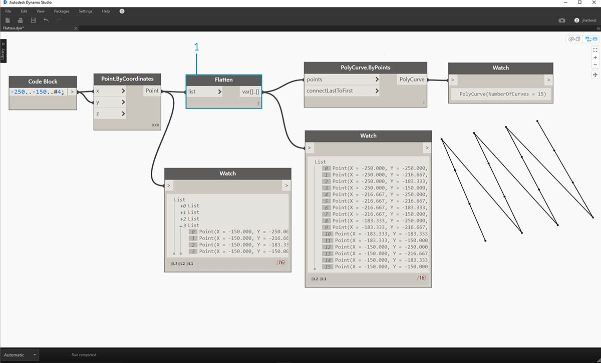
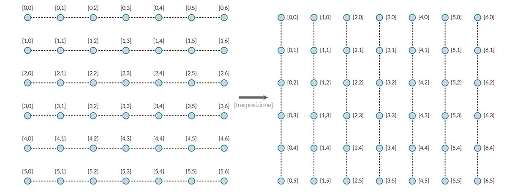
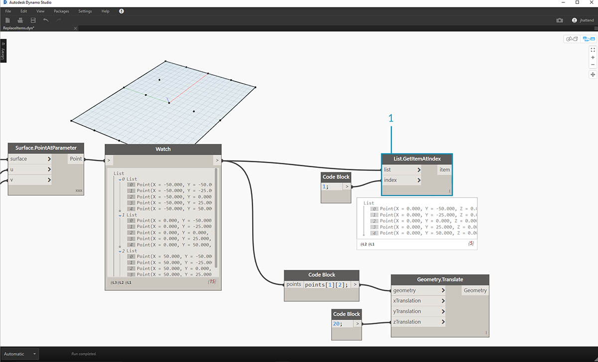
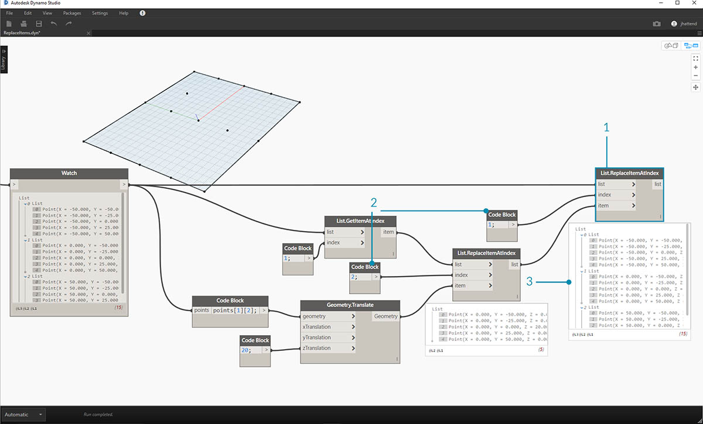
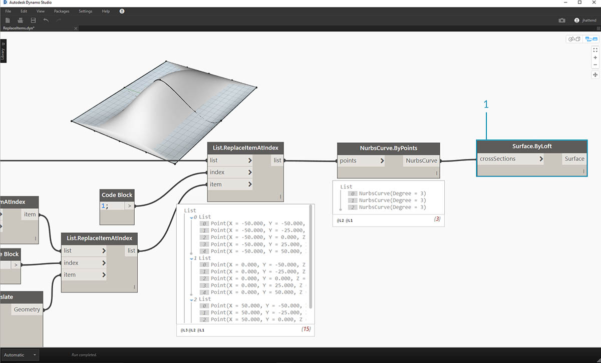

## Elenchi di elenchi

Si aggiunge un altro livello alla gerarchia. Se si prende il mazzo di schede dell'esempio originale e si crea una scatola che contiene più mazzi, la scatola ora rappresenta un elenco di mazzi e ogni mazzo rappresenta un elenco di carte. Questo è un elenco di elenchi. Per analogia in questa sezione, la scatola rossa riportata di seguito contiene un elenco di rotoli di monete e ogni rotolo contiene un elenco di penny.


> Foto di [Dori](https://commons.wikimedia.org/wiki/File:Stack_of_coins_0214.jpg).

Quali **query** è possibile eseguire dall'elenco di elenchi? Consente di accedere alle proprietà esistenti.

* Numero di tipi di moneta? 2.
* Valori del tipo di moneta? $0,01 e $0,25.
* Materiale dei quarti? Rame al 75% e nichel al 25%.
* Materiale dei penny? Zinco al 97,5% e rame al 2,5%.

Quali **azioni** è possibile eseguire nell'elenco di elenchi? In questo modo si modifica l'elenco di elenchi in base ad una determinata operazione.

* Selezionare una pila specifica di quarti o penny.
* Selezionare un quarto o un penny specifico.
* Ridisporre le pile di quarti e penny.
* Mischiare le pile insieme.

Anche in questo caso, Dynamo dispone di un nodo analogico per ciascuna delle operazioni riportate sopra. Poiché si sta lavorando con dati astratti e non con oggetti fisici, occorre una serie di regole per controllare il modo in cui ci spostiamo verso l'alto e verso il basso nella gerarchia dei dati.

Quando si utilizzano elenchi di elenchi, i dati sono stratificati e complessi, ma questo offre l'opportunità di eseguire alcune incredibili operazioni parametriche. Si esamineranno i principi fondamentali e si discuterà di alcune altre operazioni nelle lezioni riportate di seguito.

## Gerarchia dall'alto verso il basso

Il concetto fondamentale da apprendere da questa sezione: **Dynamo tratta gli elenchi come oggetti di per sé**. Questa gerarchia dall'alto verso il basso viene sviluppata tenendo a mente la programmazione orientata agli oggetti. Anziché selezionare elementi secondari con un comando quale List.GetItemAtIndex, Dynamo selezionerà tale indice dell'elenco principale nella struttura di dati. E quell'elemento può essere un altro elenco. Verrà esaminato dettagliatamente con un'immagine di esempio:

#### Esercizio - Gerarchia dall'alto verso il basso

> Scaricare il file di esempio fornito con questo esercizio (fare clic con il pulsante destro del mouse e scegliere Salva link con nome...): [Top-Down-Hierarchy.dyn](datasets/6-3/Top-Down-Hierarchy.dyn). Un elenco completo di file di esempio è disponibile nell'Appendice.


> 1. Con *Code Block*, sono stati definiti due intervalli:``` 0..2; 0..3; ```
2. Questi intervalli sono connessi ad un nodo *Point.ByCoordinates* con il collegamento impostato su *Prodotto vettoriale*. In questo modo viene creata una griglia di punti e viene inoltre restituito un elenco di elenchi come output.
3. Notare che il nodo *Watch* fornisce 3 elenchi con 4 elementi in ogni elenco.
4. Quando si utilizza *List.GetItemAtIndex*, con un indice 0, Dynamo seleziona il primo elenco e tutto il relativo contenuto. Altri programmi possono selezionare il primo elemento di ogni elenco nella struttura di dati, ma Dynamo utilizza una gerarchia dall'alto verso il basso durante la gestione dei dati.

### Livella e List.Flatten

Livella rimuove tutti i livelli di dati da una struttura di dati. Ciò è utile quando le gerarchie dei dati non sono necessarie per l'operazione desiderata, ma può essere rischioso perché rimuove le informazioni. L'esempio seguente mostra il risultato della riduzione di livelli di un elenco di dati.

#### Esercizio - Livella

> Scaricare il file di esempio fornito con questo esercizio (fare clic con il pulsante destro del mouse e scegliere Salva link con nome...): [Flatten.dyn](datasets/6-3/Flatten.dyn). Un elenco completo di file di esempio è disponibile nell'Appendice.


> 1. Inserire una riga di codice per definire un intervallo nel *blocco di codice*:``` -250..-150..#4; ```
2. Se si inserisce il *blocco di codice* nell'input *x* e *y* di un nodo *Point.ByCoordinates*, è necessario impostare il collegamento su *Prodotto vettoriale* per ottenere una griglia di punti.
3. Il nodo *Watch* mostra che è presente un elenco di elenchi.
4. Un nodo *PolyCurve.ByPoints* farà riferimento a ciascun elenco e creerà la rispettiva PolyCurve. Nell'anteprima di Dynamo, sono presenti quattro PolyCurve che rappresentano ogni riga della griglia.



> 1. Inserendo un *riduzione di livelli* prima del nodo PolyCurve, è stato creato un singolo elenco per tutti i punti. Il nodo PolyCurve fa riferimento ad un elenco per creare una curva. Poiché tutti i punti si trovano in un elenco, si otterrà una PolyCurve zig-zag che corre in tutto l'elenco di punti.

Sono inoltre disponibili opzioni per la riduzione di livelli isolati di dati. Utilizzando il nodo List.Flatten, è possibile definire un numero impostato di livelli di dati da ridurre nella parte superiore della gerarchia. Questo è uno strumento molto utile se sono presenti strutture di dati complesse che non sono necessariamente rilevanti per il workflow. Un'altra opzione consiste nell'utilizzare il nodo Flatten come funzione in List.Map. Di seguito sono riportate ulteriori informazioni su [List.Map](#listmap-and-listcombine).

### Suddivisione

Quando si utilizza la modellazione parametrica, talvolta può essere utile aggiungere più strutture di dati ad un elenco esistente. Anche per questo sono disponibili molti nodi, mentre la suddivisione è la versione più semplice. Con la suddivisione, è possibile suddividere un elenco in sottoelenchi con un determinato numero di elementi.

#### Esercizio - List.Chop

> Scaricare il file di esempio fornito con questo esercizio (fare clic con il pulsante destro del mouse e scegliere Salva link con nome...): [Chop.dyn](datasets/6-3/Chop.dyn). Un elenco completo di file di esempio è disponibile nell'Appendice.


> Un *List.Chop _with a _subLength* di 2 crea 4 elenchi con 2 elementi ciascuno.

Il comando di suddivisione suddivide gli elenchi in base ad una determinata lunghezza dell'elenco. In alcuni modi, il comando di suddivisione è l'opposto della riduzione di livelli: anziché rimuovere la struttura di dati, ad esso vengono aggiunti nuovi livelli. Questo è uno strumento utile per operazioni geometriche come l'esempio seguente.


### List.Map e List.Combine

List.Map/Combine applica una funzione impostata ad un elenco di input, ma ad un livello inferiore nella gerarchia. Le combinazioni sono identiche a quelle delle mappe, tranne per il fatto che le combinazioni possono avere più input corrispondenti all'input di una funzione specificata.

#### Esercizio - List.Map

*Nota: questo esercizio è stato creato con una versione precedente di Dynamo. In gran parte il funzionamento di List.Map è stato risolto con l'aggiunta della funzionalità List@Level. Per ulteriori informazioni, vedere [List@Level](#listlevel) di seguito.*

> Scaricare il file di esempio fornito con questo esercizio (fare clic con il pulsante destro del mouse e scegliere Salva link con nome...): [Map.dyn](datasets/6-3/Map.dyn). Un elenco completo di file di esempio è disponibile nell'Appendice.

Come introduzione rapida, si esaminerà il nodo List.Count di una sezione precedente.


> Il nodo *List.Count* conteggia tutti gli elementi di un elenco. Verrà utilizzato per illustrare il funzionamento di *List.Map*.


> 1. Inserire due righe di codice nel *blocco di codice*:

```
-50..50..#Nx;
-50..50..#Ny;
```

Dopo aver digitato questo codice, il blocco di codice creerà due input per Nx e Ny.

2. Con due *dispositivi di scorrimento dei numeri interi*, definire i valori *Nx* e *Ny* collegandoli al *blocco di codice*.
3. Collegare ogni riga del blocco di codice ai rispettivi input *X* e *Y* di un nodo *Point.ByCoordinates*. Fare clic con il pulsante destro del mouse sul nodo e modificare Collegamento in *Prodotto vettoriale*. In questo modo viene creata una griglia di punti. Poiché è stato definito l'intervallo da -50 a 50, la griglia di Dynamo di default viene estesa.
4. Un nodo *Watch* mostra i punti creati. Notare la struttura di dati. È stato creato un elenco di elenchi. Ogni elenco rappresenta una riga di punti della griglia.


> 1. Associare un nodo *List.Count* all'output del nodo Watch del passaggio precedente.
2. Collegare un nodo *Watch* all'output List.Count.

Notare che il nodo List.Count fornisce un valore pari a 5. Questo valore è uguale alla variabile "Nx" come definito nel blocco di codice. Perché?

* Innanzitutto, il nodo Point.ByCoordinates utilizza l'input "x" come input principale per la creazione di elenchi. Quando Nx è 5 e Ny è 3, viene visualizzato un elenco di 5 elenchi, ciascuno con 3 elementi.
* Poiché Dynamo tratta gli elenchi come oggetti di per sé, all'elenco principale della gerarchia viene applicato un nodo List.Count. Il risultato è un valore di 5 o il numero di elenchi nell'elenco principale.


> 1. Utilizzando un nodo *List.Map*, si scende di un livello nella gerarchia ed è possibile eseguire una *"function"* a questo livello.
2. Notare che il nodo *List.Count* non contiene input. Viene utilizzato come funzione, pertanto il nodo *List.Count* verrà applicato a ogni singolo elenco, scendendo di un livello nella gerarchia. L'input vuoto di *List.Count* corrisponde all'input dell'elenco di *List.Map*.
3. I risultati di *List.Count* ora forniscono un elenco di 5 elementi, ciascuno con un valore pari a 3. Rappresenta la lunghezza di ogni sottoelenco.

#### Esercizio - List.Combine

*Nota: questo esercizio è stato creato con una versione precedente di Dynamo. In gran parte, il funzionamento di List.Combine è stato risolto con l'aggiunta della funzionalità List@Level. Per ulteriori informazioni, vedere *[*List@Level*](#listlevel)* di seguito.*

> Scaricare il file di esempio fornito con questo esercizio (fare clic con il pulsante destro del mouse e scegliere Salva link con nome...): [Combine.dyn](datasets/6-3/Combine.dyn). Un elenco completo di file di esempio è disponibile nell'Appendice.

In questo esercizio, verrà utilizzata una logica simile a List.Map, ma con più elementi. In questo caso, si desidera dividere un elenco di curve in base a un numero di punti univoco.


> 1. Utilizzando il *blocco di codice*, definire un intervallo utilizzando la sintassi ```..20..#4; ```e un valore di ```20; ``` sotto tale linea.
2. Collegare il *blocco di codice* a due nodi *Point.ByCoordinates*.
3. Creare un *Line.ByStartPointEndPoint* dai nodi *Point.ByCoordinates*.
4. Il nodo *Watch* mostra quattro linee.


> 1. Sotto il grafico per la creazione delle linee, si desidera utilizzare _code block _per creare quattro intervalli distinti per dividere le linee in modo univoco. Questa operazione viene eseguita con le seguenti righe di codice:
```
0..1..#3;
0..1..#4;
0..1..#5;
0..1..#6;
```

2. Con un nodo *List.Create*, verranno unite le quattro linee del *blocco di codice* in un elenco.
3. Il nodo *Watch* mostra un elenco di elenchi.


> 1. *Curve.PointAtParameter* non funziona collegando le linee direttamente ai valori dei *parametri*. Occorre scendere di un livello nella gerarchia. Per questo, verrà utilizzato *List.Combine*.


> Utilizzando *List.Combine*, possiamo dividere correttamente ogni linea in base agli intervalli specificati. Questa operazione diventa un po' difficile, quindi verrà esaminata in profondità.

> 1. Innanzitutto, aggiungere un nodo *Curve.PointAtParameter* all'area di disegno. Si tratterà di *"funzione" _o *"combinatore"* che applicheremo al nodo _List.Combine*. Questo argomento verrà discusso più avanti.
2. Aggiungere un nodo *List.Combine* all'area di disegno. Fare clic su *"+"* o *"-"* per aggiungere o sottrarre input. In questo caso, verranno utilizzati i due input di default nel nodo.
3. Si desidera collegare il nodo *Curve.PointAtParameter* all'input *"comb"* di *List.Combine*. E un nodo più importante: assicurarsi di fare clic con il pulsante destro del mouse sull'*input "param" _ di _Curve.PointAtParameter* e deselezionare *"Usa valore di default"*. I valori di default negli input di Dynamo devono essere rimossi durante l'esecuzione di un nodo come funzione. In altre parole, è necessario considerare i valori di default come se fossero stati collegati altri nodi. Per questo motivo, è necessario rimuovere i valori di default in questo caso.
4. Sono presenti due input, le linee e i parametri per creare i punti. Ma come è possibile collegarli agli input di *List.Combine* e in quale ordine?
5. Gli input vuoti di *Curve.PointAtParameter*, dall'alto verso il basso, devono essere riempiti nel combinatore nello stesso ordine. Perciò, le linee sono inserite in *list1* di *List.Combine*.
6. Seguendo l'esempio, i valori dei parametri vengono inseriti nell'input *list2* di *List.Combine*.
7. Il nodo *Watch* e l'anteprima di Dynamo mostrano che sono presenti quattro linee, ciascuna divisa in base agli intervalli del *blocco di codice*.

### List@Level

Preferita a List.Map, la funzionalità List@Level consente di selezionare direttamente il livello di elenco che si desidera utilizzare direttamente nella porta di input del nodo. Questa funzionalità può essere applicata a qualsiasi input in entrata di un nodo e consentirà di accedere ai livelli degli elenchi più rapidamente e più facilmente rispetto ad altri metodi. È sufficiente indicare al nodo il livello dell'elenco che si desidera utilizzare come input e lasciare che il nodo faccia il resto.

#### Esercizio - List@Level

In questo esercizio, si utilizzerà la funzionalità List@Level per isolare un livello specifico di dati.

> Scaricare il file di esempio fornito con questo esercizio (fare clic con il pulsante destro del mouse e scegliere Salva link con nome...): [List@Level](datasets/6-3/Listatlevel.dyn). Un elenco completo di file di esempio è disponibile nell'Appendice.


> 1. Si inizierà con una semplice griglia di punti 3D.
2. Poiché la griglia è costruita con un intervallo per X, Y e Z, i dati sono strutturati in 3 ordini: un elenco X, un elenco Y e un elenco Z.
3. Questi ordini esistono in **livelli** diversi. I livelli sono indicati nella parte inferiore del simbolo circolare di anteprima. Le colonne dei livelli di elenco corrispondono ai dati dell'elenco riportati sopra per aiutare ad identificare il livello da utilizzare.
4. I livelli di elenco sono organizzati in ordine inverso, in modo che i dati del livello più basso siano sempre in "L1". In questo modo si garantisce che i grafici funzionino come previsto, anche se qualcosa è cambiato a monte.


> 1. Per utilizzare la funzione List@Level, fare clic su '>'. All’interno di questo menu, verranno visualizzate due caselle di controllo.
2. **Usa livelli**: attiva la funzionalità List@Level. Dopo aver fatto clic su questa opzione, sarà possibile fare clic e selezionare i livelli di elenco di input che si desidera utilizzare per il nodo. Con questo menu, è possibile provare rapidamente diverse opzioni di livello facendo clic verso l'alto o verso il basso.
3. **Mantieni struttura elenco**: se questa opzione è attivata, sarà possibile mantenere la struttura dei livelli dell'input. Talvolta, è possibile organizzare i dati in sottoelenchi in modo specifico. Selezionando questa opzione, è possibile mantenere intatta l'organizzazione degli elenchi senza perdere alcuna informazione.

Grazie alla semplice griglia 3D, è possibile accedere alla struttura dell'elenco e visualizzarla attivando e disattivando i livelli di elenchi. Ogni combinazione di indice e livello di elenco restituirà un gruppo di punti diverso dell'insieme 3D originale.


> 1. "@L2" in DesignScript consente di selezionare solo l'elenco al livello 2.
2. L'elenco al livello 2 con l'indice 0 include solo il primo gruppo di punti Y, restituendo solo la griglia XZ.
3. Se si modifica il filtro del livello in "L1", sarà possibile vedere tutto nel primo livello di elenco. L'elenco al livello 1 con indice 0 include tutti i punti 3D in un elenco non strutturato.
4. Se si prova la stessa procedura per "L3", sarà possibile vedere solo i punti del terzo livello di elenco. L'elenco al livello 3 con l'indice 0 include solo il primo gruppo di punti Z, restituendo solo una griglia XY.
5. Se si prova la stessa procedura per "L4", sarà possibile vedere solo i punti del terzo livello di elenco. L'elenco al livello 4 con l'indice 0 include solo il primo gruppo di punti X, restituendo solo una griglia YZ.

Sebbene questo esempio particolare possa essere creato anche con List.Map, List@Level semplifica notevolmente l'interazione, semplificando così l'accesso ai dati dei nodi. Di seguito è riportato un confronto tra i metodi List.Map e List@Level:


> 1. Sebbene entrambi i metodi consentano di accedere agli stessi punti, il metodo List@Level ci consente di passare facilmente da un livello di dati all'altro all'interno di un singolo nodo.
2. Per accedere a una griglia di punti con List.Map, sarà necessario disporre di un nodo List.GetItemAtIndex insieme a List.Map. Per ogni livello di elenco inferiore, sarà necessario utilizzare un nodo List.Map aggiuntivo. A seconda della complessità degli elenchi, potrebbe essere necessario aggiungere una quantità significativa di nodi List.Map al grafico per accedere al livello di informazioni appropriato.
3. In questo esempio, un nodo List.GetItemAtIndex con un nodo List.Map restituisce lo stesso gruppo di punti con la stessa struttura dell'elenco di List.GetItemAtIndex con '@L3' selezionato.

### Trasponi

Trasponi è una funzione fondamentale quando si lavora con elenchi di elenchi. Come nei programmi con fogli di calcolo, una trasposizione inverte le colonne e le righe di una struttura di dati. Verrà mostrata questa funzione con una matrice di base di seguito e nella seguente sezione sarà illustrato come utilizzare un trasposizione per creare relazioni geometriche.



#### Esercizio - List.Transpose

> Scaricare il file di esempio fornito con questo esercizio (fare clic con il pulsante destro del mouse e scegliere Salva link con nome...): [Transpose.dyn](datasets/6-3/Transpose.dyn). Un elenco completo di file di esempio è disponibile nell'Appendice.


> Si eliminano i nodi *List.Count* dell'esercizio precedente e si passa ad una geometria per vedere la struttura di dati.

> 1. Collegare un nodo *PolyCurve.ByPoints* all'output del nodo Watch da *Point.ByCoordinates*.
2. L'output mostra 5 PolyCurve e le curve vengono visualizzate nell'anteprima di Dynamo. Il nodo di Dynamo sta cercando un elenco di punti (o un elenco di elenchi di punti in questo caso) e sta creando una singola PolyCurve da essi. Essenzialmente, ogni elenco è stato convertito in una curva nella struttura di dati.


> 1. Se si desidera isolare una riga di curve, è necessario utilizzare il nodo *List.GetItemAtIndex*.
2. Utilizzando un valore del *blocco di codice* pari a 2, eseguire una query sul terzo elemento dell'elenco principale.
3. *PolyCurve.ByPoints* fornisce una curva, in quanto un solo elenco è collegato al nodo.


> 1. Un nodo *List.Transpose* sposterà tutti gli elementi con tutti gli elenchi in un elenco di elenchi. Ciò risulta complicato, ma si tratta della stessa logica della trasposizione in Microsoft Excel: il passaggio tra colonne e righe in una struttura di dati.
2. Notare il risultato astratto: la trasposizione ha modificato la struttura dell'elenco da 5 elenchi con 3 elementi ciascuno a 3 elenchi con 5 elementi ciascuno.
3. Notare il risultato geometrico: utilizzando *PolyCurve.ByPoints*, si ottengono 3 PolyCurve nella direzione perpendicolare alle curve originali.

### Creazione del blocco di codice

La sintassi abbreviata del blocco di codice utilizza "[]" per definire un elenco. Questo è un modo molto più rapido e più fluido per creare un elenco rispetto al nodo List.Create. Il blocco di codice viene descritto in dettaglio nel capitolo 7. Fare riferimento all'immagine seguente per osservare come è possibile definire un elenco con più espressioni con un blocco di codice.


### Query sul blocco codice

La sintassi abbreviata del blocco di codice utilizza "[]" come metodo rapido e semplice per selezionare gli elementi specifici desiderati da una struttura di dati complessa. I blocchi di codice vengono trattati in modo più dettagliato nel capitolo 7. Fare riferimento all'immagine seguente per osservare come è possibile eseguire query su un elenco con più tipi di dati con un blocco di codice.


### Esercizio - Esecuzione di query e inserimento di dati

> Scaricare il file di esempio fornito con questo esercizio (fare clic con il pulsante destro del mouse e scegliere Salva link con nome...): [ReplaceItems.dyn](datasets/6-3/ReplaceItems.dyn). Un elenco completo di file di esempio è disponibile nell'Appendice.

In questo esercizio viene utilizzata una parte della logica stabilita in un esercizio precedente per modificare una superficie. L'obiettivo è intuitivo, ma la navigazione nella struttura di dati risulterà più impegnativa. Si desidera articolare una superficie spostando un punto di controllo.


> 1. Iniziare con la stringa di nodi riportata sopra. Si sta creando una superficie di base che estende la griglia di default di Dynamo.
2. Utilizzando il *blocco di codice*, inserire queste due righe di codice e collegarle rispettivamente agli input *u* e *v* di *Surface.PointAtParameter*:
```
-50..50..#3;
-50..50..#5;
```

3. Assicurarsi di impostare il collegamento di *Surface.PointAtParameter* su *Prodotto vettoriale*.
4. Il nodo *Watch* mostra che è presente un elenco di tre elenchi, ciascuno con 5 elementi.


> In questo passaggio, si desidera eseguire una query sul punto centrale nella griglia creata. Per eseguire questa operazione, selezionare il punto centrale nell'elenco centrale. Ha senso, giusto?

> 1. Per confermare che si tratta del punto corretto, è anche possibile fare clic sugli elementi del nodo Watch per confermare che è quello corretto.
2. Utilizzando il *blocco di codice*, si scriverà una riga di codice di base per l'esecuzione di una query su un elenco di elenchi:<br xmlns="http://www.w3.org/1999/xhtml"/>```points[1][2];```
3. Utilizzando *Geometry.Translate*, si sposterà il punto selezionato verso l'alto nella direzione *Z* di *20* unità.



> 1. Selezionare anche la riga centrale dei punti con un nodo *List.GetItemAtIndex*. Nota: analogamente a un passaggio precedente, è anche possibile eseguire una query sull'elenco con il *blocco di codice*, utilizzando una riga di ```points[1];```.


> Finora è stata eseguita correttamente la query sul punto centrale ed è stato spostato verso l'alto. Ora è necessario reinserire il punto spostato nella struttura di dati originale.

> 1. Innanzitutto, si desidera sostituire l'elemento dell'elenco isolato in un passaggio precedente.
2. Utilizzando *List.ReplaceItemAtIndex*, si sostituirà l'elemento centrale utilizzando un indice di *"2"*, con l'elemento sostitutivo collegato al punto spostato (*Geometry.Translate*).
3. L'output mostra che è stato inserito il punto spostato nell'elemento centrale dell'elenco.



> Dopo aver modificato l'elenco, è necessario reinserire l'elenco nella struttura di dati originale, ovvero l'elenco di elenchi.

> 1. Seguendo la stessa logica, utilizzare *List.ReplaceItemAtIndex* per sostituire l'elenco centrale con l'elenco modificato.
2. Notare che i *blocchi di codice* che definiscono l'indice per questi due nodi sono 1 e 2, che corrisponde alla query originale del *blocco di codice* (*points[1][2]*).
3. Selezionando l'elenco in corrispondenza dell'*index 1*, viene visualizzata la struttura di dati evidenziata nell'anteprima di Dynamo. Il punto spostato è stato unito correttamente nella struttura di dati originale.


> Esistono molti modi per creare una superficie da questo gruppo di punti. In questo caso, si creerà una superficie eseguendo il loft delle curve insieme.

> 1. Creare un nodo *NurbsCurve.ByPoints* e collegare la nuova struttura di dati per creare tre curve NURBS.



> 1. Collegare un nodo *Surface.ByLoft* all'output di *NurbsCurve.ByPoints*. Ora è presente una superficie modificata. È possibile modificare il valore *Z* originale della geometria. Eseguire la traslazione e osservare l’aggiornamento della geometria.

