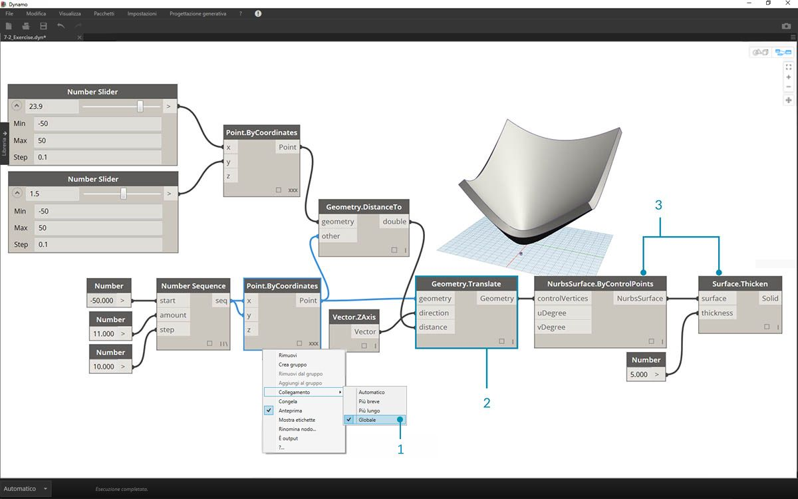
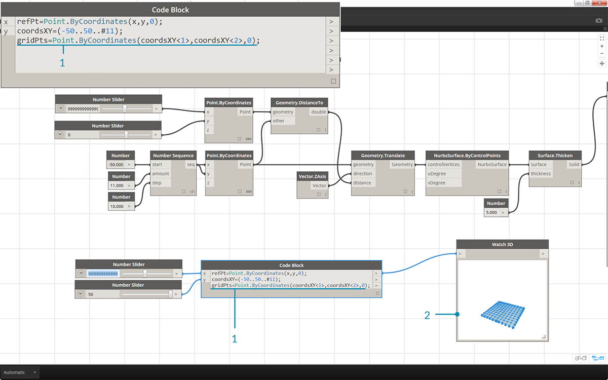
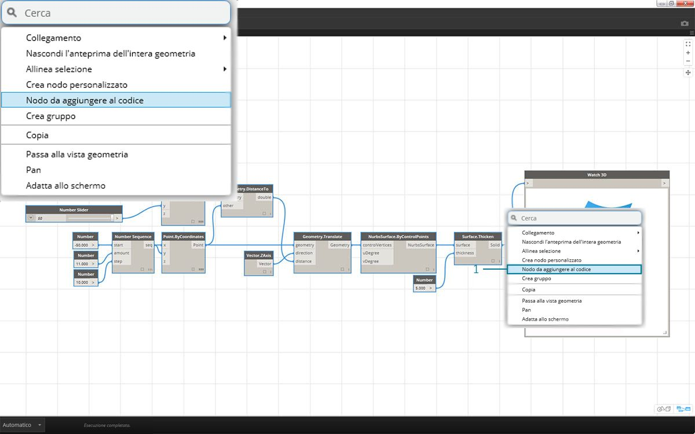

## Sintassi di DesignScript

Nei nomi dei nodi di Dynamo è possibile aver notato un tema comune: ogni nodo utilizza una sintassi *"."* senza spazi. Questo perché il testo nella parte superiore di ogni nodo rappresenta la sintassi effettiva per lo scripting e *"."* (o *notazione con punto*) separa un elemento dai metodi possibili che è possibile chiamare. In questo modo è possibile creare una facile conversione dallo scripting visivo nello scripting basato su testo.


Come analogia generale per la notazione con punto, in che modo è possibile gestire una mela parametrica in Dynamo? Di seguito sono riportati alcuni metodi che si eseguiranno sulla mela prima di decidere di mangiarla (nota: questi non sono metodi di Dynamo effettivi):

|Leggibile dall'uomo|Notazione con punto|Output|
| -- | -- | -- |
|Di che colore è la mela?|Apple.color|rosso|
|La mela è matura?|Apple.isRipe|true|
|Quanto pesa la mela?|Apple.weight|170 gr|
|Da dove è venuta la mela?|Apple.parent|albero|
|Cosa crea la mela?|Apple.children|semi|
|Questa mela è cresciuta localmente?|Apple.distanceFromOrchard|circa 96 km|

Non so quello che pensate, ma a giudicare dagli output nella tabella riportata sopra, sembra una mela gustosa. Il risultato è *Apple.eat()*.

### Notazione con punto in Code Block

Tenendo presente l'analogia con la mela, si esaminerà *Point.ByCoordinates* e sarà mostrato com'è possibile creare un punto utilizzando Code Block:


> La sintassi di *Code Block* ```Point.ByCoordinates(0,10);``` fornisce lo stesso risultato di un nodo *Point.ByCoordinates* in Dynamo, tranne per il fatto che è possibile creare un punto utilizzando un nodo. Ciò è più efficiente rispetto al collegamento di un nodo separato in *X* e *Y*.

> 1. Utilizzando *Point.ByCoordinates* in Code Block, si specificano gli input nello stesso ordine del nodo predefinito *(X,Y)*.

### Chiamata dei nodi

È possibile chiamare qualsiasi nodo normale nella libreria tramite Code Block, purché il nodo non sia un *nodo "UI"* speciale: quelli con una funzionalità speciale dell'interfaccia utente. Ad esempio, è possibile chiamare *Circle.ByCenterPointRadius*, ma non sarebbe molto utile chiamare un nodo *Watch 3D*.

I nodi regolari (nella maggior parte della libreria) in genere sono di tre tipi:

* **Crea**: consente di creare (o costruire) un elemento.
* **Azione**: consente di eseguire un'azione su un elemento.
* **Query**: consente di ottenere una proprietà di un elemento già esistente.

Si scoprirà che la libreria è organizzata in base a queste categorie. I metodi, o nodi, di questi tre tipi vengono trattati in modo diverso quando vengono richiamati all'interno di Code Block.


#### Crea

La categoria Crea costruirà la geometria da zero. I valori vengono immessi in Code Block da sinistra a destra. Questi input sono nello stesso ordine degli input nel nodo dall'alto verso il basso: 

> Confrontando il nodo *Line.ByStartPointEndPoint* e la sintassi corrispondente in Code Block, si ottengono gli stessi risultati.

#### Azione

Un'azione è un'operazione che si esegue su un oggetto di quel tipo. In Dynamo si utilizza la *notazione con punto*, comune a molti linguaggi di codifica, per applicare un'azione ad un elemento. Una volta ottenuto l'elemento, digitare un punto, quindi il nome dell'azione. L'input del metodo di tipo Azione viene inserito tra parentesi, come i metodi di tipo Crea, solo che non è necessario specificare il primo input visualizzato nel nodo corrispondente. È necessario specificare invece l'elemento su cui si sta eseguendo l'azione:


> 1. Il nodo *Point.Add *è un nodo di tipo Azione, pertanto la sintassi funziona in modo leggermente diverso.
2. Gli input sono (1) *Point* e (2) *Vector* da aggiungere ad esso. In *Code Block*, è stato denominato il punto (l'elemento) *"pt"*. Per aggiungere un vettore denominato *"vec" *a *"pt"*, è necessario scrivere *pt.Add(vec)* o: elemento, punto, azione. L'azione Add presenta solo un input o tutti gli input del nodo *Point.Add *meno il primo. Il primo input per il nodo *Point.Add *è il punto stesso.

#### Query

I metodi di tipo Query consentono di ottenere una proprietà di un oggetto. Poiché l'oggetto stesso è l'input, non è necessario specificare alcun input. Non sono richieste parentesi.


### Informazioni sul collegamento

Il collegamento con i nodi è piuttosto diverso dal collegamento con il blocco di codice. Con i nodi, l'utente fa clic con il pulsante destro del mouse sul nodo e seleziona l'opzione Collegamento da eseguire. Con il blocco di codice, l'utente dispone di un maggiore controllo sulla modalità di strutturazione dei dati. Il metodo abbreviato del blocco di codice utilizza *guide di replica* per impostare il modo in cui occorre associare diversi elenchi unidimensionali. I numeri tra parentesi angolari "<>" definiscono la gerarchia dell'elenco nidificato risultante: <1>,<2>,<3> e così via. 


> 1. In questo esempio, si utilizza un metodo abbreviato per definire due intervalli (ulteriori informazioni sul metodo abbreviato saranno fornite nella sezione seguente di questo capitolo). In breve, ```0..1;``` è equivalente a ```{0,1}``` e ```-3..-7```è equivalente a ```{-3,-4,-5,-6,-7}```. Il risultato offre un elenco di 2 valori X e 5 valori Y. Se non si utilizzano le guide di replica con questi elenchi non corrispondenti, si ottiene un elenco di due punti, che rappresenta la lunghezza dell'elenco più breve. Utilizzando le guide di replica, è possibile trovare tutte le combinazioni possibili di 2 e 5 coordinate (o **Prodotto cartesiano**).
2. Utilizzando la sintassi ```Point.ByCoordinates(x_vals<1>,y_vals<2>);``` si ottengono **due** elenchi con **cinque** voci in ogni elenco.
3. Utilizzando la sintassi ```Point.ByCoordinates(x_vals<2>,y_vals<1>);``` si ottengono **cinque** elenchi con **due** voci in ogni elenco.

Con questa notazione, è possibile anche specificare quale elenco sarà dominante: 2 elenchi di 5 cose o 5 elenchi di 2 cose. Nell'esempio, la modifica dell'ordine delle guide di replica restituisce come risultato un elenco di righe di punti o un elenco di colonne di punti in una griglia.

### Nodo da aggiungere al codice

Sebbene i metodi del blocco di codice riportati sopra possano richiedere del tempo per acquisire familiarità, in Dynamo è disponibile una funzionalità denominata Nodo da aggiungere al codice che facilita il processo. Per utilizzare questa funzionalità, selezionare una serie di nodi nel grafico di Dynamo, fare clic con il pulsante destro del mouse sull'area di disegno e selezionare Nodo da aggiungere al codice. In Dynamo vengono compressi questi nodi in un blocco di codice, con tutti gli input e gli output. Questo non è solo un ottimo strumento per apprendere il blocco di codice, ma consente anche di utilizzare un grafico di Dynamo più efficiente e parametrico. Per concludere l'esercizio riportato di seguito, utilizzare Nodo da aggiungere al codice.


### Esercizio

> Scaricare il file di esempio fornito con questo esercizio (fare clic con il pulsante destro del mouse e scegliere Salva link con nome...). Un elenco completo di file di esempio è disponibile nell'Appendice. [Dynamo-Syntax_Attractor-Surface.dyn](datasets/7-2/Dynamo-Syntax_Attractor-Surface.dyn)

Per mostrare l'efficacia del blocco di codice, verrà convertita una definizione di campo attrattore esistente nel formato blocco di codice. L'utilizzo di una definizione esistente dimostra come il blocco di codice si correla allo scripting visivo ed è utile per apprendere la sintassi di DesignScript. 

> Iniziare ricreando la definizione nell'immagine riportata sopra (o aprendo il file di esempio).

> 1. Notare che il collegamento in *Point.ByCoordinates* è stato impostato su *Prodotto cartesiano*.
2. Ogni punto di una griglia viene spostato verso l'alto nella direzione Z in base alla sua distanza dal punto di riferimento.
3. Viene ricreata e ispessita una superficie, creando una bombatura nella geometria rispetto alla distanza dal punto di riferimento.


> 1. A partire dall'inizio, definire prima il punto di riferimento: ```Point.ByCoordinates(x,y,0);```. Viene utilizzata la stessa sintassi di *Point.ByCoordinates* specificata nella parte superiore del nodo del punto di riferimento.
2. Le variabili *x* e *y* vengono inserite nel blocco di codice in modo che sia possibile aggiornarle dinamicamente con i dispositivi di scorrimento.
3. Aggiungere alcuni *dispositivi di scorrimento* agli input di *Code Block* che vanno da *-50* a *50*. In questo modo, è possibile estendersi in tutta la griglia di default di Dynamo.


> 1. Nella seconda riga di *Code Block*, verrà definito un metodo abbreviato per sostituire il nodo della sequenza numerica: ```coordsXY = (-50..50..#11);```. Se ne discuterà più in dettaglio nella prossima sezione. Per il momento, notare che questo metodo abbreviato è equivalente al nodo *Number Sequence* nello script visivo.



> 1. A questo punto, si desidera creare una griglia di punti dalla sequenza *coordsXY*. A tale scopo, si desidera utilizzare la sintassi di *Point.ByCoordinates*, ma è anche necessario avviare un *Prodotto cartesiano* dell'elenco nello stesso modo di quello utilizzato nello script visivo. A tale scopo, digitare la riga: ```gridPts = Point.ByCoordinates(coordsXY<1>,coordsXY<2>,0);```. Le parentesi angolari indicano il riferimento Prodotto cartesiano.
2. Notare nel nodo *Watch3D* che è presente una griglia di punti nella griglia di Dynamo.


> 1. Ora per la parte complessa: si desidera spostare la griglia di punti verso l'alto in base alla loro distanza dal punto di riferimento. Innanzitutto, denominare questo nuovo gruppo di punti *transPts*. E poiché la conversione è un'azione su un elemento esistente, anziché utilizzare ```Geometry.Translate...```, utilizzare ```gridPts.Translate```.
2. Leggendo dal nodo effettivo nell'area di disegno, si noterà che sono presenti tre input. La geometria da convertire è già stata dichiarata perché si sta eseguendo l'azione su quell'elemento (con *gridPts.Translate*). I due input rimanenti verranno inseriti tra le parentesi della funzione: *direction* e *distance*.
3. La direzione è abbastanza semplice. Per spostarla verticalmente, utilizzare ```Vector.ZAxis()```.
4. La distanza tra il punto di riferimento e ogni punto della griglia deve ancora essere calcolata, pertanto è necessario eseguire questa operazione come azione per il punto di riferimento nello stesso modo: ```refPt.DistanceTo(gridPts)```.
5. La riga di codice finale restituisce i punti convertiti: ```transPts = gridPts.Translate(Vector.ZAxis(),refPt.DistanceTo(gridPts));```.


> 1. Ora si ha una griglia di punti con la struttura di dati appropriata per creare una superficie NURBS. La superficie viene costruita utilizzando ```srf = NurbsSurface.ByControlPoints(transPts);```.


> 1. E infine, per aggiungere profondità alla superficie, costruire un solido utilizzando ```solid = srf.Thicken(5);```. In questo caso, la superficie è stata ispessita di 5 unità nel codice, ma la si potrebbe sempre dichiarare come variabile (ad esempio, chiamandola *thickness*) e poi controllare quel valore con un dispositivo di scorrimento.

### Semplificazione del grafico con Nodo da aggiungere al codice

La funzionalità Nodo da aggiungere al codice consente di automatizzare l'intero esercizio appena completato facendo clic su un pulsante. Questa funzione non solo è efficiente per la creazione di definizioni personalizzate e blocchi di codice riutilizzabili, ma è anche uno strumento molto utile per apprendere come eseguire lo script in Dynamo:



> 1. Iniziare con lo script visivo esistente del passaggio 1 dell'esercizio. Selezionare tutti i nodi, fare clic con il pulsante destro del mouse sull'area di disegno e selezionare *Nodo da aggiungere al codice*. È semplicissimo.


> Dynamo dispone di una versione automatizzata basata su testo del grafico visivo, del collegamento e di tutto il resto. Verificare tutto questo negli script visivi e sfruttare la potenza del blocco di codice.

