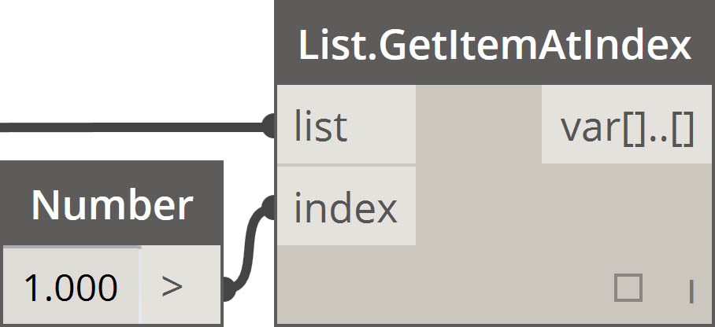
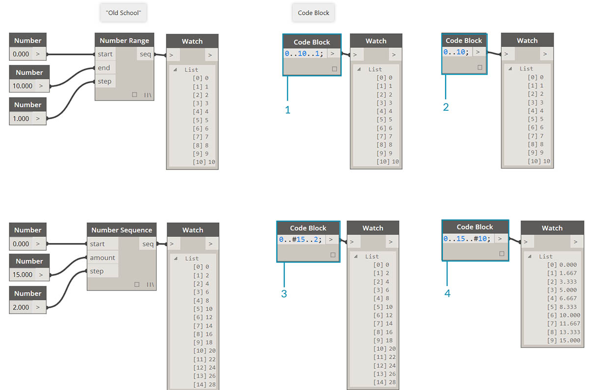
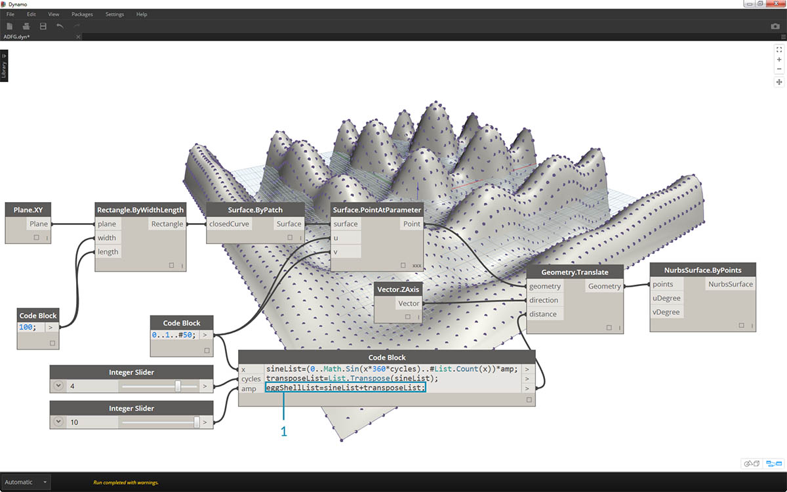
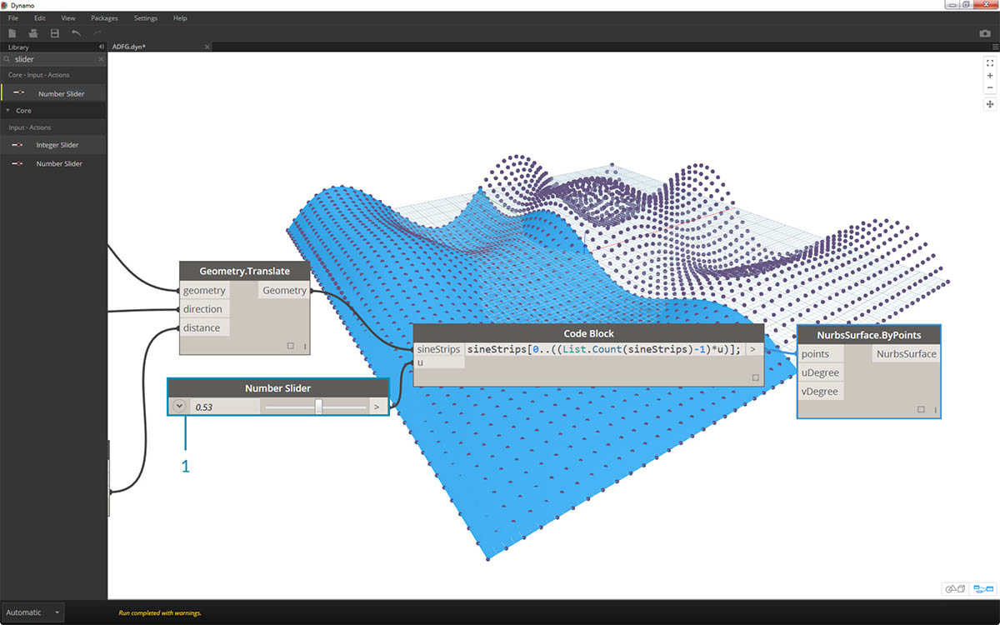

<style>
table{box-shadow: 2px 2px 2px #BBBBBB;max-width:75%;display:block;margin-left: auto;   margin-right: auto }
img{display:block;margin-left: auto;   margin-right: auto }
</style>

## Sintassi abbreviata

Nel blocco di codice esistono alcuni metodi di sintassi abbreviata di base che, in poche parole, rendono la gestione dei dati *molto* più facile. Le nozioni di base riportate di seguito verranno analizzate e sarà descritto come utilizzare questa sintassi abbreviata sia per la creazione che per l'esecuzione di una query sui dati.

<table>
    <tr>
    <td width="50%"><b>Tipo dati</b></td>
    <td width="25%"><b>Dynamo standard</b> </td>
    <td width="25%"><b>Equivalente a Code Block</b></td>
  </tr>
  <tr>
    <td> Numeri</td>
    <td></img> </td>
    <td></img></td>
  </tr>
  <tr>
    <td>Stringhe</td>
    <td></img> </td>
    <td></img></td>
  </tr>
  <tr>
    <td>Sequenze</td>
    <td></img> </td>
    <td></img></td>
  </tr>
  <tr>
    <td>Intervalli</td>
    <td></img> </td>
    <td></img></td>
  </tr>
  <tr>
    <td>Recupero di una voce nell'indice</td>
    <td></img> </td>
    <td></img></td>
  </tr>
  <tr>
    <td>Creazione di un elenco</td>
    <td></img> </td>
    <td></img></td>
  </tr>
  <tr>
    <td>Concatenazione di stringhe</td>
    <td></img> </td>
    <td></img></td>
  </tr>
  <tr>
    <td>Istruzioni condizionali</td>
    <td></img> </td>
    <td></img></td>
  </tr>
</table>

### Sintassi aggiuntiva

|Nodo/i|Equivalente a Code Block|Nota|
| -- | -- | -- |
|Qualsiasi operatore (+, &&, >=, Not e così via)|+, &&, >=, ! e così via|Notare che "Not" diventa "!" ma il nodo viene chiamato "Not" per distinguerlo da "Factorial"|
|Boolean True|true;|Notare la lettera minuscola|
|Boolean False|false;|Notare la lettera minuscola|

### Intervalli

Il metodo per la definizione di intervalli e sequenze può essere ridotto ad una sintassi abbreviata di base. Utilizzare l'immagine riportata di seguito come guida per la sintassi "..." per definire un elenco di dati numerici con il blocco di codice. Dopo aver appreso come eseguire questa notazione, la creazione di dati numerici è un processo davvero efficiente: 

> 1. In questo esempio, un intervallo di numeri viene sostituito dalla sintassi di Code Block di base che definisce ```beginning..end..step-size;```. Rappresentata numericamente, si ottiene: ```0..10..1;```.
2. Notare che la sintassi ```0..10..1;``` è equivalente a ```0..10;```. Una dimensione di incremento di 1 è il valore di default per la notazione della sintassi abbreviata. Pertanto, ```0..10;``` darà una sequenza da 0 a 10 con una dimensione di incremento di 1.
3. L'esempio di *sequenza numerica* è simile, ad eccezione del fatto che viene utilizzato un simbolo *"#"* per indicare che nell'elenco si desiderano 15 valori, anziché un elenco che arriva fino a 15. In questo caso, si sta defininendo: ```beginning..#ofSteps..step-size:```. La sintassi effettiva per la sequenza è ```0..#15..2```.
4. Utilizzando il simbolo *"#"* del passaggio precedente, è ora possibile posizionarlo nella parte *"dimensione di incremento"* della sintassi. Ora, è presente un *intervallo di numeri* che si estende dall'*"inizio"* alla *"fine"* e la notazione *"dimensione di incremento"* distribuisce uniformemente un numero di valori tra i due: ```beginning..end..#ofSteps```.

### Intervalli avanzati

La creazione di intervalli avanzati consente di utilizzare l'elenco di elenchi in modo semplice. Negli esempi riportati di seguito, si isola una variabile dalla notazione dell'intervallo primario e si crea un altro intervallo di tale elenco. 

> 1. Creando intervalli nidificati, confrontare la notazione con un simbolo *"#"* rispetto alla notazione senza. La stessa logica si applica agli intervalli di base, tranne per il fatto che diventa un po' più complesso.
2. È possibile definire un sottointervallo in qualsiasi punto dell'intervallo primario e notare che si possono anche avere due sottointervalli.
3. Controllando il valore di *"fine"* in un intervallo, si creano più intervalli di lunghezze differenti.


> Come esercizio logico, confrontare le due sintassi abbreviate riportate sopra e provare ad analizzare il modo in cui i *sottointervalli* e la notazione *"#"* determinano l'output risultante.

### Creazione di elenchi e recupero di voci da un elenco

Oltre a creare elenchi con la sintassi abbreviata, è anche possibile creare elenchi al volo. Questo elenco può contenere una vasta gamma di tipi di elementi e può anche essere sottoposto ad una query (ricordare che gli elenchi sono oggetti di per sé). Per riepilogare, con il blocco di codice si creano elenchi con le parentesi graffe e si esegue una query sulle voci di un elenco con le parentesi quadre:


> 1. Creare rapidamente elenchi con stringhe ed eseguire una query su di essi utilizzando l'indice delle voci.
2. Create elenchi con variabili ed eseguire una query utilizzando la notazione della sintassi abbreviata dell'intervallo.

La gestione di elenchi nidificati è un processo simile. Tenere presente l'ordine dell'elenco e richiamarlo utilizzando più gruppi di parentesi quadre:


> 1. Definire un elenco di elenchi.
2. Eseguire una query su un elenco con la notazione della parentesi quadra singola.
3. Eseguire una query su una voce con la notazione della parentesi quadra doppia.

### Esercizio

> Scaricare il file di esempio fornito con questo esercizio (fare clic con il pulsante destro del mouse e scegliere Salva link con nome...). Un elenco completo di file di esempio è disponibile nell'Appendice. [Obsolete-Nodes_Sine-Surface.dyn](datasets/7-3/Obsolete-Nodes_Sine-Surface.dyn)

In questo esercizio, si mostreranno le nuove competenze in termini di sintassi abbreviata per creare una bizzarra superficie di guscio definita da intervalli e formule. Durante questo esercizio, notare come si utilizzano il blocco di codice e i nodi di Dynamo esistenti contemporaneamente: viene utilizzato il blocco di codice per l'elaborazione di dati di grandi dimensioni, mentre i nodi di Dynamo vengono disposti visivamente per la leggibilità della definizione.


> Iniziare creando una superficie collegando i nodi riportati sopra. Anziché utilizzare un nodo del numero per definire la larghezza e la lunghezza, fare doppio clic sull'area di disegno e digitare ```100;``` in un blocco di codice.


> 1. Definire un intervallo compreso tra 0 e 1 con 50 divisioni digitando ```0..1..#50``` in un blocco di codice.
2. Collegare l'intervallo a *Surface.PointAtParameter*, che utilizza i valori *u* e *v* compresi tra 0 e 1 sulla superficie. Ricordarsi di modificare *Collegamento* in *Globale* facendo clic con il pulsante destro del mouse sul nodo *Surface.PointAtParameter*.


> In questo passaggio, si utilizza la prima funzione per spostare la griglia di punti verso l'alto nella direzione Z. Questa griglia determinerà una superficie generata in base alla funzione sottostante.

> 1. Aggiungere i nodi visivi all'area di disegno come mostrato nell'immagine riportata sopra.
2. Anziché utilizzare un nodo di formula, viene utilizzato un blocco di codice con la riga ```(0..Math.Sin(x*360)..#50)*5;```. Per suddividerlo rapidamente, definire un intervallo con una formula al suo interno. Questa formula è la funzione seno. La funzione seno riceve gli input di gradi in Dynamo, pertanto per ottenere un'onda seno completa, è necessario moltiplicare i valori *x* (questo è l'input di intervallo da 0 a 1) per *360*. Successivamente, si desidera che il numero di divisioni corrisponda a quello dei punti della griglia di controllo per ogni riga, pertanto si definiscono 50 suddivisioni con *#50*. Infine, il moltiplicatore 5 aumenta semplicemente l'ampiezza della traslazione in modo da poter vedere l'effetto nell'anteprima di Dynamo.


> 1. Sebbene il blocco di codice precedente funzionasse correttamente, non era completamente parametrico. Si desidera determinare dinamicamente i parametri, pertanto si sostituirà la riga del passaggio precedente con ```(0..Math.Sin(x*360*cycles)..#List.Count(x))*amp;```. In questo modo è possibile definire questi valori in base agli input.


> 1. Modificando i dispositivi di scorrimento (compresi tra 0 e 10), si ottengono alcuni risultati interessanti.


> 1. Eseguendo una trasposizione sull'intervallo di numeri, si inverte la direzione dell'onda della tenda: ```transposeList = List.Transpose(sineList);```.



> 1. Quando si aggiungono sineList e tranposeList, viene visualizzata una superficie di guscio distorta: ```eggShellList = sineList+transposeList;```.


> 1. Modificando di nuovo i dispositivi di scorrimento, si calmeranno le acque di questo algoritmo.


> 1. Infine, si esegue una query su parti isolate dei dati con il blocco di codice. Per rigenerare la superficie con un intervallo specifico di punti, aggiungere il blocco di codice riportato sopra tra i nodi *Geometry.Translate* e *NurbsSurface.ByPoints*. Contiene la riga di testo: ```sineStrips[0..15..1];```. Verranno selezionate le prime 16 righe di punti (su 50). Ricreando la superficie, si può vedere che è stata generata una parte isolata della griglia di punti.


> 1. Nel passaggio finale, per rendere il blocco di codice più parametrico, eseguire la query utilizzando un dispositivo di scorrimento compreso tra 0 e 1. A tale scopo, è necessario utilizzare la seguente riga di codice: ```sineStrips[0..((List.Count(sineStrips)-1)*u)];```. Ciò può sembrare confuso, ma la riga di codice offre un modo rapido per scalare la lunghezza dell'elenco in un moltiplicatore compreso tra 0 e 1.



> 1. Un valore di *0.53* nel dispositivo di scorrimento consente di creare una superficie appena oltre il punto medio della griglia.


> 1. Come previsto, un dispositivo di scorrimento di *1* crea una superficie dalla griglia completa di punti.


> Osservando il grafico visivo risultante, è possibile evidenziare i blocchi di codice e vedere ciascuna delle loro funzioni.

> 1. Il primo blocco di codice sostituisce il nodo *Number*.
2. Il secondo blocco di codice sostituisce il nodo *Range*.
3. Il terzo blocco di codice sostituisce il nodo *Formula* (nonché *List.Transpose*, *List.Count* e *Range*).
4. Il quarto blocco di codice esegue una query su un elenco di elenchi, sostituendo il nodo *List.GetItemAtIndex*.

