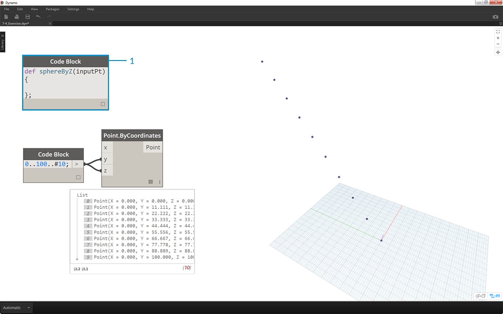
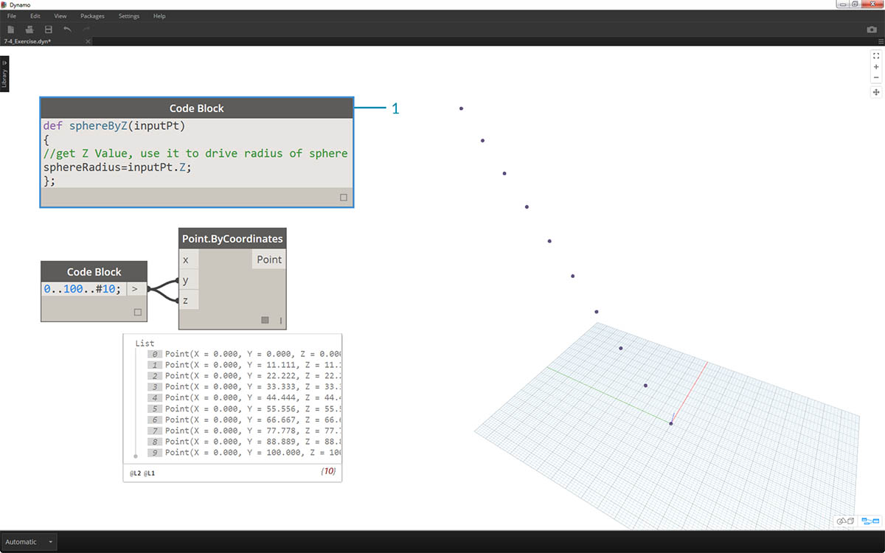
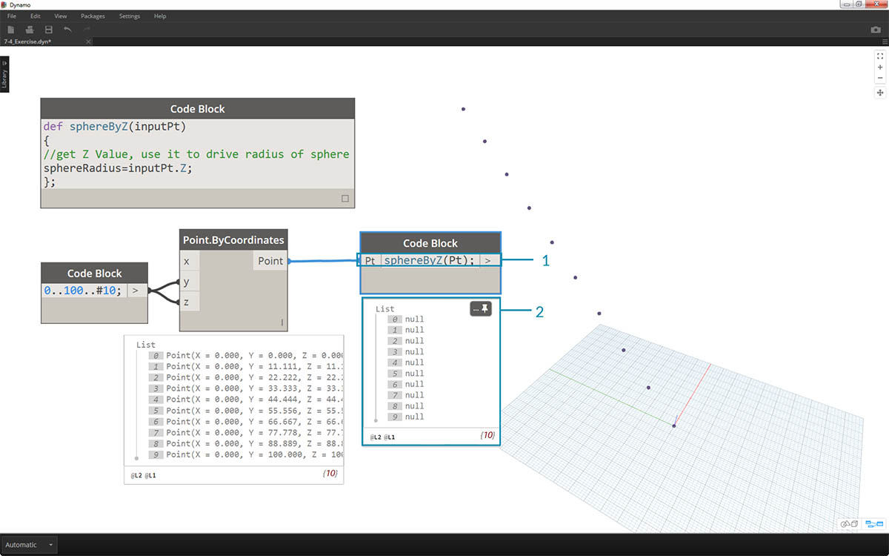
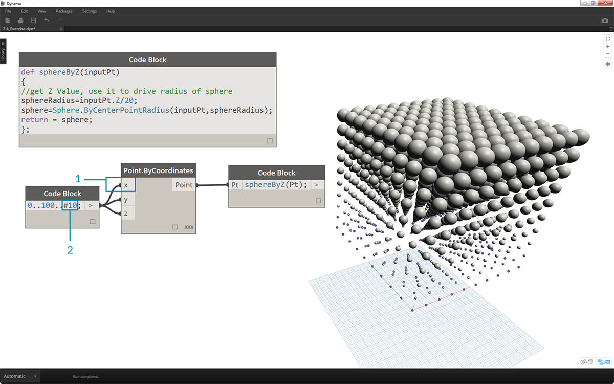

## Funzioni del blocco di codice

Le funzioni possono essere create in un blocco di codice e richiamate in un altro punto della definizione di Dynamo. In questo modo viene creato un altro livello di controllo in un file parametrico e può essere visualizzato come versione basata su testo di un nodo personalizzato. In questo caso, il blocco di codice "principale" è facilmente accessibile e può essere posizionato ovunque nel grafico. Non sono necessari i fili.

### Parent

La prima riga contiene la parola chiave "def", il nome della funzione e i nomi degli input tra parentesi. Le parentesi graffe definiscono il corpo della funzione. Restituiscono un valore con "return =". I blocchi di codice che definiscono una funzione non presentano porte di input o output, in quanto vengono chiamati da altri blocchi di codice. 

```
/*This is a multi-line comment,
which continues for
multiple lines*/
def FunctionName(in1,in2)
{
//This is a comment
sum = in1+in2;
return sum;
};
```

### Elementi derivati

Chiamano la funzione con un altro blocco di codice nello stesso file, assegnando lo stesso nome e lo stesso numero di argomenti. Funzionano come i nodi predefiniti nella libreria.


```
FunctionName(in1,in2);
```

### Esercizio

> Scaricare il file di esempio fornito con questo esercizio (fare clic con il pulsante destro del mouse e scegliere Salva link con nome...). Un elenco completo di file di esempio è disponibile nell'Appendice. [Functions_SphereByZ.dyn](datasets/7-4/Functions_SphereByZ.dyn)

In questo esercizio verrà eseguita una definizione generica che creerà sfere da un elenco di input di punti. Il raggio di queste sfere viene gestito dalla proprietà Z di ogni punto.


> Iniziare con un numero di dieci valori compresi tra 0 e 100. Collegarli ai nodi *Point.ByCoordinates* per creare una linea diagonale.



> 1. Creare un *Code Block* e introdurre la definizione utilizzando la riga di codice:
```
def sphereByZ(inputPt){
};
```

*inputPt* è il nome fornito per rappresentare i punti che controlleranno la funzione. Per ora, la funzione non sta eseguendo alcuna operazione, ma si costruirà questa funzione nei prossimi passaggi.



> 1. Alla funzione *Code Block*, si aggiungono un commento e una variabile *sphereRadius* che esegue una query sulla posizione *Z* di ogni punto. Tenere presente che *inputPt.Z* non richiede parentesi come metodo. Si tratta di una *query* sulle proprietà di un elemento esistente, pertanto non sono necessari input:
```
def sphereByZ(inputPt,radiusRatio)
{
//get Z Value, use it to drive radius of sphere
sphereRadius=inputPt.Z;
};
```


> 1. Ora, richiamare la funzione che è stata creata in un altro *Code Block*. Se si fa doppio clic sull'area di disegno per creare un nuovo *Code Block* e si digita *sphereB*, si noterà che Dynamo suggerisce la funzione *sphereByZ* definita. La funzione è stata aggiunta alla libreria di IntelliSense. Ottimo.



> 1. Ora richiamare la funzione e creare una variabile denominata *Pt* per collegare i punti creati nei passaggi precedenti:
```
sphereByZ(Pt)
```

2. Dall'output si noterà che tutti i valori sono nulli. Perché? Quando è stata definita la funzione, si stava calcolando la variabile *sphereRadius*, ma non è stato definito che cosa la funzione dovrebbe *restituire* come *output*. È possibile risolvere il problema nel passaggio successivo.


> 1. Un passaggio importante: è necessario definire l'output della funzione aggiungendo la riga ```return = sphereRadius;``` alla funzione *sphereByZ*.
2. Ora si può vedere che l'output di *Code Block* fornisce le coordinate Z di ciascun punto.


> Procedere alla creazione di sfere effettive modificando la funzione *principale*.

> 1. Per prima cosa, è necessario definire una sfera con la riga di codice: ```sphere=Sphere.ByCenterPointRadius(inputPt,sphereRadius);```.
2. Successivamente, modificare il valore restituito in *sphere* anziché in *sphereRadius*: ```return = sfera;```. In questo modo vengono restituite alcune sfere giganti nell'anteprima di Dynamo.


> 1. Per ridurre al minimo la dimensione di queste sfere, aggiornare il valore *sphereRadius* aggiungendo un divisore: ```sphereRadius = inputPt.Z/20;```. Ora è possibile vedere le sfere separate. Inizia ad avere un senso la relazione tra il raggio e il valore Z.


> 1. Nel nodo *Point.ByCoordinates*, modificando il collegamento da *Più breve* a *Globale*, verrà creata una griglia di punti. La funzione *sphereByZ* è ancora attiva, per cui tutti i punti creano sfere con i raggi basati sui valori Z.



> 1. E solo per fare delle prove, è necessario collegare l'elenco originale di numeri all'input X per *Point.ByCoordinates*. Ora si ottiene un cubo di sfere.
2. Nota: se il calcolo al computer richiede molto tempo, provare a modificare *#10* impostandolo su un valore simile a *#5*.


> 1. Tenere presente che la funzione *sphereByZ* che è stata creata è una funzione generica, pertanto è possibile richiamare l'elica da una lezione precedente e applicare la funzione ad essa.


> Un passaggio finale: controllare il rapporto del raggio con un parametro definito dall'utente. A tale scopo, è necessario creare un nuovo input per la funzione e sostituire anche il divisore *20* con un parametro.

> 1. Aggiornare la definizione di *sphereByZ* a:
```
def sphereByZ(inputPt,radiusRatio)
{
//get Z Value, use it to drive radius of sphere
sphereRadius=inputPt.Z/radiusRatio;
//Define Sphere Geometry
sphere=Sphere.ByCenterPointRadius(inputPt,sphereRadius);
//Define output for function
return sphere;
};
```

2. Aggiornare i blocchi di codice degli elementi derivati aggiungendo una variabile *ratio* all'input: ```sphereByZ(Pt,ratio);```. Collegare un dispositivo di scorrimento all'input del blocco di codice appena creato e modificare la dimensione dei raggi in base al rapporto del raggio.

