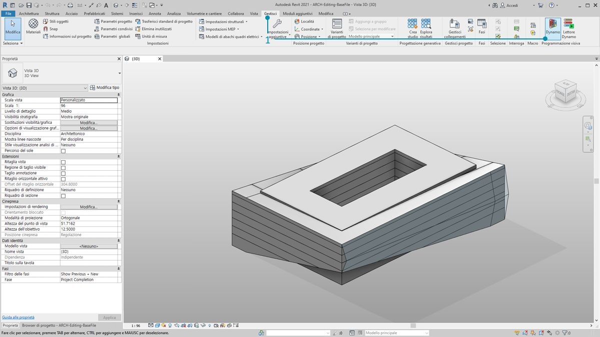
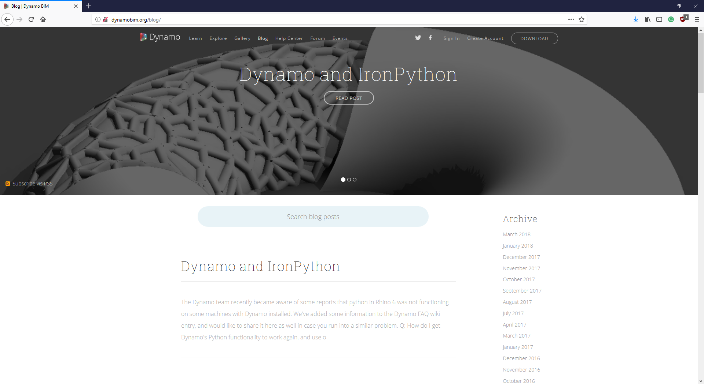

## Correlazione con Revit

Dynamo for Revit estende il Building Information Modeling (BIM) con l'ambiente di dati e logica di un editor di algoritmi grafici. La sua flessibilità, abbinata ad un solido database di Revit, offre una nuova prospettiva per il BIM.

Questo capitolo si concentra sui workflow di Dynamo per il BIM. Le sezioni sono principalmente basate sugli esercizi, poiché il passaggio diretto ad un progetto è il modo migliore per acquisire familiarità con un editor di algoritmi grafici per il BIM. Ma occorre prima parlare degli inizi del programma.

####

#### Compatibilità delle versioni di Revit

Poiché sia Revit che Dynamo continuano ad evolvere, è possibile che la versione di Revit utilizzata non sia compatibile con la versione di Dynamo for Revit installata nel computer in uso. Di seguito sono descritte le versioni di Dynamo for Revit compatibili con Revit.

|Versione di Revit|Prima versione di Dynamo stabile|Ultima versione di Dynamo for Revit supportata|
| -- | -- | -- |
|2013|[0.6.1](http://dyn-builds-data.s3-us-west-2.amazonaws.com/DynamoInstall0.6.1.exe)|[0.6.3](http://dyn-builds-data.s3-us-west-2.amazonaws.com/DynamoInstall0.6.3.exe)|
|2014|[0.6.1](http://dyn-builds-data.s3-us-west-2.amazonaws.com/DynamoInstall0.6.1.exe)|[0.8.2](http://dyn-builds-data.s3-us-west-2.amazonaws.com/DynamoInstall0.8.2.exe)|
|2015|[0.7.1](http://dyn-builds-data.s3-us-west-2.amazonaws.com/DynamoInstall0.7.1.exe)|[1.2.1](http://dyn-builds-data.s3-us-west-2.amazonaws.com/DynamoInstall1.2.1.exe)|
|2016|[0.7.2](http://dyn-builds-data.s3-us-west-2.amazonaws.com/DynamoInstall0.7.2.exe)|[1.3.2](http://dyn-builds-data.s3-us-west-2.amazonaws.com/DynamoInstall1.3.2.exe)|
|2017|[0.9.0](http://dyn-builds-data.s3-us-west-2.amazonaws.com/DynamoInstall0.9.0.exe)|[1.3.4](http://dyn-builds-data.s3-us-west-2.amazonaws.com/DynamoInstall1.3.4.exe)/[2.0.3](https://dyn-builds-data.s3-us-west-2.amazonaws.com/DynamoInstall2.0.3.exe)|
|2018|[1.3.0](http://dyn-builds-data.s3-us-west-2.amazonaws.com/DynamoInstall1.3.0.exe)|[1.3.4](http://dyn-builds-data.s3-us-west-2.amazonaws.com/DynamoInstall1.3.4.exe)/[2.0.3](https://dyn-builds-data.s3-us-west-2.amazonaws.com/DynamoInstall2.0.3.exe)|
|2019|[1.3.3](http://dyn-builds-data.s3-us-west-2.amazonaws.com/DynamoInstall1.3.3.exe)|[1.3.4](http://dyn-builds-data.s3-us-west-2.amazonaws.com/DynamoInstall1.3.4.exe)/[2.0.3](https://dyn-builds-data.s3-us-west-2.amazonaws.com/DynamoInstall2.0.3.exe)|
|2020|2.1.0 - Revit 2020 include ora Dynamo e riceve gli aggiornamenti come Revit.|N/A|

####

#### Storia di Dynamo

> Con un team dedicato di sviluppatori e una comunità appassionata, il progetto ne ha fatta di strada dalle sue umili origini.

Dynamo è stato originariamente creato per ottimizzare i workflow di AEC in Revit. Sebbene Revit crei un solido database per ogni progetto, può risultare difficile per un utente medio accedere a queste informazioni al di fuori dei vincoli dell'interfaccia. Revit ospita un'API (Application Program Interface) completa che consente agli sviluppatori di terze parti di creare strumenti personalizzati. I programmatori utilizzano questa API da anni, ma lo scripting basato su testo non è accessibile a tutti. In Dynamo si cerca di democratizzare i dati di Revit tramite un editor di algoritmi grafici accessibile.

Utilizzando i nodi di Dynamo principali in combinazione con quelli di Revit personalizzati, un utente può espandere in modo sostanziale i workflow parametrici per l'interoperabilità, la documentazione, l'analisi e la generazione. Con Dynamo noiosi workflow possono essere automatizzati, mentre esplorazioni della progettazione possono prosperare.

### Esecuzione di Dynamo in Revit

> 1. In un progetto o un editor di famiglie di Revit, individuare i moduli aggiuntivi e fare clic su *Dynamo*. Nota: Dynamo verrà eseguito solo nel file in cui è stato aperto.

> 1. Quando si apre Dynamo in Revit, è presente una nuova categoria denominata *Revit*. Questa è un'aggiunta completa all'interfaccia utente che offre nodi specifici per i workflow di Revit.*

**Nota: utilizzando la famiglia di nodi specifica di Revit, il grafico di Dynamo funzionerà solo durante l'apertura in Dynamo for Revit. Se, ad esempio, viene aperto un grafico di Dynamo for Revit in Dynamo Sandbox, i nodi di Revit risulteranno mancanti.*

### Congelamento di nodi

Poiché Revit è una piattaforma che offre una gestione affidabile dei progetti, le operazioni parametriche in Dynamo possono essere complesse e lente da calcolare. Se Dynamo richiede molto tempo per il calcolo dei nodi, è possibile utilizzare la funzionalità del nodo "Congela" per mettere in pausa l'esecuzione delle operazioni di Revit durante lo sviluppo del grafico. Per ulteriori informazioni sul congelamento dei nodi, controllare la sezione "Congelamento" nel [capitolo sui solidi](../05_Geometry-for-Computational-Design/5-6_solids.md#freezing).

### Comunità

Poiché Dynamo è stato originariamente creato per AEC, la sua vasta e crescente comunità è una grande risorsa da cui imparare e per connettersi con gli esperti del settore. La comunità di Dynamo è composta da architetti, ingegneri, programmatori e progettisti che hanno tutti passione per la condivisione e la creazione.

Dynamo è un progetto open source in costante evoluzione e molti sviluppi sono correlati a Revit. Se non si conosce il programma, accedere al forum di discussione e iniziare a [pubblicare domande](http://dynamobim.org/forums/forum/dyn/). Se si è programmatori e si desidera essere coinvolti nello sviluppo di Dynamo, consultare la [pagina su Github](https://github.com/DynamoDS/Dynamo). Inoltre, una risorsa eccezionale per le librerie di terze parti è [Dynamo Package Manager](http://dynamopackages.com/). Molti di questi pacchetti sono stati concepiti per AEC e si darà uno sguardo a pacchetti di terze parti per la suddivisione in pannelli in questo capitolo.

> Dynamo gestisce anche un [blog](http://dynamobim.com/blog/) attivo. Per scoprire gli ultimi sviluppi, leggere i post recenti.

