## Selezione

Revit è un ambiente ricco di dati. Offre un'ampia gamma di funzionalità di selezione che va oltre il semplice "puntamento e clic". È possibile eseguire una query sul database di Revit e collegare dinamicamente gli elementi di Revit alla geometria di Dynamo durante l'esecuzione di operazioni parametriche.


> La libreria di Revit nell'interfaccia utente offre la categoria Selection, che consente di selezionare la geometria in più modi.

Per selezionare correttamente gli elementi di Revit, è importante comprendere a fondo la gerarchia degli elementi di Revit. Si desidera selezionare tutti i muri di un progetto? Selezionarli per categoria. Si desidera selezionare ogni sedia Eames nel moderno ingresso di metà secolo? Selezionarla per famiglia. Prima di passare ad un esercizio, occorre esaminare rapidamente la gerarchia di Revit.

#### Gerarchia di Revit

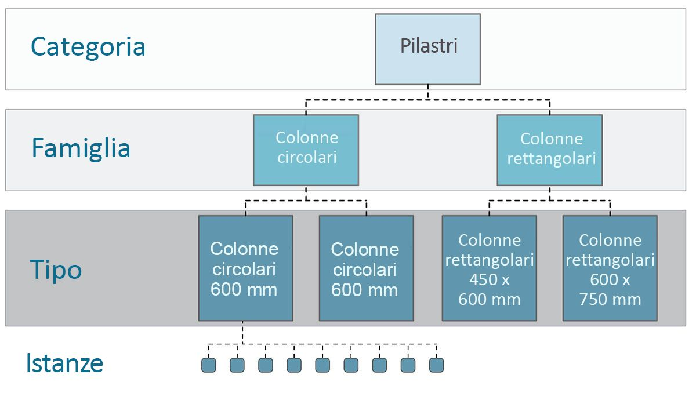

Vi ricordate la tassonomia in biologia? Regno, phylum, classe, ordine, famiglia, genere, specie? Gli elementi di Revit vengono suddivisi in categorie simili. Ad un livello di base, la gerarchia di Revit può essere suddivisa in categorie, famiglie, tipi* e istanze. Un'istanza è un singolo elemento del modello (con un ID univoco), mentre una categoria definisce un gruppo generico (ad esempio "muri" o "pavimenti"). Con il database di Revit organizzato in questo modo, è possibile selezionare un elemento e scegliere tutti gli elementi simili in base al livello specificato nella gerarchia.

**Nota: i tipi in Revit vengono definiti in modo diverso dai tipi della programmazione. In Revit, un tipo fa riferimento ad un ramo della gerarchia, anziché ad un "tipo di dati".*

#### Navigazione nel database con nodi di Dynamo

Nelle tre immagini riportate di seguito sono mostrate le categorie principali per la selezione di elementi di Revit in Dynamo. Si tratta di strumenti straordinari da utilizzare in combinazione e alcuni di questi strumenti verranno esaminati negli esercizi seguenti.


> *Puntamento e clic* è il modo più semplice per selezionare direttamente un elemento di Revit. È possibile selezionare un elemento del modello completo o parti della relativa topologia (ad esempio una superficie o un bordo). Questo rimane collegato dinamicamente a tale oggetto di Revit, pertanto quando il file di Revit ne aggiorna la posizione o i parametri, l'elemento di Dynamo di riferimento viene aggiornato nel grafico.


> I *menu a discesa* consentono di creare un elenco di tutti gli elementi accessibili in un progetto di Revit. È possibile utilizzare questa opzione per fare riferimento ad elementi di Revit che non sono necessariamente visibili in una vista. Questo è un ottimo strumento per eseguire una query su elementi esistenti o crearne di nuovi in un Editor di famiglie o in un progetto di Revit.


> È inoltre possibile selezionare un elemento di Revit in base a livelli specifici nella *gerarchia di Revit*. Si tratta di un'opzione potente per la personalizzazione di grandi serie di dati in preparazione della documentazione o della creazione di istanze generative e della personalizzazione.

Tenendo presenti le tre immagini riportate sopra, si esaminerà un esercizio che consente di selezionare elementi da un progetto di Revit di base in preparazione delle applicazioni parametriche che verranno create nelle sezioni restanti di questo capitolo.

### Esercizio

> Scaricare i file di esempio forniti con questo esercizio (fare clic con il pulsante destro del mouse e scegliere Salva link con nome...). Un elenco completo di file di esempio è disponibile nell'Appendice.

> 1. [Selecting.dyn](datasets/8-2/Selecting.dyn)
2. [ARCH-Selecing-BaseFile.rvt](datasets/8-2/ARCH-Selecting-BaseFile.rvt)

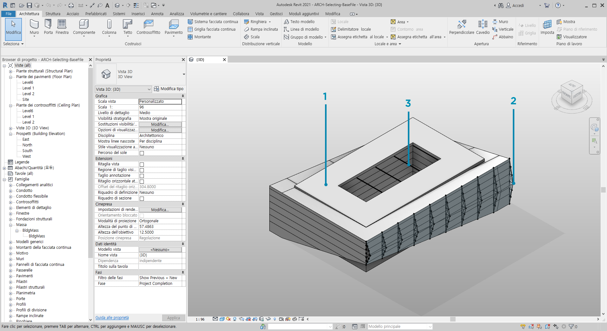

> In questo file di Revit di esempio, ci sono tre tipi di elementi di un semplice edificio. Si utilizzerà questo file come esempio per la selezione di elementi di Revit nel contesto della gerarchia di Revit:

> 1. Massa dell'edificio
2. Travi reticolari (componenti adattivi)
3. Travi (telaio strutturale)

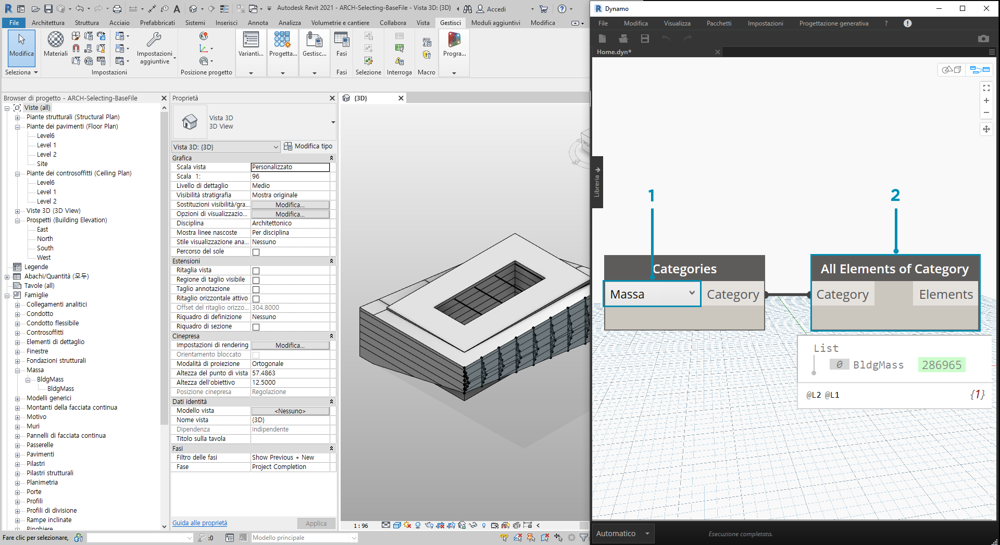

> Quali conclusioni è possibile trarre dagli elementi attualmente presenti nella vista di progetto di Revit? E di quanti livelli nella gerarchia occorre scendere per selezionare gli elementi appropriati? Naturalmente, questa operazione diventerà un'attività più complessa quando si lavora ad un progetto di grandi dimensioni. Sono disponibili numerose opzioni: è possibile selezionare elementi per categorie, livelli, famiglie, istanze e così via.

> 1. Poiché si sta utilizzando un'impostazione di base, selezionare la massa dell'edificio scegliendo *Massa* nel nodo a discesa Categories. Questo file si trova nella scheda Revit > Seleziona.
2. L'output della categoria Massa è solo la categoria stessa. È necessario selezionare gli elementi. A tale scopo, utilizzare il nodo *All Elements of Category*.

A questo punto, si noti che non è presente alcuna geometria in Dynamo. È stato selezionato un elemento di Revit, ma l'elemento non è stato convertito nella geometria di Dynamo. Si tratta di una separazione importante. Se si selezionano numerosi elementi, non si desidera visualizzare l'anteprima di tutti in Dynamo, in quanto ciò rallenterebbe le prestazioni del sistema. Dynamo è uno strumento per gestire un progetto di Revit senza necessariamente eseguire operazioni di geometria. Ciò sarà descritto nella sezione successiva di questo capitolo.

In questo caso, si sta utilizzando una geometria semplice, pertanto si desidera importare la geometria nell'anteprima di Dynamo. Accanto al valore "BldgMass" nel nodo di controllo riportato sopra è presente un numero verde*. Rappresenta l'ID dell'elemento e indica che si sta utilizzando un elemento di Revit, non la geometria di Dynamo. Il passaggio successivo consiste nel convertire questo elemento di Revit nella geometria in Dynamo.

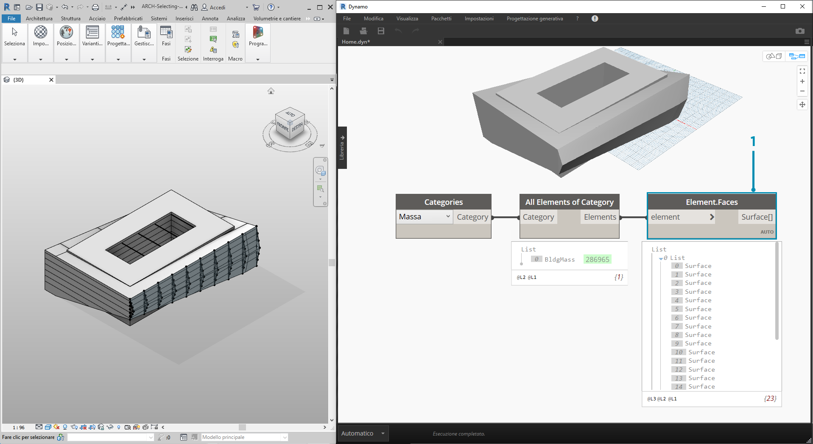

> 1. Utilizzando il nodo *Element. Faces*, viene visualizzato un elenco di superfici che rappresentano ciascuna superficie della massa di Revit. Ora è possibile vedere la geometria nella finestra di Dynamo e iniziare a fare riferimento alla superficie per le operazioni parametriche.

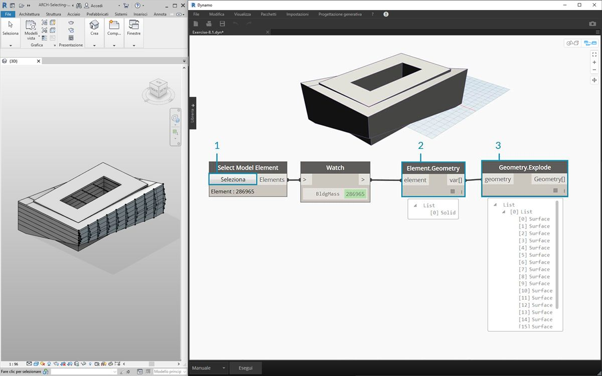

> Ecco un metodo alternativo. In questo caso, non si esegue la selezione tramite la gerarchia di Revit *(All Elements of Category)* e si sceglie di selezionare esplicitamente la geometria in Revit.

> 1. Utilizzando il nodo *Select Model Element*, fare clic sul pulsante *Seleziona *(o *Modifica*). Nella finestra di Revit, selezionare l'elemento desiderato. In questo caso, selezionare la massa dell'edificio.
2. Anziché *Element.Faces*, è possibile selezionare l'intera massa come geometria solida utilizzando *Element.Geometry*. In questo modo viene selezionata tutta la geometria contenuta all'interno della massa.
3. Utilizzando *Geometry.Explode* è possibile ottenere di nuovo l'elenco delle superfici. Questi due nodi funzionano allo stesso modo di *Element.Faces*, ma offrono opzioni alternative per fare ricerche nella geometria di un elemento di Revit.

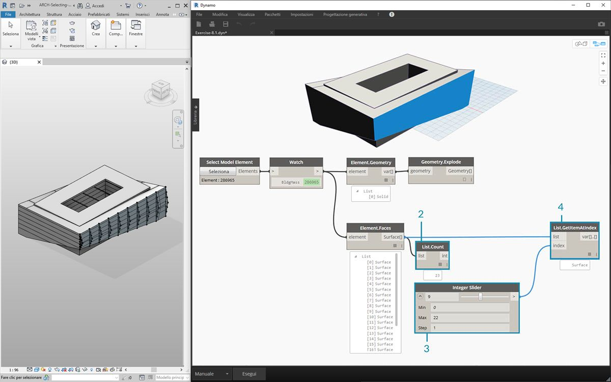

> 1. Utilizzando alcune operazioni di base con gli elenchi, è possibile eseguire una query su una superficie di interesse.
2. Innanzitutto, il nodo *List.Count* mostra che si stanno utilizzando 23 superfici nella massa.
3. Facendo riferimento a questo numero, è possibile modificare il valore massimo di *Integer Slider *in *22*.
4. Utilizzando *List.GetItemAtIndex*, immettere gli elenchi e dei valori in *Integer Slider * per *index*. Scorrendo il dispositivo con l'elemento selezionato, fermarsi quando si ottiene *index 9* e viene isolata la facciata principale che ospita le travi reticolari.

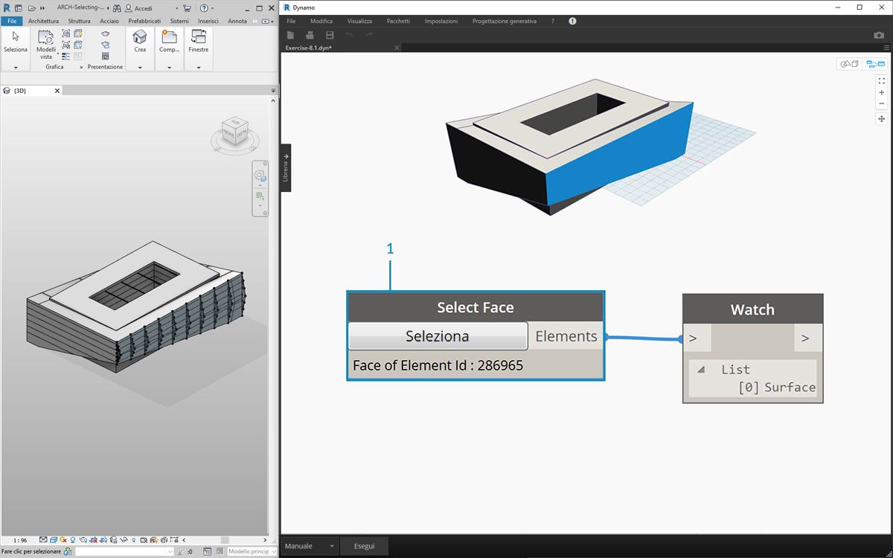

> 1. Il passaggio precedente era un po' complicato. È possibile eseguire questa operazione molto più rapidamente con il nodo *Select Face*. Questo consente di isolare una superficie che di per sé non è un elemento nel progetto di Revit. La stessa interazione si applica a *Select Model Element*, tranne per il fatto che è stata selezionata la superficie anziché l'elemento completo.

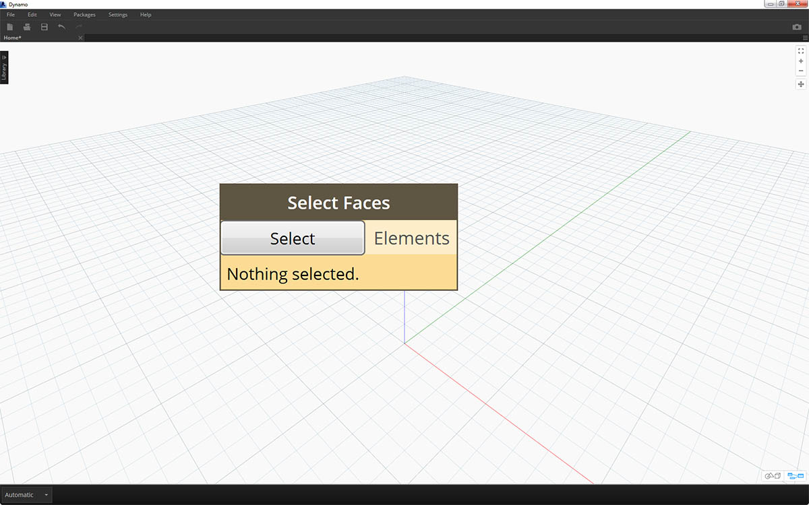

> Si supponga di voler isolare i muri della facciata principale dell'edificio. Per eseguire questa operazione, è possibile utilizzare il nodo *Select Faces*. Fare clic sul pulsante Seleziona, quindi selezionare le quattro facciate principali in Revit.

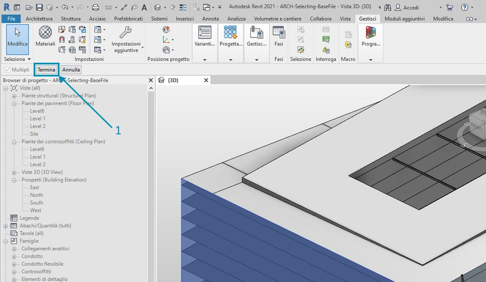

> 1. Dopo aver selezionato i quattro muri, assicurarsi di fare clic sul pulsante *Termina* in Revit.

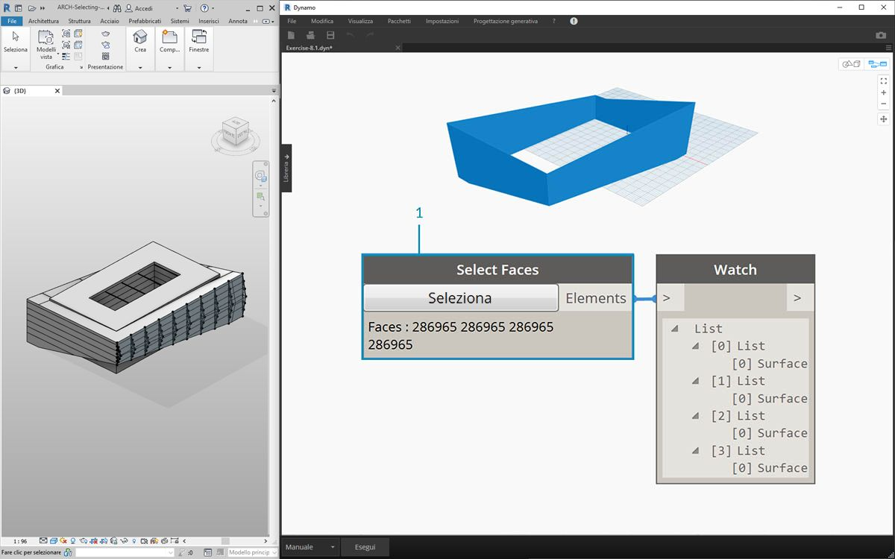

> 1. Le facce vengono ora importate in Dynamo come superfici.

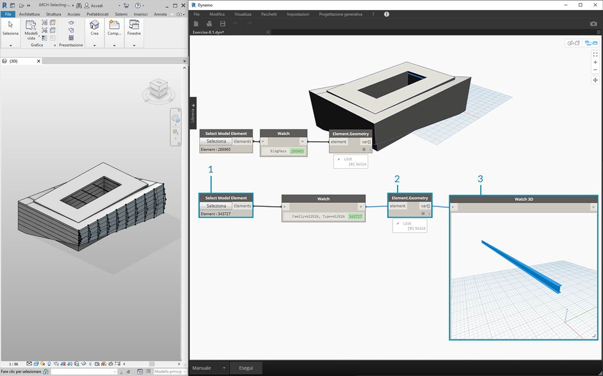

> 1. Ora, osservare le travi sopra l'atrio. Utilizzando il nodo *Select Model Element*, selezionare una delle travi.
2. Collegare l'elemento trave al nodo *Element.Geometry*, così ora la trave è presente nella finestra di Dynamo.
3. È possibile eseguire lo zoom avanti della geometria con un nodo *Watch3D*. Se la trave non è visibile in Watch3D, fare clic con il pulsante destro del mouse e selezionare Adatta alla finestra.

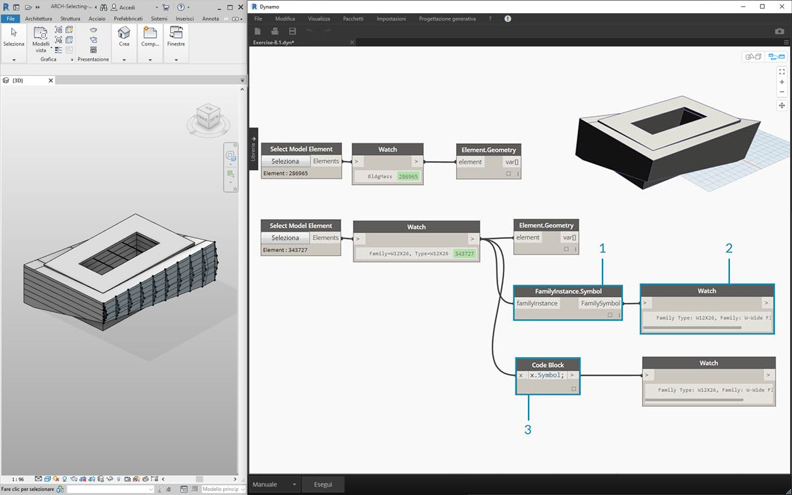

> Una domanda che potrebbe sorgere spesso nei workflow di Revit/Dynamo: com'è possibile selezionare un elemento e ottenere tutti gli elementi simili? Poiché l'elemento di Revit selezionato contiene tutte le relative informazioni gerarchiche, è possibile eseguire una query sul tipo di famiglia e selezionare tutti gli elementi di quel tipo.

> 1. Collegare l'elemento trave ad un nodo *FamilyInstance.Symbol**.
2. Il nodo *Watch* mostra che l'output è ora un simbolo di famiglia anziché un elemento di Revit.
3. *FamilyInstance.Symbol* è una query semplice, così è possibile eseguire questa operazione in Code Block con la stessa facilità di ```x.Symbol;``` e ottenere gli stessi risultati.

**Nota: un simbolo di famiglia è la terminologia dell'API di Revit per il tipo di famiglia. Poiché ciò potrebbe creare confusione, verrà aggiornato nelle prossime release.*

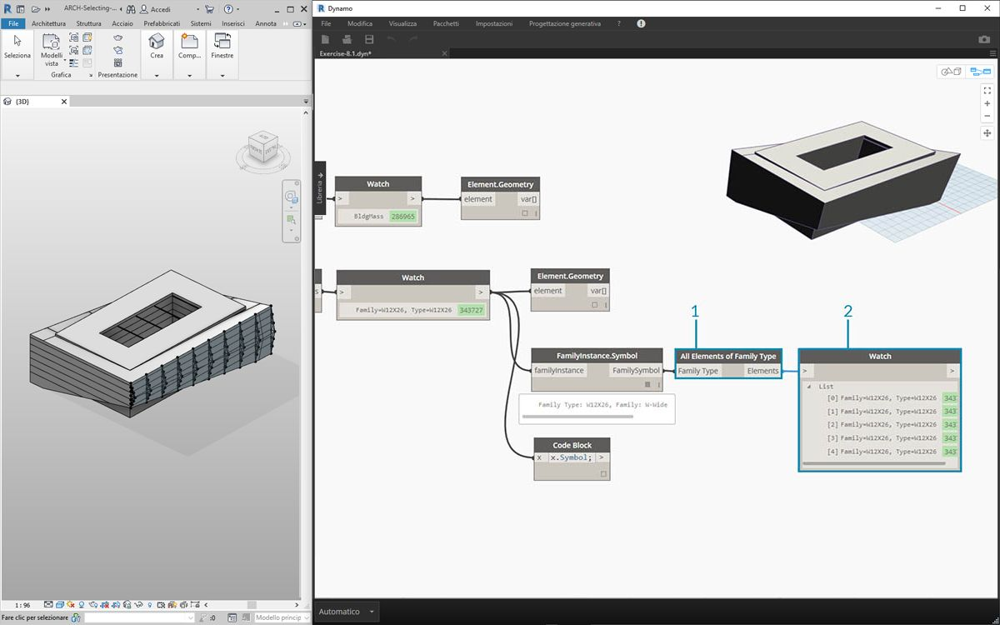

> 1. Per selezionare le travi rimanenti, utilizzare il nodo *All Elements of Family Type*.
2. Il nodo di controllo mostra che sono stati selezionati cinque elementi di Revit.

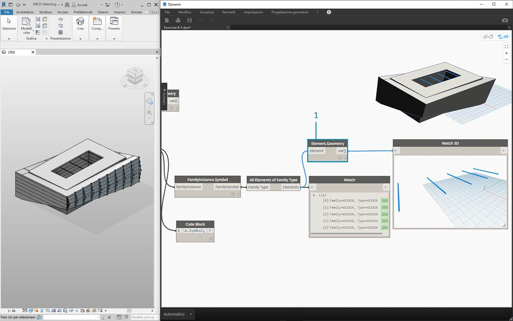

> 1. È possibile convertire anche tutti questi cinque elementi nella geometria di Dynamo.

E se ci fossero 500 travi? La conversione di tutti questi elementi nella geometria di Dynamo risulterebbe davvero lenta. Se Dynamo richiede molto tempo per il calcolo dei nodi, è possibile utilizzare la funzionalità del nodo Congela per mettere in pausa l'esecuzione delle operazioni di Revit durante lo sviluppo del grafico. Per ulteriori informazioni sul congelamento dei nodi, controllare la sezione "Congelamento" nel [capitolo sui solidi](../05_Geometry-for-Computational-Design/5-6_solids.md#freezing).

In ogni caso, se si dovessero importare 500 travi, sono necessarie tutte le superfici per eseguire l'operazione parametrica desiderata? Oppure è possibile estrarre le informazioni di base dalle travi ed eseguire attività generative con la geometria fondamentale? Questa è una domanda che verrà tenuta a mente mentre si procede in questo capitolo. Ad esempio, osservare il sistema di travi reticolari:


> Utilizzando lo stesso grafico dei nodi, selezionare l'elemento trave reticolare anziché l'elemento trave. Prima di eseguire questa operazione, eliminare il nodo Element.Geometry del passaggio precedente.

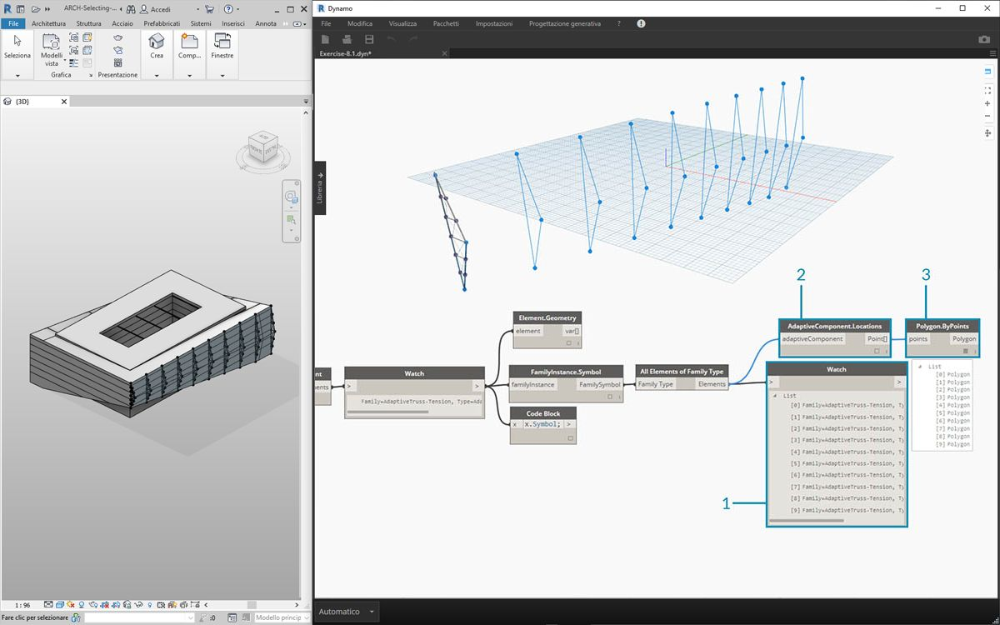

> 1. Nel nodo *Watch* è presente un elenco di componenti adattivi selezionati da Revit. Si desidera estrarre le informazioni di base, quindi si inizia con i punti adattivi.
2. Collegare il nodo *All Elements of Family Type* al nodo *AdaptiveComponent.Location*. In questo modo si ottiene un elenco di elenchi, ciascuno con tre punti che rappresentano le posizioni dei punti adattivi.
3. Il collegamento di un nodo *Polygon.ByPoints* restituisce una PolyCurve. Questo è visibile nella finestra di Dynamo. Con questo metodo, è stata visualizzata la geometria di un elemento ed è stata astratta la geometria della serie rimanente di elementi (che potrebbe essere maggiore di numero rispetto a questo esempio).

**Suggerimento: se si fa clic sul numero verde di un elemento di Revit in Dynamo, la finestra di Revit eseguirà lo zoom di tale elemento.*

