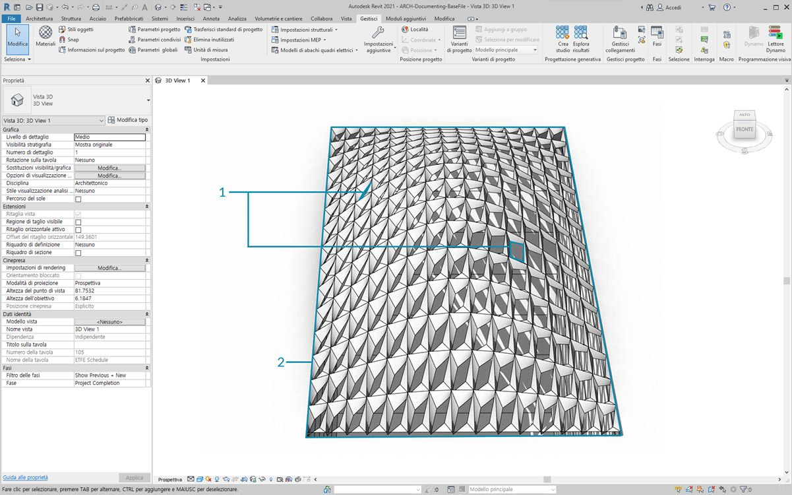
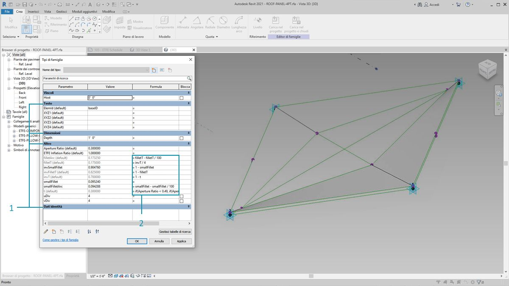
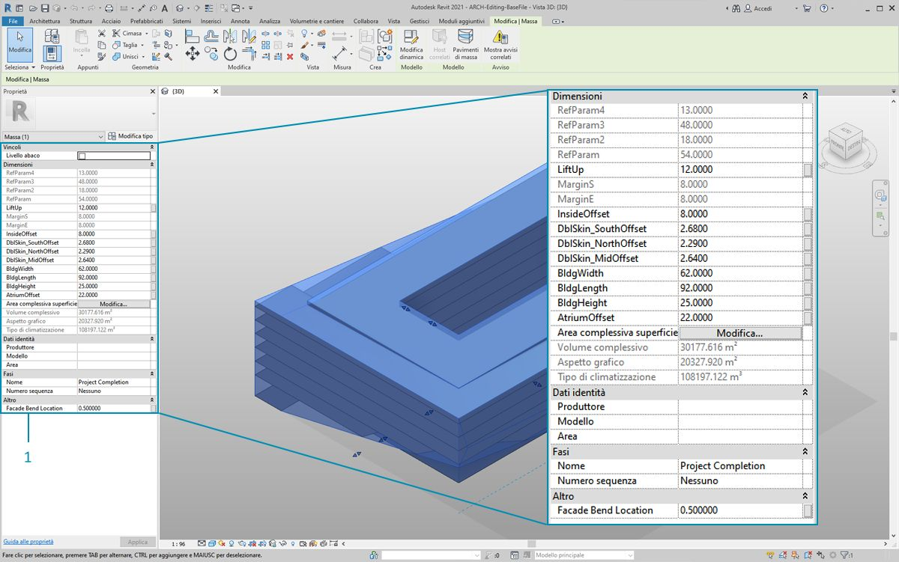
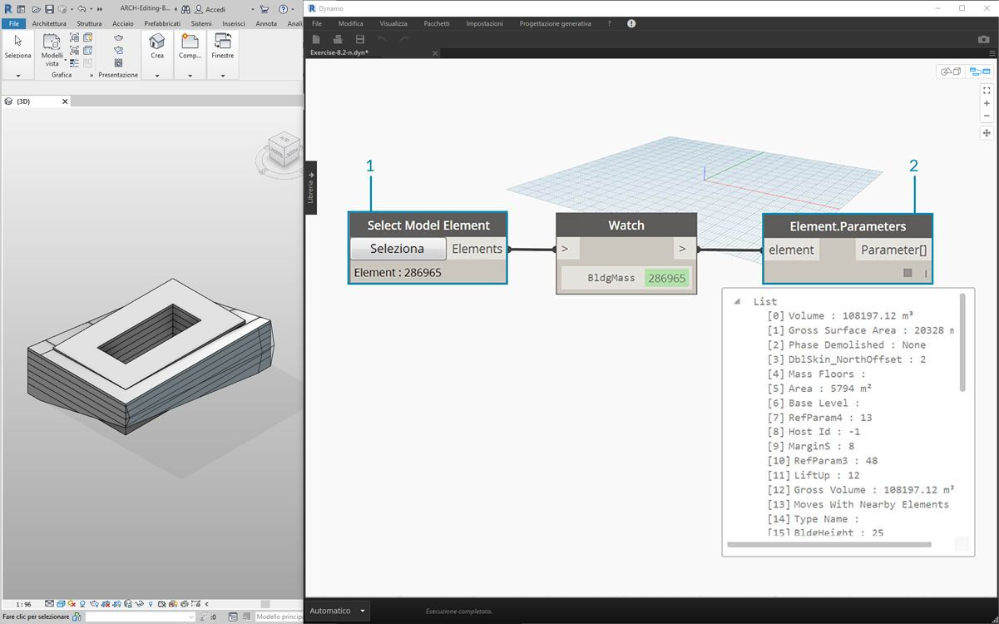
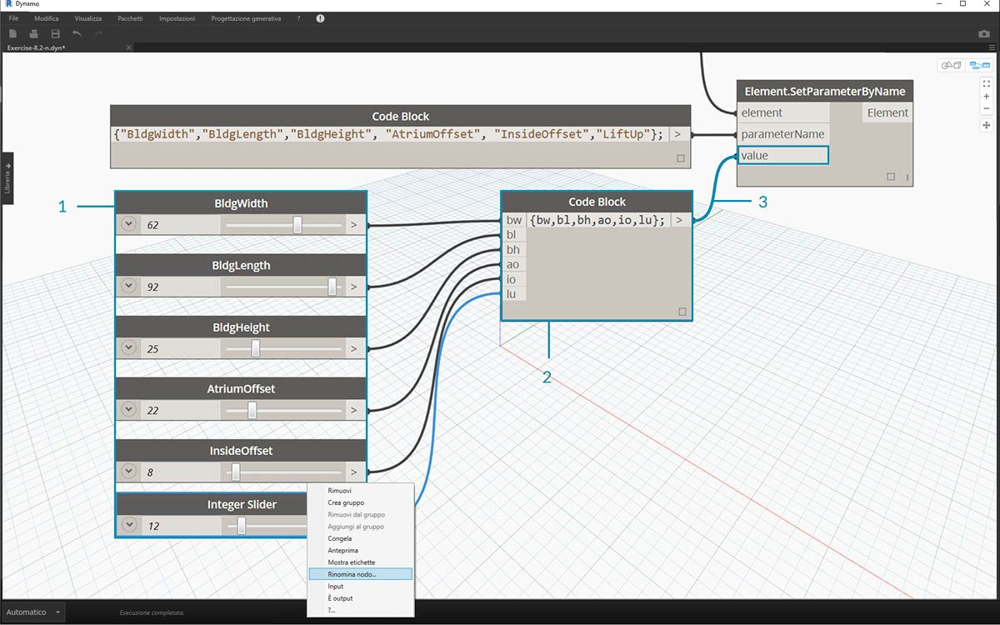
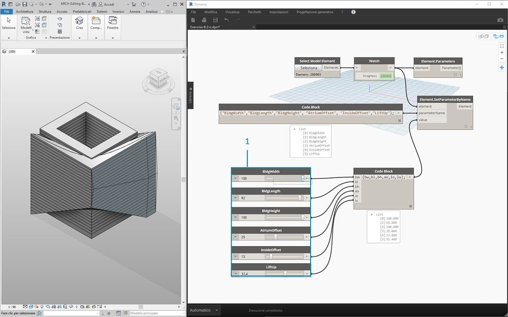
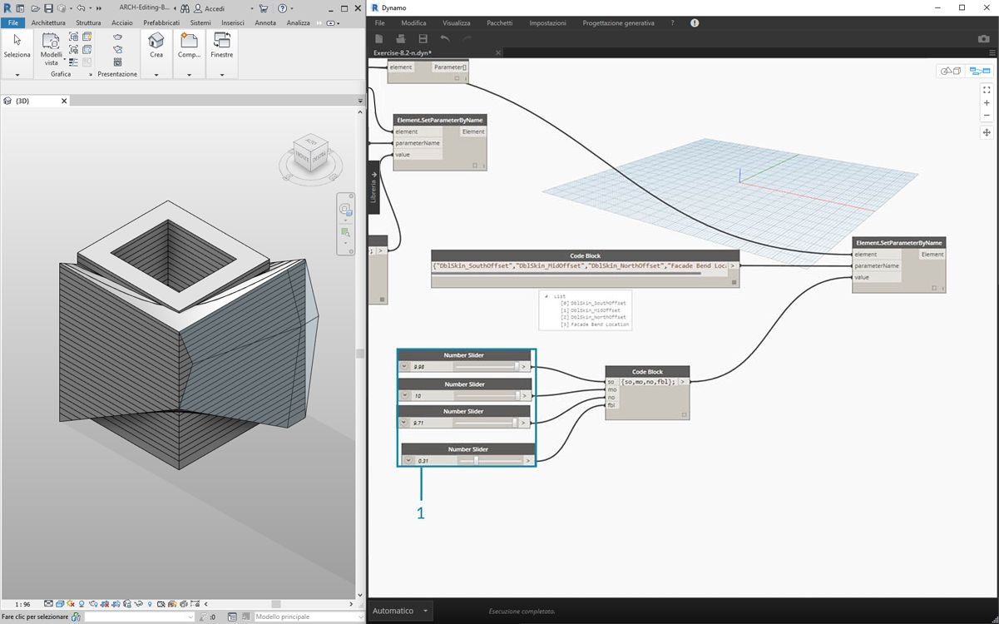

## Modifica

Una potente funzionalità di Dynamo è la possibilità di modificare i parametri su un livello parametrico. Ad esempio, un algoritmo generativo o i risultati di una simulazione possono essere utilizzati per determinare i parametri di una serie di elementi. In questo modo, un gruppo di istanze della stessa famiglia può avere proprietà personalizzate nel progetto di Revit.

### Parametri di istanza e tipo



> 1. I parametri di istanza definiscono l'apertura dei pannelli sulla superficie del tetto, che prevedono un rapporto di apertura compreso tra 0.1 e 0.4.
2. I parametri basati sul tipo vengono applicati ad ogni elemento della superficie in quanto si tratta dello stesso tipo di famiglia. Il materiale di ciascun pannello, ad esempio, può essere determinato da un parametro basato sul tipo.



> 1. Se in precedenza è stata configurata una famiglia di Revit, ricordarsi che è necessario assegnare un tipo di parametro (stringa, numero, quota e così via). Assicurarsi di utilizzare il tipo di dati corretto durante l'assegnazione di parametri da Dynamo.
2. È inoltre possibile utilizzare Dynamo in combinazione con i vincoli parametrici definiti nelle proprietà di una famiglia di Revit.

Come rapido ripasso dei parametri in Revit, si ricorda che sono presenti parametri di tipo e di istanza. Entrambi possono essere modificati da Dynamo, ma nell'esercizio riportato di seguito verranno utilizzati i parametri di istanza.

Nota: mentre si rileva l'applicazione estesa della modifica di parametri, potrebbe essere necessario modificare una grande quantità di elementi in Revit con Dynamo. Questa operazione può essere *costosa dal punto di vista computazionale*, ovvero può risultare lenta. Se si modifica un numero elevato di elementi, è possibile utilizzare la funzionalità Congela del nodo per interrompere l'esecuzione delle operazioni di Revit durante lo sviluppo del grafico. Per ulteriori informazioni sul congelamento dei nodi, controllare la sezione "Congelamento" nel [capitolo sui solidi](../05_Geometry-for-Computational-Design/5-6_solids.md#freezing).

#### Unità

A partire dalla versione 0.8, Dynamo è fondamentalmente senza unità. Ciò consente a Dynamo di rimanere un ambiente di programmazione visiva astratto. I nodi di Dynamo che interagiscono con le quote di Revit faranno riferimento alle unità del progetto di Revit. Ad esempio, se si imposta un parametro della lunghezza in Revit da Dynamo, il numero in Dynamo per il valore corrisponderà alle unità di default nel progetto di Revit. L'esercizio riportato di seguito è basato sui metri.


> Per una conversione rapida delle unità, utilizzare il nodo *"Convert Between Units"*. Questo è un comodo strumento per la conversione delle unità di lunghezza, area e volume al volo.

### Esercizio

> Scaricare i file di esempio forniti con questo esercizio (fare clic con il pulsante destro del mouse e scegliere Salva link con nome...). Un elenco completo di file di esempio è disponibile nell'Appendice.

> 1. [Editing.dyn](datasets/8-3/Editing.dyn)
2. [ARCH-Editing-BaseFile.rvt](datasets/8-3/ARCH-Editing-BaseFile.rvt)

Questo esercizio si concentra sulla modifica degli elementi di Revit senza eseguire un'operazione geometrica in Dynamo. Qui non si sta importando la geometria di Dynamo, ma si stanno modificando solo i parametri in un progetto di Revit. Questo è un esercizio di base e, per gli utenti più avanzati di Revit, notare che si tratta di parametri di istanza di una massa, ma la stessa logica può essere applicata ad una serie di elementi per la personalizzazione su larga scala. Tutto questo viene eseguito con il nodo "Element.SetParameterByName".



> Iniziare con il file di esempio di Revit per questa sezione. Sono stati rimossi gli elementi strutturali e le travi reticolari adattive della sezione precedente. In questo esercizio, ci si concentrerà su una piattaforma petrolifera parametrica in Revit e sulla manipolazione in Dynamo.

> 1. Selezionando la massa dell'edificio in Revit, si vedono una serie di parametri di istanza nel gruppo Proprietà.



> 1. Selezionare la massa dell'edificio con il nodo *Select Model Element*.
2. È possibile eseguire una query su tutti i parametri di questa massa con il nodo *"Element.Parameters"*. Ciò include i parametri di tipo e istanza.


> 1. Fare riferimento al nodo *Element.Parameters* per trovare i parametri di destinazione. In alternativa, è possibile visualizzare il gruppo Proprietà del passaggio precedente per scegliere i nomi dei parametri da modificare. In questo caso, si stanno cercando i parametri che influenzano i grandi movimenti geometrici sulla massa dell'edificio.
2. Verranno apportate modifiche all'elemento di Revit utilizzando il nodo *Element.SetParameterByName*.
3. Utilizzando *Code Block*, si definisce un elenco di questi parametri, con virgolette che racchiudono ogni voce per indicare una stringa. È inoltre possibile utilizzare il nodo List.Create con una serie di nodi *"stringa"* collegati a più input. Il blocco di codice è semplicemente più veloce e più semplice. È sufficiente assicurarsi che la stringa corrisponda al nome esatto in Revit, rispettando le maiuscole/minuscole: ```{"BldgWidth","BldgLength","BldgHeight", "AtriumOffset", "InsideOffset","LiftUp"};```.



> 1. Si desidera inoltre designare i valori per ogni parametro. Aggiungere sei *"dispositivi di scorrimento di numeri interi"* all'area di disegno e rinominarli in base al parametro corrispondente nell'elenco. Inoltre, impostare i valori di ciascun dispositivo di scorrimento sull'immagine riportata sopra. In ordine dall'alto verso il basso: ```62, 92, 25, 22, 8, 12```.
2. Definire un altro *Code Block* con un elenco della stessa lunghezza dei nomi dei parametri. In questo caso, vengono denominate variabili (senza virgolette) che creano input per *Code Block.* Collegare i *dispositivi di scorrimento* a ciascun rispettivo input: ```{bw,bl,bh,ao,io,lu};```.
3. Collegare *Code Block* al nodo *"Element.SetParameterByName*"*. Con l'opzione Automatico selezionata, i risultati verranno visualizzati automaticamente.

**Nota: questa dimostrazione funziona con i parametri di istanza, ma non con i parametri di tipo.*

 Come in Revit, molti di questi parametri dipendono l'uno dall'altro. Ci sono naturalmente delle combinazioni in cui la geometria può interrompersi. È possibile risolvere questo problema con formule definite nelle proprietà dei parametri oppure è possibile configurare una logica simile con operazioni matematiche in Dynamo (questa è una difficoltà aggiuntiva se si desidera espandere l'esercizio).

> 1. Questa combinazione conferisce una nuova bizzarra progettazione alla massa dell'edificio: ```100, 92, 100, 25, 13, 51, 4```.


> 1. Copiare il grafico e concentrarsi sulla vetrata della facciata che ospiterà il sistema di travi reticolari. In questo caso, isolare quattro parametri: ```{"DblSkin_SouthOffset","DblSkin_MidOffset","DblSkin_NorthOffset","Facade Bend Location"};```.
2. Inoltre, creare *dispositivi di scorrimento numerici* e rinominarli in base ai parametri appropriati. I primi tre dispositivi di scorrimento dall'alto verso il basso devono essere riassociati ad un dominio di [0,10], mentre il dispositivo di scorrimento finale *"Facade Bend Location"* deve essere riassociato ad un dominio di [0,1]. Questi valori, dall'alto verso il basso, dovrebbero iniziare con questi valori (sebbene siano arbitrari): ```2.68, 2.64, 2.29, 0.5```.
3. Definire un nuovo *Code Block* e collegare i dispositivi di scorrimento: ```{so,mo,no,fbl};```.



> 1. Modificando i *dispositivi di scorrimento* in questa parte del grafico, è possibile rendere la vetrata della facciata molto più significativa: ```9.98, 10.0, 9.71, 0.31```.

