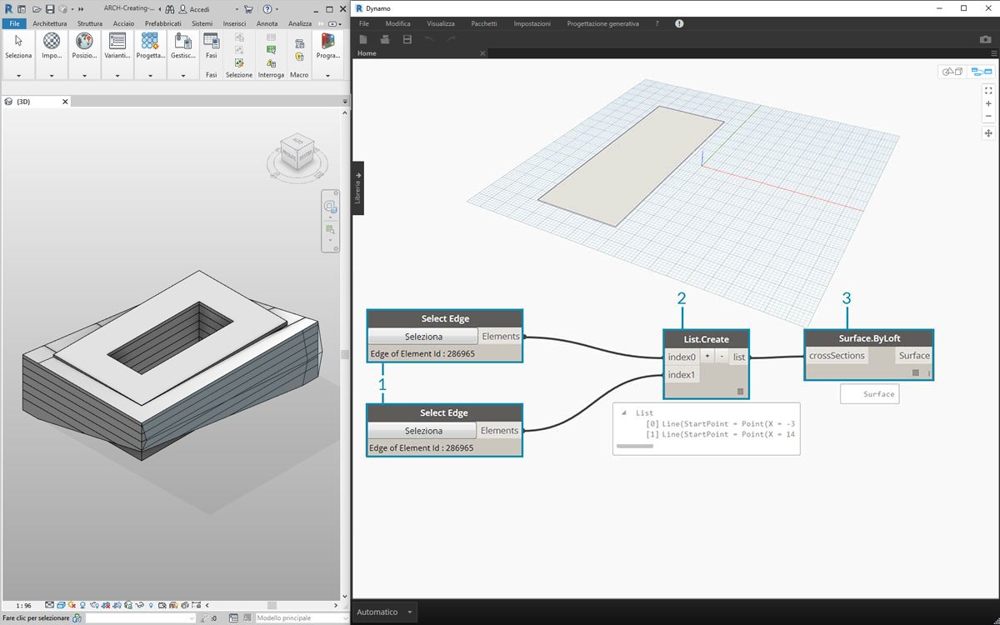
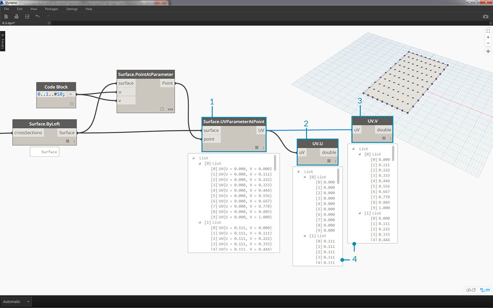
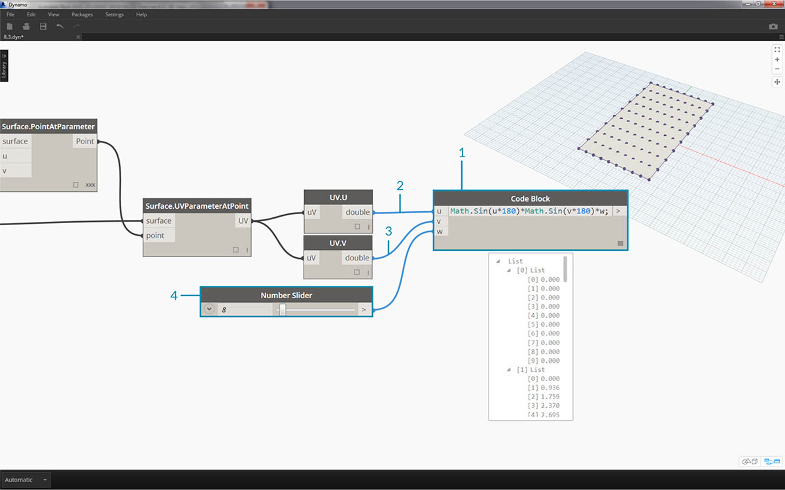
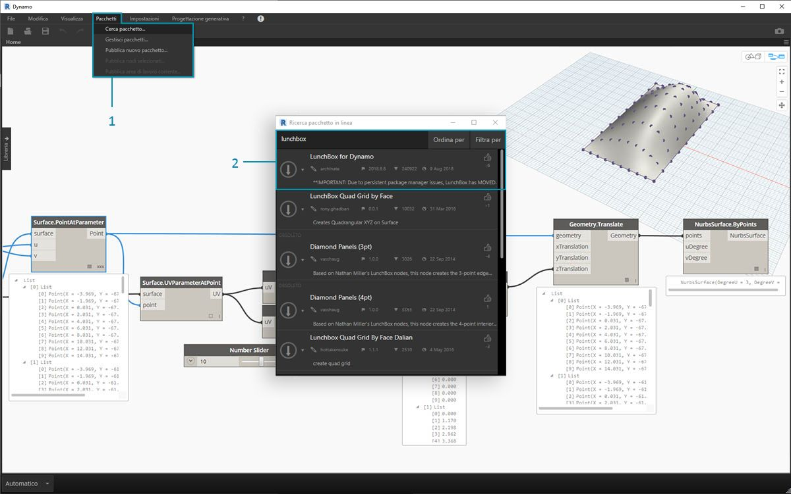
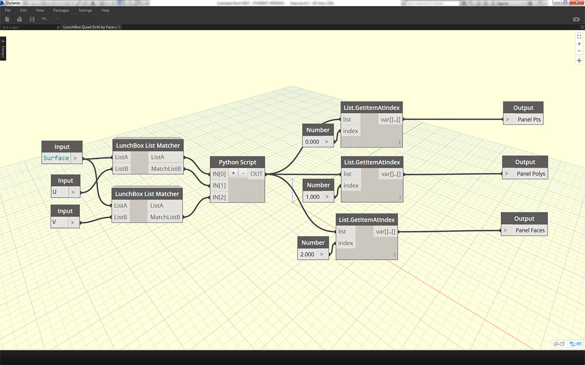
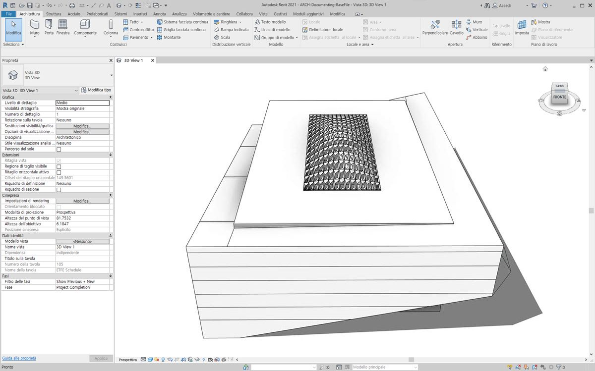
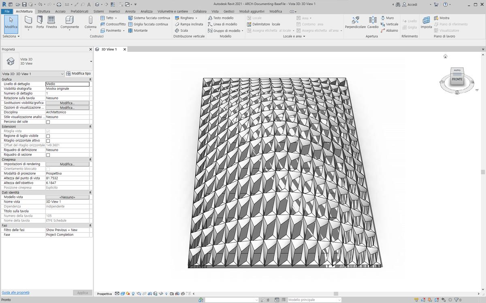
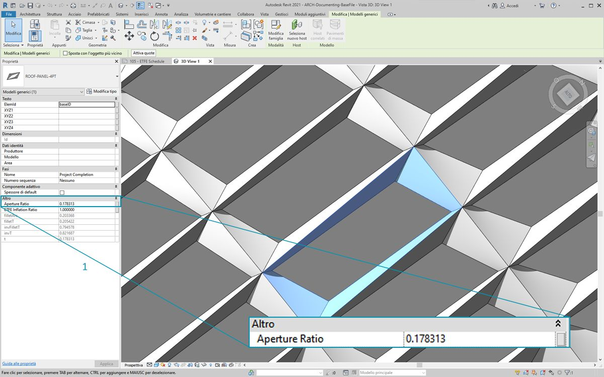
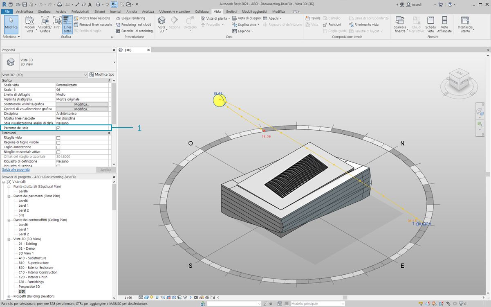
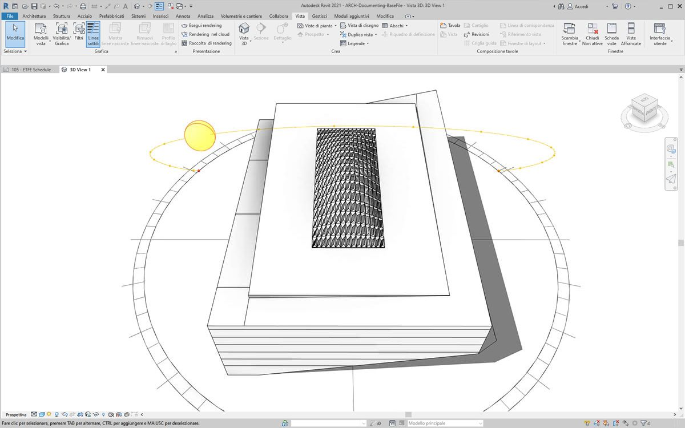

## Personalizzazione

Mentre in precedenza è stata esaminata la modifica della massa di un edificio di base, si vuole approfondire ulteriormente il collegamento di Dynamo/Revit modificando un numero elevato di elementi in un'unica operazione. La personalizzazione su larga scala diventa più complessa, poiché le strutture di dati richiedono operazioni con gli elenchi più avanzate. Tuttavia, i principi alla base della loro esecuzione sono fondamentalmente gli stessi. Verranno esaminate alcune opportunità per l'analisi da un gruppo di componenti adattivi.

#### Posizione dei punti

Si supponga di aver creato un'ampia gamma di componenti adattivi e di voler modificare i parametri in base alle relative posizioni dei punti. I punti, ad esempio, potrebbero controllare un parametro di spessore correlato all'area dell'elemento. Oppure potrebbero controllare un parametro di opacità correlato all'esposizione solare durante tutto l'anno. Dynamo consente il collegamento dell'analisi ai parametri in pochi semplici passaggi. Verrà analizzata una versione di base nell'esercizio riportato di seguito.


> Eseguire una query sui punti adattivi del componente adattivo selezionato utilizzando il nodo *AdaptiveComponent.Locations*. Questo consente di utilizzare una versione astratta di un elemento di Revit per l'analisi.

Estraendo la posizione dei punti dei componenti adattivi, è possibile eseguire un'ampia gamma di analisi per tale elemento. Un componente adattivo a quattro punti consentirà, ad esempio, di studiare la deviazione dal piano di un determinato pannello.

#### Analisi dell'orientamento solare


> Utilizzare il rimappaggio per associare un gruppo di dati ad un intervallo di parametri. Questo è uno strumento fondamentale utilizzato in un modello parametrico e verrà dimostrato nell'esercizio riportato di seguito.

Utilizzando Dynamo, le posizioni dei punti dei componenti adattivi possono essere utilizzate per creare un piano di adattamento per ogni elemento. È possibile anche eseguire una query sulla posizione del sole nel file di Revit e studiare l'orientamento relativo del piano rispetto al sole confrontandolo con altri componenti adattivi. Eseguire l'impostazione nell'esercizio riportato di seguito creando un tetto algoritmico.

### Esercizio

> Scaricare i file di esempio forniti con questo esercizio (fare clic con il pulsante destro del mouse e scegliere Salva link con nome...). Un elenco completo di file di esempio è disponibile nell'Appendice.

> 1. [Customizing.dyn](datasets/8-5/Customizing.dyn)
2. [ARCH-Customizing-BaseFile.rvt](datasets/8-5/ARCH-Customizing-BaseFile.rvt)

Questo esercizio verterà sulle tecniche illustrate nella sezione precedente. In questo caso, verrà definita una superficie parametrica degli elementi di Revit, saranno create istanze di componenti adattivi a quattro punti, che verranno poi modificati in base all'orientamento rispetto al sole.



> 1. Iniziare selezionando due spigoli con il nodo *Select Edge*. I due spigoli sono i tratti lunghi dell'atrio.
2. Combinare i due spigoli in un elenco con il nodo *List.Create*.
3. Creare una superficie tra i due spigoli con *Surface.ByLoft*.


> 1. Utilizzando *Code Block*, definire un intervallo da 0 a 1 con 10 valori a spaziatura uniforme: ```0..1..#10;```.
2. Collegare *Code Block* agli input *u *e *v* di un nodo *Surface.PointAtParameter* e collegare il nodo *Surface.ByLoft* all'input *surface*. Fare clic con il pulsante destro del mouse sul nodo e modificare *Collegamento* in *Globale*. In questo modo si ottiene una griglia di punti sulla superficie.

Questa griglia di punti funge da punti di controllo per una superficie definita in modo parametrico. Si desidera estrarre le posizioni u e v di ciascuno di questi punti in modo da poterle collegare ad una formula parametrica e mantenere la stessa struttura di dati. A tale scopo, è possibile eseguire una query sulle posizioni dei parametri dei punti appena creati.



> 1. Aggiungere un nodo *Surface.ParameterAtPoint* all'area di disegno e collegare gli input come mostrato in precedenza.
2. Eseguire una query sui valori *u* di questi parametri con il nodo *UV.U*.
3. Eseguire una query sui valori *v* di questi parametri con il nodo *UV.V*.
4. Gli output mostrano i valori *u* e *v* corrispondenti per ogni punto della superficie. Ora è disponibile un intervallo compreso tra *0* e *1* per ogni valore, nella struttura di dati corretta, pertanto è possibile applicare un algoritmo parametrico.



> 1. Aggiungere *Code Block* all'area di disegno e immettere il codice: ```Math.Sin(u*180)*Math.Sin(v*180)*w;```. Si tratta di una funzione parametrica che crea una protuberanza sinusoidale da una superficie piana.
2. L'input *u* si collega a *UV.U*.
3. L'input *v* si collega a *UV.V*.
4. L'input *w* rappresenta l'*ampiezza* della forma, pertanto si associa *Number Slider* ad esso.


> 1. Ora è disponibile un elenco di valori come definito dall'algoritmo. Utilizzare questo elenco di valori per spostare i punti verso l'alto nella direzione *+Z*. Utilizzando *Geometry.Translate*, collegare *Code Block *a *zTranslation* e *Surface.PointAtParameter* all'input *geometry*. I nuovi punti dovrebbero essere visualizzati nell'anteprima di Dynamo.
2. Infine, creare una superficie con il nodo *NurbsSurface.ByPoints*, collegando il nodo del passaggio precedente all'input points. Si ottiene una superficie parametrica. È possibile trascinare il dispositivo di scorrimento per osservare la protuberanza restringersi e ingrandirsi.

Con la superficie parametrica, si vuole definire un modo per suddividerla in pannelli al fine di creare la serie di componenti adattivi a quattro punti. Dynamo non dispone di funzionalità predefinite per la suddivisione della superficie in pannelli, pertanto è possibile accedere alla community per i pacchetti di Dynamo utili.



> 1. Passare a *Pacchetti > Cerca pacchetto*.
2. Cercare *LunchBox* e scaricare *LunchBox for Dynamo*. Si tratta di un insieme veramente utile di strumenti per le operazioni di geometria come questa.


> 1. Dopo il download, si dispone ora dell'accesso completo alla suite LunchBox. Cercare *Quad Grid* e selezionare *LunchBox Quad Grid By Face*. Collegare la superficie parametrica all'input *Surface* e impostare le divisioni *U* e *V* su *15*. Nell'anteprima di Dynamo dovrebbe essere visualizzata una superficie in quattro pannelli.



> Se si desidera conoscere la relativa impostazione, è possibile fare doppio clic sul nodo *Lunch Box* e vedere come viene eseguita.


> Tornando a Revit, si darà un rapido sguardo al componente adattivo utilizzato qui. Non occorre seguirlo, ma questo è il pannello del tetto di cui verrà creata un'istanza. Si tratta di un componente adattivo a quattro punti, che è una rappresentazione approssimata di un sistema ETFE. L'apertura del vuoto centrale si trova su un parametro denominato *Aperture Ratio*.


> 1. Verrà creata un'istanza di molti elementi della geometria in Revit. Assicurarsi quindi di impostare il risolutore Dynamo su *Manuale*.
2. Aggiungere un nodo *Family Types* all'area di disegno e selezionare *ROOF-PANEL-4PT*.
3. Aggiungere un nodo *AdaptiveComponent.ByPoints* all'area di disegno, collegare *Panel Pts* dall'output *LunchBox Quad Grid by Face* all'input *points*. Collegare il nodo *Family Types* all'input *familySymbol*.
4. Fare clic su *Esegui*. La creazione della geometria in Revit richiederà** un po' di tempo. Se richiede troppo tempo, ridurre il valore 15 di *Code Block* ad un numero inferiore. In questo modo si riduce il numero di pannelli sul tetto.

*Nota: se Dynamo richiede molto tempo per il calcolo dei nodi, potrebbe essere necessario utilizzare la funzionalità del nodo Congela per mettere in pausa l'esecuzione delle operazioni di Revit durante lo sviluppo del grafico. Per ulteriori informazioni sul congelamento dei nodi, controllare la sezione "Congelamento" nel [capitolo sui solidi](../05_Geometry-for-Computational-Design/5-6_solids.md#freezing).*



> Tornando in Revit, ecco la serie di pannelli sul tetto.



> Eseguendo lo zoom avanti, è possibile osservare più da vicino la qualità della superficie.

### Analisi



> 1. Continuando dal passaggio precedente, proseguire e controllare l'apertura di ogni pannello in base alla sua esposizione al sole. Se si esegue lo zoom in Revit e si seleziona un pannello, sulla barra delle proprietà viene visualizzato il parametro *Aperture Ratio*. La famiglia è impostata in modo che l'apertura sia compresa, approssimativamente, tra *0.05* e *0.45*.



> 1. Se si osserva il percorso solare, è possibile vedere la posizione corrente del sole in Revit.


> 1. È possibile fare riferimento a questa posizione del sole utilizzando il nodo *SunSettings.Current*.
2. Collegare le impostazioni del sole a *Sunsetting.SunDirection* per ottenere il vettore solare.
3. Dal nodo *Panel Pts* utilizzato per creare i componenti adattivi, utilizzare *Plane.ByBestFitThroughPoints* per approssimare un piano per il componente.
4. Eseguire una query sulla *normale* di questo piano.
5. Utilizzare il *prodotto scalare* per calcolare l'orientamento solare. Il prodotto scalare è una formula che determina il possibile grado di parallelismo o antiparallelismo dei due vettori. Quindi utilizzare la normale del piano di ogni componente adattivo e confrontarla con il vettore solare per simulare approssimativamente l'orientamento solare.
6. Utilizzare il *valore assoluto* del risultato. In questo modo si garantisce che il prodotto scalare sia preciso se la normale del piano è rivolta verso la direzione inversa.
7. Fare clic su *Esegui*.


> 1. Osservando il *prodotto scalare*, si hanno diversi numeri. Si desidera utilizzare la distribuzione relativa, ma è necessario comprimere i numeri nell'intervallo appropriato del parametro *Aperture Ratio* che si intende modificare.
2. *Math.RemapRange* è uno strumento eccezionale per questa funzione. Prevede un elenco di input e ne riassocia i limiti a due valori obiettivo.
3. Definire i valori obiettivo come *0.15* e *0.45* in *Code Block*.
4. Fare clic su *Esegui*.


> 1. Collegare i valori riassociati ad un nodo *Element.SetParameterByName*.
2. Collegare la stringa *Aperture Ratio* all'input *parameterName*.
3. Collegare *AdaptiveComponent* all'input *element*.
4. Fare clic su *Esegui*.



> Tornando in Revit, da lontano è possibile notare l'effetto dell'orientamento solare sull'apertura dei pannelli ETFE.


> Eseguendo lo zoom avanti, si può vedere che i pannelli ETFE sono più vicini alla superficie del sole. L'obiettivo è ridurre il surriscaldamento derivante dall'esposizione solare. Se si desidera far passare più luce in base all'esposizione solare, occorre solo cambiare il dominio in *Math.RemapRange*.

