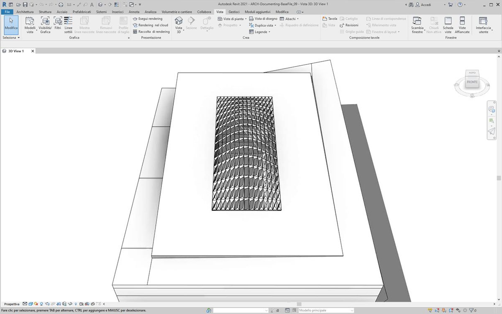
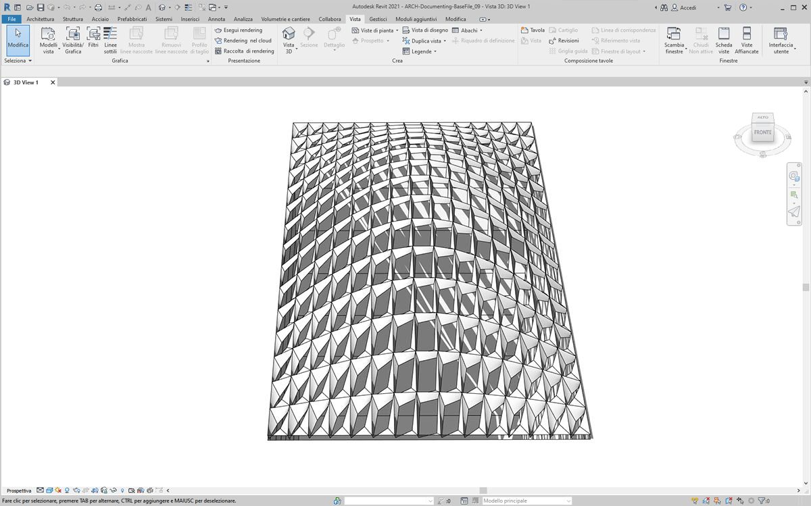
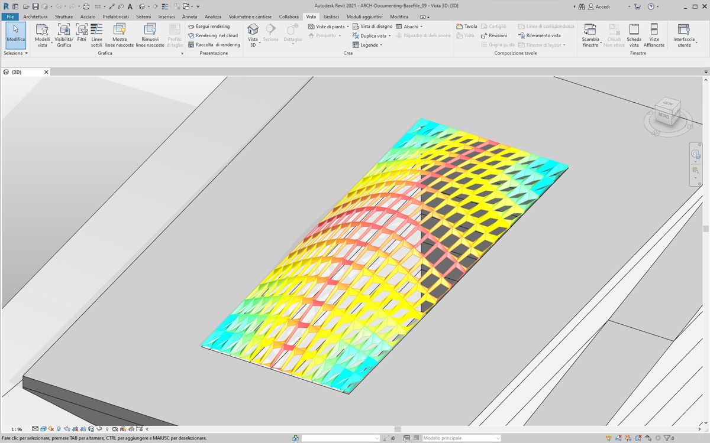
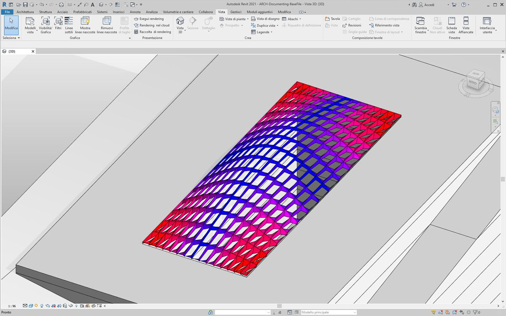
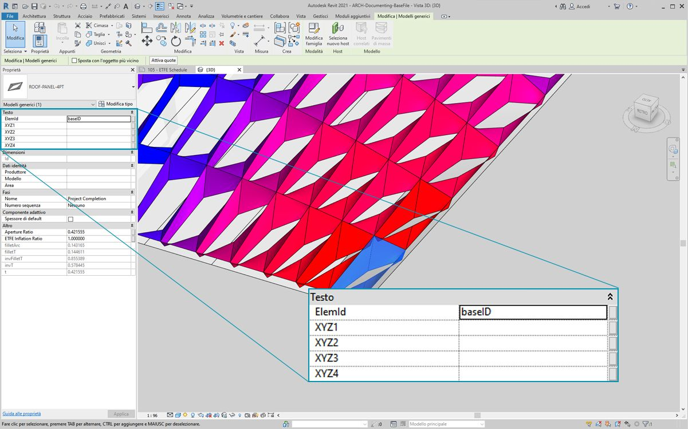
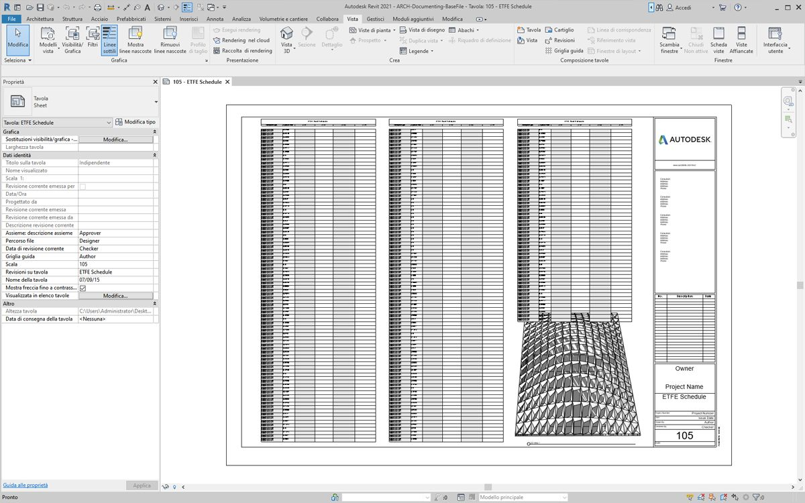
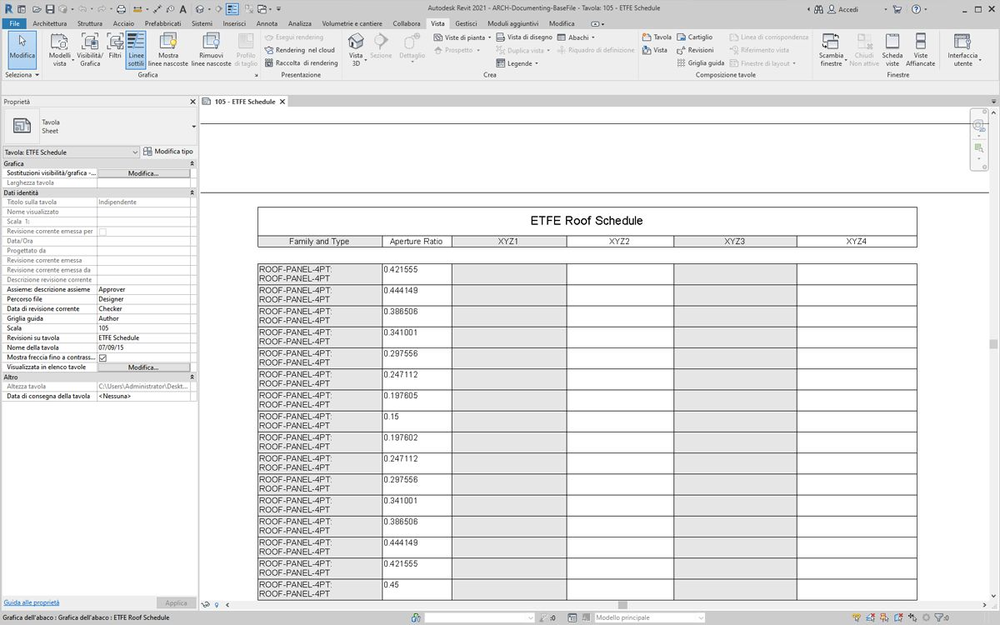
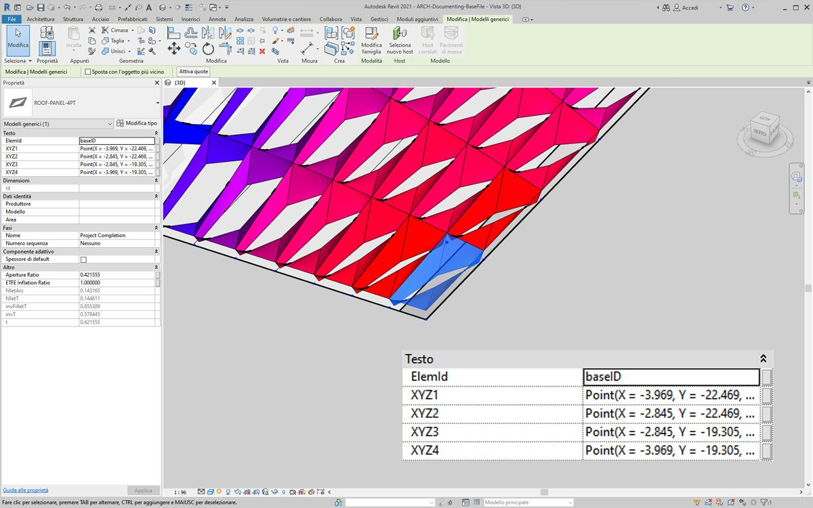
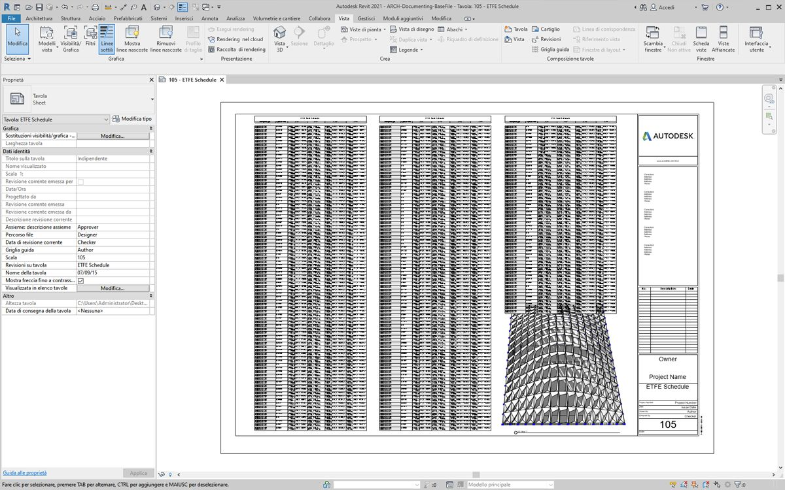
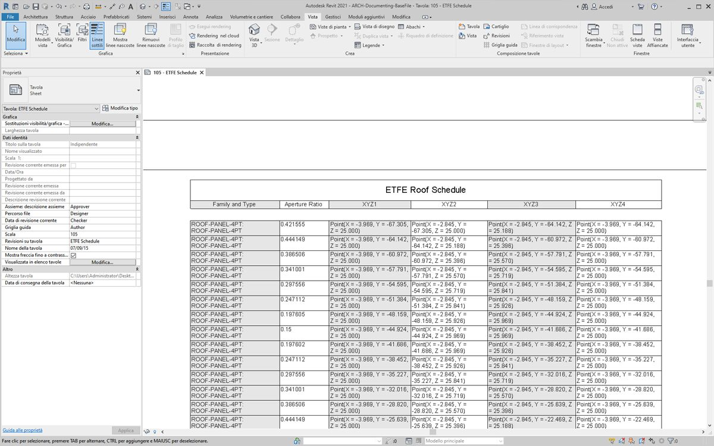

## Documentazione

La modifica dei parametri per la documentazione segue le lezioni apprese nelle sezioni precedenti. In questa sezione verrà esaminata la modifica dei parametri che non hanno effetto sulle proprietà geometriche di un elemento, ma piuttosto si prepara un file di Revit per la documentazione.

#### Deviazione

Nell'esercizio riportato di seguito, verrà utilizzata una deviazione di base dal nodo del piano per creare una tavola di Revit per la documentazione. Ogni pannello della struttura del tetto definita in modo parametrico ha un valore diverso per la deviazione e si desidera chiamare l'intervallo di valori utilizzando il colore e includendo nell'abaco i punti adattivi da consegnare ad un consulente per le facciate, un ingegnere o un appaltatore.


> La deviazione dal nodo del piano calcolerà la distanza con cui l'insieme di quattro punti varia dal piano di adattamento tra di loro. Questo è un modo rapido e semplice per studiare l'edificabilità.

### Esercizio

> Scaricare i file di esempio forniti con questo esercizio (fare clic con il pulsante destro del mouse e scegliere Salva link con nome...). Un elenco completo di file di esempio è disponibile nell'Appendice.

> 1. [Documenting.dyn](datasets/8-6/Documenting.dyn)
2. [ARCH-Documenting-BaseFile.rvt](datasets/8-6/ARCH-Documenting-BaseFile.rvt)

Iniziare con il file di Revit per questa sezione (o continuare dalla sezione precedente). Questo file presenta una serie di pannelli ETFE sul tetto. Per questo esercizio, si farà riferimento a questi pannelli.


> 1. Aggiungere un nodo *Family Types* all'area di disegno e scegliere *ROOF-PANEL-4PT*.
2. Collegare il nodo ad un nodo di selezione *All Elements of Family Type* per caricare tutti gli elementi da Revit in Dynamo.


> 1. Eseguire una query sulla posizione dei punti adattivi per ogni elemento con il nodo *AdaptiveComponent.Locations*.
2. Creare un poligono da questi quattro punti con il nodo *Polygon.ByPoints*. Notare che ora è disponibile una versione astratta del sistema con pannelli in Dynamo senza dover importare la geometria completa dell'elemento di Revit.
3. Calcolare la deviazione planare con il nodo *Polygon.PlaneDeviation*.


> Per divertimento, come nell'esercizio precedente, impostare il *rapporto di apertura* di ogni pannello in base alla sua deviazione planare.

> 1. Aggiungere un nodo *Element.SetParameterByName* all'area di disegno e collegare i componenti adattivi all'input *element*. Collegare un *Code Block* che riporta *Aperture Ratio* all'input di *parameterName*.
2. Non è possibile collegare direttamente i risultati della deviazione all'input value perché è necessario riassociare i valori all'intervallo di parametri.


> 1. Utilizzando *Math.RemapRange*, riassociare i valori di deviazione ad un dominio compreso tra *0.15 *e *0.45*.
2. Collegare questi risultati all'input value per *Element.SetParameterByName*.



> Tornando in Revit, è possibile *in un certo senso* sfruttare la modifica dell'apertura sulla superficie.



> Eseguendo lo zoom avanti, diventa più chiaro che i pannelli chiusi sono ponderati verso gli angoli della superficie. Gli angoli aperti sono verso la parte superiore. Gli angoli rappresentano aree di maggiore deviazione mentre la bombatura ha una curvatura minima, pertanto ciò è utile.

### Colore e documentazione

L'impostazione del rapporto di apertura non mostra chiaramente la deviazione dei pannelli sul tetto; inoltre si sta modificando la geometria dell'elemento effettivo. Si supponga di voler semplicemente studiare la deviazione dal punto di vista della fattibilità della fabbricazione. Sarebbe utile colorare i pannelli in base all'intervallo di deviazione per la documentazione. È possibile farlo con la serie di passaggi riportata di seguito e con un processo molto simile a quello descritto sopra.


> 1. Rimuovere i nodi *Element.SetParameterByName* e aggiungere *Element.OverrideColorInView*.
2. Aggiungere un nodo *Color Range* all'area di disegno e collegarlo all'input color di *Element.OverrideColorInView*. Per creare la sfumatura, è ancora necessario collegare i valori della deviazione all'intervallo di colori.
3. Posizionando il cursore del mouse sull'input *value*, è possibile vedere che i valori per l'input devono essere compresi tra *0* e *1* per assegnare un colore a ciascun valore. È necessario riassociare i valori della deviazione a questo intervallo.


> 1. Utilizzando *Math.RemapRange*, riassociare i valori della deviazione planare ad un intervallo compreso tra* 0* e *1* (nota: è anche possibile utilizzare il nodo *"MapTo"* per definire un dominio di origine).
2. Collegare i risultati ad un nodo *Color Range*.
3. Notare che l'output è un intervallo di colori anziché un intervallo di numeri.
4. Se l'opzione è impostata su Manuale, fare clic su *Esegui*. Dovrebbe essere possibile procedere facilmente da questo momento in poi avendo impostato l'opzione su Automatico.



> In Revit, si nota una sfumatura molto più leggibile che è rappresentativa della deviazione planare basata sull'intervallo di colori. Ma se si vogliono personalizzare i colori? Notare che i valori della deviazione minima sono rappresentati in rosso, che sembra essere l'opposto di ciò che ci si aspetterebbe. Si desidera visualizzare la deviazione massima in rosso, con la deviazione minima rappresentata da un colore più tenue. Tornare in Dynamo e modificare questo aspetto.


> 1. Utilizzando un *Code Block*, aggiungere due numeri su due righe diverse: ```0;``` e ```255;```.
2. Creare un colore rosso e blu collegando i valori appropriati a due nodi *Color.ByARGB*.
3. Creare un elenco da questi due colori.
4. Collegare questo elenco all'input *colors* di *Color Range* e osservare l'aggiornamento dell'intervallo di colori personalizzato.



> Tornando in Revit, è ora possibile distinguere meglio le aree di deviazione massima negli angoli. Ricordarsi che questo nodo serve per sostituire un colore in una vista, così può essere davvero utile disporre di una tavola specifica nel gruppo di disegni che si concentra su un particolare tipo di analisi.

### Pianificazione.



> 1. Selezionando un pannello ETFE in Revit, si noterà che sono presenti quattro parametri di istanza, *XYZ1, XYZ2, XYZ3* e *XYZ4*. Questi sono tutti vuoti dopo la loro creazione. Si tratta di parametri basati sul testo che richiedono valori. Verrà utilizzato Dynamo per scrivere le posizioni dei punti adattivi su ciascun parametro. Ciò consente l'interoperabilità se la geometria deve essere inviata ad un ingegnere o un consulente per le facciate.



> In una tavola di esempio, è presente un abaco di grandi dimensioni vuoto. I parametri XYZ sono parametri condivisi nel file di Revit, il che consente di aggiungerli all'abaco.



> Se si esegue lo zoom avanti, i parametri XYZ devono ancora essere immessi. I primi due parametri vengono gestiti da Revit.


> Per scrivere questi valori, verrà eseguita un'operazione sugli elenchi complessa. Il grafico stesso è semplice, ma i concetti si basano in modo significativo sul mappaggio degli elenchi, come discusso nel capitolo sugli elenchi.

> 1. Selezionare tutti i componenti adattivi con due nodi.
2. Estrarre la posizione di ciascun punto con *AdaptiveComponent.Locations*.
3. Convertire questi punti in stringhe. Ricordarsi che il parametro è basato sul testo, quindi occorre immettere il tipo di dati corretto.
4. Creare un elenco delle quattro stringhe che definiscono i parametri da modificare: *XYZ1, XYZ2, XYZ3* e *XYZ4*.
5. Collegare questo elenco all'input *parameterName* di *Element.SetParameterByName*.
6. Collegare *Element.SetParameterByName* all'input *comb* di *List.Combine*.
7. Collegare i *componenti adattivi* a *list1*.
8. Connettere *String from Object* a *list2*.
9. Qui si sta eseguendo il mappaggio degli elenchi, poiché si stanno scrivendo quattro valori per ogni elemento, il che crea una struttura dei dati complessa. Il nodo *List.Combine* definisce un'operazione di un livello più basso nella gerarchia dei dati. Per questo motivo, gli input element e value restano vuoti. *List.Combine* collega i sottoelenchi dei relativi input agli input vuoti di *List.SetParameterByName*, in base all'ordine in cui sono collegati.



> Selezionando un pannello in Revit, notare che sono presenti valori di stringa per ogni parametro. Realisticamente, è necessario creare un formato più semplice per scrivere un punto (X, Y, Z). Questa operazione può essere eseguita con operazioni di stringa in Dynamo, ma in questo caso viene ignorata per rimanere all'interno dell'ambito di questo capitolo.



> Vista dell'abaco di esempio con i parametri compilati.



> Ogni pannello ETFE ora dispone delle coordinate XYZ scritte per ogni punto adattivo, che rappresentano gli angoli di ogni pannello per la fabbricazione.

