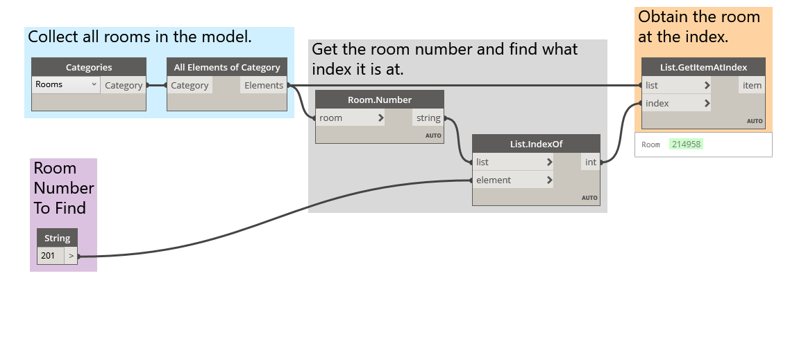
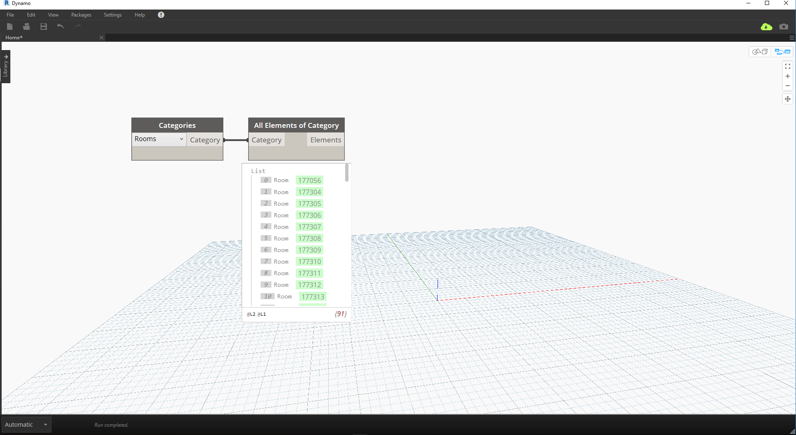
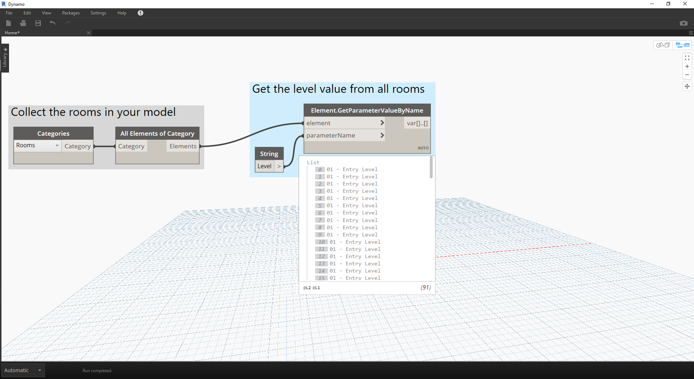

# Dizionari - Casi di utilizzo di Revit

Si è mai voluto cercare qualcosa in Revit a partire da un dato?

#### Se la risposta è affermativa, è stato fatto qualcosa di simile:



> Nell'immagine precedente si raccolgono tutti i locali nel modello di Revit, si ottiene l'indice del locale desiderato (per numero di locale) e infine si acquisisce il locale in corrispondenza dell'indice.

### Ora procedere ricreando questa idea utilizzando i dizionari.

> Scaricare il file di esempio fornito con questo esercizio (fare clic con il pulsante destro del mouse e scegliere Salva link con nome...): [RoomDictionary.dyn](datasets/9-4_roomDictionary.dyn). Un elenco completo di file di esempio è disponibile nell'Appendice.

 Innanzitutto, è necessario raccogliere tutti i locali nel modello di Revit.

> * Scegliere la categoria di Revit che si desidera utilizzare (in questo caso, i locali).
* Si indicherà a Dynamo di raccogliere tutti questi elementi.

 Successivamente, è necessario decidere quali chiavi utilizzare per la ricerca di questi dati. Per informazioni sulle chiavi, vedere la sezione [9-1 Che cos'è un dizionario?](9-1_What-is-a-dictionary,md).

> * I dati che verranno utilizzati sono il numero del locale.

 Ora verrà creato il dizionario con le chiavi e gli elementi specificati.

> * Il nodo ```Dictionary.ByKeysValues``` creerà un dizionario a partire dagli input appropriati.
* ```keys``` deve essere una stringa, mentre ```values``` può essere diversi tipi di oggetto.

 Infine, è possibile recuperare un locale dal dizionario con il relativo numero.

> * ```String``` sarà la chiave utilizzata per cercare un oggetto nel dizionario.
* ```Dictionary.ValueAtKey``` consentirà ora di ottenere l'oggetto dal dizionario.

---

### Utilizzando la stessa logica del dizionario, è possibile creare dizionari anche con oggetti raggruppati. Se si volessero cercare tutti i locali ad un determinato livello, è possibile modificare il grafico sopra come indicato di seguito.



> * Invece di utilizzare il numero del locale come chiave, è possibile utilizzare il valore di un parametro (in questo caso si utilizzerà il livello).


> * Ora è possibile raggruppare i locali in base al livello in cui risiedono.


> * Con gli elementi raggruppati per livello, è ora possibile utilizzare le chiavi condivise (chiavi univoche) come chiave per il dizionario e gli elenchi di locali come elementi.


> * Infine, utilizzando i livelli nel modello di Revit, è possibile cercare i locali che risiedono in tale livello nel dizionario. ```Dictionary.ValueAtKey``` recupererà il nome del livello e restituirà gli oggetti locale in corrispondenza di tale livello.

Le opportunità di utilizzo del dizionario sono davvero infinite. La possibilità di correlare i dati BIM in Revit all'elemento stesso offre diversi casi di utilizzo.

