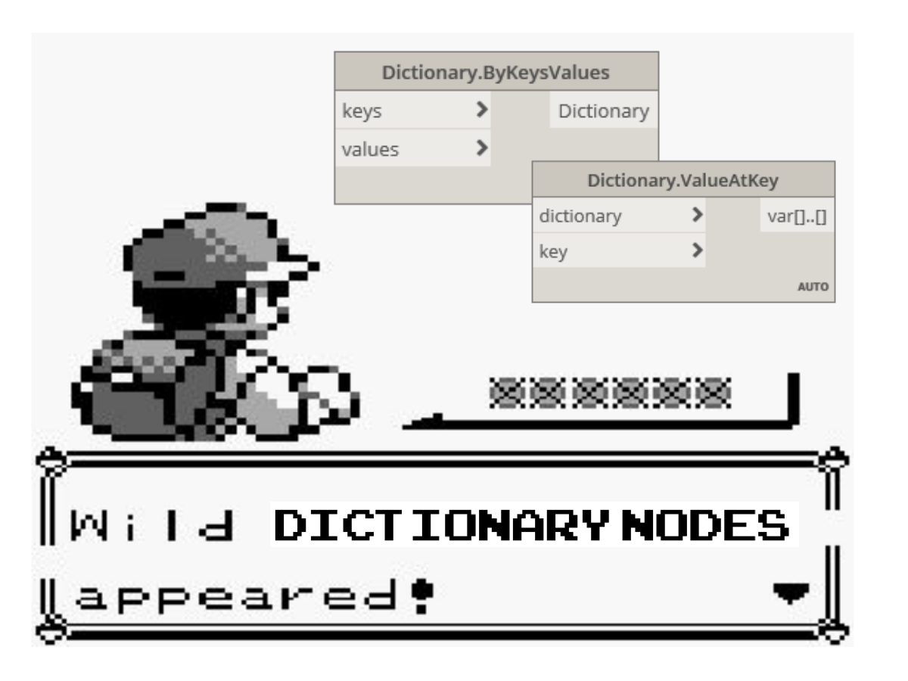

# Dizionari in Dynamo

I dizionari rappresentano una raccolta di dati correlati ad un altro elemento di dati noto come chiave. I dizionari consentono di cercare, eliminare e inserire dati in una raccolta.

Essenzialmente, si può pensare ad un dizionario come ad uno strumento davvero intelligente in cui cercare qualcosa.

*Sebbene la funzionalità del dizionario sia disponibile da tempo in Dynamo, Dynamo 2.0 introduce un nuovo metodo di gestione di questo tipo di dati.*

 *Immagine gentilmente concessa da [sixtysecondrevit.com](http://sixtysecondrevit.com/2018-01-22-new-dictionary-nodes-in-dynamobim-daily-build/)*

