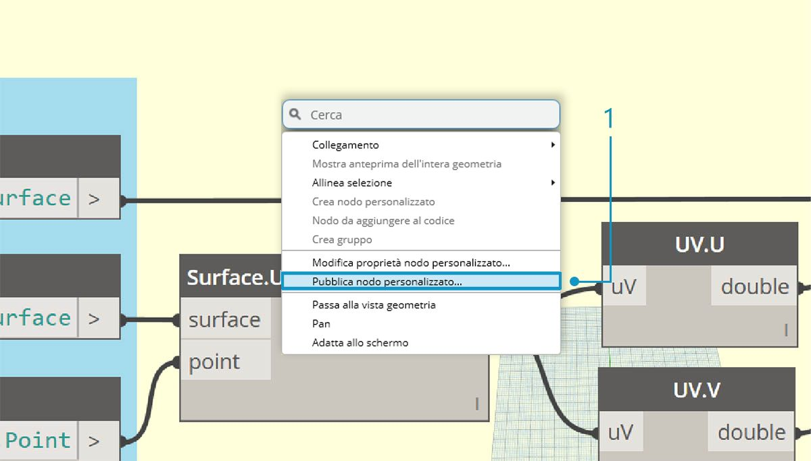
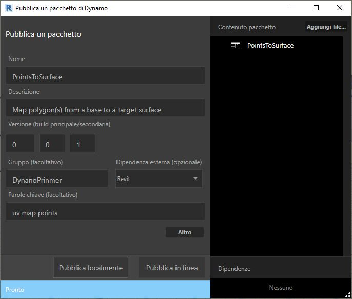
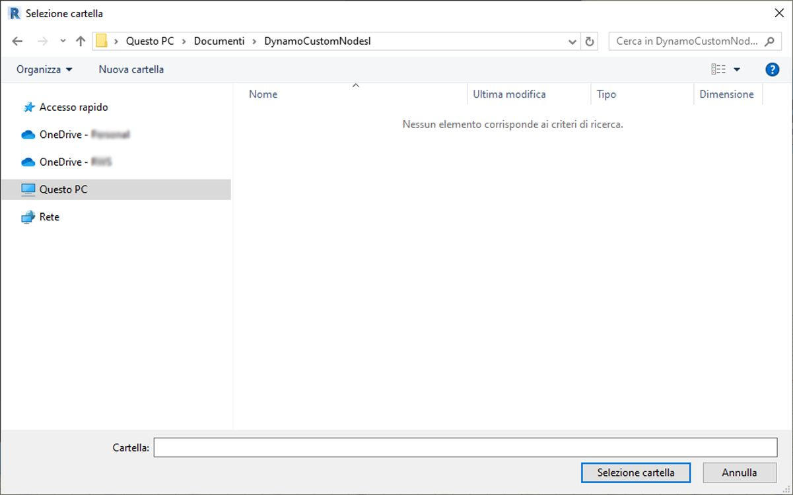
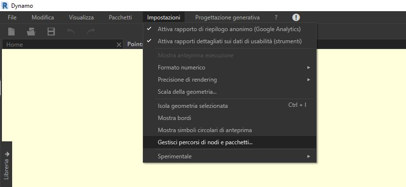
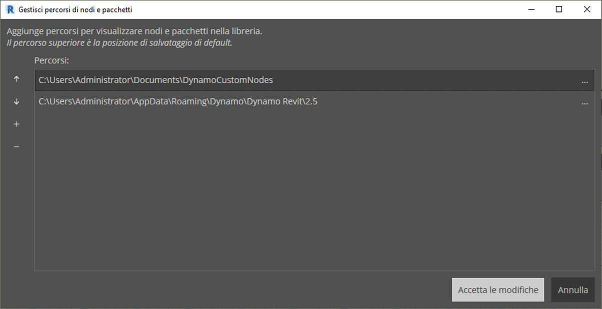
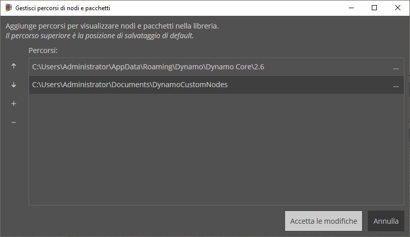
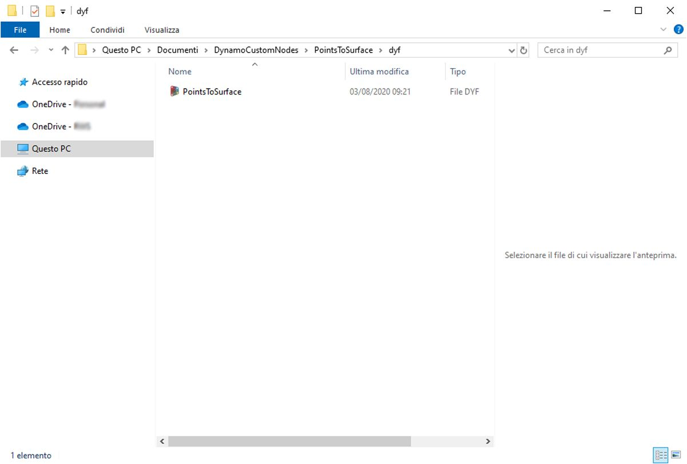

## Aggiunta alla libreria

È stato appena creato un nodo personalizzato ed è stato applicato ad un processo specifico nel grafico di Dynamo. E dato che questo nodo è ben riuscito, si desidera mantenerlo nella libreria di Dynamo come riferimento in altri grafici. Per eseguire questa operazione, il nodo verrà pubblicato localmente. Questo è un processo simile alla pubblicazione di un pacchetto, che sarà esaminata più in dettaglio nel prossimo capitolo.

### Pubblicazione locale di un nodo personalizzato

Procedere con il nodo personalizzato creato nella sezione precedente. Se si pubblica un nodo localmente, questo sarà accessibile nella libreria di Dynamo quando si apre una nuova sessione. Senza pubblicare un nodo, un grafico di Dynamo che fa riferimento ad un nodo personalizzato deve anche contenere tale nodo personalizzato nella relativa cartella (o il nodo personalizzato deve essere importato in Dynamo utilizzando *File > Importa libreria*).

> Scaricare il file di esempio fornito con questo esercizio (fare clic con il pulsante destro del mouse e scegliere Salva link con nome...). Un elenco completo di file di esempio è disponibile nell'Appendice. [PointsToSurface.dyf](datasets/10-3/PointsToSurface.dyf)

> Dopo l'apertura del nodo personalizzato PointsToSurface, viene visualizzato il grafico in alto nell'editor dei nodi personalizzati di Dynamo. È inoltre possibile aprire un nodo personalizzato facendovi doppio clic nell'editor dei grafici di Dynamo.

> 1. Per pubblicare un nodo personalizzato localmente, è sufficiente fare clic con il pulsante destro del mouse sull'area di disegno e selezionare *Pubblica questo nodo personalizzato*.

> Compilare le informazioni pertinenti simili a quelle mostrate nell'immagine riportata sopra e selezionare *Pubblica localmente.*. Notare che il campo Gruppo (facoltativo) definisce l'elemento principale accessibile dal menu di Dynamo.

> Scegliere una cartella in cui memorizzare tutti i nodi personalizzati che si prevede di pubblicare localmente. In Dynamo viene controllata questa cartella ad ogni caricamento del programma, quindi verificare che si trovi in una posizione permanente. Individuare la cartella e scegliere *Seleziona cartella.* Il nodo di Dynamo viene ora pubblicato localmente e rimarrà sulla barra degli strumenti di Dynamo ogni volta che si carica il programma.

> 1. Per verificare il percorso della cartella dei nodi personalizzati, accedere a *Impostazioni > Gestisci percorsi di nodi e pacchetti*.

> In questa finestra sono presenti due percorsi: *AppData\Roaming\Dynamo...* si riferisce alla posizione di default dei pacchetti di Dynamo installati in linea. *Documents\DynamoCustomNodes...* si riferisce alla posizione dei nodi personalizzati pubblicati localmente. *

> 1. È possibile spostare il percorso della cartella locale in basso nell'ordine dell'elenco indicato sopra (selezionando il percorso della cartella e facendo clic sulla freccia giù a sinistra dei nomi dei percorsi). La cartella superiore è il percorso di default per le installazioni di pacchetti. Pertanto, se si mantiene il percorso di installazione di default del pacchetto di Dynamo come cartella di default, i pacchetti in linea verranno separati dai nodi pubblicati localmente.*

> È stato cambiato l'ordine dei nomi dei percorsi in modo da avere il percorso di default di Dynamo come posizione di installazione del pacchetto.

> Accedendo a questa cartella locale, è possibile trovare il nodo personalizzato originale nella cartella *dyf*, che è l'estensione del file di un nodo personalizzato di Dynamo. Si può modificare il file in questa cartella e il nodo verrà aggiornato nell'interfaccia utente. È inoltre possibile aggiungere altri nodi alla cartella *DynamoCustomNodes* principale. In Dynamo verranno aggiunti alla libreria al riavvio.

> Dynamo ora viene caricato ogni volta con *PointsToSurface* nel gruppo *DynamoPrimer* della libreria di Dynamo.

