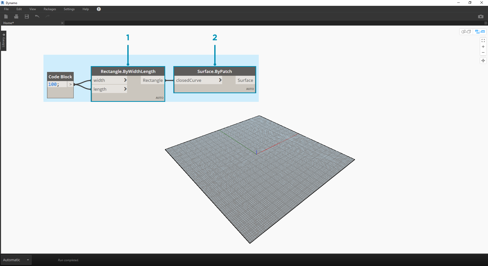
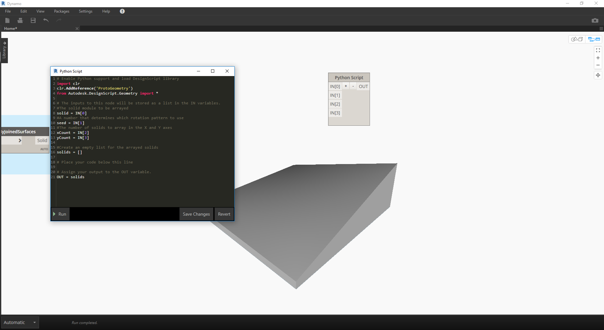
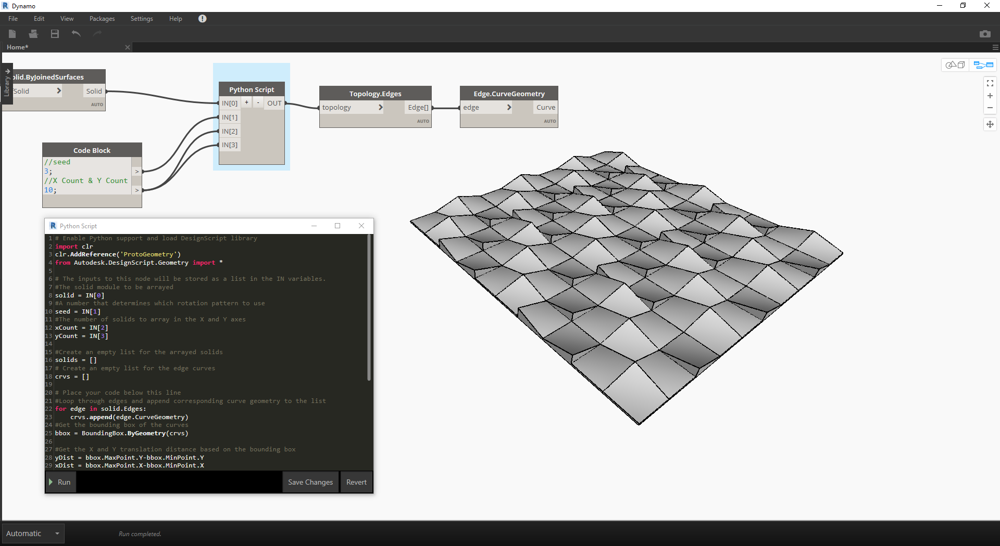
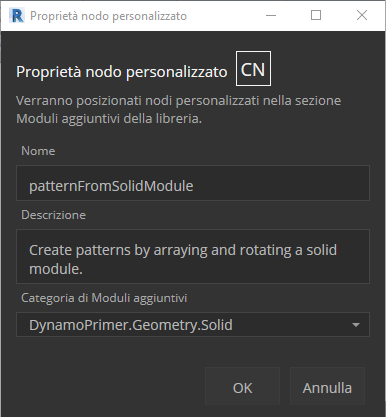
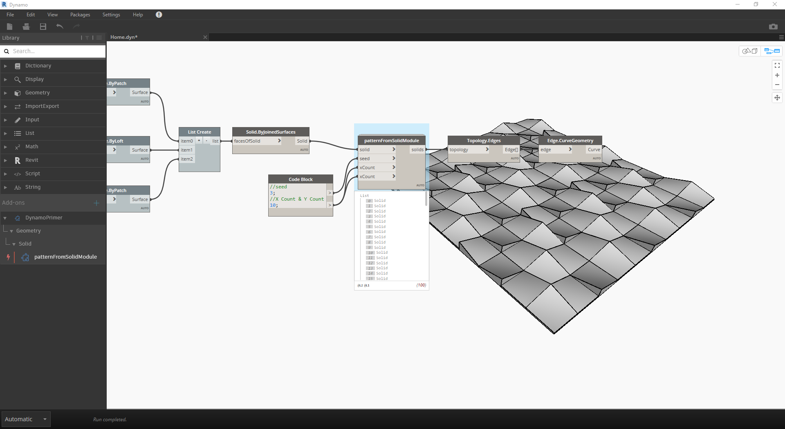

## Python

 Python è un linguaggio di programmazione ampiamente utilizzato, la cui popolarità ha molto a che fare con il suo stile di sintassi. È altamente leggibile, il che rende più semplice l'apprendimento di molti altri linguaggi. Python supporta moduli e pacchetti e può essere incorporato nelle applicazioni esistenti. Gli esempi riportati in questa sezione presuppongono una conoscenza di base di Python. Per informazioni su come iniziare ad utilizzare Python, una buona risorsa è la pagina ["Getting Started"](https://www.python.org/about/gettingstarted/) sul sito [Python.org](https://www.python.org/).

### Programmazione visiva e testuale

Perché è opportuno utilizzare la programmazione testuale nell'ambiente di programmazione visiva di Dynamo? Come è stato discusso nel capitolo 1.1, la programmazione visiva ha molti vantaggi. Consente di creare programmi senza apprendere una sintassi speciale in un'interfaccia visiva intuitiva. Tuttavia, un programma visivo può diventare disordinato e a volte può risultare carente in termini di funzionalità. Ad esempio, Python offre metodi molto più facili da realizzare per la scrittura di istruzioni condizionali (if/then) e il loop. Python è un potente strumento in grado di ampliare le funzionalità di Dynamo e di consentire di sostituire molti nodi con alcune righe di codice concise.

**Programma visivo:** 

**Programma testuale:**

```
import clr
clr.AddReference('ProtoGeometry')
from Autodesk.DesignScript.Geometry import *

solid = IN[0]
seed = IN[1]
xCount = IN[2]
yCount = IN[3]

solids = []

yDist = solid.BoundingBox.MaxPoint.Y-solid.BoundingBox.MinPoint.Y
xDist = solid.BoundingBox.MaxPoint.X-solid.BoundingBox.MinPoint.X

for i in xRange:
for j in yRange:
fromCoord = solid.ContextCoordinateSystem
toCoord = fromCoord.Rotate(solid.ContextCoordinateSystem.Origin,Vector.ByCoordinates(0,0,1),(90*(i+j%val)))
vec = Vector.ByCoordinates((xDist*i),(yDist*j),0)
toCoord = toCoord.Translate(vec)
solids.append(solid.Transform(fromCoord,toCoord))

OUT = solids
```

### Nodo Python

Come i blocchi di codice, i nodi Python sono un'interfaccia di script all'interno di un ambiente di programmazione visiva. Il nodo Python è disponibile in *Core > Scripting* nella libreria. Facendo doppio clic sul nodo, viene aperto l'editor di script Python. È inoltre possibile fare clic con il pulsante destro del mouse sul nodo e scegliere *Modifica...*.


> Si noterà del testo boilerplate in alto, che è utile per fare riferimento alle librerie necessarie. Gli input vengono memorizzati nella matrice IN. I valori vengono restituiti a Dynamo assegnandoli alla variabile OUT.

La libreria Autodesk.DesignScript.Geometry consente di utilizzare la notazione punto analogamente ai blocchi di codice. Per ulteriori informazioni sulla sintassi di Dynamo, fare riferimento al capitolo 7.2 e al manuale [DesignScript Guide](http://dynamobim.org/wp-content/links/DesignScriptGuide.pdf). Digitando un tipo di geometria, ad esempio Point., verrà visualizzato un elenco di metodi per la creazione e l'esecuzione di una query sui punti.


> I metodi includono costruttori quali *ByCoordinates*, azioni quali *Add* e query quali le coordinate *X*, *Y* e *Z*.

### Esercizio

> Scaricare il file di esempio fornito con questo esercizio (fare clic con il pulsante destro del mouse e scegliere Salva link con nome...). Un elenco completo di file di esempio è disponibile nell'Appendice. [Python_Custom-Node.dyn](datasets/10-4/Python-CustomNode.dyn)

In questo esempio, si scriverà uno script di Python che crea modelli da un modulo solido e lo si trasformerà in un nodo personalizzato. Innanzitutto, creare il modulo solido utilizzando i nodi di Dynamo.



> 1. **Rectangle.ByWidthLength:** creare un rettangolo che sarà la base del solido.
2. **Surface.ByPatch:** collegare il rettangolo all'input "*closedCurve*" per creare la superficie inferiore.


> 1. **Geometry.Translate:** collegate il rettangolo all'input "*geometry*" per spostarlo verso l'alto, utilizzando un blocco di codice per specificare lo spessore di base del solido.
2. **Polygon.Points:** eseguire la query sul rettangolo traslato per estrarre i punti degli angoli.
3. **Geometry.Translate:** utilizzare un blocco di codice per creare un elenco di quattro valori corrispondenti ai quattro punti, traslando un angolo del solido verso l'alto.
4. **Polygon.ByPoints:** utilizzare i punti traslati per ricreare il poligono superiore.
5. **Surface.ByPatch:** collegare il poligono per creare la superficie superiore.

Ora che sono presenti le superfici superiore e inferiore, creati i lati del solido tramite loft tra i due profili.


> 1. **List.Create:** collegare il rettangolo inferiore e il poligono superiore agli input dell'indice.
2. **Surface.ByLoft:** eseguire il loft dei due profili per creare i lati del solido.
3. **List.Create:** collegare le superfici superiore, laterale e inferiore agli input dell'indice per creare un elenco di superfici.
4. **Solid.ByJoinedSurfaces:** unire le superfici per creare il modulo solido.

Ora che è stato realizzato il solido, rilasciare un nodo Script Python nell'area di lavoro.


> Per aggiungere altri input al nodo, chiudere l'editor e fare clic sull'icona + sul nodo. Gli input sono denominati IN[0], IN[1] e così via per indicare che rappresentano le voci di un elenco.

Iniziare definendo gli input e l'output. Fare doppio clic sul nodo per aprire l'editor di Python.



```
# Enable Python support and load DesignScript library
import clr
clr.AddReference('ProtoGeometry')
from Autodesk.DesignScript.Geometry import *

# The inputs to this node will be stored as a list in the IN variables.
#The solid module to be arrayed
solid = IN[0]
#A number that determines which rotation pattern to use
seed = IN[1]
#The number of solids to array in the X and Y axes
xCount = IN[2]
yCount = IN[3]

#Create an empty list for the arrayed solids
solids = []

# Place your code below this line

# Assign your output to the OUT variable.
OUT = solids
```

Questo codice risulterà più utile mentre si prosegue nell'esercizio. Successivamente, occorre pensare alle informazioni necessarie per includere in una matrice il modulo solido. Per prima cosa, è necessario conoscere le quote del solido per determinare la distanza di traslazione. A causa di un bug del riquadro di delimitazione, è necessario utilizzare la geometria della curva dello spigolo per creare un riquadro di delimitazione.


> Osservare il nodo Python in Dynamo. Si noti che viene utilizzata la stessa sintassi presente nei titoli dei nodi in Dynamo. Il codice commentato è riportato di seguito.

```
# Enable Python support and load DesignScript library
import clr
clr.AddReference('ProtoGeometry')
from Autodesk.DesignScript.Geometry import *

# The inputs to this node will be stored as a list in the IN variables.
#The solid module to be arrayed
solid = IN[0]
#A number that determines which rotation pattern to use
seed = IN[1]
#The number of solids to array in the X and Y axes
xCount = IN[2]
yCount = IN[3]

#Create an empty list for the arrayed solids
solids = []
# Create an empty list for the edge curves
crvs = []

# Place your code below this line
#Loop through edges and append corresponding curve geometry to the list
for edge in solid.Edges:
crvs.append(edge.CurveGeometry)
#Get the bounding box of the curves
bbox = BoundingBox.ByGeometry(crvs)

#Get the X and Y translation distance based on the bounding box
yDist = bbox.MaxPoint.Y-bbox.MinPoint.Y
xDist = bbox.MaxPoint.X-bbox.MinPoint.X

# Assign your output to the OUT variable.
OUT = solids
```

Poiché si eseguiranno sia la traslazione che la rotazione dei moduli solidi, utilizzare l'operazione Geometry.Transform. Guardando il nodo Geometry.Transform, si sa che per trasformare il solido sarà necessario un sistema di coordinate di origine e un sistema di coordinate di destinazione. L'origine è il sistema di coordinate contestuale del solido, mentre la destinazione sarà un sistema di coordinate diverso per ogni modulo incluso nella matrice. Ciò significa che si dovrà riprodurre a ciclo continuo i valori X e Y per trasformare il sistema di coordinate in modo diverso ogni volta.


> Osservare il nodo Python in Dynamo. Il codice commentato è riportato di seguito.

```
# Enable Python support and load DesignScript library
import clr
clr.AddReference('ProtoGeometry')
from Autodesk.DesignScript.Geometry import *

# The inputs to this node will be stored as a list in the IN variables.
#The solid module to be arrayed
solid = IN[0]
#A number that determines which rotation pattern to use
seed = IN[1]
#The number of solids to array in the X and Y axes
xCount = IN[2]
yCount = IN[3]

#Create an empty list for the arrayed solids
solids = []
# Create an empty list for the edge curves
crvs = []

# Place your code below this line
#Loop through edges and append corresponding curve geometry to the list
for edge in solid.Edges:
crvs.append(edge.CurveGeometry)
#Get the bounding box of the curves
bbox = BoundingBox.ByGeometry(crvs)

#Get the X and Y translation distance based on the bounding box
yDist = bbox.MaxPoint.Y-bbox.MinPoint.Y
xDist = bbox.MaxPoint.X-bbox.MinPoint.X
#get the source coordinate system
fromCoord = solid.ContextCoordinateSystem

#Loop through X and Y
for i in range(xCount):
for j in range(yCount):
#Rotate and translate the coordinate system
toCoord = fromCoord.Rotate(solid.ContextCoordinateSystem.Origin,Vector.ByCoordinates(0,0,1),(90*(i+j%seed)))
vec = Vector.ByCoordinates((xDist*i),(yDist*j),0)
toCoord = toCoord.Translate(vec)
#Transform the solid from the source coord system to the target coord system and append to the list
solids.append(solid.Transform(fromCoord,toCoord))

# Assign your output to the OUT variable.
OUT = solids
```



> Facendo clic su Run nel nodo Python, si consentirà l'esecuzione del codice.


> Provare a modificare il valore iniziale (seme) per creare modelli diversi. È anche possibile modificare i parametri del modulo solido stesso per effetti differenti. In Dynamo 2.0 è possibile semplicemente modificare il seme e fare clic su Run senza chiudere la finestra di Python.

Dopo aver creato uno script di Python utile, salvarlo come nodo personalizzato. Selezionare il nodo dello script Python, fare clic con il pulsante destro del mouse e selezionare Nuovo nodo dalla selezione.



> Assegnare un nome, una descrizione e una categoria.

Verrà aperta una nuova area di lavoro in cui modificare il nodo personalizzato.


> 1. **Input:** modificare i nomi di input in modo che siano più descrittivi e aggiungere i tipi di dati e i valori di default.
2. **Output:** modificare il nome di output. Salvare il nodo come file .dyf.



> Il nodo personalizzato riflette le modifiche appena apportate.

