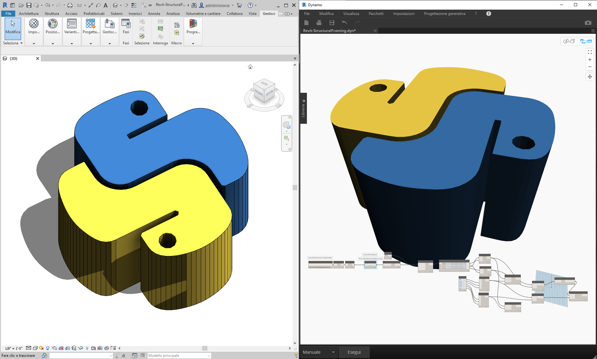
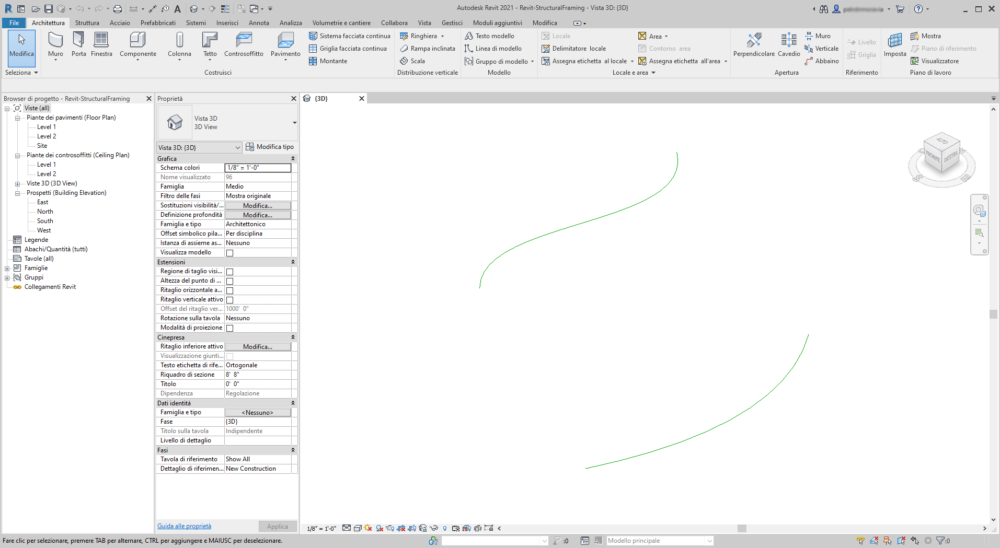
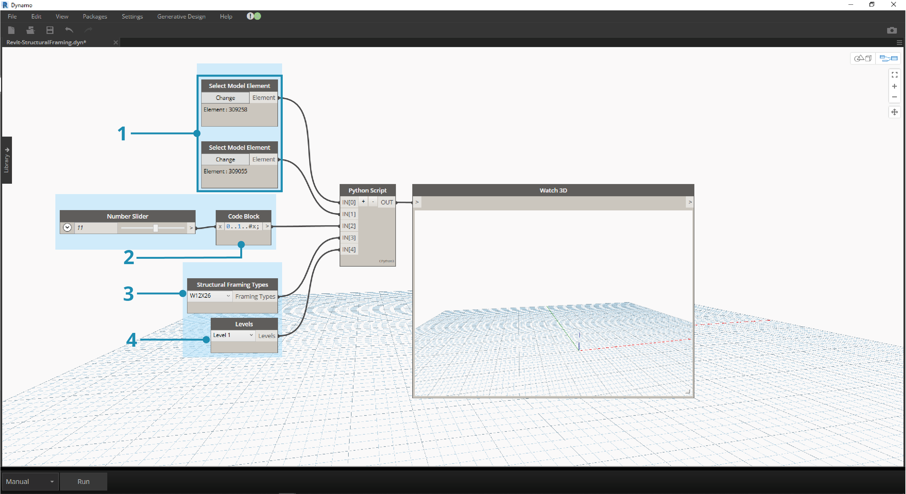
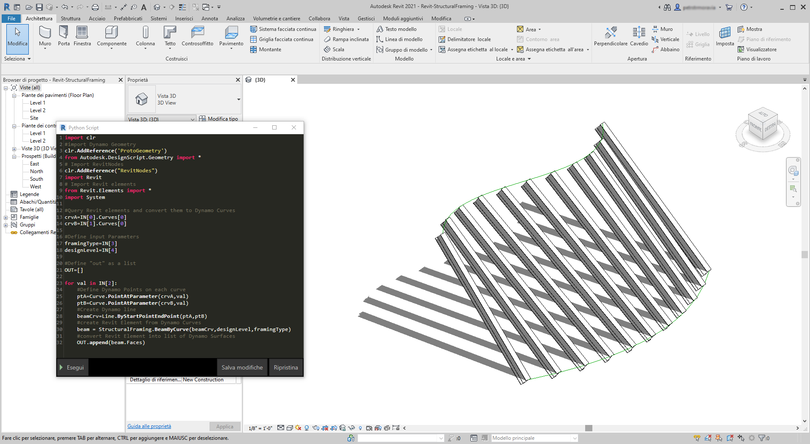

## Python e Revit

Ora che è stato dimostrato come utilizzare gli script di Python in Dynamo, verrà esaminato il collegamento delle librerie di Revit nell'ambiente di scripting. Tenere presente che sono stati importati i nodi principali di Dynamo con le prime tre righe del blocco di codice riportato di seguito. Per importare i nodi di Revit, gli elementi di Revit e la gestione dei documenti di Revit, è necessario aggiungere solo alcune righe:

```
import clr
clr.AddReference('ProtoGeometry')
from Autodesk.DesignScript.Geometry import *

# Import RevitNodes
clr.AddReference("RevitNodes")
import Revit

# Import Revit elements
from Revit.Elements import *

# Import DocumentManager
clr.AddReference("RevitServices")
import RevitServices
from RevitServices.Persistence import DocumentManager

import System
```

Questo consente di accedere all'API di Revit e offre scripting personalizzato per qualsiasi operazione di Revit. Combinando il processo di programmazione visiva con lo scripting, la collaborazione e lo sviluppo di strumenti dell'API di Revit, si ottiene un miglioramento significativo. Ad esempio, un responsabile BIM e un progettista di schemi possono lavorare insieme sullo stesso grafico. In questa collaborazione, possono migliorare la progettazione e l'esecuzione del modello.



### API specifiche della piattaforma

Il piano che sta dietro al progetto di Dynamo è quello di ampliare l'ambito di implementazione della piattaforma. Poiché Dynamo aggiunge altri programmi all'elenco di casi, gli utenti potranno accedere alle API specifiche della piattaforma dall'ambiente di scripting di Python. Sebbene Revit sia il case study di questa sezione, è possibile prevedere altri capitoli in futuro che offrono esercitazioni complete sullo scripting in altre piattaforme. Inoltre, ora sono disponibili numerose librerie di [IronPython](http://ironpython.net/), che possono essere importate in Dynamo.

Negli esempi riportati di seguito sono illustrati modi per implementare operazioni specifiche di Revit da Dynamo utilizzando Python. Per una revisione più dettagliata sulla relazione di Python con Dynamo e Revit, fare riferimento alla [pagina Wiki di Dynamo](https://github.com/DynamoDS/Dynamo/wiki/Python-0.6.3-to-0.7.x-Migration). Un'altra utile risorsa per Python e Revit è il progetto [Revit Python Shell](https://github.com/architecture-building-systems/revitpythonshell).

### Esercizio 01

> Creare un nuovo progetto di Revit. Scaricare il file di esempio fornito con questo esercizio (fare clic con il pulsante destro del mouse e scegliere Salva link con nome...). Un elenco completo di file di esempio è disponibile nell'Appendice. [Revit-Doc.dyn](datasets/10-5/Revit-Doc.dyn)

In questi esercizi, verranno esaminati gli script di Python elementari in Dynamo for Revit. L'esercizio si concentrerà sull'utilizzo di file ed elementi di Revit, nonché sulla comunicazione tra Revit e Dynamo.


> Questo è un metodo molto semplice per il recupero di *doc*, *uiapp* e *app* del file di Revit collegato alla sessione di Dynamo. I programmatori che hanno lavorato in precedenza nell'API di Revit possono notare le voci dell'elenco di controllo. Se questi elementi non risultano familiari, sarà possibile utilizzare altri esempi negli esercizi riportati di seguito.

Di seguito è mostrato il modo in cui si importano i servizi di Revit e si recuperano i dati dei documenti in Dynamo: 

> Osservare il nodo Python in Dynamo. Il codice commentato è riportato di seguito.

```
# Enable Python support and load DesignScript library
import clr
# Import DocumentManager
clr.AddReference("RevitServices")
import RevitServices
from RevitServices.Persistence import DocumentManager

# Place your code below this line
doc = DocumentManager.Instance.CurrentDBDocument
uiapp = DocumentManager.Instance.CurrentUIApplication
app = uiapp.Application

# Assign your output to the OUT variable.
OUT = [doc,uiapp,app]
```

### Esercizio 02

> Scaricare i file di esempio forniti con questo esercizio (fare clic con il pulsante destro del mouse e scegliere Salva link con nome...). Un elenco completo di file di esempio è disponibile nell'Appendice. [Revit-ReferenceCurve.dyn](datasets/10-5/Revit-ReferenceCurve.dyn)

In questo esercizio, verrà creata una semplice curva di modello in Revit mediante il nodo Python di Dynamo.


> Iniziare con il gruppo di nodi nell'immagine riportata sopra. Innanzitutto, verranno creati due punti di riferimento in Revit dai nodi di Dynamo.

> Iniziare creando una nuova famiglia di masse concettuali in Revit. Avviare Dynamo e creare il gruppo di nodi nell'immagine riportata sopra. Innanzitutto, verranno creati due punti di riferimento in Revit dai nodi di Dynamo.

> 1. Creare un blocco di codice e assegnargli un valore di "0;".
2. Collegare questo valore ad un nodo ReferencePoint.ByCoordinates per gli input X, Y e Z.
3. Creare tre dispositivi di scorrimento, compresi tra -100 e 100, con una dimensione di incremento pari a 1.
4. Collegare ogni dispositivo di scorrimento ad un nodo ReferencePoint.ByCoordinates.
5. Aggiungere un nodo Python all'area di lavoro, fare clic sul pulsante "+" sul nodo per aggiungere un altro input e collegare i due punti di riferimento in ogni input. Aprire il nodo Python.


> Osservare il nodo Python in Dynamo. Il codice commentato è riportato di seguito.

> 1. **System.Array:** Revit richiede una matrice di sistema com input (anziché un elenco di Python). Si tratta solo di un'altra riga di codice, ma prestare attenzione ai tipi di argomento faciliterà la programmazione di Python in Revit.

```
import clr

# Import RevitNodes
clr.AddReference("RevitNodes")
import Revit
# Import Revit elements
from Revit.Elements import *
import System

#define inputs
startRefPt = IN[0]
endRefPt = IN[1]

#define system array to match with required inputs
refPtArray = System.Array[ReferencePoint]([startRefPt, endRefPt])
#create curve by reference points in Revit
OUT = CurveByPoints.ByReferencePoints(refPtArray)
```


> Da Dynamo, sono stati creati due punti di riferimento con una linea che li collega utilizzando Python. Si aumenterà un po' il livello di complessità nel prossimo esercizio.

### Esercizio 03

> Scaricare e decomprimere i file di esempio forniti con questo esercizio (fare clic con il pulsante destro del mouse e scegliere Salva link con nome...). Un elenco completo di file di esempio è disponibile nell'Appendice. [Revit-StructuralFraming.zip](datasets/10-5/Revit-StructuralFraming.zip)

> Questo esercizio semplifica la procedura, ma enfatizza gli argomenti relativi al collegamento di dati e geometria da Revit a Dynamo e viceversa. Per iniziare, aprire Revit-StructuralFraming.rvt. Una volta aperto il file, caricare Dynamo e aprire il file Revit-StructuralFraming.dyn.



> Questo file di Revit contiene dati di base. Due curve di riferimento: una disegnata sul livello 1 e l'altra sul livello 2. Si desidera ottenere queste curve in Dynamo e mantenere un collegamento attivo.



> In questo file è presente un gruppo di nodi che si collegano a cinque input di un nodo Python.

> 1. Nodi **Select Model Element:** fare clic sul pulsante Seleziona per ogni elemento e selezionare una curva corrispondente in Revit.
2. **Code Block:** utilizzando la sintassi *"0..1..#x;"*, collegare un dispositivo di scorrimento di numeri interi compreso tra 0 e 20 all'input *x*. Questo indica il numero di travi da disegnare tra le due curve.
3. **Structural Framing Types:** dal menu a discesa, scegliere la trave di default W12x26.
4. **Levels:** selezionare "Livello 1".


> Questo codice in Python è un po' più denso, ma i commenti all'interno del codice descrivono cosa sta accadendo nel processo:

```
import clr
#import Dynamo Geometry
clr.AddReference('ProtoGeometry')
from Autodesk.DesignScript.Geometry import *
# Import RevitNodes
clr.AddReference("RevitNodes")
import Revit
# Import Revit elements
from Revit.Elements import *
import System

#Query Revit elements and convert them to Dynamo Curves
crvA=IN[0].Curves[0]
crvB=IN[1].Curves[0]

#Define input Parameters
framingType=IN[3]
designLevel=IN[4]

#Define "out" as a list
OUT=[]

for val in IN[2]:
#Define Dynamo Points on each curve
ptA=Curve.PointAtParameter(crvA,val)
ptB=Curve.PointAtParameter(crvB,val)
#Create Dynamo line
beamCrv=Line.ByStartPointEndPoint(ptA,ptB)
#create Revit Element from Dynamo Curves
beam = StructuralFraming.BeamByCurve(beamCrv,designLevel,framingType)
#convert Revit Element into list of Dynamo Surfaces
OUT.append(beam.Faces)
```



> In Revit, è presente una serie di travi che si estendono sulle due curve come elementi strutturali. Nota: questo non è un esempio realistico; gli elementi strutturali vengono utilizzati come esempio per le istanze native di Revit create da Dynamo.  In Dynamo, è possibile visualizzare anche i risultati. Le travi del nodo Watch 3D fanno riferimento alla geometria sottoposta a query dagli elementi di Revit.

Notare che è presente un processo continuo di conversione dei dati dall'ambiente di Revit all'ambiente di Dynamo. In sintesi, ecco come viene riprodotto il processo:

1. Selezionare l'elemento di Revit.
2. Convertire l'elemento di Revit nella curva di Dynamo.
3. Dividere la curva di Dynamo in una serie di punti di Dynamo.
4. Utilizzare i punti di Dynamo tra due curve per creare le linee di Dynamo.
5. Creare le travi di Revit facendo riferimento alle linee di Dynamo.
6. Generare le superfici di Dynamo eseguendo una query sulla geometria delle travi di Revit.

Questo processo può sembrare un po' complicato, ma lo script lo rende semplice quanto la modifica della curva in Revit e la riesecuzione del risolutore (anche se potrebbe essere necessario eliminare le travi precedenti quando si esegue questa operazione). *Ciò è dovuto al fatto che si stanno posizionando le travi in Python, interrompendo così l'associazione che hanno i nodi OOTB.*


> Con un aggiornamento delle curve di riferimento in Revit, si ottiene una nuova serie di travi.

